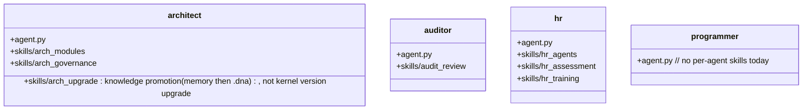

## Positioning

The four built-in CBIM agent definitions (system prompts + behavior + skill registry): **architect**, **auditor**, **hr**, **programmer**. Each agent's `agent.py` is the canonical definition; per-agent `skills/` hold the runtime knowledge they invoke via `engine skill show`.

## Class Diagram

## Key Decisions

- **Agent skills are co-located under the agent's own directory.** A skill that only ever runs in the architect's context (e.g. `arch_modules`) belongs to the architect, not to the cross-agent `cbi.skills` package.
- **`agent.py` files are deployed as `.claude/agents/<name>.md`** by `project.init` via templates under `project.agents/`. The Python file here is the *source of truth*; the `.md` files in projects are the *rendered deployment*.

- **HR 责任边界 = 写侧（招 / 训 / 治），不含读侧（查）。** `agent_list` 是系统级查询能力（MCP `agent_list` 工具 + `agent.py registry.list_agents()`），所有 agent 都可直接调用，不需要经过 HR。HR 拥有的是 agent 生命周期的写操作——招聘（`hr_agents`）、训练（`hr_training`）、考核与治理（`hr_assessment`）。把「读 agent 清单」也算作 HR 职责，会让 HR 变成所有 agent 调用 agent 的强制中介，违反 C4（接口隔离）。
- **执行热路径不派 HR 做能力匹配。** 主 agent 在执行循环中需要选派 work agent 时，直接用 MCP `agent_list` 自助匹配（读 frontmatter 的 `name` / `description` / `keywords`），匹配不到则回退 `programmer`。这不是「绕过 HR」——HR 的写侧职责（招新 agent、改 agent.py、考核）一项都没少；被消除的只是「读 agent 清单」这条本就属于系统级查询的能力。把 HR 拉进每次热路径调度，会让一次性查询变成多轮 LLM 往返，纯属过度设计。
- **保留两条 HR 路径：`hr_request`（用户直答）+ `hr_gov`（治理循环）。** 用户显式请求时（「帮我招个 X agent」「评估一下 programmer 的表现」），主 agent 仍走 HR 直答路径，HR 在 BT 中作为一等 agent 存在。治理循环（dream loop）中 HR 仍负责 agent 体系的周期性巡检与重组。被裁掉的只是「执行根中段那条把 HR 当成调度中介的 `hr_exec` 子树」——HR 作为人事职能的入口完整保留。

