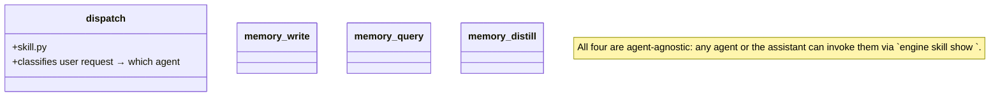

## Positioning

Cross-agent skills: `dispatch` (assistant's routing skill), `memory_write` / `memory_query` / `memory_distill` (memory ops invoked by the assistant on user request).

## Class Diagram



## Key Decisions

- **A skill lives here only if more than one agent (or the assistant + an agent) invokes it.** Single-agent skills live under that agent's directory. This boundary keeps the cross-agent surface small.

### v2 重设计：memory_distill 输入源从 short 改为 CC transcript JSONL

本决定是 `v1/kernel/memory` v2 重设计的超集一部分。short 层废弃之后，`memory_distill` skill 的逻辑整体重写；**skill.py 的代码修改是 coder 任务**，本节锁定架构契约。

**调用者变化**：
- v1：主 agent 手动调 / 阈值提示；HR 也可调。
- v2：**只由主 agent 调**。主动触发从 v1 的两个场景（用户显请 + 阈值提示）变为三个场景：用户显请、阈值提示、**治理循环 `DispatchMemDistill` yield**。主 agent 是唯一合法调用方是因为蒙骏需要读 transcript 原文推断信号，主 agent 天然拥有该上下文（同会话）且 HR 不拥有 `memory_get` 路径。

**输入源变化**：
- v1：`.cbim/memory/short/*.md`，取预填 `- [x]` 信号。
- v2：`~/.claude/projects/<project-slug>/*.jsonl`——Claude Code 原生的会话 JSONL。输入路径列表有两种来源：(a) 治理循环 DispatchMemDistill 的 prompt 里列出的 `paths`（mtime > 1 天）；(b) 用户手动请求时主 agent 自扫 `~/.claude/projects/<slug>/` 拉 mtime 在某范围内的 JSONL。

**蒙骏过程变化**：
- v1 有“填信号”预备步：主 agent 读每个 short 条目，看 `## 信号` 区域的 `- [x]` 预选项。
- v2 取消该预备步。主 agent 直接读 transcript JSONL 原文（含用户轮 + 助手轮 + tool calls），自行推断 MUST/WANT/HOW/IS。推断依据从“读标记过的选项”变为“读原始对话思考”，信息损耗更小、不需人工预选。四象限定义 / 输出文件名赋式 / 输出模板保持不变。

**输出变化**：
- v1：写 `capability-<agent>.md` / `decision-<scope>.md` / `business-<module>.md`；调 Edit tool 给原 short 条目加 `distilled: <date>` 标记。
- v2：仍写三类 medium 文件（文件名不变）；**不再给 transcript 加 distilled 标记**（主 agent 不修改 transcript 文件）。蒙骏报告返回给 `dream_tick_resume` 的 dispatch_result 中含 `distilled_paths` 字段，后续 `TranscriptDelete` 节点负责删原件。人手手动调用（非治理循环）不删 transcript，只报告蒙骏结果。

**输出报告 schema（进入 dream contract）**：
```
{
  "distilled_paths":          list[str],   # 成功蒙骏的 transcript 路径
  "medium_entries_written":   list[str],   # 新增/更新的 medium 文件路径
  "skipped_paths":            list[{path, reason}],  # 跳过原因：no-signal / too-short / parse-error
  "errors":                   list[str]    # 骨折错误
}
```

**与 v2 记忆架构的一致性**：
- skill 调 `memory_write` 只能传 `tier="medium"`（记忆服务 v2 不再接受 short）。
- skill **不**直接删 transcript——删除动作在治理循环的 `TranscriptDelete` 节点，决策权在治理循环手里、与索引同步。
- skill 调用者主 agent **不需**主动调 `retrieval.index_upsert`——medium 写入后 `memory.crud.write` 会同步触发索引更新。

