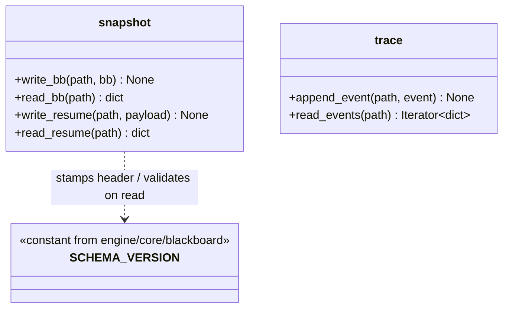

## Positioning

Atomic file persistence for behavior-tree state. Single responsibility: turn an in-memory blackboard + trace event into bytes on disk (and back) without losing partial writes, without leaking schema knowledge into callers, and without imposing a runtime model.

Two files, two writers:

- `snapshot.py` — writes `bb.json` (the full blackboard snapshot) and `resume.json` (the runner-resume payload: stack path + dispatch correlation). Whole-file atomic replace (write to `*.tmp`, `os.replace` onto target). Used by `Runner` at node exit (if dirty) and at yield.
- `trace.py` — appends one JSON line per BT event (enter / exit / yield / resume) to `trace.jsonl`. Append-only, line-buffered, never rewritten in place.

The module is loop-agnostic: the execution loop drives writes into `.cbim/scheduler/bt/<tick_id>/`; the dream loop drives writes into `.cbim/scheduler/dream/<run_id>/`. The path prefix is injected by the caller (api layer) at Runner construction. This module only sees absolute file paths.

**It is not what**:

| Misreading | Clarification |
|------------|---------------|
| A storage abstraction layer | No. There is no `Storage` interface, no pluggable backend. Disk + JSON is the contract; in-memory variants for tests use `tmp_path` fixtures, not a mock backend. |
| A schema authority | No. Blackboard schema lives in `engine/core/blackboard.py`; this module only references `SCHEMA_VERSION` for the snapshot header. Field validation belongs to the blackboard module, not to the writer. |
| A migration tool | No. On `SCHEMA_VERSION` mismatch the snapshot is treated as unrecoverable; runners refuse to resume. Forward migration is an explicit project-side decision, not auto-applied. |
| A queue / journal / WAL | No. `trace.jsonl` is observational only. The runner never replays trace to recover; recovery is bb + resume snapshot only. |
| Cross-process locking | No. One tick / one run owns its directory; multi-writer to the same directory is undefined and not defended against. |

## Class Diagram

No internal classes beyond two file modules; this is a leaf. Consumers (`engine/core/runner.py`, `engine/execution/loops/*` and `engine/dream/loops/*` api layer) depend on these two surfaces only — never the reverse.

## Key Decisions

- **Atomic replace, not append, for snapshots.** `bb.json` and `resume.json` are written as `*.tmp` first, then `os.replace`d onto the target. On crash mid-write the target file is either the old contents or the new contents, never a half-written hybrid. `trace.jsonl` is the only file written by append, and append-line semantics on POSIX/NTFS are accepted as good-enough for observational data.
- **Schema version lives in `core.blackboard`, referenced by snapshot header.** `snapshot.write_bb` stamps `{"schema_version": core.blackboard.SCHEMA_VERSION, "bb": <dict>}` into the file; `snapshot.read_bb` rejects on mismatch. Persistence never owns the version constant — it only enforces the read-side check. This keeps the schema authority single-sourced.
- **No `Storage` interface, no backend pluggability.** Disk + JSON is the contract. If a different substrate is ever needed (sqlite, redis), it gets a new module, not a backend slot here. C1 / C6: one façade, stable abstractions.
- **Loop-agnostic path injection.** The module knows nothing about `bt/` vs `dream/` directory naming. Callers (`api/bt_tick.py`, `api/dream_tick.py`) compute the absolute path and pass it in. This is what lets one persistence module serve both root loops without conditionals.
- **`trace.jsonl` is observational, not authoritative.** The runner never reads it back during resume. Recovery is strictly bb + resume snapshot. Trace is for the dashboard, debug tooling, and after-the-fact audit. Designing it as authoritative would force WAL-grade durability guarantees that this module deliberately does not offer.
- **Resume mismatch is fatal.** If `resume.json` references a node path that no longer exists in the static tree (e.g. tree topology changed between yield and resume), the runner refuses to resume and surfaces an error to the api layer. Persistence does not attempt repair.
- **On-disk paths are external contract, not internal implementation.** `.cbim/scheduler/bt/<tick_id>/` and `.cbim/scheduler/dream/<run_id>/` are read directly by the dashboard, debug tools, and CLI. The file names (`bb.json`, `resume.json`, `trace.jsonl`) and their JSON shapes are frozen surface. Changes break downstream consumers — treat as a versioned contract, not an internal detail.

## Non-Goals

- **No cross-loop schema unification.** Execution `bb.json` and dream `bb.json` are separate files with separate schemas; both happen to use this writer, but the writer does not (and must not) enforce a unified schema across loops.
- **No partial-write recovery for `trace.jsonl`.** A torn last line is ignored on read; the dashboard skips malformed events. We do not parse-and-rewrite trace to repair it.
- **No snapshot pruning / rotation.** Lifecycle of `.cbim/scheduler/bt/<tick_id>/` and `.cbim/scheduler/dream/<run_id>/` directories is the caller's responsibility — typically the dream-loop's `Finalize` step or an out-of-band cleanup job.
- **No concurrent-writer support.** Two runners writing to the same directory is undefined. One tick / one run owns its directory; there is no lock, no last-writer-wins arbitration.
- **No migration of old snapshots on schema bump.** Schema bumps invalidate in-flight resumes; this is by design (in-flight ticks are short-lived and expendable).
- **No format other than JSON.** No msgpack, no pickle, no protobuf. JSON is line-debuggable in production; that is more valuable than wire compactness for state files of this size.

