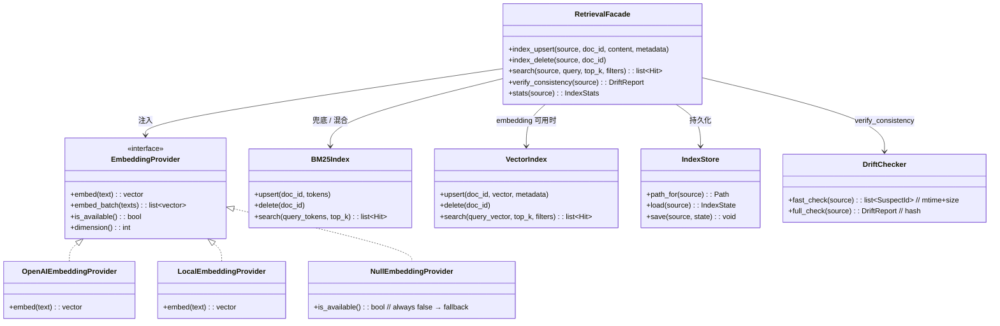

## Positioning

**项目本地的检索原语库**，类比一个嵌入式的向量+关键词索引引擎。承载 embedding provider 抽象、BM25 兜底、索引存储、相似度计算、4 源检索 API、漂移校验。**对四个数据源（CC transcript / `.cbim/memory/medium/` / `.dna/` / `.claude/agents/`）一视同仁**，但本模块**不知道**这些源的语义——它只知道 `(source, doc_id, content, metadata)` 四元组。

本模块定位于 `engine/` 之下，与 `engine/execution`、`engine/dream`、`engine/core`、`engine/persistence` 平级，是 CBIM 双根循环（execution 前置召回 + dream 全量校验）共同依赖的核心基础设施层。语义对调用方一视同仁——`memory` / `dna` / `agents` 各自的写入工具也通过这条同一基础设施做同步索引。

**它不是什么**：

| 误解 | 澄清 |
|------|------|
| 记忆服务的子模块 | 不是。`memory` 与本模块是两个独立模块；`memory.crud.write` 把记忆条目落盘后**调用** `retrieval.index_upsert` 作为副作用，但本模块不知道"记忆条目"这个概念。 |
| 知识系统的子模块 | 不是。`.dna/` 写入工具（`dna_edit` / `dna_init` 等）同样会调 `retrieval.index_upsert`，但本模块不知道"模块"概念。 |
| `engine/execution` 的子模块 | 不是。execution 只是本模块的若干调用方之一；dream 也是；memory 写入路径也是。本模块与 execution / dream 在 `engine/` 下平级，互不归属。 |
| 一个会主动扫文件的索引器 | 不是。本模块只接受写入工具的同步调用；**不**主动扫文件、**不**起后台线程、**不**自带触发器。增量同步由调用方负责。 |
| 一定要外接 embedding API 才能用 | 不是。`EmbeddingProvider` 可插拔；当外部 API 不可用或未配置时，自动降级到 BM25 关键词检索，**保证零外部依赖也能工作**。 |
| 一个对话上下文管理器 | 不是。"近期记忆 / agent 信息 / 模块知识图谱"三分类拼装是**调用方**（`engine/execution` 的 retrieval 节点）的语义；本模块只返回排序后的命中列表，谁来读怎么拼是调用方的事。 |
| 一个嵌入向量数据库（如 Chroma / Pinecone） | 不是。本模块是**接口 + 简实现**：默认后端是文件 + numpy 的 cosine 计算，足够单项目规模；后端可换但不引入重依赖。 |

## Class Diagram

**类图说明**：本模块没有子模块，是 leaf。内部分四组职责：(1) `EmbeddingProvider` 抽象 + 多实现（外部 API / 本地模型 / Null）；(2) `VectorIndex` / `BM25Index` 双索引引擎；(3) `IndexStore` 文件持久化；(4) `DriftChecker` 两级校验。`RetrievalFacade` 把它们粘起来对外暴露唯一接口。

## Origin Context

CBIM v2 的记忆架构重设计带来一个共同需求：**多源向量检索**。`bt_tick` 启动前要从 4 个源（最近会话 transcript / 中期记忆 / 模块知识图谱 / agent 能力册）召回相关内容，拼成 3 类上下文喂给主 agent。这 4 个源的写入路径完全不同（hook 写 transcript / `memory_write` 写 medium / `dna_edit` 写 `.dna/` / `agent_update` 写 `.claude/agents/`），但**索引/检索逻辑完全相同**——同一套 embedding、同一套相似度、同一套漂移校验。

**为什么放在 `engine/` 下**：本模块的两个最关键调用方是 `engine/execution`（`bt_tick` 前置 4 源 search）与 `engine/dream`（治理循环里的 `verify_consistency` + `index_delete`），二者都是核心循环的根驱动；retrieval 是它们共享的基础设施。把它放在 `engine/` 下与 `execution` / `dream` / `core` / `persistence` 平级，能让"核心循环 + 其基础设施"在 `engine/` 这一个父目录下完整自洽——memory / dna / agents 调用方虽多，但它们的核心使命是"让 execution / dream 能拿到上下文"。把 retrieval 抽到 `kernel/` 顶层与 memory 平级会模糊"核心循环 infra 子层"这个归属。

如果把检索塞进 `kernel/memory`：
- `memory` 要 import `.dna/` 与 `.claude/agents/` 路径解析，破坏"被动数据层不知道外部概念"的铁律；
- 索引存储要分散在每个源模块内部，没法用统一漂移校验；
- embedding provider 抽象被锁死在 `memory` 内部，`.dna/` / agents 想用要重写一遍。

如果把检索散到每个源模块内部：
- 4 套独立索引、4 套独立 embedding 调用、4 套独立兜底逻辑——重复且漂移；
- BM25 / cosine / 索引文件格式没有单一权威；
- 换 embedding 后端要改 4 个地方。

抽出独立的 `engine/retrieval` leaf 模块解决全部三个问题：
- 4 个源模块通过同一个 facade 接口写索引、查索引、查漂移；
- embedding 后端可插拔，BM25 兜底由本模块统一承担；
- 索引文件布局、漂移校验语义在本模块内部演进，对调用方透明。

## Key Decisions

- **本模块是 leaf，无下级子模块。** 内部四组职责（EmbeddingProvider / VectorIndex+BM25Index / IndexStore / DriftChecker）通过 `RetrievalFacade` 粘合对外。任何"把 EmbeddingProvider 拔出来做独立子模块"的提议都要先回答"它有没有独立的写入入口和生命周期"——目前没有，它只是 facade 注入的策略对象。
- **本模块在 `engine/` 之下，与 `execution` / `dream` / `core` / `persistence` 平级。** 不是 `execution` 子模块、不是 `dream` 子模块、不是 `memory` 子模块。理由：服务于两根循环（execution 前置召回 + dream 全量校验）的基础设施天然属于核心循环 infra 子层。依赖方向单向：`{execution, dream, memory.crud, memory.compaction, mcp_server.tools.dna, mcp_server.tools.agents, hooks.session_*} → engine/retrieval`，本模块对它们零依赖。
- **EmbeddingProvider 是可插拔接口；BM25 是永远在线的兜底。** `EmbeddingProvider.is_available()` 在每次 `search` / `index_upsert` 调用前查询；返回 `False` 时（外部 API 未配置 / 网络不可达 / 模型未加载）自动降级为 BM25 关键词检索。**"零外部依赖也能工作"是铁律**——CBIM 默认安装不假定用户有 OpenAI key / GPU / 本地模型，开箱即用必须有兜底路径。
- **4 个源共享同一套接口，源名是字符串枚举。** `source ∈ {"transcript", "memory_medium", "dna", "agents"}`，本模块内部按源分目录存索引文件（`.cbim/index/<source>/`），但接口对源**一视同仁**——调用方传 `source` 字符串选索引，不通过"每个源一个接口方法"暴露语义差异。新增源只需在源名枚举追加 + 调用方接入，本模块不改。
- **索引更新是写入工具的同步副作用，本模块不主动触发。** `memory_write` / `dna_edit` / `agent_update` / transcript 写入 hook 每次写入数据后**同步**调用 `retrieval.index_upsert(source, doc_id, content, metadata)`；删除同理 `index_delete`。本模块不订阅事件、不起 watcher、不扫文件系统——索引与数据的一致性由"写入工具同时写两边"承诺，本模块只保证"调到了就索引到"。
- **两级漂移校验：mtime+size 快检 + hash 兜底。** SessionStart hook 调 `verify_consistency(source, mode="fast")` 用 mtime+size 比对元数据，秒级完成，发现可疑文件标记 suspect 待修；治理循环（`engine/dream` 的 MemRebuildIndex 节点）调 `verify_consistency(source, mode="full")` 跑全量 hash 校验作为兜底。**两级合用**——快检覆盖 99% 漂移、低开销；hash 兜底解决快检漏判（同 mtime 同 size 但内容变了的边角情况）与索引文件本身的损坏。
- **索引存储路径是公共契约。** `.cbim/index/<source>/{index.json, vectors.bin, bm25.json, meta.json}` 进入 contract。dashboard 与 debug 工具可只读消费；本模块对结构演进走 schema_version 字段。
- **检索结果带 `source` 标签返回，由调用方做语义分类。** `Hit{doc_id, source, score, content, metadata}`——调用方拿到列表后按 `source` 分桶拼装（如 execution 的 3 类上下文：transcript+memory_medium → "近期记忆"、agents → "agent 信息"、dna → "模块知识图谱"）。本模块**不**做语义分桶；分桶规则属于调用方的上下文组装策略。
- **`embed_batch` 是性能契约，不是新接口语义。** 批量 embedding 与单条 embedding 语义完全等价，仅用于减少外部 API 往返；调用方何时用单条 / 何时用 batch 是性能决策，不影响正确性。

## Sub-module Relationships

无下级子模块。本模块是 leaf。

**对外协作方**（无依赖，仅被调用）：

| 调用方 | 调用入口 | 时机 |
|--------|---------|------|
| `kernel/memory/crud` | `index_upsert("memory_medium", ...)` / `index_delete` | `write` / `update` / `delete` 内同步触发 |
| `kernel/memory/compaction` | `verify_consistency("memory_medium", mode="full")` | `MemRebuildIndex` 内 |
| `mcp_server` 的 `dna_*` 工具 | `index_upsert("dna", ...)` / `index_delete` | `dna_edit` / `dna_init` / `dna_split` 等 .dna/ 写入后同步触发 |
| `mcp_server` 的 `agent_*` 工具 | `index_upsert("agents", ...)` / `index_delete` | `agent_update` / `agent_init` 等写入后同步触发 |
| `.claude/hooks/cbim_session_stop.py` | `index_upsert("transcript", ...)` | Session 结束写新 transcript JSONL 时同步触发 |
| `engine/execution` 的 retrieval 节点 | `search(source, query, top_k)` × 4 源 | `bt_tick` 启动后、`ModeClassify` 前 |
| `engine/dream` 的 MemRebuildIndex 节点 | `verify_consistency(source, mode="full")` | 治理循环记忆步内 |
| `engine/dream` 的 TranscriptDelete 节点 | `index_delete("transcript", doc_id)` | 治理循环删 transcript 后 |
| `.claude/hooks/cbim_session_start.py` | `verify_consistency(source, mode="fast")` | 每次 session 启动 |

依赖方向：所有上述调用方 → `engine/retrieval`。**本模块没有对外依赖**（仅依赖 Python 标准库 + 可选 embedding SDK）。无循环依赖。

## Non-Goals

- **不是事件源。** 不 emit 事件、不通知任何方、不起后台线程。索引更新由调用方同步触发；漂移校验由调用方主动跑。
- **不知道数据源的业务语义。** `source` 是字符串枚举；本模块不区分 transcript 与 medium 哪个更重要、不为 `.dna/` 做特殊排序、不为 agents 做特殊过滤。语义差异在调用方。
- **不主动扫文件。** 一切索引动作要么由写入工具同步触发、要么由治理循环显式调 `verify_consistency`；本模块不持有任何 watcher / inotify / 定时器。
- **不做语义分桶 / 上下文拼装。** 拿到 `Hit` 列表后怎么按 `source` 分桶、按 3 类 / 4 类 / N 类拼装、用什么标题加在每段前面——全是调用方的事。本模块只返回排序后的命中列表。
- **不假定 embedding 一定可用。** 任何"假定能调外部 API"的实现都要在 facade 入口先查 `is_available()` 决策；BM25 兜底必须永远在场。
- **不假定 BM25 与 embedding 谁更好。** 默认 embedding 可用时走 embedding，不可用时走 BM25；混合检索（如 RRF 融合）作为可选策略，由 facade 内部一个开关字段决定，不强制。
- **不把索引文件作为数据真实源。** 索引可重建——只要 4 个源的数据文件还在，跑一次 `verify_consistency(mode="full")` 就能补齐。任何"丢了索引就丢了数据"的设计都是反模式。
- **不归属 execution / dream 任一根循环。** 既然两根都依赖本模块，本模块在 `engine/` 下与它们平级，不被任一根私有化。

## Outbound

本模块对外**无依赖**。仅依赖 Python 标准库（`json` / `pathlib` / `hashlib`）+ 可选 numpy（vector 索引存在时）+ 可选 embedding SDK（外部 provider 启用时）。

依赖方向：`memory.crud → engine/retrieval`、`memory.compaction → engine/retrieval`、`mcp_server.tools.dna → engine/retrieval`、`mcp_server.tools.agents → engine/retrieval`、`hooks.session_* → engine/retrieval`、`engine/execution → engine/retrieval`、`engine/dream → engine/retrieval`。无环。
