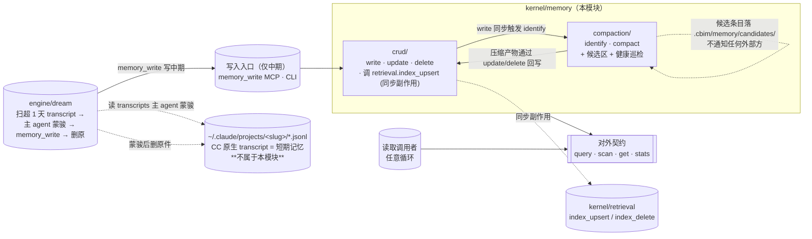

## Positioning

**项目本地的中期记忆服务**，类比一个嵌入式的文档库。本模块只管**中期记忆**（`.cbim/memory/medium/`）与**候选区**（`.cbim/memory/candidates/`）；它有自己的内部生命周期（CRUD ↔ 压缩升级），对外只暴露 4 个**只读**接口（`query` / `scan` / `get` / `stats`）。

**v2 重设计后的关键收窄**：**短期记忆路径（`.cbim/memory/short/`）废弃**。Claude Code 原生的 `~/.claude/projects/<project-slug>/*.jsonl` 会话转录直接作为短期记忆（1 天保留期，超期由 dream 循环蒙骏 → 写 medium → 删原 transcript）。本模块**不拥有也不摆到 short transcripts**——transcripts 是 Claude Code 的产物，本模块只是其蒙骏产物（medium 条目）的落地点。

**它不是什么**：

| 误解 | 澄清 |
|------|------|
| 一条从原始到知识的单向晋升流水线 | 不是。CRUD 与压缩升级是**双向闭环**：写入会触发候选识别，候选区压缩后还可能反哺为新的低层条目。 |
| 拥有短期记忆存储 | 不是（v2 变更）。短期记忆 = `~/.claude/projects/<slug>/` 下的 CC transcript JSONL，不在 `.cbim/memory/short/` 下；路径不由本模块拥有。 |
| 由 Stop Hook 链式驱动的提炼到 `.dna/` 的链路 | 不是。Hook 仅被用于索引 transcript（与 `kernel/retrieval` 的交互），**不**再负责写 short 条目。写入路径只会是显式 `memory_write` / CLI / 压缩升级触发器。 |
| 一个“为四大循环服务”的子系统 | 不是。它是被动数据服务，与四大循环**平级**。循环消费它，但它不知道循环存在。 |
| 一定要"晋升到 `.dna/`"才算成功 | 不是。绝大多数 medium 条目终其生命周期都不会进入 `.dna/`。 |
| Session 恢复者 / 事件源 / 调度参与方 | 不是。不感知会话生命周期、不 emit 事件、不参与调度决策。 |
| 检索引擎 | 不是。向量检索 / BM25 / 索引存储 / 漂移校验都在平级模块 `kernel/retrieval`；memory 仅在 `crud.write` 后作为同步副作用调 `retrieval.index_upsert("memory_medium", ...)`。 |

## Sub-module Relationships

**子模块关系**：

| 关系 | 方向 | 说明 |
|------|------|------|
| `crud` → `compaction` | `write` 同步调用 `identify` | "Create 一体两步"的第 2 步；不通知外部 |
| `crud` → `kernel/retrieval` | `write` / `update` / `delete` 同步调 `index_upsert` / `index_delete` | 索引与数据一致性由本模块承诺；该依赖进入 module dependencies |
| `compaction` → `crud` | `compact` 通过 `update` / `delete` 回写 | 改盘的唯一入口在 `crud`；`compaction` 不持有文件写权限 |
| `compaction` ↔ `candidates/` | 独占工作区 | 路径独立，不复用 `medium/` |

**与外部模块的协作**：

| 对方 | 方向 | 说明 |
|------|------|------|
| `kernel/retrieval` | crud 调用 | 写入 / 更新 / 删除 medium 条目后同步调索引 |
| `engine/dream` | dream 调用 memory_write | dream 从 transcripts 蒙骏后以普通写入路径调 `memory_write` 落 medium；本模块对 dream 无感知 |
| `~/.claude/projects/<slug>/` transcripts | 本模块不读不写 | transcripts 是 Claude Code 产物，不是本模块的数据；蒙骏者（主 agent in dream）才读，hook 才删 |

**无循环依赖**——`crud` ↔ `compaction` 是**双向调用**，不是双向静态依赖；静态依赖只有一条：`compaction → crud`。`crud → retrieval` 是本模块唯一的跨模块依赖，单向。

## Origin Context

原始设计试图由本模块同时拥有 short / medium 两层存储。实践中出现三个问题：

1. **Short 层与 CC transcript 高度重叠**——两者都是会话原文的部分抷要，short 实际是 Stop hook 对 transcript 的二手冗余拷贝；
2. **信号字段扫描依赖 LLM 以外的人工勾选**（原 memory_distill skill 的"填 `- [x]`"步骤），对 distill 自动化是硬堡垒；
3. **CC transcript 本身已是高保真会话记录**，主 agent 读原始 JSONL 推断 MUST/WANT/HOW/IS 比读加工过的 short 条目信息损耗更小。

v2 重设计决议：
- 废弃 short 层；CC transcript 直接作为短期记忆，保留1 天；
- `memory_distill` 输入源从 short 改为 transcript，取消人工信号预备步骤；
- transcript 蒙骏后删除原文件（避免重复处理与磁盘压力）；
- 蒙骏作业从原来在主循环压入热路径改为放在治理循环（`engine/dream` 的记忆治理步）。

本模块随之变化：**只管 medium + candidates 两个存储区**；不再有 `short/` 路径、不再有 Stop hook 写 short 的契约、不再有信号扫描逻辑。

另一个 v2 变更是**向量检索**：本模块原本只有关键词 `query`，现在提升为向量+关键词混合。但检索逻辑本身**不进本模块**——抽到平级的 `kernel/retrieval` 供 4 个源（transcript / memory_medium / dna / agents）共享；本模块只在 `crud.write` 后同步调 `retrieval.index_upsert("memory_medium", ...)` 保证索引与 medium 文件一致。

## Key Decisions

- **被动数据层定位是铁律。** 本模块不参与业务调度、不主动通知任何方、不区分调用者身份。同一查询条件，谁来查结果都一样。任何"为某循环优化视图"的需求由上层 ACL/Filter 包装实现，**不**在本模块内。
- **不拥有短期记忆存储。** v2 废弃 `.cbim/memory/short/` 路径与其上的一切契约。短期记忆 = CC transcript = `~/.claude/projects/<project-slug>/*.jsonl`，路径不由本模块持有、生命周期不由本模块管理。Hook 不再写 short，`memory_write` 不再接受 `tier="short"` 参数。
- **4 个对外接口稳定优先，签名在 `contract.md`。** `query` / `scan` / `get` / `stats` 全部进入本模块 `contract.md`。`stats` 不是临时调试接口——audit / 健康度观测对它有长期依赖。
- **写入路径两条，不在对外契约内。** 只保留 `memory_write` MCP / CLI 两条明确入口进到 `crud/` 子模块（v1 原有的 "Hook 写 short" 路径随 short 层废弃一同取消）。外部循环**不能**直接写记忆库。
- **写入同步触发 `retrieval.index_upsert` 是本模块的硬责任。** `crud.write` / `update` / `delete` 完成落盘后同步调 `retrieval.index_upsert("memory_medium", doc_id, content, metadata)` 或 `index_delete`；调用未返回前不能判 `write` 成功。这让检索与存储一致性在本模块边界内被锁死，避免上层遗漏。
- **与 `.dna/` 知识系统是同级独立系统。** 记忆条目可能被人工或 Architect **复制**到 `.dna/`，但这是知识侧的**导入**动作，不是本模块的"出口"。`compaction/` 只生成候选条目并标记 `promote_candidate`，等知识循环来 `scan(filter="promote_candidate")` 自取。
- **子模块分工的稳定性等同对外契约。** `crud/` 持有所有改盘动作的入口，`compaction/` 持有所有压缩升级与候选区管理；两者职责零重叠。父模块只暴露 4 个只读接口的转发，**不**在父模块层放任何业务逻辑。

## Non-Goals

- **不是事件源。** 任何写入、压缩、候选识别都不 emit 事件、不调外部回调、不写跨模块日志（模块内部观测日志除外）。
- **不是调度参与方。** 不持有任何“何时该跑什么”的判断；`compact` 由 CLI / 定时 / 阈值独立触发，触发逻辑不在本模块。
- **不是 Session 恢复者。** Session 启停由 Claude Code 本身或 hook 处理；本模块不知道"会话"这个概念。
- **不是短期记忆仓。** v2 后本模块不拥有 short 存储、不读 transcripts、不删 transcripts。任何 short 路径、Stop hook 写 short、`tier=short` 写入参数都是破窗。
- **不是检索引擎。** 向量 / BM25 / 索引存储在平级模块 `kernel/retrieval`；本模块只调它的 `index_upsert` / `index_delete`。
- **不是知识系统。** 不评判一条条目是否"值得晋升"；只识别"形态上像候选"并打包，决断权在知识循环。
