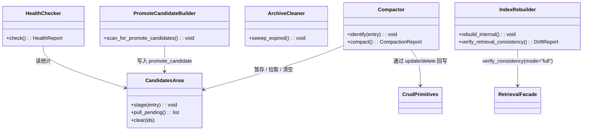

## Positioning

记忆服务的**压缩与升级层**：承载 4 个压缩升级操作（medium 内压缩、提升候选生成、归档清理、索引重建、健康巡检），独占 `candidates/` 工作区。识别只产生候选不通知任何外部循环；所有改盘动作都通过 `crud/` 的 `update` / `delete` 回写。

**v2 重设计后的关键变化**：
- **原"短→中蛒骨"责任从本模块上下架**。short 层废弃后，蛒骨作业（transcript → medium）不再是压缩动作之一——它是 `engine/dream` 调 `memory_distill` skill，主 agent 读 transcript JSONL 后以普通 `memory_write` 写 medium。本模块只管 medium 内部压缩 / 提升候选 / 归档 / 索引重建 / 健康巡检。
- `MemRebuildIndex` 表示重建本模块内部的查找索引与调 `engine/retrieval.verify_consistency("memory_medium", mode="full")` 以重对齐外部检索索引。

## Class Diagram

## Key Decisions

- **不再负责“短→中蛒骨”。** v2 后蛒骨路径从本模块上下架：short 层废弃后，蛒骨输入源从 `.cbim/memory/short/*.md` 变为 `~/.claude/projects/<slug>/*.jsonl`（CC 原生 transcript）。该路径由 `engine/dream` 的记忆治理步调 `memory_distill` skill、主 agent 读 transcript 后以 `memory_write` 写 medium，与本模块**无关**。**本模块不读 transcripts、不调 LLM、不看“会话”这个概念**。
- **`candidates/` 是本模块独占的工作区，路径独立。** 候选区不是第三层存储，是压缩流程的工作区；物理上独立于 `medium/`（位于 `.cbim/memory/candidates/`）。外部只能通过父模块 `kernel/memory` 的 `scan(filter="promote_candidate")` 只读拉候选清单。
- **提升候选只识别和打包，不通知。** 识别出"值得被知识系统提升"的候选时，只把候选条目落进 `candidates/`（带 `promote_candidate` 标记），不调 Architect、不调 HR、不 emit 任何事件、不唤醒任何外部循环。
- **健康巡检逻辑归本模块，audit 只查 stats。** `HealthChecker` 在本模块内部实现容量 / 堆积 / 增长率等阈值判断；阈值穿透时只在巡检报告里说，不直接发告警。`audit` 模块只能通过父模块的 `stats()` 拉指标后自己判断。
- **本模块不持有任何文件写权限。** 所有改盘动作（合并 medium 条目、产出新 medium 条目、删除被覆盖的原始条目、归档过期条目）都通过 `crud/` 的 `update` / `delete` 完成。本模块只在 `candidates/` 自己的工作区里做暂存；正式存储区的修改必须经 `crud/` 这一道闸门——连带同步更新外部 `engine/retrieval` 索引。
- **`identify` 被 `crud/` 同步调用；`compact` 独立触发。** `identify` 没有自己的触发时机，它是 `write` 一体三步里的第 2 步；本模块只负责"识别什么、怎么打包候选"。`compact` 才是本模块的自治动作，由 CLI / 定时 / 阈值 / `engine/dream` 独立触发。
- **`MemRebuildIndex` 是两个动作的集合。** (1) 重建本模块内部 `index/`（服务于 `scan` / `get` 的快快表）；(2) 调 `engine/retrieval.verify_consistency("memory_medium", mode="full")` 全量校验与外部检索索引的一致性。到这一步是服务于"快检发现漂移后的兜底修复"；主的增量同步在 `crud/` 的写入路径上。
- **闭环自然收敛，无需外部判停。** `compact` 处理候选后回写的 `medium/` 又会触发 `identify` 再次产生候选——形成内部闭环。但因为每次 `compact` 严格减少候选总数（合并、删除原始条目），闭环会自然收敛；本模块不需要外部回调或显式 stop 条件。

## Sub-module Relationships

无下级子模块。本模块是 leaf；横向上反向调用 `crud/` 的 `update` / `delete` 回写压缩产物，构成记忆服务内部的双向闭环；`MemRebuildIndex` 另外依赖外部 `engine/retrieval.verify_consistency`。

## Non-Goals

- **不读 transcript JSONL。** 废弃了原来“扫 short 压 medium”的职责后，本模块不再访问 `~/.claude/projects/<slug>/`。Transcript 蒙骏在 `engine/dream` + `memory_distill` skill，蒙骏产物通过普通 `memory_write` 路径走到 `crud/`。
- **不调 LLM。** 压缩 / 识别候选 / 健康巡检 / 索引重建全部是确定性 Python 逻辑；任何“用 LLM 判断要不要压缩”的写法都是破窗。
- **不发事件、不调外部。** 压缩 / 识别候选 / 归档 / 重建索引都不通知任何方。
