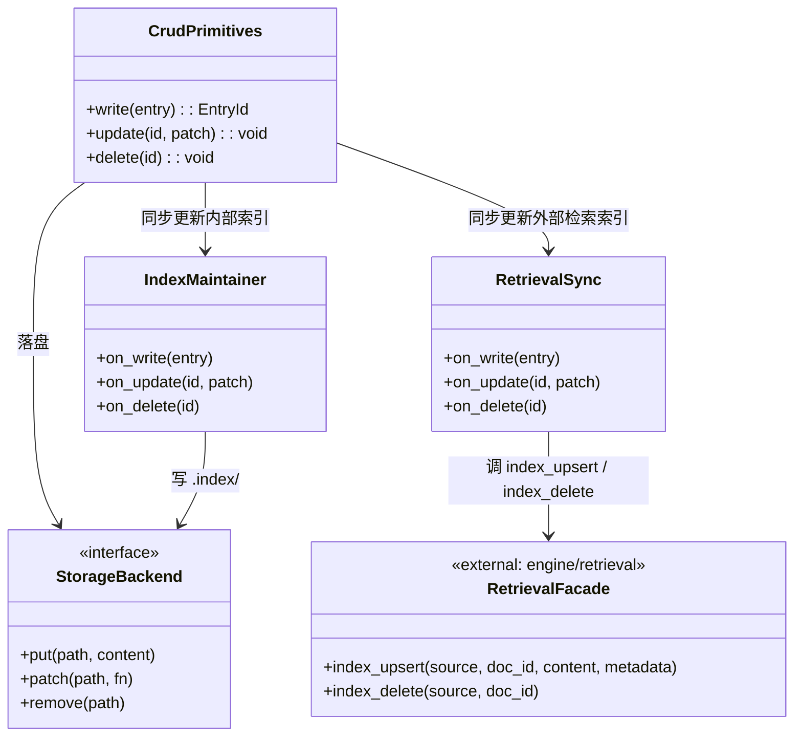

## Positioning

记忆服务的**写入与改删原语层**：承载 4 个 CRUD 原语（`write` / `update` / `delete` / 内部索引维护），是记忆服务内部所有"落盘 + 改盘"的唯一执行点。被 `compaction/` 反向调用以回写压缩产物；不暴露任何对外接口（对外的只读接口在父模块 `kernel/memory` 的 `contract.md`）。

**v2 重设计后的关键收窄**：
- 只写 `medium/`（`short/` 路径废弃）；candidates/ 仍由 `compaction/` 独占，本模块不直接写 candidates。
- 每次写入 / 更新 / 删除后**同步**调 `engine/retrieval.index_upsert` / `index_delete` 作为本模块的硬附责任。

## Class Diagram

**说明**：`IndexMaintainer` 是本模块的内部索引（例如 `index/` 下的查找快快表，服务于 `query` / `scan` / `get`）；`RetrievalSync` 是本模块调外部 `engine/retrieval` 的轻层，两者职责不混。两个都是同步调用，都在 `write` / `update` / `delete` 返回前完成。

## Key Decisions

- **Create 是"一体三步"的单一原语，不拆。** `write` 的对外语义就是一个原语；内部一定要按顺序完成三件事，且只在三件都完成后才返回成功：(1) 把新条目落盘到 `medium/` 并同步更新内部 `index/`；(2) 调 `compaction/` 的 `identify` 把命中压缩条件的候选复制到 `candidates/`；(3) 同步调 `engine/retrieval.index_upsert("memory_medium", doc_id, content, metadata)` 更新外部检索索引。任何拆分这三步都会破坏"写入即识别即可检"的同步语义，让上层可能只跑前两步或只跑前一步——这是 v2 重设计明确禁止的。
- **`tier="short"` 参数上下架。** v2 后 `write` / `update` / `delete` 只处理 `medium/` 路径下的条目；candidates/ 仍由 `compaction/` 独占。调用方传 `tier="short"` 返回参数验证错误；**不提供向下兼容**。原来写 short 的三条路径（Hook / `memory_write` MCP / CLI）现在收窄为两条路径（`memory_write` MCP / CLI）且只能写 medium。
- **索引一致性责任在本模块边界内。** 每个 CRUD 原语返回前必须同步完成两件索引事：(a) 更新本模块内部 `index/` （服务于 `scan` / `get`）；(b) 调外部 `engine/retrieval` 的 `index_upsert` / `index_delete`（服务于 `query` 与 跨源 retrieval 节点）。任一失败 → 整个原语返回错误；不接受"写了但还没索引"的中间态。实现上可以是顺序调用 + 任何一步失败回滚前面的改动，也可以是批启动后指定顺序提交；如何实现不进本模块 contract，但原语语义上是原子的。
- **`identify` 不通知外部，只是把候选状态写下来。** 第 2 步的副作用仅限于在 `candidates/` 落候选条目；不发起后续动作、不触发任何外部循环、不 emit 事件。后续 `compact` 由谁、何时跑，与 `write` 完全无关。
- **改盘的唯一入口在本模块。** 任何对 `medium/` 的修改、任何 `index/` 的同步更新、任何对外部 `retrieval` 的同步调用，都必须经 `crud/` 的三个原语；包括 `compaction/` 处理候选后产出的合并/覆盖结果，也必须通过 `update` / `delete` 回写——`compaction/` 不持有任何直接的文件写权限、不直接调 retrieval。
- **不持有对外接口。** 4 个对外只读接口（`query` / `scan` / `get` / `stats`）全部在父模块 `kernel/memory` 的 `contract.md` 内。`crud/` 是内部实现细节，**不**在父模块对外契约中出现；外部任何循环都不能直接调 `crud/`。写入侧的合法入口只有两条：`memory_write` MCP 工具、CLI——它们都先到父模块入口，再走入本模块。
- **`candidates/` 不归本模块管。** 候选区数据结构、识别逻辑、压缩流程在 `compaction/` 子模块；本模块只在 `write` 的第 2 步里调用 `compaction.identify(entry)`，把控制权交回去。
- **本模块增加一条跨模块依赖：`engine/retrieval`。** 进入 `module.md` Dependencies。方向仅为 `memory.crud → engine/retrieval`，`retrieval` 不依赖本模块；无环。

## Sub-module Relationships

无下级子模块。本模块是 leaf；横向上被 `compaction/` 反向调用（回写压缩产物），构成记忆服务内部的双向闭环；同时单向依赖外部 `engine/retrieval`（写入同步调用其 `index_upsert` / `index_delete`）。
