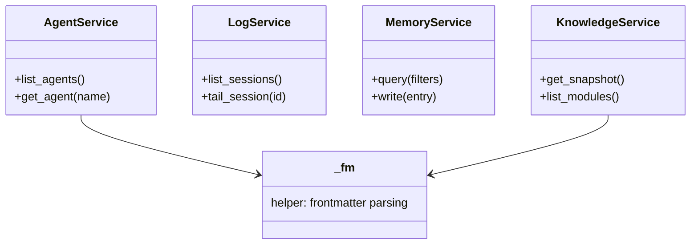

## Positioning

Facade layer between long-lived servers (`mcp_server`, `dashboard`) and kernel internals (`cbi`, `memory`). Provides stable, narrow APIs so the servers don't directly import volatile sub-package internals.

## Class Diagram

## Key Decisions

- **Services exist so the surface mcp_server / dashboard depend on stays stable across kernel refactors.** Without this layer, every renaming in `cbi/_primitives/modules.py` would break the MCP and dashboard tool surfaces.
- **Services own transactional write facades for all governance domains (agent / dna / memory).** Both CLI handlers (`engine/cli.py`) and MCP tools (`mcp_server/tools/*.py`) are thin shells over the service functions — this is the single source of truth for multi-file orchestration (e.g. init_module writes `.dna/module.md` + optional `contract.md` + registry update atomically). The previous "No service writes" rule was reversed in Phase 1 of the MCP-first surface migration.

