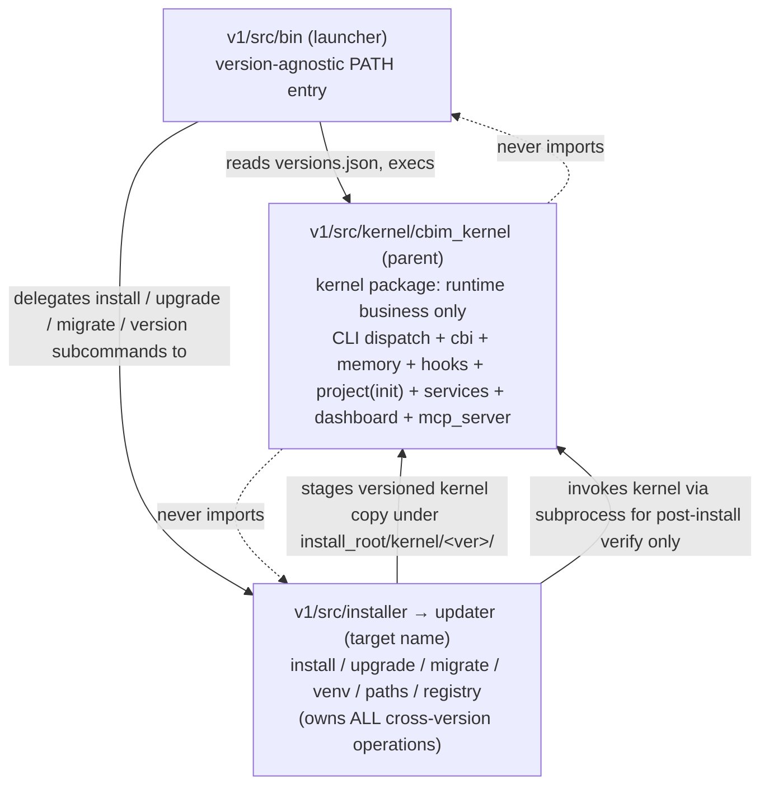

## Positioning

Cbim-CC kernel monorepo. Develops, packages, installs, and runs the globally-installed CC kernel and the per-project bootstrap that pins individual projects to a kernel version. Dogfoods CBIM on itself: this repo's own architecture knowledge lives under `.dna/`.

## Sub-module Relationships

`updater` is the renamed `installer` after absorbing schema-migration (`migrate`) and cross-version `upgrade` flow from `kernel/project/`. The on-disk directory remains `v1/src/installer/` in this revision; the rename is a separate task. Treat "installer" and "updater" as the same module — the latter is the target name once responsibilities settle.

## Origin Context

Two facts drive the three-way split:

1. The kernel must be **version-pinned per project**. Multiple kernel versions coexist under one install root; each project's `.cbim/.pin` names one. So the binary on PATH (`launcher`) is **deliberately separate** from any kernel version it dispatches to.
2. The kernel itself must not know how it was installed, where install root lives, or how to move from one schema version to another. That knowledge belongs to `updater` (all cross-version operations: install, upgrade, schema migrate) and `launcher` (entry resolution). The kernel only knows the project it currently serves, at its currently-pinned schema version.

The split between `updater` and `kernel` follows a single axis: **does this code run across versions, or within one version?** Cross-version → updater. Within-version → kernel. Schema migration is cross-version by definition (it reads schema N and writes schema N+1), so it lives in updater, not kernel.

## Key Decisions

- **Strict three-way layering: launcher → updater + kernel; updater ↔ kernel only via the on-disk versions registry.** No Python import edge goes from kernel back into updater or launcher. The on-disk contract (`<install_root>/versions.json`, `<install_root>/kernel/<ver>/`, `<project_root>/.cbim/.pin`) is the only coupling — unidirectional and inspectable. Subprocess invocation is permitted in one direction only: updater may shell into a staged kernel for post-install verification; kernel never shells into updater.

- **Launcher is the only file that may never break compat.** Kernel upgrades replace `<install_root>/kernel/<ver>/`; updater upgrades replace `<install_root>/installer/` (will become `<install_root>/updater/` after rename); the launcher on PATH is upgraded rarely and independently and inlines a copy of `install_root()` so it has zero deps on either package at startup.

- **Repo layout is `v1/src/{bin,installer,kernel}/`.** The `v1/` prefix exists because `v2/` (a separate native-agent experiment) lives in this repo but is out of scope for this `.dna/` tree. The `installer/` directory will be renamed to `updater/` in a follow-up; until then, "installer" and "updater" refer to the same module in this document.

- **Updater owns ALL cross-version operations; kernel owns only single-version runtime business.** The dividing line is the **version axis**, not project-vs-global:
  - **Updater handles**: `install` (place a new kernel version), `upgrade` (replace install + repin), `migrate` (transform `.cbim/` from schema N to schema N+1), version registry, venv, launcher placement, PATH. All of these read a "from version" and write a "to version".
  - **Kernel handles**: `init` (bootstrap a new project at the current kernel version — no version transition), plus runtime business (cbi, memory, hooks, services, dashboard, mcp, agent dispatch). Kernel code only ever executes at one schema version: its own.
  - Consequence: `cbim migrate` and the `project/upgrade/` sub-package currently inside `cbim_kernel/` are mis-located by this rule and are slated for migration to updater. See "Sibling split, not parent-child" below.

- **Sibling split, not parent-child — and the on-disk contract is the only coupling face.** Updater and kernel are siblings under launcher, not parent-and-child. Earlier framing put kernel as the "real" product with installer as a deployment helper; that framing forced the kernel to know about its own deployment story (e.g. embedding `cbim_version` in `config.json`, owning `project/upgrade/`, owning `project/migrate.py`). The corrected framing: updater and kernel are two peer products that **negotiate exclusively through on-disk artifacts** — `versions.json`, `<install_root>/kernel/<ver>/`, `<project_root>/.cbim/.pin`. Neither imports the other. Updater may subprocess into a staged kernel for verification; kernel never subprocesses or imports updater. This is the iron rule that the cross-version code in `cbim_kernel/project/` is currently violating, and the migration target that closes the violation. **Non-negotiable.**

- **Project lifecycle responsibilities split by the version axis; pin accessor split by R/W.** `init` stays in kernel (no version transition: bootstrap at current version). `migrate` and `upgrade` migrate out to updater (cross-version transitions). For `<project_root>/.cbim/.pin` accessors, the previously-deferred decision is now resolved along the R/W axis:
  - **`write_pin` moves to updater.** Writing the pin is a cross-version operation by definition (it records the result of `migrate` or `upgrade.apply`). Updater owns the single canonical writer; kernel no longer writes the pin after the migration. (Kernel's `init` bootstraps `.cbim/` at the current kernel version — that initial pin write goes through updater via the same canonical writer, invoked from kernel's init flow as a one-shot, or relocated entirely to updater's bootstrap surface during the migration task.)
  - **`read_pin` is inlined per consumer.** The pin format is frozen — plain text, single line, trailing `\n` — and is treated as a tiny stable contract, not shared code. Launcher, updater, and kernel each inline their own read helper. No module imports a `read_pin` from another; the duplication is intentional and bounded (three call sites, ~5 lines each) and removes the only remaining bidirectional import temptation. Kernel's existing `project/pin.py` after the migration: delete `write_pin`, and either delete `read_pin` (inlining it into the kernel callers) or keep it as a kernel-internal helper that no other package imports.
  - **One writer per file** stands, unchanged: `write_pin` lives in exactly one place (updater). Multiple readers inlining the same fixed format does not violate this — it reinforces it, because the format is locked and the readers cannot mutate.

- **Dogfooded `.dna/`.** This repo carries its own `.dna/` tree; architecture changes here are governed by the same kernel CLI that ships to users.
