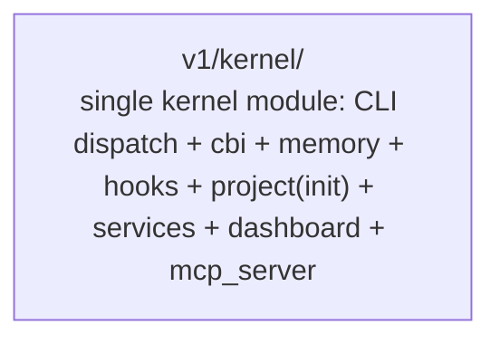

## Positioning

Cbim-CC kernel monorepo. Develops and packages the CC kernel; `install.sh` clones the repo and copies `v1/kernel/` into each project's `.cbim/kernel/`. Dogfoods CBIM on itself: this repo's own architecture knowledge lives under `.dna/`.

## Sub-module Relationships

`kernel` is the only module under this repo's `.dna/` tree. The earlier three-module design (`bin` launcher + `installer`/`updater` + `kernel`) targeted a globally-installed multi-version layout; that design was abandoned in favour of the current per-project flat-copy install (`install.sh` → `<project>/.cbim/kernel/`). No launcher binary, no version registry, no cross-version migrator exists on disk.

## Origin Context

The kernel must run inside each project's `.cbim/` and serve only that project. Earlier drafts considered a globally-installed kernel with version pinning per project (launcher on PATH + version registry + cross-version migrator), but the operational cost of maintaining cross-version compatibility outweighed the benefit at this scale. The current shape — `install.sh` copies `v1/kernel/` into `<project>/.cbim/kernel/`, kernel runs only against its own project — is a deliberate collapse of that earlier multi-module design into a single kernel module.

## Key Decisions

- **v1 layout collapsed to a single kernel module.** The earlier three-module design (`bin` launcher + `installer`/`updater` + `kernel`) was abandoned. On disk, only `v1/kernel/` exists; there is no launcher binary on PATH, no install-root version registry, no cross-version migrator. Install is a flat copy of `v1/kernel/` into `<project>/.cbim/kernel/` via `install.sh`.

- **Repo layout is `v1/kernel/` + `v1/tests/` + `v1/docs/` + `v1/benchmark/`.** The `v1/` prefix exists because `v2/` (a separate native-agent experiment) lives in this repo but is out of scope for this `.dna/` tree.

- **Per-project install, no global state.** Each project owns its own `.cbim/kernel/`. Kernel code only ever executes against the project it currently serves. No cross-project, cross-version, or cross-install coordination.

- **Dogfooded `.dna/`.** This repo carries its own `.dna/` tree; architecture changes here are governed by the same kernel CLI that ships to users.

