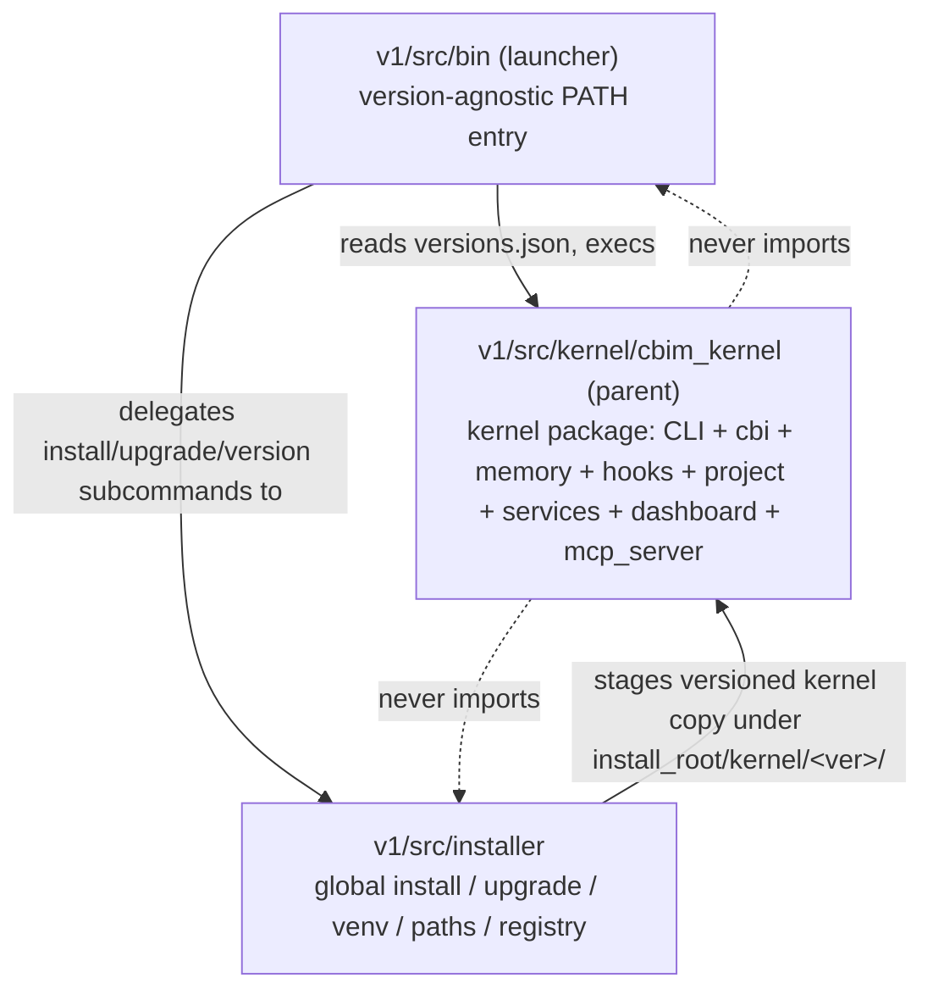

## Positioning

Cbim-CC kernel monorepo. Develops, packages, installs, and runs the globally-installed CC kernel and the per-project bootstrap that pins individual projects to a kernel version. Dogfoods CBIM on itself: this repo's own architecture knowledge lives under `.dna/`.

## Sub-module Relationships

## Origin Context

Two facts drive the three-way split:

1. The kernel must be **version-pinned per project**. Multiple kernel versions coexist under one install root; each project's `.cbim/config.json` names one. So the binary on PATH (`launcher`) is **deliberately separate** from any kernel version it dispatches to.
2. The kernel itself must not know how it was installed or where install root lives. That knowledge belongs to `installer` (global ops) and `launcher` (entry resolution). The kernel only knows the project it currently serves.

## Key Decisions

- **Strict three-way layering: launcher → installer + kernel; installer ↔ kernel only via the on-disk versions registry.** No Python import edge goes from kernel back into installer or launcher. The on-disk contract (`<install_root>/versions.json`, `<install_root>/kernel/<ver>/`) is the only coupling — unidirectional and inspectable.
- **Launcher is the only file that may never break compat.** Kernel upgrades replace `<install_root>/kernel/<ver>/`; installer upgrades replace `<install_root>/installer/`; the launcher on PATH is upgraded rarely and independently and inlines a copy of `install_root()` so it has zero deps on either package at startup.
- **Repo layout is `v1/src/{bin,installer,kernel}/`.** The `v1/` prefix exists because `v2/` (a separate native-agent experiment) lives in this repo but is out of scope for this `.dna/` tree.
- **Project lifecycle (init / migrate / upgrade) lives inside the kernel package**, not the installer. Rationale: init/migrate/upgrade operate on a CBIM project (`<cwd>/.cbim/`), not on the global install root, so they are kernel concerns invoked through `cbim <cmd>`. Installer only manages the global install root.
- **Dogfooded `.dna/`.** This repo carries its own `.dna/` tree; architecture changes here are governed by the same kernel CLI that ships to users.
