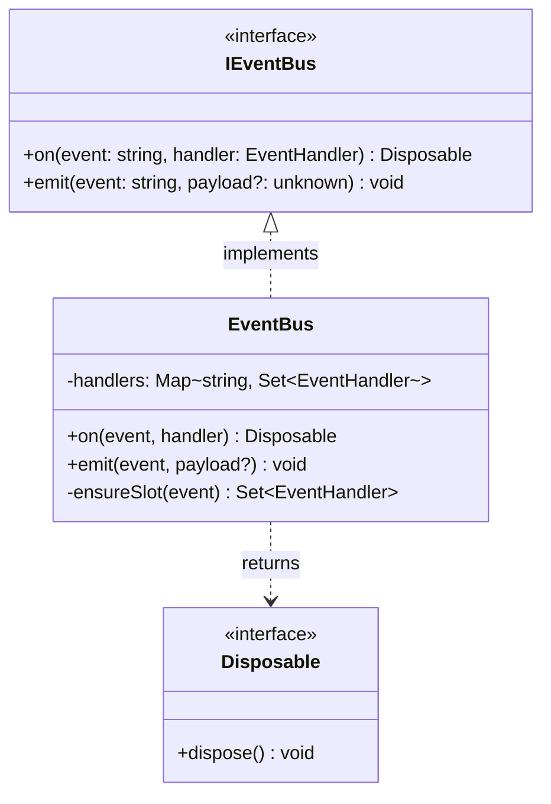
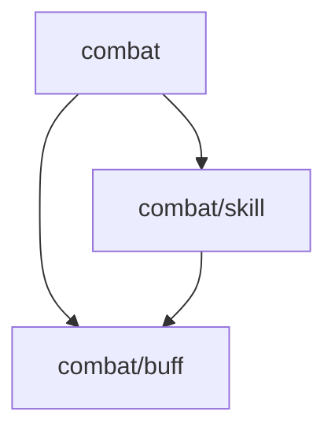

[English](ARCHITECTURE.md) | [中文](ARCHITECTURE.zh-CN.md)

# CBIM 架构文档

## 为什么需要 CBIM

Agent 真正替代人力、提升效率，需要同时满足两个条件：

```
真正提效 = 能自动跑 × 跑得健康
```

两个条件缺一不可：

- **只能自动跑，跑不健康**：输出平铺混乱，无层级、无边界，review 成本比人工写代码更高，大型项目维护性极差——依然需要大量人力介入
- **跑得健康，但需要人驱动**：每个步骤都要人对话推动，效率没有数量级提升，无法真正替代人力

当前 AI 编码 Agent 尚未大规模替代人力，根本原因不是模型不够强——而是**同时满足"能自动跑"和"跑得健康"的系统架构还不存在**。

CBIM 正是为解决这两个问题而设计：

| 目标 | CBIM 的解法 |
|------|-----------|
| **能自动跑** | SessionStart/Stop hook 跨 session 零成本恢复上下文；coordinator dispatch 无需人工路由；知识快照让 agent 启动即有项目全景；v2 任务队列支持自主消费需求单、bug 单、测试单 |
| **跑得健康** | Architect Gate 确保输出有层级、有边界；`.dna/` 知识库让真人 review 成本极低；两层治理持续保障架构质量；上下文最小化减少幻觉和返工 |

两个条件同时满足，才能实现 **agent 自主交付、人工只做最终审查** 的工作模式。

---

## 这是什么

**CBIM** = **CBI**（Capability-Business Independence，能力-业务独立性）+ **M**（Memory，记忆系统）

**CBI** 是核心设计哲学：

> 能力（Agent 定义、Skills）与业务（项目知识、模块内容）必须严格分离，互不污染。
> 能力是可移植的专业技能；业务是特定项目的知识蓝图。两者只通过任务接口协作，不相互耦合。

**M** 是框架的记忆基础设施：会话记忆（短期/中期）+ SessionStart 上下文注入，让 CBIM 在项目中跨会话积累结构化知识。

这一哲学体现在框架的每一层设计：

| 分离维度 | 能力侧 | 业务侧 |
|---------|-------|-------|
| 存储位置 | `.claude/agents/`（soul）+ `cbim/knowledge/skills/`（能力向 skill） | `.dna/` 目录 = 模块身份标识；`module.md` = 唯一硬约束；其余全部可选 |
| 治理者 | HR | 架构师 |
| 铁律 | soul/skills 不含任何项目特定内容 | 知识文件不引用 agent 规范 |
| 可验证性 | 放到另一个项目仍然有意义 → 合规 | 只描述当前最终工作状态，不描述 agent |

**它解决的具体问题**：

当前最常见的 Claude Code 工作模式是：**一个默认 agent + 大量 CLAUDE.md + 大量 skill**。这个模式有一个随时间恶化的结构性缺陷：

```
对话轮次增加
  → CLAUDE.md、skill 文件逐渐被全量加载进上下文
  → token 暴增，LLM 开始"迷失在中间"
  → 幻觉概率上升，输出质量下降
  → 纠正错误又消耗更多 token，进一步污染上下文
```

**重置 session** 能清除上下文，但带来另一个问题：
- 对话记忆丢失
- 需要重新 grep 项目文件、重新理解代码结构
- 没有结构化的项目知识——只能靠人工重新告知 agent 背景

CBIM 同时解决这两个问题：

| 问题 | CBIM 的解法 |
|------|------------|
| 上下文随轮次暴增 | 多 Agent × 模块拓扑树：每次任务只加载目标 agent soul + 任务子树 `.dna/`，上下文与项目规模无关 |
| 重置后记忆丢失 | SessionStart hook 自动注入：模块拓扑快照 + 近期记忆，重置 session 零成本恢复项目上下文 |

**与标准 Claude Code 用法的对比**：

| | 标准 Claude Code | CBIM |
|---|---|---|
| 项目上下文 | 一个 `CLAUDE.md`（随项目增长无限膨胀） | 模块拓扑树 `.dna/`（按模块边界拆分，按需加载子树） |
| 业务规则 | 写入 `CLAUDE.md` 或 `.claude/skills/` | 写入对应模块的 `module.md`（唯一必需文件）；`contract.md`、`workflows/` 为可选扩展 |
| 操作步骤 | `.claude/skills/` 全量注册，始终占用上下文 | `cbim/knowledge/skills/`（能力向）+ `.dna/workflows/`（业务向），按需读取 |
| Agent | 一个大而全主 agent + 无数 skill | 多个专精 agent，每次只加载目标 agent soul |
| 治理 | 无 | 架构师（业务层，三序遍历拓扑树）+ HR（能力层）双轨治理 |

> **核心**：多 Agent（能力轴）× 模块拓扑树（业务轴）的二维结构，实现每次任务的上下文最小化。

CBIM 同时也是一个**可部署到任意项目的 Claude Code 上下文管理框架**。安装后，在项目根目录启动 Claude Code，主 session 就是"助手"——它是你与所有执行角色之间唯一的对话入口。

你只需要和助手说话。助手负责理解意图、拆解任务、路由给合适的 Agent、汇总结果。

---

## CBIM 核心 — 多 Agent × 模块拓扑树

CBIM 的核心不只是多 Agent，而是 **多 Agent（能力轴）× 模块拓扑树（业务轴）** 的二维结构。两者缺一不可：

- 只有多 Agent，业务知识仍是一团：不知道该加载哪些上下文
- 只有模块拓扑树，能力仍是大而全：agent 需要携带所有技能才能处理任意节点

两轴交叉，才能在每次任务中同时精确定位「用哪个 agent」和「加载哪个子树」。

### `.dna/` 约定：约定最小化 + 扩展开放

`.dna/` 约定遵循**约定最小化 + 扩展开放**的设计哲学：

- **`.dna/` 目录存在 = 模块身份标识。** 没有这个目录，就不是模块。目录的存在性是唯一的标记。
- **`module.md` 是唯一的硬约束** — 一个文件，YAML frontmatter（元数据）+ markdown 正文（架构），替代了原来的 `module.json` + `architecture.md` 组合。这与 `.claude/agents/<name>.md` 和 `cbim/knowledge/skills/<name>/SKILL.md` 形成统一的 `frontmatter + 正文` 模式。
- **其余全部可选** — `contract.md`（协议边界）、`workflows/`（确定性流程）、或任意用户自定义文件。框架推荐但从不强制。

```
.dna/
├── module.md           # 必需：唯一的硬约束
├── contract.md         # 可选：协议边界（REST / gRPC / SDK）
├── workflows/          # 可选：确定性流程定义
└── ...                 # 可选：用户自定义文件
```

### 模块拓扑树的作用

`.dna/` 目录按文件系统层级构成一棵树，不是平铺的模块列表：

```
.dna/（根）
├── src/combat/.dna/        ← 父节点：描述子模块关系与定位
│   ├── src/combat/skill/.dna/   ← 叶节点：封装具体实现
│   └── src/combat/buff/.dna/
└── src/economy/.dna/
```

拓扑树的价值：
1. **精确加载子树** — 任务涉及 `combat` 模块，只加载 `combat` 子树，`economy` 不进上下文
2. **层级治理** — 架构师用三序遍历（前序/中序/后序）系统检查整棵树的健康度
3. **依赖方向约束** — 树结构天然要求单向依赖，从根到叶，避免循环
4. **粒度匹配任务** — 跨模块任务加载父节点，叶级任务只加载叶节点，上下文随任务粒度自动伸缩

### 二维上下文最小化

```
每次任务的上下文 = 专精 agent 的 soul（能力轴）
               × 任务所在子树的 .dna/（业务轴）
```

| 维度 | 传统做法 | CBIM |
|------|---------|------|
| **能力轴** | 一个大而全主 agent，soul 包含所有技能 | 多个专精 agent，每次只加载目标 agent 的 soul |
| **业务轴** | `CLAUDE.md` 写入全部业务规则，常驻上下文 | 模块拓扑树，只加载任务所在子树的 `.dna/` |

结果：**上下文 ≈ 一个专精 agent 的 soul × 任务子树的 .dna/**，与项目总规模无关。

### 少上下文 → 少幻觉 → 少 token

LLM 在长上下文中分析质量下降是已知规律（"lost in the middle"）。上下文污染会产生复利式损耗：

```
大而全 agent + 全量知识常驻
  → 上下文污染 → 幻觉率↑ → 错误↑ → 纠正轮次↑ → token 恶性循环

专精 agent × 任务子树按需加载
  → 上下文干净 → 幻觉率↓ → 准确↑ → 零纠正 → token 节省
```

多 Agent 的调度开销是**固定成本**；单体大 agent 的上下文污染是**随项目规模增长的变动损耗**。

> CBIM 用固定的调度开销，换取每次任务的二维上下文最小化。这是 **多 Agent × 模块拓扑树** 设计的核心取舍。

---

## 架构全景

```
┌─────────────────────────────────────────────────────────────────┐
│                          用户                                    │
└──────────────────────────┬──────────────────────────────────────┘
                           │ 所有交互
                           ▼
┌─────────────────────────────────────────────────────────────────┐
│  助手（主 session，CLAUDE.md）                                   │
│  · 唯一对外接口  · 任务拆解  · 派发调度  · 汇总结果             │
└──────┬───────────────────┬──────────────────┬───────────────────┘
       │                   │                  │
       ▼                   ▼                  ▼
┌────────────┐    ┌────────────────┐    ┌──────────────────────┐
│  架构师    │    │      HR        │    │  Work Agents         │
│            │    │                │    │  (programmer, ...)   │
│ 业务层治理 │    │  能力层治理    │    │  执行具体任务        │
│  .dna/     │    │ .claude/agents/│    │  按蓝图实现交付      │
└────────────┘    └──────┬─────────┘    └──────────────────────┘
                         │
                    ┌────┴────┐
                    │  评审官  │
                    │  独立审查│
                    └─────────┘
```

---

## 四个核心 Agent

| Agent | 职责 | 管辖范围 |
|-------|------|---------|
| **助手** | 唯一对外接口，拆解调度，汇总结果 | 全局协调 |
| **架构师** | 设计并维护项目知识体系，架构评审 | `.dna/`（业务层） |
| **HR** | Work agent 全生命周期：招募、培训、考核、归档 | `.claude/agents/`（能力层） |
| **评审官** | 独立批判审查，只读，只由助手派发 | 全局只读 |

核心 4 个 Agent **永远不在 HR 的治理范围内**。

Work agents（如程序员）由 HR 按需创建，助手通过 HR 申请后派发。

---

## 如何使用

直接告诉助手你要做什么，不用指定具体 Agent：

| 你想做 | 直接说 |
|--------|--------|
| 初始化项目知识体系 | 请初始化本项目的模块知识体系 |
| 新建一个功能模块 | 新建一个 combat 模块 |
| 按蓝图实现代码 | 按当前蓝图实现登录接口 |
| 审查某个设计/改动 | 审一下这次改动 |
| 查历史决策 | 查一下 combat 模块的历史决策 |

---

## 两类 Skill

传统 Claude Code 项目会在 `.claude/skills/` 里堆积大量 skill 文件，随项目增长难以管理。CBIM 按照「谁拥有、谁受益」将 skill 一分为二，`.claude/` 下只剩 `agents/`，保持干净。

| 类型 | 归属 | 存储位置 | 治理者 | 特征 |
|------|------|---------|--------|------|
| **能力向 skill** | Agent 私有能力 | `cbim/knowledge/skills/<name>/SKILL.md` | HR | 描述 agent 怎么做某类操作；可移植，放到任何项目仍有意义 |
| **业务向 skill** | 模块确定性流程 | `.dna/workflows/<name>/workflow.md` | 架构师 | 描述特定模块的业务步骤；与项目强绑定，随模块演化 |

```
.claude/
└── agents/          ← soul 文件，引用 cbim/knowledge/skills/ 里的能力向 skill
                        （无 .claude/skills/，无混乱堆积）

cbim/knowledge/skills/   ← 能力向 skill（HR 治理，agent 跨项目可复用）
.dna/workflows/          ← 业务向 skill（架构师治理，模块内确定性流程）
```

### 业务向 Skill 的按需加载

业务向 skill（workflow）不会全量注入会话上下文。**只有当某个模块被指定处理时，该模块的 `.dna/` 才会被加载 — `module.md` 始终加载（唯一必需文件），其余可选文件只在存在时加载。**

```
SessionStart
  └── snapshot.py 注入会话
        ├── 模块树：路径 + 名称 + owner（来自 module.md frontmatter）
        └── agent 列表：id + description（不含 skill 内容）

任务派发时（按需加载）
  └── agent 读取目标模块的 .dna/
        ├── module.md                          ← 始终加载（唯一必需文件）
        ├── contract.md（如存在）              ← 可选
        └── workflows/<name>/workflow.md       ← 可选，仅相关时加载
```

这是 CBIM 不需要在 `.claude/` 堆积大量 skill 的根本原因：
- 能力向 skill 由 agent 在需要时主动 Read，不常驻上下文
- 业务向 skill（workflow）封装在模块 `.dna/` 内，随模块按需加载，与其他模块完全隔离

项目可以有数十个模块、每个模块多个 workflow，对会话上下文的压力始终是常数级（快照 + 当前任务模块）。

**进化路径**：
- 业务流程出现 ≥ 2 次 → 架构师提炼为 `.dna/workflows/`（业务向 skill）
- agent 能力积累验证 → HR 提炼为 `cbim/knowledge/skills/`（能力向 skill）→ 内化进 soul

---

## 两层治理

| 层级 | 治理者 | 管辖范围 |
|------|--------|---------|
| **能力层** | HR | `.claude/agents/`（agent 定义与 skills） |
| **业务层** | 架构师 | 项目各级 `.dna/`（`module.md` + 可选扩展） |

**铁律**：能力进 `.claude/agents/`，业务进 `.dna/`，不得混入对方。

### 治理即评审

架构师和 HR 的治理过程均模拟资深 leader review，分两个维度：

| | 架构师（arch-governance） | HR（hr-assessment） |
|---|---|---|
| **维度一** | 架构设计合理性（18 因子，三序遍历） | 定义合理性（14 因子，纵横两层） |
| **维度二** | 知识与工作区一致性 | 定义与表现一致性 |
| **脚本化** | `arch-governance/check.py` 自动检查 8 项 | `hr-assessment/check.py` 自动检查 3 项 |
| **阈值配置** | `arch-governance/config.json` | `hr-assessment/config.json` |

---

## 架构可持续性

CBIM 解决的不只是上下文效率——它解决了另一个更深层的问题：**即便是 Vibe Coding，也能产出有层级、有边界、单向依赖的代码**。

### Vibe Coding 的架构隐患

"近乎 Vibe Coding"是对 AI 编码工具最不利的测试条件：用自然语言描述需求，不提供文件路径、类名、函数名。在这种条件下：

**Base 模式**（单 Agent）的典型输出：
- Agent 自行探索代码库，找到相关文件后就地修改
- 新代码随机放置在就近的文件中
- 没有层级意识，模块边界模糊，依赖方向随意
- 随需求累积，代码库逐渐退化为难以维护的平铺网络

**CBIM 模式** 在相同条件下：
- 每次实现任务必须先经过架构师
- 架构师确认模块归属、依赖方向、接口契约，更新或新建 `.dna/`
- 程序员携带明确的模块上下文实现代码
- 即使用户从未提及"架构"、"分层"、"模块边界"，这些约束依然被执行

### 知识先行原则（Architect Gate）

```
任何实现任务：
  用户需求
    → 助手 → 架构师
                 ├── 功能归属哪个模块？
                 ├── 是否需要新建模块？依赖哪些已有模块？
                 ├── 接口契约是什么？
                 └── 确认/更新 .dna/ 档案
    → 架构师返回模块上下文（路径 + 蓝图）
    → 助手 → 程序员（携带明确路径和蓝图）
                 └── 在正确的模块位置实现
```

架构师不是可选的评审步骤，而是每次实现任务的**必经路径**。每一次需求开发都复现这个循环——架构意识不依赖用户的技术素养，不依赖程序员的经验，由流程保障。

### Vibe Coding 条件下的输出对比

| | Base | CBIM |
|--|--|--|
| 代码放置 | 随机探索，就近修改 | 按模块归属，在确认路径下实现 |
| 层级结构 | 平铺，无层级控制 | 层级化，新代码归属明确的模块节点 |
| 模块边界 | 模糊，随需求蔓延 | 清晰，架构师在实现前确认边界 |
| 依赖方向 | 随意，双向耦合常见 | 单向，拓扑树结构约束方向 |
| 接口契约 | 隐式，实现即契约 | 显式，`contract.md` 先于实现存在 |

### 规模越大，优势越明显

项目规模越小，Base 模式的平铺代码问题越不明显（文件少、关系简单）。随着项目规模增长：

- **Base**：平铺网络持续扩张，模块边界越来越模糊，任何改动都可能引发意外副作用
- **CBIM**：拓扑树约束始终存在，新模块归入合适的父节点，依赖方向始终从根到叶

**架构可持续性不依赖人工审查，而是内嵌在每次任务的执行流程中。**

---

## 结构化可审计性

CBIM 的第三个核心价值面向**真人审查者**：当 agent 团队自主运行一段时间后，真人无需阅读代码——只需读 `.dna/` 和 `agents/`，就能看清整个项目状态与虚拟团队进展。

### 知识是一等公民

CBIM 将知识作为架构的一等公民，而不是代码的附属注释。`.dna/` 不是事后整理的文档，它是**架构师在每次任务前确认、在每次变更后更新的活体知识库**。这决定了真人审查时面对的是有结构可依赖的知识，而不是碎片化的 commit message 和散落的注释。

### 两个入口，一次性读懂项目全景

```
.dna/（树状）        → 业务全景
  ├── 每个模块一个 module.md：定位、类图、关键决策
  ├── contract.md（如存在）：跨边界接口契约
  └── workflows/（如存在）：沉淀下来的确定性业务流程

.claude/agents/      → 团队全景
  ├── 有哪些 agent，各自的能力边界
  ├── 每个 agent 掌握哪些 skill
  └── skill 演化状态（在用 / 验证中 / 已内化进 soul）

两者合并 → 项目进展 + 虚拟团队状态，一次性可读
```

### 与 Base 模式的对比

| 审查维度 | Base | CBIM |
|---------|------|------|
| 项目状态 | 读 git log → 读 diff → 猜意图 | 读 `.dna/` 树，模块边界和决策显式记录 |
| 团队状态 | 无虚拟团队概念 | 读 `agents/`，能力边界和技能分布清晰 |
| 知识来源 | 代码注释 + commit message（事后，碎片化） | 架构驱动写入（任务前确认，结构化） |
| 下一步影响判断 | 需深读代码才能判断影响范围 | 读模块契约和依赖树，快速定位影响边界 |

### 可维护性来自结构

因为知识由架构师主动维护，且与代码实现同步（知识先行），真人审查者面对的知识库具备：

- **完整性**：每个模块只需一个必需文件（`module.md`）— 元数据与架构合一，可选扩展（`contract.md`、`workflows/`）只在有价值时添加
- **时效性**：知识在实现前更新，不是事后补写
- **层级性**：拓扑树结构，粒度与任务自然匹配

这让 CBIM 下的项目比 Base 模式更容易**交接、协作、长期维护**——即便是新加入的真人开发者，也能通过知识树快速建立项目心智模型，而不是从零读代码。

---

## 记忆系统

**助手是唯一的记忆持有者。** Subagent 专注执行，不直接操作记忆。

记忆在 CBIM 中是一条**三阶段蒸馏管道**，每阶段目的不同：

| 阶段 | 路径 | 目的 |
|------|------|------|
| **短期** | `cbim/memory/store/short/` | 原始 session 记录；主要用于近期上下文恢复，自动清理 |
| **中期** | `cbim/memory/store/medium/` | 压缩提炼后的模式摘要；去噪、保留有效信号，长期留存 |
| **知识**（核心） | `cbim/knowledge/skills/` + `.dna/` | 结构化落地：能力进 skills/soul，业务进 `.dna/workflows/` |

三个阶段的转化关系：
- **短期 → 中期**：压缩过程 — 去掉执行细节，保留值得记录的模式和教训
- **中期 → 知识**：最核心的一步 — 将验证过的模式固化为治理结构，成为后续所有任务的基础

| 层级 | 路径 | 生命周期 |
|------|------|---------|
| 短期 | `cbim/memory/store/short/` | 提炼后标记 `distilled`，至少保留 3 天后由 cleanup 删除；未提炼的永不自动删除 |
| 中期 | `cbim/memory/store/medium/` | 长期保留，升格至知识层后手动归档 |

- **Stop hook** — `write-memory.py` 在 session 结束时自动执行两件事：
  1. 将本次调度内容写入短期记忆（`store/short/YYYY-MM-DD-*.md`）
  2. 写入 `store/last-session.md` — 结构化恢复点（任务、执行记录、改动文件、涉及模块）

- **SessionStart hook** — `load-memory.py` 在 session 开始时自动注入三层上下文：
  1. **项目知识快照**（模块拓扑树 + agent 列表）
  2. **上次 session 恢复点**（`last-session.md`，始终优先注入）
  3. **近期记忆**（按修改时间排序，top-k 条）

- **按需查询** — 会话中途可通过 `cbim/memory/engine/cli.py query` 检索历史

```
session 结束
  └── Stop hook
        ├── store/short/YYYY-MM-DD-*.md   ← 原始记录（治理 + 恢复的共同来源）
        └── store/last-session.md          ← 恢复点（下次直接注入）

新 session 开始
  └── SessionStart hook 注入
        ├── 项目知识快照（模块树 + agent 列表）
        ├── 上次 session 恢复点
        └── 近期记忆（按时间排序）

治理周期（HR / 架构师主动触发）
  └── 三阶段蒸馏
        ├── short/ → medium/         （压缩：助手提炼摘要）
        ├── medium/ → skills/soul    （固化：HR 将模式转为能力治理结构）
        └── medium/ → .dna/          （固化：架构师将模式转为业务治理结构）
```

---

## 记忆蒸馏路径

### 能力蒸馏（HR 侧）

```
store/short/          原始 session 记录（自动写入）
    ↓ 压缩提炼
store/medium/         能力模式摘要（去噪，保留有效信号）
    ↓ 固化（最核心的一步）
cbim/knowledge/skills/<name>/SKILL.md   新增或更新能力向 Skill
    ↓ 多次验证后内化
.claude/agents/<id>/<id>.md             更新 Soul / Identity
```

### 业务蒸馏（架构师侧）

```
store/short/          原始 session 记录（自动写入）
    ↓ 压缩提炼
store/medium/         业务模式摘要（决策、接口变更、反复出现的流程）
    ↓ 固化（最核心的一步）
.dna/module.md + contract.md            更新模块蓝图
    ↓ 出现 ≥2 次的确定性流程
.dna/workflows/<name>/                  新增业务向 Workflow
    ↓ 模块职责过重
拆分为多个子模块
```

---

## 目录结构（部署后）

```
<project>/
├── CLAUDE.md                          ← 助手身份（主 session）
│
├── .claude/
│   ├── settings.json                  ← 权限配置 + hook 注册
│   └── agents/                        ← 从 cbim/cc-template/agents/ 安装
│       ├── architect/
│       │   └── architect.md
│       ├── hr/
│       │   └── hr.md
│       ├── auditor/
│       │   └── auditor.md
│       └── programmer/
│           └── programmer.md
│
├── .dna/                              ← 架构师创建，项目知识根模块
│   ├── index.md                       ← 仅根模块：全树模块路径列表
│   ├── module.md                      ← 必需：唯一硬约束（frontmatter + 架构）
│   ├── contract.md                    ← 可选：协议边界（REST / gRPC / SDK）
│   ├── workflows/                     ← 可选：确定性流程定义
│   └── ...                            ← 可选：用户自定义文件
│
└── cbim/                              ← 框架本体
    ├── install.py / install.bat
    │
    ├── cc-template/                   ← Claude Code 安装模板
    │   ├── CLAUDE-template.md
    │   ├── agents/                    ← agent 模板（单 .md 文件）
    │   │   ├── architect/architect.md
    │   │   ├── hr/hr.md
    │   │   ├── auditor/auditor.md
    │   │   └── programmer/programmer.md
    │   └── hooks/
    │       ├── load-memory.py         ← SessionStart：快照 + 记忆注入
    │       └── write-memory.py        ← Stop：写入短期记忆
    │
    ├── knowledge/                     ← 知识库（能力层 + 业务层 CRUD）
    │   ├── README.md                  ← 四象限架构说明
    │   ├── agent-convention.md        ← agent 定义规范
    │   ├── dna-convention.md          ← .dna/ 内容规范
    │   ├── engine/                    ← CRUD 原语 + CLI
    │   │   ├── cli.py                 ← 统一入口（agents / modules 双域）
    │   │   ├── agents.py
    │   │   ├── modules.py
    │   │   └── snapshot.py            ← 项目知识快照生成
    │   └── skills/                    ← 操作 skill（SKILL.md + 运行时脚本）
    │       ├── dispatch/              ← 助手请求分类与派发
    │       ├── arch-modules/          ← 模块 CRUD
    │       ├── arch-upgrade/          ← 知识升格（memory → .dna/）
    │       ├── arch-governance/       ← 架构评审（含 check.py + config.json）
    │       ├── hr-agents/             ← agent CRUD
    │       ├── hr-training/           ← agent 培训
    │       ├── hr-assessment/         ← agent 评审（含 check.py + config.json）
    │       └── audit-review/          ← 评审官对抗性审查
    │
    ├── memory/                        ← 记忆引擎
    │   ├── engine/                    ← Python 包（FileBackend）
    │   ├── skills/                    ← 记忆操作 skill（write / query / distill）
    │   └── store/
    │       ├── short/                 ← 短期记忆（gitignore）
    │       └── medium/               ← 中期记忆（gitignore）
    │
    └── preview/                       ← 本地预览服务（记忆 / 能力 / 知识）
        ├── server.py
        ├── preview.py / preview.bat
        ├── index.html / app.js / style.css
        └── __init__.py
```

---

## 附录：`module.md` 示例

`module.md` 是 `.dna/` 中唯一的必需文件。它将元数据（YAML frontmatter）与架构（markdown 正文）合并在一个文件中 — 与 `.claude/agents/<name>.md` 和 `cbim/knowledge/skills/<name>/SKILL.md` 形成统一的 `frontmatter + 正文` 模式。

### 叶子模块示例

````markdown
---
name: event-bus
owner: architect
description: 解耦的、类型安全的进程内事件分发
keywords: [event, pub-sub, decoupling]
dependencies: []
---

## 定位

解耦的、类型安全的进程内事件分发，用于跨模块通信。

## 类图



## 关键决策

- **接口优先**：消费方依赖 `IEventBus`，不直接依赖 `EventBus`，无需 mock 框架即可替换测试替身。
- **Disposable 返回值**：`on()` 返回 `Disposable` 而非要求调用 `off()`，防止忘记取消订阅导致的内存泄漏。
- **同步 emit**：Handler 设计为同步执行；异步副作用由 handler 自行管理，保持 bus 简单可预测。
````

### 父模块示例

父模块的正文只描述定位、子模块关系和跨子模块的涌现洞察 — 不写任何子模块的内部细节。

````markdown
---
name: combat
owner: architect
description: 战斗系统根模块
keywords: [combat, battle]
dependencies:
  - src/types
---

## 定位

所有战斗相关子系统的顶层容器。

## 子模块关系



- **skill** — 主动技能执行（施放、冷却、目标选取）
- **buff** — 被动状态效果（施加、持续、过期）

## 关键决策

- **skill 依赖 buff，反向禁止**：技能可以施加 buff，但 buff 不得触发技能 — 防止递归战斗循环。
````
