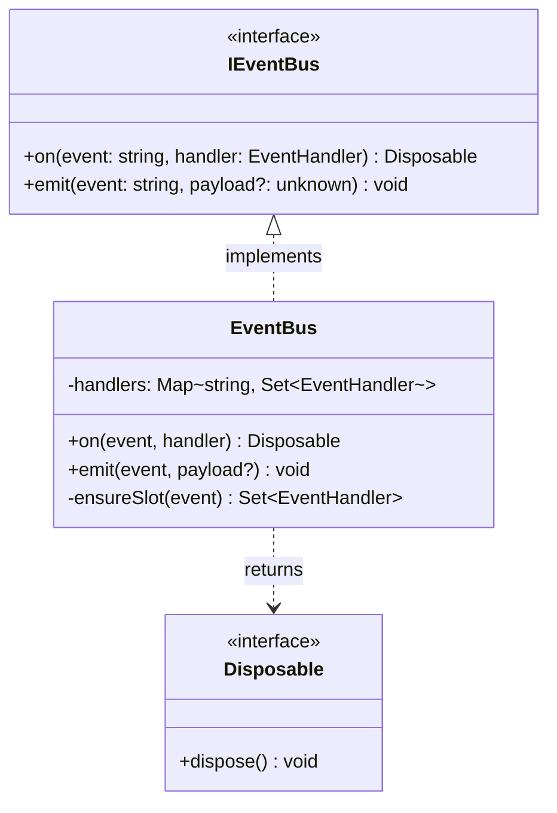

# `.dna/` Business Layer Convention

> The business layer is governed by the architect, strictly separated from the capability layer (`.claude/agents/`).

## Core Concepts

**Module**: Any directory containing a `.dna/` subdirectory is a module.

**Root module**: The project root directory itself must contain `.dna/`, making it the root module.

**Module tree**: Implicitly defined by the filesystem directory hierarchy. Parent module = the nearest ancestor directory that contains `.dna/`. No explicit hierarchy declaration is needed.

---

## Convention Layers

| Layer | Content |
|-------|---------|
| **Hard constraint** | `.dna/` exists = module; `module.md` must exist inside `.dna/` |
| **Framework recommended** | `contract.md` (protocol boundary), `workflows/` (deterministic processes) |
| **User freedom** | Any custom files under `.dna/` |

---

## Module Directory Structure

```
<project>/
└── <module>/
    └── .dna/
        ├── module.md              # required: the sole hard requirement
        ├── contract.md            # optional (recommended): protocol boundary (REST/gRPC/SDK)
        ├── workflows/             # optional (recommended): deterministic processes
        │   └── <workflow-name>/
        │       └── workflow.md
        └── <any user-defined files>  # optional: free extension
```

> **Change logs are not inside the module directory.** Module changelogs are written into session memory (`cbim/memory/store/`); the architect periodically distills and promotes them back to `.dna/`.

**Root-module-only file**:

```
<project>/
└── .dna/
    └── index.md    # list of relative paths of all modules in the tree (root module only)
```

---

## `module.md` Format

YAML frontmatter (metadata) + markdown body (architecture). A single file replaces the former `module.json` + `architecture.md` combination.

### Frontmatter Fields

```yaml
---
name: core-agent                           # required: kebab-case module name
owner: architect                           # required: responsible agent id
description: Agent lifecycle subsystem     # optional: brief module description
keywords: [agent, lifecycle, permission]   # optional: keywords for search
dependencies:                              # optional: paths of other modules this module depends on
  - src/types
includeDirs: []                            # optional: additional directories to include in context
---
```

### Body: Architecture Content

The markdown body after the frontmatter contains the module's architecture documentation. It follows the same design guide as the former `architecture.md`.

**Purpose**: Read once, grasp the architect's design intent. Write what the code cannot tell you; skip what the code already shows.

---

## `module.md` Design Guide

### Leaf Module

A leaf module's `module.md` body contains three sections:

1. **Positioning** — One sentence: what this module is and why it exists.
2. **Class Diagram** — Mermaid `classDiagram` showing classes, interfaces, key method signatures, and relationships (inheritance / composition / dependency).
3. **Key Decisions** — The "why" behind design choices — information invisible in the code itself.

Example:

````markdown
---
name: event-bus
owner: architect
description: Decoupled, type-safe in-process event dispatch
keywords: [event, pub-sub, decoupling]
dependencies: []
---

## Positioning

Decoupled, type-safe in-process event dispatch for cross-module communication.

## Class Diagram



## Key Decisions

- **Interface-first**: Consumers depend on `IEventBus`, never on `EventBus` directly, enabling test doubles without mocking frameworks.
- **Disposable return**: `on()` returns a `Disposable` instead of requiring `off()`, preventing forgotten-unsubscribe memory leaks.
- **No async emit**: Handlers are synchronous by design; async side-effects should be managed by the handler itself, keeping the bus simple and predictable.
````

### Parent Module

A parent module's `module.md` body contains three sections:

1. **Positioning** — One sentence: what this module is and why it exists.
2. **Sub-module Relationship Diagram** — Mermaid diagram showing child modules, their positioning, and inter-child relationships (dependency / composition / aggregation). **Never write any child module's internal details.**
3. **Key Decisions** — Emergent insights visible only from the cross-child-module perspective.

---

## Optional: `contract.md` (Protocol Boundary)

| File | When to create | Constraint |
|------|----------------|-----------|
| `contract.md` | Cross-language / cross-process boundary (REST, gRPC, message protocol); publicly released SDK/library API contracts | Currently valid external interfaces only; no change history; high-density, interface signatures as primary content |

**Do NOT create `contract.md` for ordinary internal modules** (e.g., TypeScript modules consumed within the same codebase). In strongly-typed languages, the source code itself is the contract; duplicating it in `contract.md` adds maintenance burden with no value.

If `contract.md` does not exist for a module, no error is raised; this is the expected default.

---

## Module Change Workflow

Three scenarios, three paths:

### 1. New Module

```
Architect writes module.md (frontmatter + target-state class diagram)
  -> Programmer implements according to the diagram
  -> (Optional) Architect reviews implementation against blueprint
```

The architect produces the blueprint first. The class diagram represents the **target state** — what the module should look like when implementation is complete.

### 2. Incremental Change (behavior tweak, no structural change)

```
Programmer modifies code directly
  -> module.md is NOT updated (class diagram and structure unchanged)
  -> Change details go into session memory
```

If the change does not alter class/interface boundaries, method signatures, or relationships in the class diagram, the programmer can proceed without involving the architect. The `module.md` stays as-is.

### 3. Structural Refactor (interface/structure change)

```
Architect updates module.md (new class diagram + new Key Decisions)
  -> Programmer implements according to the new module.md
  -> (Large multi-step migration) Architect may create a temporary contract.md
    as a migration blueprint; delete it when migration is complete
```

Any change that alters the class diagram — new classes, changed interfaces, restructured relationships — requires the architect to update `module.md` first. For large-scale refactors requiring coordinated multi-step migration, `contract.md` may serve as a **temporary migration blueprint** and must be removed once the migration is complete.

---

## Business Hard Rules

1. **No history** — `module.md` and `contract.md` describe only the current final state. Never write what changed or why it changed. Changes go into session memory (`cbim/memory/store/`); the architect periodically distills and promotes them.

2. **Parent module writes only relationships and positioning** — A parent module's `module.md` body describes only: the relationships between child modules (dependency / composition / aggregation) and each child module's positioning. Never write any child module's internal details. Each child module's internal design is the responsibility of its own `module.md`.

3. **Capability and business separated** — The knowledge pack contains only project/module knowledge; it must not reference agent capability specs.

---

## Backward Compatibility

The engine supports dual-format loading:

- **New format (preferred)**: `.dna/module.md` with YAML frontmatter + markdown body
- **Legacy format (deprecated)**: `.dna/module.json` + `.dna/architecture.md`

When only the legacy format is found, the engine loads it with a deprecation warning. Existing legacy files in user projects are **not deleted** — migration timing is the user's decision.

---

## `index.md` Format (Root Module Only)

```markdown
# Module Index

- . (root module)
- src/combat
- src/inventory
- src/ui/hud
```

One module relative path per line. The architect updates this whenever a module is created or deprecated.

---

## Workflow Structure

```
.dna/workflows/<workflow-name>/
└── workflow.md     # trigger conditions + steps + output format
```

A workflow describes a **deterministic process within the module** — it contains no agent capability descriptions. Trigger conditions are explicit, steps are self-contained, and execution requires no additional human instructions.

---

## CRUD Commands

```bash
# List all modules in the project
python cbim/knowledge/engine/cli.py modules list

# View module details
python cbim/knowledge/engine/cli.py modules show <module-dir>

# Initialize a new module
python cbim/knowledge/engine/cli.py modules init <dir> --name <name> --owner <owner>
```
