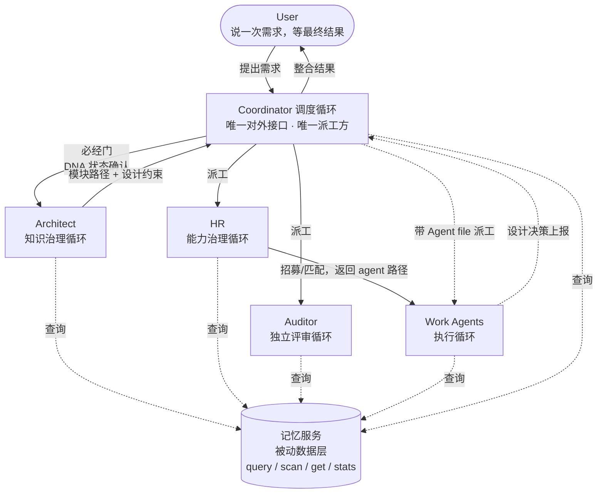

# CBIM 循环与角色全景

> CBIM 所有运行时角色与循环的**位置图**。
> 本文档只画位置，不画内部；每个循环/服务的内部设计在各自专门文档中。
> 关联文档：`design/WORKFLOW-MEMORY.zh-CN.md`（记忆服务）。

---

## 1. 总览图

---

## 2. 五角色一句话定位

| 角色 | 一句话定位 | 详细设计文档 |
|------|------------|--------------|
| **Coordinator** | 唯一对外接口、唯一派工方；理解意图、分解任务、调度路由、汇总反馈，不亲自执行业务。 | [`WORKFLOW-EXECUTION.zh-CN.md`](./WORKFLOW-EXECUTION.zh-CN.md) |
| **Architect** | 知识系统（`.dna/`）的守护者；模块设计、架构治理、知识蒸馏；所有需求型任务的必经门。 | [`WORKFLOW-ARCHITECT.zh-CN.md`](./WORKFLOW-ARCHITECT.zh-CN.md) |
| **HR** | Work Agent 全生命周期管理；招募、培训、考核、匹配；Coordinator 通过 HR 获取执行 Agent。 | [`WORKFLOW-HR.zh-CN.md`](./WORKFLOW-HR.zh-CN.md) |
| **Auditor** | 独立评审方；在 Coordinator 指派的时机对技术决策与产出质量进行独立批判，不被其他 Agent 直接调用。 | 待设计 |
| **Work Agents** | 具体业务执行者；按 Architect 给出的 ContextPack 实施任务，产出可验证交付物。 | 待设计 |

**记忆服务**的详细设计见 [`WORKFLOW-MEMORY.zh-CN.md`](./WORKFLOW-MEMORY.zh-CN.md)。

**记忆服务**不在五角色之列——它不是角色，是与所有循环平级的被动数据服务。详见 `WORKFLOW-MEMORY.zh-CN.md`。

---

## 3. 本文档的角色与维护方式

| 项 | 约定 |
|----|------|
| 文档定位 | CBIM 所有循环与服务的**唯一位置索引**。新人读完此文应能回答"系统里有谁、谁找谁、各自在哪"。 |
| 内容边界 | 只画位置关系（谁派谁的工、谁查谁的数据）；**不**画任何循环的内部状态机、不写任何接口签名、不展开任何角色的内部决策流程。 |
| 详细设计 | 每个循环/服务有独立的 `WORKFLOW-*.zh-CN.md`，本文档只在"详细设计文档"列中引用其路径。 |
| 维护触发 | 任何**循环边界调整**（新增循环、删除循环、合并、改变派工关系、改变查询关系）必须**同步更新本文档**，否则位置图与实际不符即视为破窗。 |
| 不需要更新的场景 | 某个循环内部状态机变化、接口签名变化、实现技术栈变化——这些只更新对应的 `WORKFLOW-*` 文档。 |

---

## 4. 当前状态

| 模块 | 设计状态 | 文档 |
|------|----------|------|
| 记忆服务 | ✅ 已设计（v3 定稿） | [`WORKFLOW-MEMORY.zh-CN.md`](./WORKFLOW-MEMORY.zh-CN.md) |
| Coordinator 调度循环 | 🚧 设计中 | [`WORKFLOW-EXECUTION.zh-CN.md`](./WORKFLOW-EXECUTION.zh-CN.md) |
| Architect 知识治理循环 | 🚧 设计中 | [`WORKFLOW-ARCHITECT.zh-CN.md`](./WORKFLOW-ARCHITECT.zh-CN.md) |
| HR 能力治理循环 | 🚧 设计中 | [`WORKFLOW-HR.zh-CN.md`](./WORKFLOW-HR.zh-CN.md) |
| Auditor 独立评审循环 | ⏳ 待设计 | — |
| Work Agents 执行循环 | ⏳ 待设计 | — |

记忆服务作为被动数据层先行定稿，是因为它的接口契约是其余四大循环设计的输入。四大循环将按 Coordinator → Architect → HR → Auditor → Work Agents 的顺序逐一展开设计，每完成一个回到本文档同步状态与文档链接。
