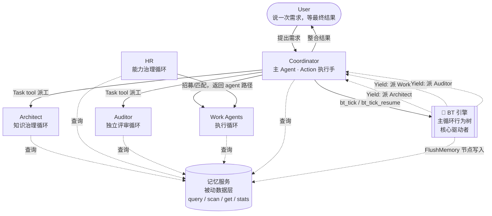

# CBIM 循环与角色全景

> CBIM 所有运行时角色与循环的**位置图**。
> 本文档只画位置，不画内部；每个循环/服务的内部设计在各自专门文档中。
> 关联文档：[`WORKFLOW-EXECUTION.zh-CN.md`](./WORKFLOW-EXECUTION.zh-CN.md)（执行循环 + 主循环行为树）、[`BEHAVIOR-TREE-ENGINE.zh-CN.md`](./BEHAVIOR-TREE-ENGINE.zh-CN.md)（行为树引擎实现）、[`WORKFLOW-MEMORY.zh-CN.md`](./WORKFLOW-MEMORY.zh-CN.md)（记忆服务）。

---

## 1. 总览图

**关键变化（v2）：** 主循环不再是 Coordinator 提示词里的散文流程，而是一棵由 BT 引擎驱动的行为树。Coordinator 退化为"具备 Task 工具的 Action 执行手"，控制流权在引擎。HR 退化为旁路服务（被 Coordinator 在需要 Work Agent 时同步调用），不再在派工主路径上。

---

## 2. 五角色一句话定位

| 角色 | 一句话定位 | 详细设计文档 |
|------|------------|--------------|
| **Coordinator** | 唯一对外接口；调 `bt_tick` 启动主循环行为树；按引擎 yield 出的 DispatchRequest 用 Task tool 派工；不持有控制流。 | [`WORKFLOW-EXECUTION.zh-CN.md`](./WORKFLOW-EXECUTION.zh-CN.md) |
| **Architect** | 知识系统（`.dna/`）的守护者；模块设计、架构治理、知识蒸馏；所有需求型任务的必经门（由 BT `ArchGate` 节点强制执行）。 | [`WORKFLOW-ARCHITECT.zh-CN.md`](./WORKFLOW-ARCHITECT.zh-CN.md) |
| **HR** | Work Agent 全生命周期管理；招募、培训、考核、匹配；Coordinator 在需要 Work Agent 时通过 HR 获取 agent 路径。 | [`WORKFLOW-HR.zh-CN.md`](./WORKFLOW-HR.zh-CN.md) |
| **Auditor** | 独立评审方；在变体树挂载 Audit 节点的场景下被 BT 引擎调度，不被其他 Agent 直接调用。 | 待设计 |
| **Work Agents** | 具体业务执行者；按 Architect 给出的 ContextPack 实施任务，产出可验证交付物。 | 待设计 |

**记忆服务**的详细设计见 [`WORKFLOW-MEMORY.zh-CN.md`](./WORKFLOW-MEMORY.zh-CN.md)。它不是角色，是与所有循环平级的被动数据服务。

---

## 3. 本文档的角色与维护方式

| 项 | 约定 |
|----|------|
| 文档定位 | CBIM 所有循环与服务的**唯一位置索引**。新人读完此文应能回答"系统里有谁、谁找谁、各自在哪"。 |
| 内容边界 | 只画位置关系（谁派谁的工、谁查谁的数据）；**不**画任何循环的内部状态机、不写任何接口签名、不展开任何角色的内部决策流程。 |
| 详细设计 | 每个循环/服务有独立的 `WORKFLOW-*.zh-CN.md`，本文档只在"详细设计文档"列中引用其路径。 |
| 维护触发 | 任何**循环边界调整**（新增循环、删除循环、合并、改变派工关系、改变查询关系）必须**同步更新本文档**，否则位置图与实际不符即视为破窗。 |
| 不需要更新的场景 | 某个循环内部状态机变化、接口签名变化、实现技术栈变化——这些只更新对应的 `WORKFLOW-*` 文档。 |

---

## 4. 当前状态

| 模块 | 设计状态 | 文档 |
|------|----------|------|
| 记忆服务 | ✅ 已设计（v3 定稿） | [`WORKFLOW-MEMORY.zh-CN.md`](./WORKFLOW-MEMORY.zh-CN.md) |
| Coordinator 调度循环 | ✅ 已设计（行为树引擎驱动） | [`WORKFLOW-EXECUTION.zh-CN.md`](./WORKFLOW-EXECUTION.zh-CN.md) + [`BEHAVIOR-TREE-ENGINE.zh-CN.md`](./BEHAVIOR-TREE-ENGINE.zh-CN.md) |
| Architect 知识治理循环 | 🚧 设计中 | [`WORKFLOW-ARCHITECT.zh-CN.md`](./WORKFLOW-ARCHITECT.zh-CN.md) |
| HR 能力治理循环 | 🚧 设计中 | [`WORKFLOW-HR.zh-CN.md`](./WORKFLOW-HR.zh-CN.md) |
| Auditor 独立评审循环 | ⏳ 待设计 | — |
| Work Agents 执行循环 | ⏳ 待设计 | — |

记忆服务作为被动数据层先行定稿；Coordinator 调度循环以行为树引擎的形态定稿。Architect / HR / Auditor / Work Agents 四个循环的内部状态机将按顺序展开设计；它们对外都通过 BT 引擎的 `DispatchRequest` 入口被调用，因此其内部循环设计不影响主循环拓扑。

---

## 5. 驱动模型

**BT 引擎是核心驱动者，五角色是循环参与者**——这是 v2 与 v1 最大的范式差异。

- **驱动者（BT 引擎）：** 持有主循环行为树拓扑、装饰器栈、黑板状态、迭代收敛判定。每次用户 prompt 触发一次 tick；引擎决定下一步派谁、什么时候收敛、什么时候打断用户。
- **参与者（五角色）：** Coordinator 是 Action 执行手（调 Task tool 派工）；Architect / Auditor / Work Agents 是被 BT yield 出的 DispatchRequest 调用的执行单元；HR 是被 Coordinator 在需要 Work Agent 时旁路查询的能力服务。所有角色都不持有主循环控制流——控制流只在 BT 引擎里。
- **平级关系：** BT 引擎与五角色不是上下级。BT 调度五角色完成任务，五角色不感知 BT 的存在（它们只看到"被 Coordinator 用 Task tool 派工了"）。这一层解耦保证了：未来若把 BT 换成其他调度器（或反过来），五角色无需修改。
- **驱动者只有一个：** L4 锁定——CBIM 主循环 = 唯一的全局根。没有平级的第二棵树。

引擎实现细节、节点契约、协程式 yield/resume 协议详见 [`BEHAVIOR-TREE-ENGINE.zh-CN.md`](./BEHAVIOR-TREE-ENGINE.zh-CN.md)。
