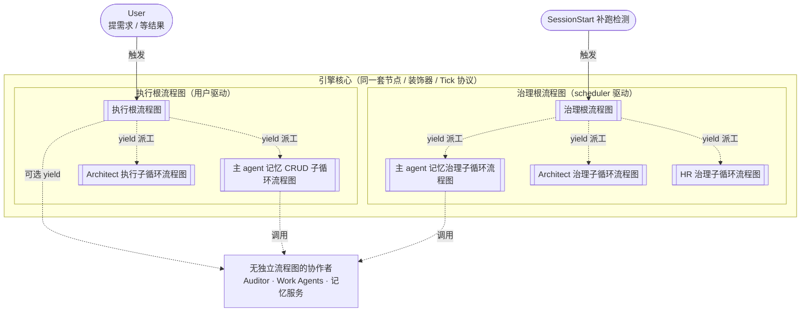

# CBIM 循环与角色全景

> **一句话开宗明义：CBIM 所有循环都是流程图。** 七棵流程图跑在同一个引擎核心上，没有第二种调度模型，没有手写状态机，没有散落的协程。看到"循环"就等于看到一个流程图。

本文档是给人看的**全貌索引**，不是技术规格。流程图为主，散文为辅；每个流程图的内部节点、黑板字段、收敛判定、实现细节，全部在各自的 `WORKFLOW-*.zh-CN.md` 里展开。

---

## 1. 七个流程图全景图

两个根流程图平级共存，互不 import；五个子循环流程图按"执行/治理"分别挂到对应根上。子循环也是流程图，由根流程图的 yield 派工触发，跑完回收结果继续 Tick。

> 注：执行轴上没有 HR 子循环。v3.6 已撤掉"HR 执行子循环流程图"——执行根在派 Work Agent 前直接用 MCP `agent_list` 查能力册做匹配，`agent_list` 是系统级查询能力所有 agent 都有权限；HR 只在写侧（招 / 训 / 治）出现，因此只剩治理轴上的 HR 治理子循环。详见 [`WORKFLOW-EXECUTION.zh-CN.md`](./WORKFLOW-EXECUTION.zh-CN.md) §4 与 [`WORKFLOW-HR.zh-CN.md`](./WORKFLOW-HR.zh-CN.md) §1。

---

## 2. 七个流程图归属表

| 流程图名称 | 触发方 | 入口 | 详见文档 |
|---------|--------|------|----------|
| 执行根流程图 | User prompt | 主 agent 调 `bt_tick` | [`WORKFLOW-EXECUTION.zh-CN.md`](./WORKFLOW-EXECUTION.zh-CN.md) |
| 治理根流程图 | SessionStart 补跑检测 | 主 agent 调 `dream_tick` | [`WORKFLOW-DREAM.zh-CN.md`](./WORKFLOW-DREAM.zh-CN.md) |
| 主 agent 记忆 CRUD 子循环流程图 | 执行根 yield | 主 agent 自驱 | [`WORKFLOW-MEMORY.zh-CN.md`](./WORKFLOW-MEMORY.zh-CN.md) |
| 主 agent 记忆治理子循环流程图 | 治理根 yield | 主 agent 自驱 | [`WORKFLOW-MEMORY.zh-CN.md`](./WORKFLOW-MEMORY.zh-CN.md) |
| Architect 执行子循环流程图 | 执行根 yield | Task tool 派给 Architect | [`WORKFLOW-ARCHITECT.zh-CN.md`](./WORKFLOW-ARCHITECT.zh-CN.md) |
| Architect 治理子循环流程图 | 治理根 yield | Task tool 派给 Architect | [`WORKFLOW-ARCHITECT.zh-CN.md`](./WORKFLOW-ARCHITECT.zh-CN.md) |
| HR 治理子循环流程图 | 治理根 yield | Task tool 派给 HR | [`WORKFLOW-HR.zh-CN.md`](./WORKFLOW-HR.zh-CN.md) |

> v3.6 后执行轴上不再有 HR 子循环。执行根派 Work Agent 前由主 agent 用系统级 MCP `agent_list` 查能力册直接匹配 `agent_file`；HR 仅在写侧（招募 / 训练 / 治理）出现。边界判定见 [`v1/kernel/cbi/agents/.dna/module.md`](../v1/kernel/cbi/agents/.dna/module.md)。

引擎本体见 [`v1/kernel/engine/execution/README.md`](../v1/kernel/engine/execution/README.md)。

---

## 3. 无流程图的协作者

CBIM 里有三类协作者**不跑流程图**，刻意保持简单：

- **Auditor** — Claude Code subagent，仅靠提示词约束行为；执行根 yield 派工，跑完结束。配置见 `.claude/agents/auditor/auditor.md`。
- **Work Agents** — Claude Code subagent，仅靠提示词约束行为；执行根 yield 派工，跑完结束。配置见 `.claude/agents/<各 agent>/...`。
- **记忆服务** — 被动数据层，不是 actor，等着被调用；对外只读查询接口，对治理走维护接口。详见 [`WORKFLOW-MEMORY.zh-CN.md`](./WORKFLOW-MEMORY.zh-CN.md)。

---

## 4. 维护约定

| 项 | 约定 |
|----|------|
| 文档定位 | 八个流程图的位置索引，新人读完应能回答"系统里有哪几个流程图、各自挂在哪棵根上、各自的详细设计在哪个文档"。 |
| 内容边界 | 只画归属与触发关系；不画任何流程图的节点拓扑、黑板字段、收敛逻辑、接口签名。 |
| 维护触发 | 新增 / 删除 / 合并 / 重挂任何一个流程图，必须同步更新本文档的全景图与归属表。 |
| 不需更新的场景 | 某个流程图的内部节点、装饰器、黑板字段变化——只更新对应的 `WORKFLOW-*` 文档。 |
