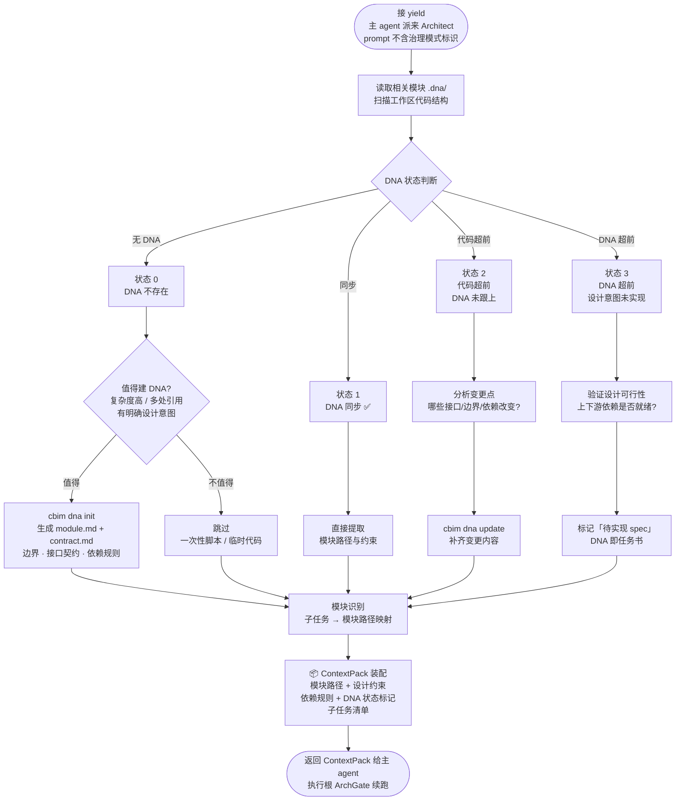
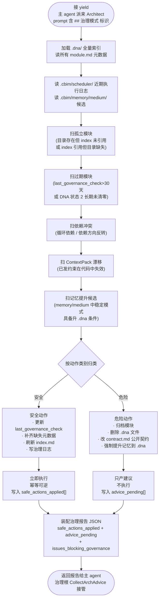

# CBIM Architect 的业务知识管理（执行 + 治理双子循环）

> **v1**（基于 Claude Code）与 **v2**（原生实现）共享的设计蓝图。
> 网页版：`design/web/loops.html` → 业务知识管理标签。
> 关联文档：[`LOOPS-OVERVIEW.zh-CN.md`](./LOOPS-OVERVIEW.zh-CN.md)（位置图）、[`WORKFLOW-EXECUTION.zh-CN.md`](./WORKFLOW-EXECUTION.zh-CN.md)（执行根，触发执行子循环）、[`WORKFLOW-DREAM.zh-CN.md`](./WORKFLOW-DREAM.zh-CN.md)（治理根，触发治理子循环）。

---

## 0. 顶部说明：Architect 是业务知识轴的双重身份 actor

Architect 是业务知识轴（`.dna/`）的**管理者和执行者**——既是这条轴的"日常使用人"（执行子循环），也是这条轴的"维护人"（治理子循环）。两个子循环共用同一份 agent 配置文件（`.claude/agents/architect/architect.md`），由派工 prompt 头部的标识 token 决定进入哪个子循环。

| 子循环 | 触发根 | 工作内容 | 在哪一节 |
|--------|--------|---------|---------|
| **执行子循环** | 执行根（用户驱动） | 接收意图、产 ContextPack、给 Work Agent 当任务书 | 第一部分 §1–§4 |
| **治理子循环** | 治理根（scheduler 驱动） | 扫 `.dna/` 找问题、安全动作自主、危险动作只产建议 | 第二部分 §5–§8 |

**对偶关系**：业务轴（`.dna/`，Architect 管）与能力轴（`.claude/agents/`，HR 管）互为镜像，详见 [`WORKFLOW-HR.zh-CN.md`](./WORKFLOW-HR.zh-CN.md)。两轴各有自己的双子循环，组合起来覆盖 CBIM 的全部知识与能力维度。

---

# 第一部分：Architect 执行子循环

## 1. 触发源

执行子循环挂在执行根（[`WORKFLOW-EXECUTION`](./WORKFLOW-EXECUTION.zh-CN.md)）下，由以下入口触发：

| 触发源 | 场景 |
|--------|------|
| **执行根 `ArchGate` 节点** | 每次用户 prompt 进入执行根后，`Decompose` 拆出 requirement-type 子任务 → `ArchGate` yield 主 agent 派 Architect。这是**必经门**。 |
| **Work Agent 回环（`NEEDS_ARCH_DECISION`）** | Work Agent 执行中发现架构决策点 → 通过 `subtask_results[id].needs_arch_decision=true` 回到 `ArchGate`，Architect 进入执行子循环重产 ContextPack。 |
| **用户显式请求模块设计 / 合规审查** | 用户直接 prompt "帮我设计 X 模块" / "检查 Y 模块依赖"，意图分析归为需求型任务，仍走 `ArchGate`。 |

## 2. 节点流程图（执行子循环）



## 3. 与执行根的接口

### 3.1 DispatchRequest 格式（主 agent → Architect）

执行根 `ArchGate` 节点 yield 时构造的 DispatchRequest 形态：

```
{
  "target_agent": "architect",
  "mode": "execution",                  # 关键：不带 "## 治理模式" 标识
  "user_request": "<原始 prompt>",
  "intent": <bb.intent>,
  "dispatch_plan": <bb.dispatch_plan>,  # Decompose 产物，含子任务清单
  "memory_context": <CRUD 子循环 query 拉到的相关历史>  # 可选
}
```

### 3.2 ContextPack 结构（Architect → 主 agent → 执行根）

执行子循环的产物，写回执行根 `bb.arch_context`：

```
{
  "modules": [
    {
      "path": "<module path>",
      "dna_state": "0|1|2|3",
      "module_md_excerpt": "...",
      "contract_md_excerpt": "...",
      "constraints": ["...", "..."],
      "dependency_rules": {"depends_on": [...], "depended_by": [...]}
    },
    ...
  ],
  "subtask_to_modules": {
    "<subtask_id>": ["<module path>", ...]
  },
  "global_design_notes": "...",
  "dna_actions_taken": [
    {"action": "init|update|mark_spec", "module": "<path>", "detail": "..."}
  ]
}
```

执行根 `Dispatch` 阶段会把每个 Work Agent 的 prompt 拼上其对应模块的 `constraints` + `dependency_rules`——这就是 Architect 知识起作用的方式。

## 4. DNA 四状态 · 懒式生成 · 知识裂变路径（执行子循环的核心知识）

### DNA 四状态

| 状态 | 含义 | Architect 动作 |
|------|------|----------------|
| **0 — 无** | DNA 文件不存在 | 评估是否值得建；值得则 `cbim dna init`，否则跳过 |
| **1 — 同步** | DNA 与代码一致 ✅ | 直接提取模块路径与约束，返回上下文包 |
| **2 — 代码超前** | 代码已变更，DNA 未跟上 | 分析变更点，`cbim dna update` 补齐 |
| **3 — DNA 超前** | 有设计意图尚未实现 | 验证可行性，标记「待实现 spec」，DNA 即任务书 |

### 懒式生成原则

DNA 文档**不是前置必做项**。Architect 根据以下条件判断是否值得建：

- 模块复杂度高（多文件、多依赖）
- 被多处引用（改动影响范围广）
- 有明确设计意图需要显式记录
- 一次性脚本、临时代码 → **跳过**

### 知识裂变路径

- **新模块 DNA 建立** → 知识图谱扩展，下次任务可直接定位
- **旧模块拆分** → 子模块独立 DNA，粒度更精确
- **跨模块契约更新** → 依赖图重构，减少耦合风险

---

# 第二部分：Architect 治理子循环

## 5. 触发源

治理子循环挂在治理根（[`WORKFLOW-DREAM`](./WORKFLOW-DREAM.zh-CN.md)）下，**唯一触发源**：

| 触发源 | 场景 |
|--------|------|
| **治理根第二步 `ArchitectGovernanceStep` 的 `DispatchArchGovern` 节点** | 治理根记忆治理步骤完成后，yield 主 agent 派 Architect，prompt 头部带 `## 治理模式` 标识 token |

用户对话、执行根派工、Work Agent 回环都**不会**进入治理子循环——它们只能进执行子循环（即使涉及"巡检"性质的用户请求，也走执行模式的 ContextPack 返回路径）。

## 6. 节点流程图（治理子循环）



## 7. 治理模式的扫描清单与自主权边界

### 扫描清单（5 大检查项）

| 检查项 | 检查内容 |
|--------|---------|
| 孤立模块 | `.dna/` 存在但 `index.md` 未引用，或反之 |
| 过期模块 | `last_governance_check` 超过 30 天，或代码侧多次修改而 `.dna/` 未跟上（DNA 状态 2 长期未清零） |
| 依赖冲突 | 模块间出现循环依赖、依赖方向反转 |
| ContextPack 与代码状态背离 | 已发出的 ContextPack 中标注的约束在代码中已失效 |
| 记忆提升候选 | `.cbim/memory/medium/` 中存在 Architect 域的稳定模式，已具备提升到 `.dna/` 的条件 |

### 自主权边界

| 类别 | 动作 | 自主权 |
|------|------|--------|
| **安全动作** | 更新 `module.md` 的 `last_governance_check` 时间戳；补齐缺失的元数据字段；刷新 `index.md` 索引；写入治理日志 | **可自主执行**（幂等、可逆） |
| **危险动作** | 归档模块、删除 `.dna/` 文件、改动 `contract.md` 公开契约、强制提升记忆到 `.dna/` | **只产建议**，写入返回报告的 `advice_pending` 数组，由用户下次会话时决定是否采纳 |

## 8. 与治理根的接口

### 8.1 DispatchRequest 格式（主 agent → Architect 治理模式）

```
{
  "target_agent": "architect",
  "mode": "governance",                # 关键标识，prompt 头部带 "## 治理模式"
  "run_id": "<dream run_id>",
  "scope_hint": "all" 或 ["<module path>", ...]   # 可选，治理根可指定子集
}
```

### 8.2 返回值结构（Architect → 主 agent → 治理根）

治理模式 Architect 必须返回结构化 JSON 报告，由治理根 `CollectArchAdvice` 写入 `bb.arch_governance_report`：

```
{
  "mode": "governance",
  "scanned_at": "<ISO 8601>",
  "scope": {
    "modules_scanned": <int>,
    "memory_candidates_reviewed": <int>
  },
  "safe_actions_applied": [
    {"action": "update_timestamp", "module": "<path>", "detail": "..."},
    ...
  ],
  "advice_pending": [
    {"severity": "warn|error", "kind": "stale_module|cycle_dep|...", "module": "<path>", "summary": "...", "suggested_action": "..."},
    ...
  ],
  "issues_blocking_governance": [...]
}
```

### 8.3 执行子循环 vs 治理子循环 的关键差异

| 维度 | 执行子循环 | 治理子循环 |
|------|---------|---------|
| 触发来源 | 执行根 `ArchGate` 节点 / 用户对话 / Work Agent 回环 | 治理根 `DispatchArchGovern` 节点 |
| 模式标识 | `mode=execution`，无 `## 治理模式` 头部 | `mode=governance`，prompt 头部带 `## 治理模式` |
| 输入 | 单个或少量子任务的上下文 | 全 `.dna/` 扫描请求 |
| 与用户交互 | 间接（通过 Coordinator 整合） | 不交互（产物落报告，下次 SessionStart 摘要呈现） |
| 派 Work Agent | 不派；返回 ContextPack 后由执行根派 | 不派 |
| 写 `.dna/` | 允许（按 DNA 四状态决策） | 只写安全字段（时间戳、索引、日志） |
| 返回 | ContextPack（模块路径 + 约束 + 依赖规则） | 治理报告 JSON |

---

## 9. 与能力轴的对偶关系

业务轴（`.dna/`）与能力轴（`.claude/agents/`）互为镜像：

- 业务知识管理（Architect）管「模块做什么、有什么约束」
- 能力管理（HR，详见 [`WORKFLOW-HR.zh-CN.md`](./WORKFLOW-HR.zh-CN.md)）管「谁来做、有什么能力」
- 两轴各有双子循环（执行 + 治理），覆盖范围持续扩展
