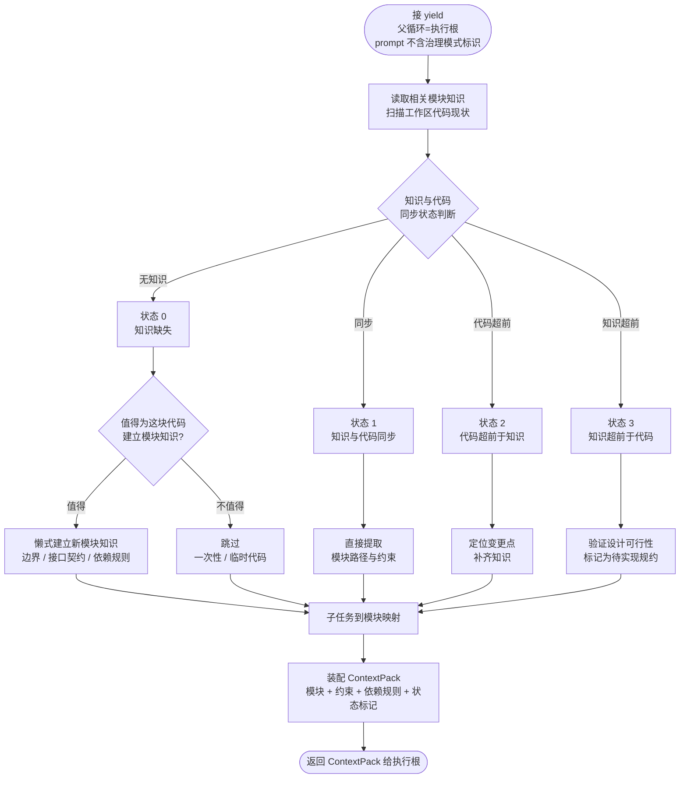
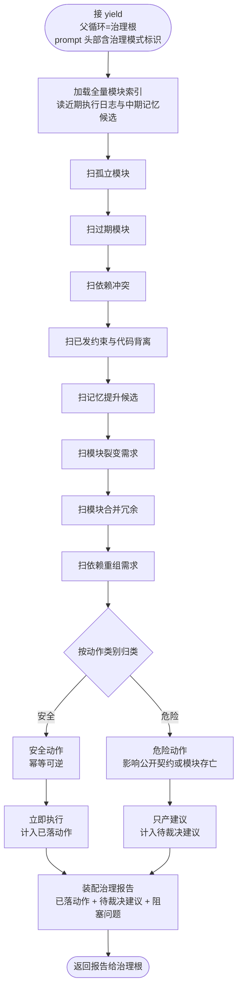

# CBIM Architect 双子循环流程图

> 关联：[`LOOPS-OVERVIEW`](./LOOPS-OVERVIEW.zh-CN.md)（位置图） · [`WORKFLOW-EXECUTION`](./WORKFLOW-EXECUTION.zh-CN.md)（执行根） · [`WORKFLOW-DREAM`](./WORKFLOW-DREAM.zh-CN.md)（治理根） · [`WORKFLOW-HR`](./WORKFLOW-HR.zh-CN.md)（能力轴对偶）

**一句话定位：Architect 持有执行子循环流程图和治理子循环流程图两个子循环**，分别挂在执行根与治理根之下，由父循环 yield 触发，agent 接 yield 后按流程图节点序遍历，跑完一个子循环回到父循环。两个子循环共用同一份 agent 配置，由父循环派工 prompt 头部标识决定进入哪个。

---

## 1. 总览

| 维度 | 执行子循环流程图 | 治理子循环流程图 |
|------|--------------|--------------|
| 触发方 | 执行根（用户驱动） | 治理根（scheduler 驱动） |
| 工作性质 | 前向式造新：为当前任务而懒式创建/更新模块 | 回头式重构：扫已有模块注册表，找该拆/归档/合并/重组的 |
| 产出物 | ContextPack（喂回执行根，作为 Work Agent 派工的知识基底） | 治理报告（喂回治理根，安全动作已落、危险动作待人裁决） |
| 衔接 | 跑完回执行根的派工阶段 | 跑完回治理根的下一治理步骤 |

---

## 2. Architect 执行子循环流程图

### 节点职责

| 节点 | 职责 |
|------|------|
| 接 yield | 从执行根接派工，识别为执行模式 |
| 读取相关模块知识 / 扫代码 | 只看与当前任务相关的范围，不做全量巡检 |
| 同步状态判断 | 将模块归入"无 / 同步 / 代码超前 / 知识超前"四态之一 |
| 值得建立? | 复杂度高、多处引用、有明确设计意图为"值得"；一次性脚本为"不值得" |
| 懒式建立 / 直接提取 / 补齐 / 验证待实现 | 四态对应的差异化处理，前向式而非回头式 |
| 子任务到模块映射 | 把意图分析阶段的子任务清单挂到模块上 |
| 装配 ContextPack | 汇总模块路径、约束、依赖规则、状态标记 |
| 返回 | 把 ContextPack 交回执行根，由执行根用于派 Work Agent |

---

## 3. Architect 治理子循环流程图

### 节点职责

| 节点 | 职责 |
|------|------|
| 接 yield | 从治理根接派工，识别为治理模式 |
| 加载全量索引 | 不限于当前任务，遍历全部模块注册表与近期治理输入 |
| 八项扫描 | 孤立 / 过期 / 依赖冲突 / 约束漂移 / 记忆提升 / 裂变 / 合并 / 依赖重组 |
| 按动作类别归类 | 安全=幂等可逆；危险=触及公开契约或模块存亡 |
| 安全动作执行 | 时间戳更新、索引刷新、元数据补齐、治理日志写入 |
| 危险动作建议 | 归档、删除、改公开契约、拆分、合并、依赖重组——只产建议不执行 |
| 装配治理报告 | 汇总已落动作、待裁决建议、阻塞问题 |
| 返回 | 把报告交回治理根，由治理根串接下一步 |

---

## 4. 与能力轴的对偶

业务知识轴（Architect 管）与能力轴（HR 管）互为镜像，两轴各自都拥有"执行 + 治理"两个子循环，组合覆盖 CBIM 全部知识与能力维度。详见 [`WORKFLOW-HR.zh-CN.md`](./WORKFLOW-HR.zh-CN.md)。
