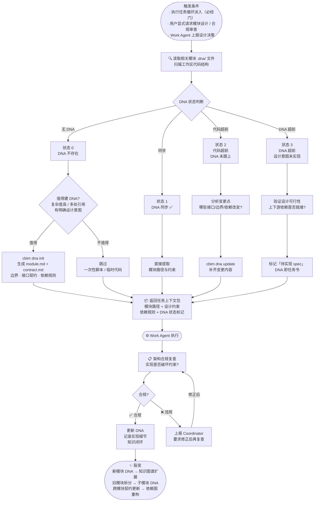

# CBIM 业务知识治理循环

> **v1**（基于 Claude Code）与 **v2**（原生实现）共享的设计蓝图。  
> 网页版：`design/web/loops.html` → 业务知识治理循环标签。

业务轴 · `.dna/` · 知识系统的更新与裂变。执行任务的必经门，懒式 DNA 管理。与能力知识治理循环对偶，共同构成双轴治理体系。

## DNA 四状态

| 状态 | 含义 | Architect 动作 |
|------|------|----------------|
| **0 — 无** | DNA 文件不存在 | 评估是否值得建；值得则 `cbim dna init`，否则跳过 |
| **1 — 同步** | DNA 与代码一致 ✅ | 直接提取模块路径与约束，返回上下文包 |
| **2 — 代码超前** | 代码已变更，DNA 未跟上 | 分析变更点，`cbim dna update` 补齐 |
| **3 — DNA 超前** | 有设计意图尚未实现 | 验证可行性，标记「待实现 spec」，DNA 即任务书 |

## 懒式生成原则

DNA 文档**不是前置必做项**。Architect 根据以下条件判断是否值得建：

- 模块复杂度高（多文件、多依赖）
- 被多处引用（改动影响范围广）
- 有明确设计意图需要显式记录
- 一次性脚本、临时代码 → **跳过**

## 知识裂变路径

- **新模块 DNA 建立** → 知识图谱扩展，下次任务可直接定位
- **旧模块拆分** → 子模块独立 DNA，粒度更精确
- **跨模块契约更新** → 依赖图重构，减少耦合风险

## 与能力轴的对偶关系

业务轴（`.dna/`）与能力轴（`.claude/agents/`）互为镜像：

- 业务知识治理管「模块做什么、有什么约束」
- 能力知识治理管「谁来做、有什么能力」
- 两轴协同裂变，覆盖范围持续扩展
