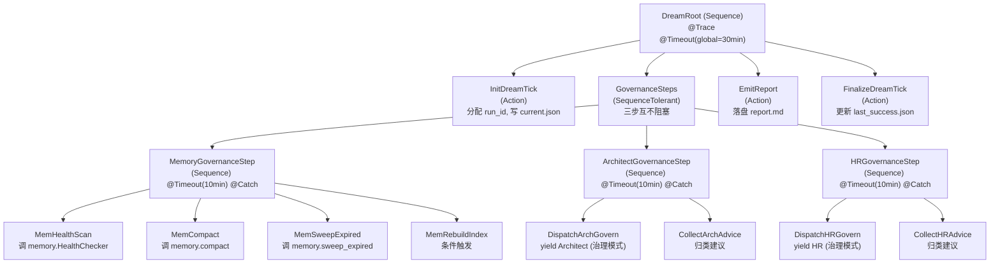
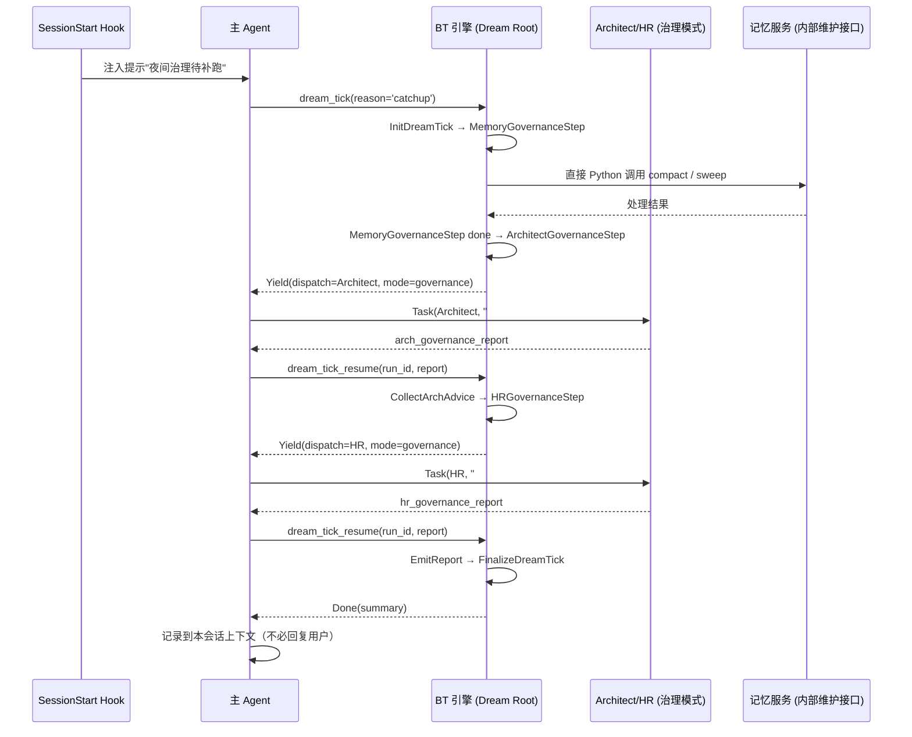

# CBIM 治理循环（夜间梦境）

> **v1 设计稿（行为树驱动）**。这是 CBIM 的第二棵主循环根，与 [`WORKFLOW-EXECUTION.zh-CN.md`](./WORKFLOW-EXECUTION.zh-CN.md) 平级共存。
> 关联文档：[行为树引擎实现 README](../v1/kernel/engine/bt/README.md)、[`LOOPS-OVERVIEW.zh-CN.md`](./LOOPS-OVERVIEW.zh-CN.md)（全景图）。
> 三个治理步骤对应的子循环详细设计：
> - 记忆治理 → [`WORKFLOW-MEMORY.zh-CN.md`](./WORKFLOW-MEMORY.zh-CN.md) 第二部分（主 agent 记忆治理子循环）
> - 知识治理 → [`WORKFLOW-ARCHITECT.zh-CN.md`](./WORKFLOW-ARCHITECT.zh-CN.md) 第二部分（Architect 治理子循环）
> - 能力治理 → [`WORKFLOW-HR.zh-CN.md`](./WORKFLOW-HR.zh-CN.md) 第二部分（HR 治理子循环）

---

## 一、系统定位

**治理循环是 CBIM 的第二个主循环根。** 它与执行任务循环平级，不是其子循环、不是其装饰器、不是其插件。两者共用同一个行为树引擎（`engine/bt/core`），但各自持有独立的根树、独立的黑板、独立的 trace、独立的入口工具。

### 是什么

- **一棵跑在 BT 引擎上的、由调度器（而非用户）触发的行为树**：根节点是 Sequence，里面装着三个治理步骤：
  1. **主 agent 自跑记忆治理子循环**（直接 in-process 调用记忆服务内部维护接口，无 LLM 介入）
  2. **派 Architect 进入治理子循环**（yield 主 agent 用 Task tool 派工，prompt 头部带治理模式标识）
  3. **派 HR 进入治理子循环**（同上）
  整体在 SessionStart 时被检测、被补跑。
- **CBIM 自我维护的唯一通道**：记忆压缩、孤立 `.dna/` 清理、闲置 agent 归档、过期 ContextPack 复核——这些没有用户在前台等结果的"后台家务"，全部归治理循环管。
- **被动数据层的唯一唤起方**：记忆服务定位是被动的、不主动跑的；治理循环就是那个"在合适的时间把它叫起来跑一次"的存在。Architect / HR 的治理子循环同理——它们也只在治理循环触发时才会被唤起。

### 不是什么

| 误解 | 澄清 |
|------|------|
| 治理循环是 cron 定时任务 | 不是。它没有内置时钟，只在 SessionStart 时检测"距上次成功治理 ≥ 20 小时"才补跑，本质是"用户回来时顺手跑一次"。 |
| 治理循环是执行循环的子循环 | 不是。它是平级的第二根。执行循环不知道治理循环存在，反之亦然——两者只通过共享被治理的资源（`.cbim/memory/` / `.dna/` / `.claude/agents/`）间接关联。 |
| 治理循环会主动改代码 / 删模块 | 不是。它只做安全动作（时间戳更新、记忆压缩、索引重建）；危险动作（归档模块、招募 agent、改契约）只产出建议落到报告里，由用户下次会话时决定是否采纳。 |
| 治理循环跑起来会阻塞用户 | 不是。用户随时可以打断；治理立即让位，当前 RUNNING 节点归档为"未完成"，明天再跑。 |

### 夜间梦境的工程隐喻

人睡觉时大脑做两件事：把白天的短期记忆压缩归档到长期记忆，把白天积累的"小问题"在后台慢慢消化。CBIM 的治理循环正是这件事的工程对应——白天（执行循环）做的事在记忆和知识层留下痕迹，夜里（治理循环）把这些痕迹整理归档、识别模式、提出改进建议。隐喻不止于诗意：它给系统一个**与用户驱动解耦的、稳定节奏的自维护通道**，避免维护逻辑被强行塞进执行循环的关键路径。

---

## 二、触发机制

### 触发源：SessionStart 检测补跑

治理循环**没有定时器**，唯一的触发入口是 SessionStart hook 检测以下条件：

| 条件 | 说明 |
|------|------|
| 距上次成功治理 ≥ 20 小时 | 读 `.cbim/scheduler/dream/last_success.json` 的 `finished_at`，与当前时间比较。20 小时是经验值——保证一天至少一次，又不会因为同一天多次开会话被反复触发。 |
| 当前没有正在运行的 dream tick | 读 `.cbim/scheduler/dream/current.json`，若存在 `status=running` 的记录则跳过本次（去重）。 |
| 上次治理失败已记录失败时间窗 | 若上次治理失败时间距今 < 1 小时，跳过（避免立即重试同一故障）；否则正常补跑。 |

满足三条 → SessionStart hook 在主 agent 上下文里注入一条系统消息："夜间治理待补跑，请在响应用户前或后调用 `dream_tick(reason='catchup')` 启动；用户优先。"

### 入口工具：`dream_tick` / `dream_tick_resume`

与执行循环的 `bt_tick` / `bt_tick_resume` 形态完全对称，但**独立工具**，独立 MCP 接口：

| 工具 | 用途 |
|------|------|
| `dream_tick(reason: str)` | 启动一次治理循环 tick；`reason` 取值 `catchup` / `manual` / `forced` |
| `dream_tick_resume(run_id, dispatch_result)` | 治理循环 yield 后，主 agent 派工拿到结果回交 |

**为什么独立工具而非复用 `bt_tick`**：黑板 schema、节点拓扑、报告产物、持久化路径都不同；用同一个工具名会让主 agent 难以静态判断"我现在在跑哪棵树"，trace 也会混在一起难以审计。两个工具，两个根，两份 trace，清清楚楚。

### 与用户冲突时让位

治理循环跑到一半，用户发来新 prompt——这是一定会发生的场景，必须有明确语义：

1. 主 agent 收到新 prompt，**立即响应用户**，不等治理 tick 跑完；
2. 当前 RUNNING 的治理节点不会被强杀，但也不会被恢复；
3. 引擎在下次 SessionStart 检测到 `current.json` 仍是 `running` 状态、且 `last_heartbeat` 超过 30 分钟无更新 → 将本次 run 标记为 `abandoned`，归档到 `.cbim/scheduler/dream/<run_id>/` 下，写一条 `abandoned.json` 说明放弃原因；
4. **明天的 SessionStart 重新触发新的 dream tick**（因为 `last_success.json` 未更新，20 小时窗口仍然成立）。

用户优先是**单向硬规则**：治理循环让位用户，用户不让位治理循环。

---

## 三、行为树拓扑

### 装饰器叠加顺序

`@Trace`（最外） → `@Timeout` → `@Catch`（最内）。

- 全局根 `@Timeout(30min)` 是硬上限——治理循环超过半小时未结束直接熔断，避免占用过久。
- 每个治理步骤 `@Timeout(10min)` + `@Catch`——单步超时或异常只标记该步骤失败，不阻塞其他两步。

### SequenceTolerant 节点

新增到 `engine/bt/core/composite.py`，语义如下：

| 维度 | Sequence | SequenceTolerant（新） |
|------|----------|------------------------|
| 子节点遍历 | 顺序 | 顺序 |
| 任一子节点 FAILURE | 立即中断，返回 FAILURE | 记录失败，继续下一个子节点 |
| 全部子节点完成后 | 全 SUCCESS 才 SUCCESS | 全 FAILURE → FAILURE；至少一个 SUCCESS → SUCCESS（并在黑板上记 `step_results` 明细） |
| 适用场景 | 强依赖链路（执行循环 LoopSeq） | 互相独立的"批处理步骤"（治理循环三步） |

**为什么不用 Parallel**：治理三步对资源（记忆服务的写锁、`.dna/` 扫描的 I/O）有竞争；用 Sequence 顺序化天然规避了竞态，又不需要并发提速（夜间任务对延迟不敏感）。SequenceTolerant 是"顺序 + 不打断"，正好匹配。

---

## 四、三个治理步骤的契约

### 记忆治理步骤（MemoryGovernanceStep）—— 主 agent 自跑记忆治理子循环

本步骤对应 [`WORKFLOW-MEMORY.zh-CN.md`](./WORKFLOW-MEMORY.zh-CN.md) 第二部分（主 agent 记忆治理子循环）。**这是治理三步中唯一不需要 yield 派 LLM agent 的步骤**——主 agent 直接 in-process Python 调用 `engine/memory/` 模块。

| 子节点 | 读 | 写 | 调谁 | 返回语义 |
|--------|----|----|------|----------|
| `MemHealthScan` | `.cbim/memory/.index/` 统计、`candidates/` 堆积量 | `bb.mem_health` | 直接 Python 调用 `memory.HealthChecker.check()` | SUCCESS = 报告写好；FAILURE = 健康检查器异常 |
| `MemCompact` | `bb.mem_health` 决定是否需压缩 | `bb.mem_compact_result` | 直接 Python 调用 `memory.compact()` | SUCCESS = 压缩完成或无需压缩；FAILURE = compact 抛异常 |
| `MemSweepExpired` | `bb.mem_health` 决定是否需清理 | `bb.mem_sweep_result` | 直接 Python 调用 `memory.sweep_expired()` | SUCCESS = 清理完成；FAILURE = sweep 抛异常 |
| `MemRebuildIndex` | `bb.mem_health.index_drift` | `bb.mem_index_result` | 直接 Python 调用 `memory.rebuild_index()` | 仅当 `index_drift=true` 时执行；SUCCESS = 重建完成或跳过 |

**关键约束**：这一步**不走 MCP**，直接 in-process Python 调用 `engine/memory/` 模块。原因是记忆服务的对外 4 接口（query/scan/get/stats）是只读契约；compact / sweep / rebuild 是**内部维护接口**，专供主 agent 的记忆治理子循环使用，不对外暴露。这一点也在 [`WORKFLOW-MEMORY.zh-CN.md`](./WORKFLOW-MEMORY.zh-CN.md) §3.2 同步说明。

### 知识治理步骤（ArchitectGovernanceStep）—— 派 Architect 进入治理子循环

本步骤对应 [`WORKFLOW-ARCHITECT.zh-CN.md`](./WORKFLOW-ARCHITECT.zh-CN.md) 第二部分（Architect 治理子循环）。yield 主 agent 用 Task tool 派 Architect，prompt 头部带 `## 治理模式` 标识。

**Architect 治理子循环只做"回头式重构"**：扫已有 `.dna/` 模块注册表，找孤立 / 过期 / 依赖冲突 / 漂移 / 记忆提升候选 / **模块裂变 / 模块合并 / 依赖重组**这八类问题。所有"为满足当前任务而懒式创建新模块"的工作归 Architect 执行子循环（执行根 ArchGate 节点触发），不在治理这里。

| 子节点 | 读 | 写 | 调谁 | 返回语义 |
|--------|----|----|------|----------|
| `DispatchArchGovern` | `bb.run_id` | `bb.pending_dispatch` | yield 主 agent 派 Architect，prompt 含治理模式标识 `## 治理模式` | RUNNING = 等待 Architect resume；SUCCESS = ContextPack 已返回 |
| `CollectArchAdvice` | resume 回来的 Architect 报告 | `bb.arch_governance_report` | 纯本地，归类建议（safe_actions_applied / advice_pending） | SUCCESS = 归类完成；FAILURE = 报告格式异常 |

### 能力治理步骤（HRGovernanceStep）—— 派 HR 进入治理子循环

本步骤对应 [`WORKFLOW-HR.zh-CN.md`](./WORKFLOW-HR.zh-CN.md) 第二部分（HR 治理子循环）。yield 主 agent 用 Task tool 派 HR，prompt 头部带 `## 治理模式` 标识。

**HR 治理子循环只做"回头式重构"**：扫已有 `.claude/agents/` agent 注册表，找闲置 / 失能 / 累计能力缺口（补漏招募） / 漂移 / 重复 / **agent 裂变（职责过宽该拆分）**这六类问题。所有"为满足当前任务而懒式招募新 agent"的工作归 HR 执行子循环（执行根 CallHR 节点触发），不在治理这里。

| 子节点 | 读 | 写 | 调谁 | 返回语义 |
|--------|----|----|------|----------|
| `DispatchHRGovern` | `bb.run_id` | `bb.pending_dispatch` | yield 主 agent 派 HR，prompt 含治理模式标识 | RUNNING / SUCCESS 同上 |
| `CollectHRAdvice` | resume 回来的 HR 报告 | `bb.hr_governance_report` | 纯本地，归类建议 | SUCCESS / FAILURE 同上 |

### 报告与收尾

- `EmitReport` —— 把三个步骤的 `*_result` / `*_report` 整合成 markdown，落盘 `.cbim/scheduler/dream/<run_id>/report.md`，同时把摘要塞入 `bb.summary_for_session`，供下次 SessionStart 注入主 agent 上下文。
- `FinalizeDreamTick` —— 写 `last_success.json`（`{run_id, finished_at, summary_path}`），清理 `current.json`。即使前面三步全部 FAILURE，只要 EmitReport 成功（哪怕只是写"全部失败"），FinalizeDreamTick 仍执行——这样 20 小时窗口正常滚动，不会因失败而反复重试。

---

## 五、黑板独立 Schema

治理循环的黑板与执行循环**完全隔离**，独立 schema，独立持久化路径。

| # | 字段 | 类型 | 写者 | 读者 | 说明 |
|---|------|------|------|------|------|
| 1 | `run_id` | str | InitDreamTick | 所有 | 本次 dream tick 的唯一 ID（UUID） |
| 2 | `trigger_reason` | str | InitDreamTick | EmitReport | `catchup` / `manual` / `forced` |
| 3 | `mem_health` | dict | MemHealthScan | 记忆步骤后续 / EmitReport | 健康检查结果：候选堆积量、索引漂移、过期条目数 |
| 4 | `mem_compact_result` / `mem_sweep_result` / `mem_index_result` | dict | 对应节点 | EmitReport | 各子节点产物：处理条目数、耗时、是否跳过 |
| 5 | `arch_governance_report` | dict | CollectArchAdvice | EmitReport | Architect 治理模式返回：`{safe_actions_applied: [...], advice_pending: [...]}` |
| 6 | `hr_governance_report` | dict | CollectHRAdvice | EmitReport | HR 治理模式返回，结构同上 |
| 7 | `step_results` | dict[step → status] | SequenceTolerant 容器 | EmitReport | 三步的最终状态（success / failure / timeout） |
| 8 | `summary_for_session` | str | EmitReport | 引擎落 `last_success.json` 引用 | 给下次 SessionStart 注入的一行摘要 |

**持久化路径**：`.cbim/scheduler/dream/<run_id>/bb.json` + `trace.jsonl` + `report.md`。与执行循环的 `.cbim/scheduler/bt/<tick_id>/` 物理隔离，互不影响。

---

## 六、与执行循环的隔离

| 维度 | 执行任务循环 | 治理循环 |
|------|-------------|---------|
| 触发源 | 用户 prompt | SessionStart 补跑检测 |
| 入口工具 | `bt_tick` / `bt_tick_resume` | `dream_tick` / `dream_tick_resume` |
| 根节点 | Root（Sequence + LoopSeq） | DreamRoot（Sequence + SequenceTolerant） |
| 黑板 schema | 18 字段（详见 EXECUTION §2） | 8 字段（本文 §5） |
| 持久化路径 | `.cbim/scheduler/bt/<tick_id>/` | `.cbim/scheduler/dream/<run_id>/` |
| trace 文件 | 独立 | 独立 |
| 冲突时 | 用户驱动，治理让位 | 立即归档 RUNNING 节点，明天再跑 |
| 共享资源 | BT 引擎 (`engine/bt/core`)、被治理的 `.dna/` / `.cbim/memory/` / `.claude/agents/` | 同左 |
| 不共享 | 黑板字段、节点定义、trace、入口工具、报告 | 同左 |

**互不依赖的硬规则**：执行循环的代码里不允许 import 治理循环的任何模块，反之亦然。两者唯一的公共依赖是 `engine/bt/core`（行为树引擎本体）和被治理的资源目录。

---

## 七、失败语义

治理循环的失败哲学与执行循环根本不同——执行循环失败要打断用户，治理循环失败**只记录不打扰**。

| 失败场景 | 处理 |
|----------|------|
| 单步治理节点 FAILURE | `@Catch` 吞掉异常，写入 `bb.step_results[step]=failure`，下一步继续 |
| 单步超时 | `@Timeout(10min)` 触发，标记 `step_results[step]=timeout`，下一步继续 |
| 全局超时（30 分钟） | 引擎熔断，EmitReport 仍执行（基于已有数据写部分报告），FinalizeDreamTick 仍执行 |
| Architect / HR 派工失败 | 该步骤记为 failure，建议条目变成"治理模式 agent 不可用，跳过本次"；下次治理重试 |
| 引擎本身崩溃 | `current.json` 残留 `running`，下次 SessionStart 检测到超过 30 分钟无心跳 → 标记 abandoned；20 小时窗口正常生效，明天补跑 |

**产物不回滚**：哪怕中途失败，已经写入的记忆压缩产物、已经更新的时间戳字段都不回滚。这是设计选择——治理动作本身设计为幂等且单调（要么成功推进，要么原样不动），不存在"半成功需要回滚"的场景。

**报告暴露而不阻塞**：所有失败、超时、跳过都明确写在 `report.md` 里，下次 SessionStart 摘要会提示用户"昨晚治理有 N 步失败，详见 `<path>`"。用户决定是否处理；系统不会因为失败而拒绝下次治理。

---

## 八、主 agent 协作模型

与执行循环对称的协程式 yield/resume，区别在于驱动者不是用户而是 SessionStart hook 注入的系统消息。

**与执行循环的关键差异**：

- 没有"回复用户"的步骤。Done 返回的 summary 只用于内部日志和下次 SessionStart 的摘要注入。
- 主 agent 在治理 tick 跑的过程中**仍可响应用户**——如果用户在此期间发来 prompt，主 agent 优先响应用户，治理 tick 暂停（不调 `dream_tick_resume`），引擎检测心跳超时后自动归档。
- 派工时 prompt 必须带治理模式标识（`## 治理模式` 或等价 token），让 Architect / HR 知道这是治理调用而非业务调用。

---

## 九、与角色子循环的接口

| 角色 / 服务 | 治理循环如何调用 | 调用方式 | 治理子循环 |
|-------------|----------------|---------|-----------|
| 主 agent（记忆能力宿主） | `MemoryGovernanceStep` 各子节点 | 直接 in-process Python 调用内部维护接口（compact / sweep_expired / rebuild_index / HealthChecker.check） | 主 agent 跑[记忆治理子循环](./WORKFLOW-MEMORY.zh-CN.md)（第二部分）——纯确定性流程，无 LLM |
| Architect | `ArchitectGovernanceStep` 派工 | yield → 主 agent 用 Task tool 调起 Architect，prompt 含治理模式标识 | Architect 进入[治理子循环](./WORKFLOW-ARCHITECT.zh-CN.md)（第二部分）：不接用户对话，**回头式**扫已有 `.dna/` 找裂变 / 归档 / 合并 / 重组需求，安全动作自主、危险动作只产建议；**不做"为当前任务造新模块"——那归执行子循环** |
| HR | `HRGovernanceStep` 派工 | 同上 | HR 进入[治理子循环](./WORKFLOW-HR.zh-CN.md)（第二部分）：**回头式**扫已有 `.claude/agents/` 找闲置 / 失能 / 漂移 / 裂变 / 合并需求；**不做"为当前任务招新 agent"——那归执行子循环** |
| Auditor | 不参与 | — | Auditor 是 Claude Code 提示词配置 agent，CBIM 不为它设计任何循环（含治理） |
| Work Agents | 不参与 | — | Work Agents 是 Claude Code 提示词配置 agent，CBIM 不为它们设计任何循环；治理循环管的是元结构，不是业务执行 |
| 记忆服务 | 被主 agent 记忆治理子循环调用 | 被动数据层，不是 actor；通过内部维护接口被调一次执行一次 | 无（不是 actor） |

**所有被调用方对治理循环都是黑盒**：它们只看到"被以治理模式调用了一次"或"被调一次接口"，不感知 dream tick 的拓扑、黑板、run_id。这层解耦保证未来治理循环重构时不会波及被调用方。

---

## 十、已主动排除的设计选项

以下方案在 v1 设计稿评审中被明确排除，记录原因以防回潮：

| # | 被排除的方案 | 排除原因 |
|---|--------------|----------|
| 1 | **作废"主循环 = 唯一根"决议，改为治理循环是唯一根** | 否决：执行循环和治理循环承载的是根本不同的驱动模型（用户驱动 vs scheduler 驱动）；强行合并会让黑板 schema 膨胀且语义混乱。正确做法是"原决议升级为两根并存"，详见 [`WORKFLOW-EXECUTION.zh-CN.md`](./WORKFLOW-EXECUTION.zh-CN.md) §7 修订与 [`LOOPS-OVERVIEW.zh-CN.md`](./LOOPS-OVERVIEW.zh-CN.md) §5。 |
| 2 | **用 cron / systemd timer 定时触发治理循环** | 否决：CBIM 是项目级工具，无后台常驻进程；定时器需要额外的进程管理负担。SessionStart 补跑模型零依赖、用户回来就跑、与项目使用频率自然匹配。 |
| 3 | **复用 `bt_tick` / `bt_tick_resume` 入口，仅靠 prompt 区分** | 否决：根树、黑板、trace、报告都不同，混用入口会让主 agent 难以静态判断当前在跑哪棵树；trace 混在一起难以审计。独立工具 = 独立审计边界。 |
| 4 | **治理循环失败时阻塞下一次执行循环** | 否决：用户优先是单向硬规则。治理失败只记录到报告，不影响用户的执行任务。 |
| 5 | **治理模式 Architect / HR 可以自主归档模块、招募 agent** | 否决：归档/招募是不可逆操作，必须用户确认。治理模式只能做幂等的安全动作（更新时间戳、补字段、记日志），危险动作一律转为建议。 |
| 6 | **三个治理步骤之间共享黑板字段、互相读取对方产物** | 否决：步骤之间应当独立——记忆治理失败不应影响知识治理。SequenceTolerant 的"互不阻塞"语义就是为此设计。 |
| 7 | **治理循环跑完直接向用户发推送消息** | 否决：CBIM 没有主动推送通道。治理结果通过 `report.md` 落盘 + 下次 SessionStart 摘要注入，是被动呈现，不打扰用户。 |
| 8 | **同一项目并发跑多个 dream tick（多会话场景）** | 否决：`current.json` 单例锁机制保证同一项目同时只有一个 dream tick；多会话场景下后启动的会话检测到锁直接跳过，避免对 `.cbim/memory/` 的并发写竞争。 |
