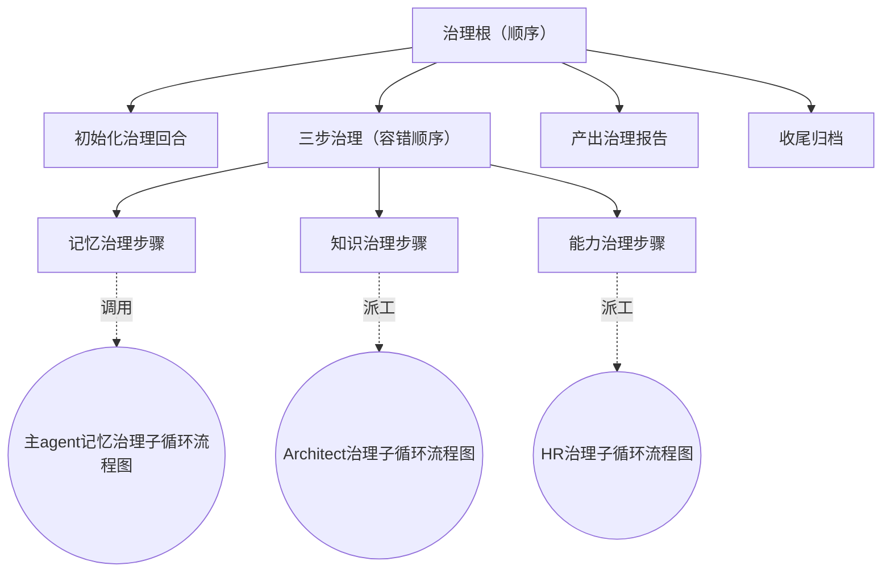

# CBIM 治理根流程图

> 全貌索引。本篇只画治理根流程图自身；三个治理子循环只引用、不展开。
> 关联：[`LOOPS-OVERVIEW.zh-CN.md`](./LOOPS-OVERVIEW.zh-CN.md) ·
> [`WORKFLOW-EXECUTION.zh-CN.md`](./WORKFLOW-EXECUTION.zh-CN.md) ·
> [`WORKFLOW-MEMORY.zh-CN.md`](./WORKFLOW-MEMORY.zh-CN.md) ·
> [`WORKFLOW-ARCHITECT.zh-CN.md`](./WORKFLOW-ARCHITECT.zh-CN.md) ·
> [`WORKFLOW-HR.zh-CN.md`](./WORKFLOW-HR.zh-CN.md)

---

## 一句话定位

**治理根流程图由 `dream_tick` 触发，与执行根流程图平级，是 CBIM 后台自维护循环。**
两根共用同一个流程图引擎，各自独立黑板、独立轨迹、独立入口工具；治理根永远让位用户。

---

## 治理根流程图

容器语义：三步治理用"容错顺序"——任一步失败不阻塞其余两步，任一步成功则整体视为有效推进。

---

## 节点职责表

| 节点 | 一句话职责 | 调用的子循环流程图 |
|------|-----------|----------------|
| 初始化治理回合 | 登记本次治理回合身份、占用单例锁 | — |
| 三步治理 | 顺序跑三个互不依赖的治理步骤，互不阻塞 | —（容器） |
| 记忆治理步骤 | 主agent就地跑记忆健康检查与维护，无LLM介入 | [主agent记忆治理子循环流程图](./WORKFLOW-MEMORY.zh-CN.md) |
| 知识治理步骤 | 让位主agent去派 Architect 进入治理模式，回头扫已有模块 | [Architect治理子循环流程图](./WORKFLOW-ARCHITECT.zh-CN.md) |
| 能力治理步骤 | 让位主agent去派 HR 进入治理模式，回头扫已有 agent | [HR治理子循环流程图](./WORKFLOW-HR.zh-CN.md) |
| 产出治理报告 | 把三步成果合成一份报告，附带给下次会话起始的一行摘要 | — |
| 收尾归档 | 更新"上次成功治理"标记、释放单例锁 | — |

---

## 触发与让位规则

| 规则 | 说明 |
|------|------|
| 超期催跑 | 会话起始 hook 检测到距上次成功治理已超期 → 在主agent上下文注入提示，建议在响应用户前后调用一次治理 |
| 单例去重 | 同项目同时只允许一个治理回合在跑；后启动的会话检测到锁直接跳过 |
| 用户prompt永远优先 | 治理跑到一半，用户发来新prompt → 主agent立即响应用户，治理回合不再被恢复，下次会话起始检测到无心跳即归档为未完成 |
| 失败不打扰 | 任一步失败只写进报告，不弹给用户；下次治理窗口照常滚动 |

---

## 与子循环流程图的衔接

三个治理步骤都只是治理根流程图上的"接驳点"，本身不展开子循环细节：

- **记忆治理步骤** → 主agent在进程内启动 [主agent记忆治理子循环流程图](./WORKFLOW-MEMORY.zh-CN.md)；纯确定性流程，全程无LLM、无派工、无yield。
- **知识治理步骤** → yield 主agent，用 Task tool 派 Architect 进入 [Architect治理子循环流程图](./WORKFLOW-ARCHITECT.zh-CN.md)；该子循环只做回头式重构，不为当前任务造新模块。
- **能力治理步骤** → yield 主agent，用 Task tool 派 HR 进入 [HR治理子循环流程图](./WORKFLOW-HR.zh-CN.md)；该子循环只做回头式重构，不为当前任务招新 agent。

被调用方对治理根流程图是黑盒：它们只知道"被以治理模式调用了一次"，不感知本回合的拓扑或身份。
