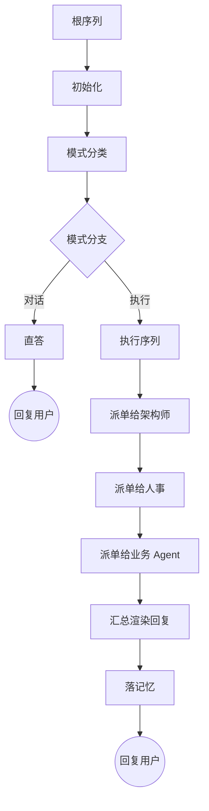

# 执行根 BT — 全貌

> 关联：[全景图](./LOOPS-OVERVIEW.zh-CN.md) · [治理根 BT](./WORKFLOW-DREAM.zh-CN.md)
> 子循环（只引用，本篇不展开）：[Architect 子循环 BT](./WORKFLOW-ARCHITECT.zh-CN.md) · [HR 子循环 BT](./WORKFLOW-HR.zh-CN.md) · [主 agent 记忆 CRUD 子循环 BT](./WORKFLOW-MEMORY.zh-CN.md)

---

## 1. 定位

**执行根 BT 由用户 prompt 触发。** 用户每发一次 prompt，主 agent 把它喂给执行根 BT，由根 BT 决定走对话直答还是走执行通路；执行通路依次完成知识、能力、业务三轴，最终渲染回复送回用户。CBIM 所有循环都是 BT，本根与治理根平级共存。

---

## 2. 执行根 BT 拓扑

---

## 3. 节点职责

| 节点 | 一句话职责 | 下游分支 |
|------|-----------|---------|
| 根序列 | 串起整轮 tick，统管超时与轨迹 | → 初始化 |
| 初始化 | 准备本轮 tick 的上下文容器 | → 模式分类 |
| 模式分类 | 判定本次 prompt 是闲聊还是要干活 | → 模式分支 |
| 模式分支 | 按分类结果二选一 | 对话 → 直答；执行 → 执行序列 |
| 直答 | 直接生成回复，不动业务通路 | → 回复用户 |
| 执行序列 | 知识、能力、业务三轴依次跑完 | → 派单给架构师 |
| 派单给架构师 | 让架构师把用户意图拆成任务清单与上下文 | → 派单给人事 |
| 派单给人事 | 让人事按任务所需能力匹配或招募 agent | → 派单给业务 Agent |
| 派单给业务 Agent | 按任务清单逐个派业务 agent 执行 | → 汇总渲染回复 |
| 汇总渲染回复 | 把各 agent 的产出整理成给用户的回复 | → 落记忆 |
| 落记忆 | 把本轮值得留存的内容写入记忆，失败不阻塞 | → 回复用户 |

---

## 4. 与子循环的衔接

执行根的叶节点只负责"派单 + 等结果"，真正的工作发生在被派出的 agent 内部，每个被派出的 agent 自己也跑一棵 BT。

| 执行根节点 | 衔接的子循环 BT |
|-----------|----------------|
| 派单给架构师 | [Architect 子循环 BT](./WORKFLOW-ARCHITECT.zh-CN.md) |
| 派单给人事 | [HR 子循环 BT](./WORKFLOW-HR.zh-CN.md) |
| 落记忆 | [主 agent 记忆 CRUD 子循环 BT](./WORKFLOW-MEMORY.zh-CN.md) |

派单给业务 Agent 衔接的是具体业务 agent，其内部拓扑由各 agent 自行约定，本文不收录。

---

## 5. 与治理根的关系

执行根由用户 prompt 触发，治理根由会话开启时的检查触发，二者平级，共用同一套 BT 引擎，互不依赖。用户 prompt 始终优先于治理活动。
