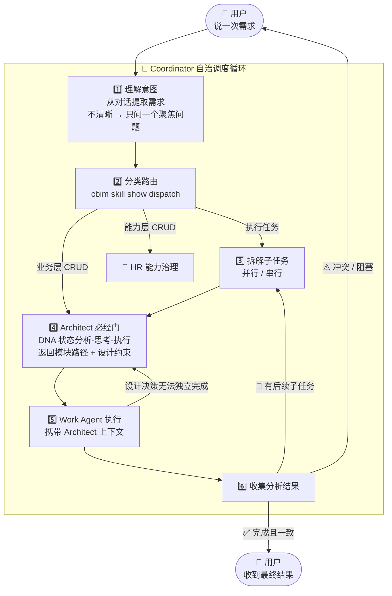

# CBIM 执行任务循环

> **v1**（基于 Claude Code）与 **v2**（原生实现）共享的设计蓝图。  
> 网页版：`design/web/loops.html` → 执行任务循环标签。

对 Claude Code 执行机制的优化。用户说一次需求，Coordinator 自治驱动到完成。Architect 是所有执行任务的必经门。

## 调度原则

- 每次迭代必须有实质进展，无进展即停止上报
- **打断用户的唯一条件：** 意图真正模糊 · 结果冲突 · 破坏性/不可逆操作

## Architect 必经门（步骤 4）

执行任务的所有子任务在派发给 Work Agent 之前，必须经过 Architect 进行 DNA 状态分析：

1. **分析**：读取相关 `.dna/` 文件，扫描工作区代码结构，判断 DNA 状态（0~3）
2. **思考**：根据状态决定动作——新建 / 跳过 / 补齐 / 标记 spec
3. **执行**：通过 `cbim dna` 命令完成 DNA 操作，返回任务上下文包

详见：[业务知识治理循环](./WORKFLOW-ARCHITECT.zh-CN.md)

## 路由分类

| 路由目标 | 触发条件 |
|----------|----------|
| 执行任务（Decompose → Architect → WorkAgent） | 代码实现、功能开发、bug 修复 |
| 业务层 CRUD（直接到 Architect） | 模块设计、DNA 管理、合规审查 |
| 能力层 CRUD（直接到 HR） | agent 招募/训练/评估/归档 |
