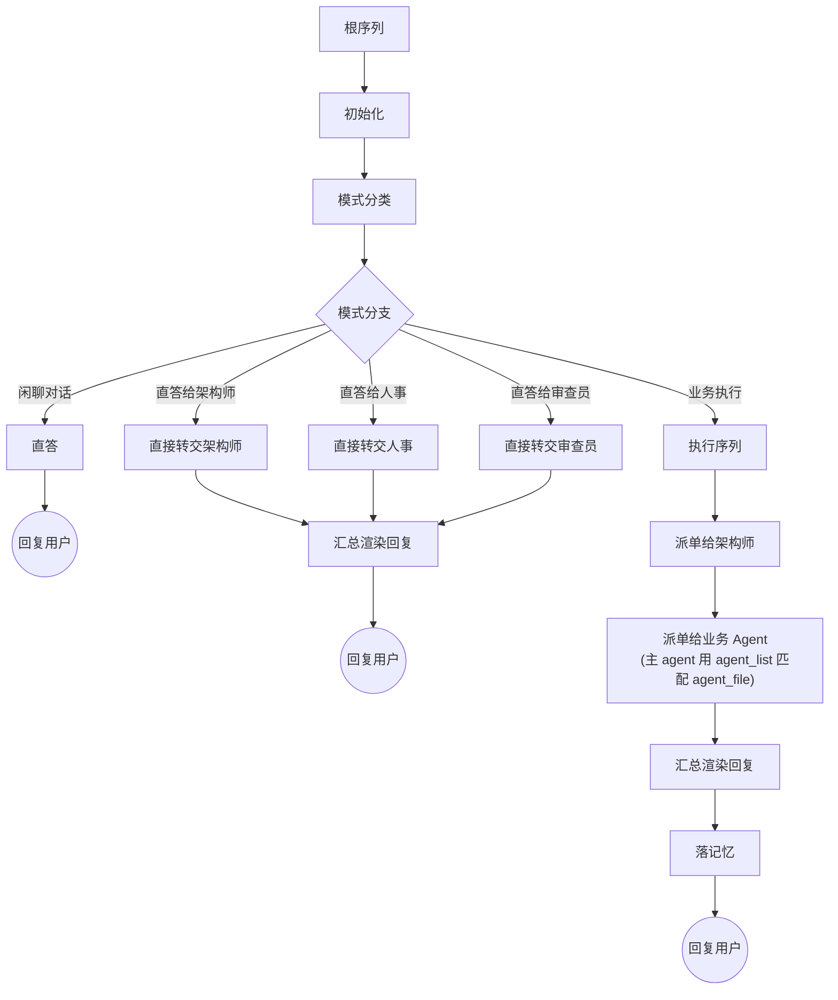

# 执行根流程图 — 全貌

> 关联：[全景图](./LOOPS-OVERVIEW.zh-CN.md) · [治理根流程图](./WORKFLOW-DREAM.zh-CN.md)
> 子循环（只引用，本篇不展开）：[Architect 子循环流程图](./WORKFLOW-ARCHITECT.zh-CN.md) · [HR 子循环流程图](./WORKFLOW-HR.zh-CN.md) · [主 agent 记忆 CRUD 子循环流程图](./WORKFLOW-MEMORY.zh-CN.md)

---

## 1. 定位

**执行根流程图由用户 prompt 触发。** 用户每发一次 prompt，主 agent 把它喂给执行根流程图，由根流程图决定走对话直答还是走执行通路；执行通路依次完成知识、能力、业务三轴，最终渲染回复送回用户。CBIM 所有循环都是流程图，本根与治理根平级共存。

---

## 2. 执行根流程图

注：四条非业务执行路径（闲聊对话、直答给架构师 / 人事 / 审查员）均不走落记忆——落记忆只发生在业务执行序列内。

---

## 3. 节点职责

| 节点 | 一句话职责 | 下游分支 |
|------|-----------|---------|
| 根序列 | 串起整轮 tick，统管超时与轨迹 | → 初始化 |
| 初始化 | 准备本轮 tick 的上下文容器 | → 模式分类 |
| 模式分类 | 判定本次 prompt 属于哪一种处理路径 | → 模式分支 |
| 模式分支 | 按分类结果选一条路走 | 闲聊对话 → 直答；直答给架构师 / 人事 / 审查员 → 对应的直接转交节点；业务执行 → 执行序列 |
| 直答 | 主 agent 直接生成回复，不动其它通路 | → 回复用户 |
| 直接转交架构师 | 用户问题明确指向架构事务，原样交给架构师作答，不走业务三轴 | → 汇总渲染回复 |
| 直接转交人事 | 用户问题明确指向 agent 体系，原样交给人事作答，不走业务三轴 | → 汇总渲染回复 |
| 直接转交审查员 | 用户问题明确指向独立评审，原样交给审查员作答，不走业务三轴 | → 汇总渲染回复 |
| 执行序列 | 知识、业务两轴依次跑完 | → 派单给架构师 |
| 派单给架构师 | 让架构师把用户意图拆成任务清单与上下文 | → 派单给业务 Agent |
| 派单给业务 Agent | 按任务清单逐个派业务 agent 执行；架构师产出的每条 task 携带 `required_capability` 但不带 `agent_file`，主 agent 在收到 yield 时用 MCP `agent_list` 匹配 `.claude/agents/*.md`，匹配不到回退到 `programmer` | → 汇总渲染回复 |
| 汇总渲染回复 | 把各路产出整理成给用户的回复 | → 落记忆 |
| 落记忆 | 把本轮值得留存的内容写入记忆，失败不阻塞 | → 回复用户 |

---

## 4. 与子循环的衔接

执行根的叶节点只负责"派单 + 等结果"，真正的工作发生在被派出的 agent 内部，每个被派出的 agent 自己也跑一个流程图。

**只有"业务执行"模式才会进入架构师 / 业务两轴子循环。** 三条"直接转交"路径绕过执行序列，由对应 agent 自行完成单轮作答，不触发架构师子循环、也不调度业务 agent。

| 执行根节点 | 衔接的子循环流程图 |
|-----------|----------------|
| 派单给架构师（业务执行模式下） | [Architect 子循环流程图](./WORKFLOW-ARCHITECT.zh-CN.md) |
| 落记忆 | [主 agent 记忆 CRUD 子循环流程图](./WORKFLOW-MEMORY.zh-CN.md) |

> 注：HR 执行子循环（hr_exec，挂在执行根中段的能力匹配子树）已于 v3.6 从执行根移除。剩下的两条 HR 相关路径——`hr` mode（用户显式"招个 X agent"时主 agent 直答给 HR）与 `hr_gov` 治理子树（治理根后台扫能力册）——均保持不变。详见 [HR 子循环流程图](./WORKFLOW-HR.zh-CN.md)。

派单给业务 Agent 衔接的是具体业务 agent，其内部拓扑由各 agent 自行约定，本文不收录。直接转交架构师 / 人事 / 审查员三条路径不进入任何子循环，仅完成一次单轮派发与回收。

---

## 5. 与治理根的关系

执行根由用户 prompt 触发，治理根由会话开启时的检查触发，二者平级，共用同一套流程图引擎，互不依赖。用户 prompt 始终优先于治理活动。
