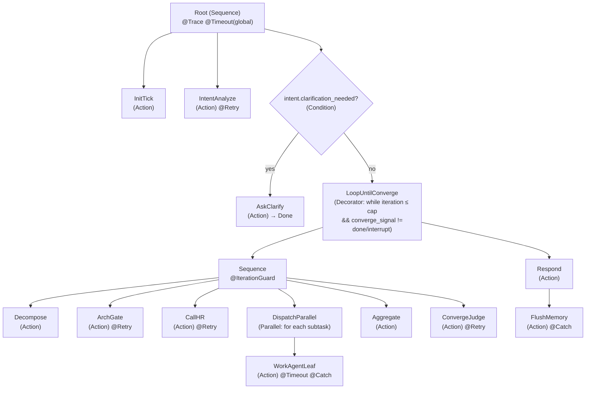
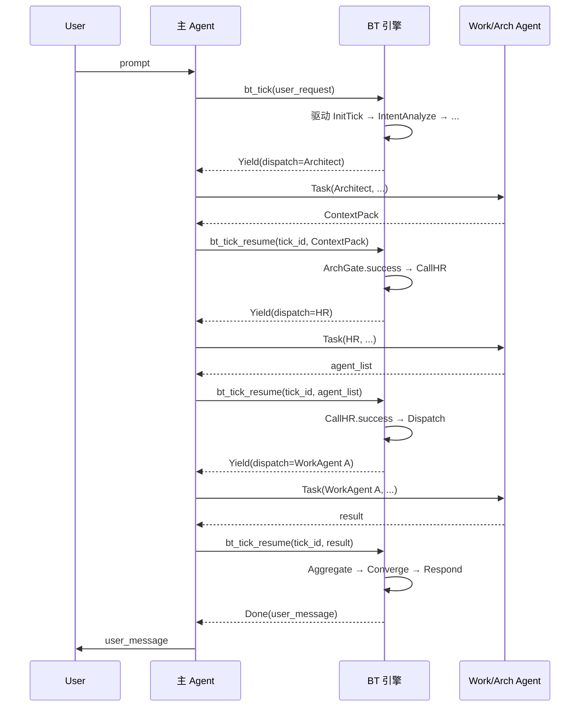

# CBIM 执行任务循环

> **v2 设计稿（行为树驱动）**。v1（基于 Claude Code CLAUDE.md 提示词驱动）已废弃为参考实现。
> 网页版：`design/web/loops.html` → 执行任务循环标签。
> 关联文档：[行为树引擎实现 README](../v1/kernel/engine/bt/README.md)、[`LOOPS-OVERVIEW.zh-CN.md`](./LOOPS-OVERVIEW.zh-CN.md)（全景图）。

---

## 1. 范式说明

**执行任务循环 = 一棵跑在引擎上的行为树。** 它是 CBIM 的**核心驱动引擎**：用户每一次 prompt 都从全局根节点开始一次 tick，由树的拓扑决定下一步派谁、装饰器决定异常如何处理、黑板承载所有跨节点状态。Coordinator 的"自治调度循环"不再是提示词里的散文流程，而是一棵可静态审计、可单步重放、可恢复中断的行为树。

### 与游戏行为树的关键差异

| 维度 | 游戏行为树 | CBIM 行为树 |
|------|------------|-------------|
| **tick 频率** | 每帧（16ms 级） | 每次用户 prompt 触发一次，单次 tick 内部允许 yield/resume 多回合 |
| **叶节点开销** | μs 级动作 | 秒~分钟级（Work Agent 一次任务） |
| **状态载体** | 节点对象内部字段 + 共享 blackboard | **只有黑板**——节点 ABC 禁止持有跨 tick 字段（见 §2） |
| **RUNNING 语义** | 下一帧继续 | 跨 tick 持久化恢复，由 `bb.runner_resume_path` 锁定回到原节点（见 §6） |
| **失败处理** | 节点 return FAILURE，父节点决定 | 同左，叠加装饰器（Timeout / Retry / Catch）做横切异常治理（见 §5） |
| **并发** | tick 内同步遍历 | 同左（Parallel 节点内的多分支由引擎顺序驱动，并发是"派多个 Work Agent 等结果"，不是树遍历并发） |
| **观测** | 渲染帧 | 每次 tick 落 trace（节点进入/退出/状态/耗时），可重放 |

一句话：**节奏慢、状态显式、必须可恢复、必须可审计**——这四条差异决定了所有后续设计。

---

## 2. 黑板 Schema

黑板（Blackboard，下称 `bb`）是单次用户 prompt 的所有跨节点状态的**唯一载体**。节点之间不通过返回值传数据，只通过 `bb` 字段读写。

### 2.1 字段表

| # | 字段 | 类型 | 写者 | 读者 | 说明 |
|---|------|------|------|------|------|
| 1 | `tick_id` | str | Root | 所有 | 单次 tick 的唯一 ID（UUID），同时也是 trace / 快照的文件名前缀 |
| 2 | `user_request` | str | Root | 所有 | 用户本轮原始 prompt（不变） |
| 3 | `intent` | dict\|None | IntentAnalyze | 后续所有 | 意图分析产物：`{kind, normalized_request, clarification_needed, clarifying_question}` |
| 4 | `dispatch_plan` | list[Subtask] | Decompose | Dispatch / Aggregate | 拆解后的子任务序列；每条 `{id, kind, target_agent, prompt, depends_on}` |
| 5 | `arch_context` | dict | ArchGate | Dispatch / WorkAgent prompt | Architect 返回的 ContextPack（模块路径、设计约束、依赖规则） |
| 6 | `subtask_results` | dict[id → Result] | Dispatch | Aggregate / Converge | 每个子任务的结果：`{status, output, needs_arch_decision, raw}` |
| 7 | `iteration` | int | Root → Loop | Converge / Caps | 当前 Decompose→Dispatch→Aggregate 的迭代轮次（从 1 起） |
| 8 | `iteration_cap` | int | Root | Converge | 软上限（默认 5），超出即强制 Interrupt |
| 9 | `converge_signal` | enum | Converge | Root | `done` / `loop` / `interrupt` 三态 |
| 10 | `final_response` | str\|None | Respond | Root | 最终回复用户的消息 |
| 11 | `interrupt_reason` | str\|None | Converge / 装饰器 | Root | 触发 Interrupt 的原因（冲突/超 cap/破坏性操作/装饰器熔断） |
| 12 | `runner_resume_path` | list[NodeId]\|None | 引擎 | 引擎 | RUNNING 节点的栈路径，跨 tick 恢复用（详见 §6 与 [引擎 README §3](../v1/kernel/engine/bt/README.md#3-持久化与-trace-格式)） |
| 13 | `bb_status` | enum | 引擎 | 引擎 / 主 agent | `running` / `done` / `error`；与 `runner_resume_path` 配合判定是否需 resume |
| 14 | `pending_dispatch` | DispatchRequest\|None | Dispatch | 主 agent | 当 tick yield 时，告诉主 agent 要派哪个 Work Agent，参数是什么 |
| 15 | `trace` | list[TraceEntry] | 所有节点 | 引擎落盘 | 节点级 trace：进入/退出/状态/耗时/异常 |
| 16 | `memory_flush_queue` | list[MemoryEntry] | 各阶段 | FlushMemory | 待落 `.cbim/memory/` 的条目缓冲，避免每节点都打开记忆服务 |
| 17 | `audit_report` | dict\|None | Audit 节点 | Aggregate | 可选叶节点（Audit）的结果，仅当树拓扑里挂了 Audit 节点时存在 |
| 18 | `agent_list` | list[dict]\|None | CallHR | DispatchParallel / WorkAgentLeaf | HR 返回的"子任务 → agent_file"分配清单：`[{subtask_id, target_agent_file, agent_capability}]`。WorkAgentLeaf 派工前先按 `subtask_id` 查这里，回退到 `subtask.target_agent_file`。 |

### 2.2 访问规则

- **节点内部不得持有跨 tick 字段。** 节点对象只能有"本次 tick 内"的私有变量；任何需要跨 tick 或跨节点存活的数据，必须写黑板。
- **写者唯一原则。** 每个字段表里"写者"列只能是一个节点类（或引擎自身）。其他节点只读。违反即破窗。
- **读者无限制，但只读副本。** 节点取出 `bb.xxx` 后不得就地修改可变结构；如需修改，写回必须显式赋值 `bb.xxx = new_value`，引擎据此判定 dirty 触发快照。
- **空值语义。** `None` = 该阶段尚未运行；空列表/空 dict = 该阶段已运行但产出为空。两者不可互换。

### 2.3 持久化策略（L1 锁定）

- **持久化范围：** 跨 tick 的同一用户请求内全程持久化（同一 `tick_id` 链）。用户开启下一个 prompt 即开新 `tick_id`，旧黑板归档。
- **持久化形式：** JSON 快照。每次黑板 dirty（任一字段被显式赋值）后，引擎在节点退出时落盘一次：`.cbim/scheduler/bt/<tick_id>/bb.json`。
- **trace 同址：** 同目录下 `trace.jsonl`，每行一条 TraceEntry，append-only。
- **恢复入口：** 主 agent 重启或 tick yield 后回调 `bt_tick_resume(tick_id, ...)` 时，引擎读 `bb.json` + `runner_resume_path` 还原现场（详见 §6 与 [引擎 README §3](../v1/kernel/engine/bt/README.md#3-持久化与-trace-格式)）。

---

## 3. 主循环行为树拓扑

下图是**完整全局根**——L4 锁定结果：CBIM 主循环 = 唯一根，无其他平级根。

### 装饰器叠加顺序（从外到内）

`@Trace`（最外） → `@Timeout` → `@Retry` / `@IterationGuard` / `@Catch`（最内）。

- 最外层 `Trace` 保证任何分支（含装饰器熔断）都被记录。
- `Timeout` 早于 `Retry`：超时不重试，直接 Catch。
- `IterationGuard` 仅包 LoopSeq，与节点级 Retry 互不干涉。

详细装饰器语义见 §5。

### LoopSeq 六节点顺序（v2.1 修订）

LoopSeq 是顺序节点（Sequence），子节点严格按顺序执行：

1. `Decompose` —— 拆解，生成 `dispatch_plan`（**不**填 agent_file）
2. `ArchGate` —— 知识轴：yield Architect，回填 `arch_context`
3. `CallHR` —— 能力轴：yield HR，回填 `agent_list`（`subtask_id → agent_file`）
4. `DispatchParallel` —— 业务轴：按 `agent_list` 派 Work Agent
5. `Aggregate` —— 整合结果，检测冲突
6. `ConvergeJudge` —— 判定 done / loop / interrupt

**ArchGate（知识轴）与 CallHR（能力轴）平行**，分别管"业务模块知识"与"agent 能力匹配"两个正交维度——前者决定"做什么"，后者决定"派给谁"。两者都必须先于 Work Agent 派工完成。

---

## 4. 五阶段 = 五个 Action 的契约

行为树叶节点（Action）即"做事"的最小单位。主循环的核心是五个 Action，对应执行循环的五个语义阶段：

| Action | 读 `bb` | 写 `bb` | 调谁 | 返回语义 |
|--------|---------|---------|------|----------|
| `IntentAnalyze` | `user_request` | `intent` | 规则引擎优先；歧义时 LLM 兜底（L8） | SUCCESS = 已分析（含 clarification_needed=true）；FAILURE = 规则与 LLM 均无法分析 |
| `Decompose` | `user_request`, `intent`, `subtask_results`（如有，用于二次拆解） | `dispatch_plan`（不含 `target_agent_file`，HR 在 CallHR 阶段统一填）, `iteration += 1` | 主 agent（LLM 决策）；规则可拦截"无需拆解"的简单 case | SUCCESS = 已拆解出 ≥1 个子任务；FAILURE = 无法拆解 |
| `ArchGate` | `dispatch_plan` | `arch_context` | 通过 `pending_dispatch` yield 给主 agent 派 Architect | SUCCESS = 已拿到 ContextPack；RUNNING = 等待 Architect resume；FAILURE = Architect 报错 |
| `CallHR` | `dispatch_plan`, `arch_context`, `agent_list`（去重检查） | `agent_list`（subtask_id → agent_file 清单） | 通过 `pending_dispatch` yield 给主 agent 派 HR | SUCCESS = 已有覆盖所有 `arch_context`-依赖子任务的 agent_list（或本轮无需求）；RUNNING = 等待 HR resume；FAILURE = HR 报 `agent_gap`（无可用 agent） |
| `DispatchParallel` (内含 `WorkAgentLeaf`) | `dispatch_plan`, `arch_context`, `agent_list` | `subtask_results[id]`, `pending_dispatch`（逐个派工） | 通过 `pending_dispatch` yield 给主 agent 派 Work Agent；agent_file 优先取自 `bb.agent_list`，回退到 `subtask.target_agent_file` | 全部子任务 SUCCESS → SUCCESS；任一 FAILURE 且无 fallback → FAILURE；任一携带 `NEEDS_ARCH_DECISION` → 回到 ArchGate（树拓扑层面通过 Aggregate 写 `converge_signal=loop` 实现） |
| `Aggregate` | `subtask_results` | `subtask_results`（合并视图）、可能写 `interrupt_reason`（如检测到冲突） | 纯本地，无外调 | SUCCESS = 整合完成；FAILURE = 检测到不可调和冲突（写 `interrupt_reason`） |
| `ConvergeJudge` | `subtask_results`, `iteration`, `iteration_cap` | `converge_signal` | 规则优先（无新子任务且无 `NEEDS_ARCH_DECISION` → done；有新增任务 → loop；冲突/超 cap → interrupt）；歧义时 LLM 兜底（L8） | SUCCESS = 已判定（信号在 `converge_signal`）；FAILURE = 判定异常（罕见） |

辅助 Action：

- **`InitTick`** — 写入 `tick_id`、`user_request`、`iteration=0`、`iteration_cap=5`，初始化 `subtask_results = {}`。
- **`AskClarify`** — 把 `intent.clarifying_question` 写入 `final_response`，置 `converge_signal=done`，结束本 tick。
- **`Respond`** — 把 `Aggregate` 整合产物渲染成用户可读消息，写 `final_response`。如果 `interrupt_reason` 非空，渲染为"打断说明 + 当前状态"。
- **`FlushMemory`** — 把 `memory_flush_queue` 落到 `.cbim/memory/short/`（一次性批写）。失败被 `@Catch` 吞掉但记 trace（记忆故障不应阻塞用户回复）。

---

## 5. 装饰器与异常处理

5 个标准装饰器，覆盖所有横切关注点。**装饰器只做横切，不做业务**——业务由 Action 自己处理。

| 装饰器 | 包谁 | 行为 | 失败时 |
|--------|------|------|--------|
| `@Trace` | Root | 记录每个被装饰节点的 enter/exit/status/duration_ms 到 `bb.trace`；引擎落 `trace.jsonl` | 永不失败（trace 本身异常吞掉，写一条 `trace_self_error` 条目） |
| `@Timeout(seconds)` | 全局 Root + 单个长 Action（WorkAgentLeaf） | 到时返回 FAILURE 给父节点，**不强杀子进程**——只标记超时，子进程（Work Agent）由其自身管理或被 OS 回收。引擎在 trace 上记 `timeout_fired`。 | 父节点收到 FAILURE 按正常拓扑处理 |
| `@Retry(n, only=idempotent)` | IntentAnalyze, ArchGate, CallHR, ConvergeJudge | 节点返回 FAILURE 时重跑，最多 n 次。**仅可包幂等节点**——LoopSeq 六节点中只有这四个被标注为幂等（无副作用、无外部状态改动）。Decompose / Dispatch / Aggregate 严禁包 Retry。 | n 次仍 FAILURE → 抛给父节点 |
| `@Catch(fallback)` | WorkAgentLeaf, FlushMemory | 子节点抛异常时不向上传播，按 fallback 策略（写 `subtask_results[id].status=error` 或写 trace 后吞掉） | 一定不抛——这是熔断 |
| `@IterationGuard` | LoopSeq | 每进入一次 LoopSeq，校验 `iteration ≤ iteration_cap`；超出直接写 `converge_signal=interrupt`、`interrupt_reason="iteration_cap_exceeded"` 并跳出 LoopRoot | 不抛，写信号 |

**两条非负约定：**

1. `@Timeout` 不强杀子进程 —— 子进程生命周期归子进程，行为树只管"我不再等你"。这避免了"杀到一半留下 zombie 状态"的复杂性。
2. `@Retry` 仅包幂等节点 —— 防止"重跑 Decompose 产生重复子任务"这类副作用堆叠。

---

## 6. 主 agent 与引擎的协作模型

L6 + L7 锁定：**主 agent = Action implementer + 调度回环参与者**。主 agent 自身不再执行 CLAUDE.md 那段散文式"理解 → 路由 → 拆解 → 派工 → 汇总"流程——那段已废弃。主 agent 的工作是：

1. 收到用户 prompt 后调 `bt_tick(user_request)`；
2. 引擎在内部驱动行为树到第一个 yield 点（通常是 ArchGate 或 WorkAgentLeaf 要派工）；
3. 引擎返回 `BtResult.Yield(dispatch_request)`；
4. 主 agent 用 Task tool 派出对应 Architect / Work Agent，拿到结果；
5. 主 agent 调 `bt_tick_resume(tick_id, dispatch_result)` 把结果交回引擎；
6. 引擎继续驱动到下一个 yield 点或 Done；
7. 循环 3–6 直到 `BtResult.Done(user_message)`；
8. 主 agent 把 `user_message` 输出给用户。

### 协程式 yield/resume 时序

**为什么是协程式而非主 agent 自驱动**：行为树的拓扑、装饰器、迭代上限、收敛判定等控制逻辑全部在引擎里——主 agent 只是"具备 Task 工具的执行手"。如果让主 agent 也持有控制流，相当于把树拷贝一份到 prompt 里，违反单一来源原则。

`bt_tick` / `bt_tick_resume` 的 MCP 工具签名与 `BtResult` 三态详见 [引擎 README §6](../v1/kernel/engine/bt/README.md#6-l7-协程式-yieldresume-协议细节)。

---

## 7. 全局 tick 入口与触发源

- **全局根** —— L4 锁定：主循环 = 唯一根。没有平级树，没有备份根。所有用户 prompt 都从同一个根节点入口进入。
- **触发源** —— 用户每一次 prompt 触发一次 `bt_tick`。**不存在定时触发、不存在外部事件触发、不存在 Agent 自驱触发**。这与游戏引擎"每帧 tick"形成根本差异：CBIM 是用户驱动的反应式系统。
- **HR 调用以 `CallHR` 节点纳入主循环（v2.1 修订）**，与 `ArchGate` 平行——HR 是能力轴的执行 agent，与 Architect（知识轴）地位对等。HR **内部子循环**（招募/培训/匹配的自闭环）仍保持黑盒，不行为树化（L5 决议保留）。其余子循环（记忆压缩、Auditor 评审）暂不行为树化，保持当前实现（CLI/Hook/独立 agent 自闭环）。
- **单 tick 边界** —— 一次 `bt_tick` + 若干 `bt_tick_resume` 构成一次"逻辑 tick"，对应一次用户 prompt。逻辑 tick 内黑板持久；逻辑 tick 结束（Done / Interrupt）黑板归档，不影响下一个 tick。

---

## 8. 调度原则（保留）

- 每次迭代必须有实质进展，无进展即触发 Converge=interrupt（由 `Aggregate` 检测 `subtask_results` 与上轮无差异）。
- **打断用户的唯一条件：** 意图真正模糊 · 结果冲突 · 破坏性/不可逆操作 · 超 `iteration_cap`。前三条由 Action 主动写 `interrupt_reason`，最后一条由 `@IterationGuard` 写。
- Architect 必经门保留语义（v1 即如此），由 `ArchGate` Action 强制执行：任何 requirement-type 子任务在派 Work Agent 前必须先经过 ArchGate；该校验由 `Decompose` 在生成 `dispatch_plan` 时静态保证（每个 requirement-type subtask 的 `depends_on` 必须包含 ArchGate 节点的产出 `arch_context`）。

---

## 9. 与 v1 的对应关系

| v1 CLAUDE.md 概念 | v2 对应 |
|-------------------|---------|
| `## Workflow` 8 步散文流程 | 主循环行为树（§3） |
| Architect 必经门（提示词约束） | `ArchGate` Action（强制执行，§4） |
| 软迭代 cap=5 | `@IterationGuard` 装饰器（§5） |
| `NEEDS_ARCH_DECISION` 文本标记 | `subtask_results[id].needs_arch_decision: bool`（§2），由 `WorkAgentLeaf` 解析填入 |
| 收敛信号（done / loop / interrupt） | `converge_signal` 黑板字段（§2） |
| 主 agent 自驱动调度 | **废弃**——主 agent 改为 Action implementer（§6） |
