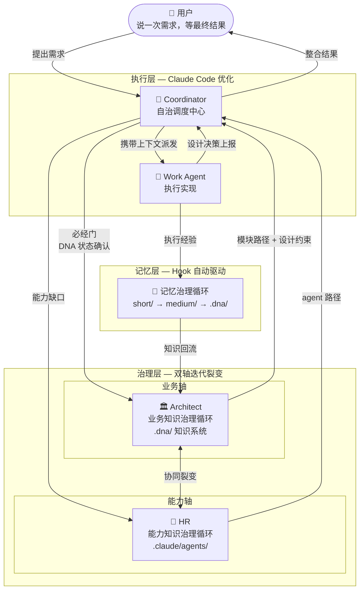

# CBIM 全局系统结构

> **v1**（基于 Claude Code）与 **v2**（原生实现）共享的设计蓝图。  
> 网页版：`design/web/index.html` → 全局结构标签。

三个层次 · 四个循环 · 双轴迭代裂变。用户只感知首尾，其余全部自治。

**核心闭环：** 每次任务执行都在让系统变得更好——经验沉淀为记忆，记忆提升为知识，知识增强下一次执行。

**裂变机制：** 新模块 DNA 建立 → 知识图谱扩展；新 agent 孵化 → 能力图谱扩展；两轴协同，边界持续生长。

## 三个层次

| 层次 | 内容 | 治理目标 |
|------|------|----------|
| 执行层 | Coordinator + Work Agent | 任务完成，用户心智负担最低 |
| 治理层 | Architect（业务轴）+ HR（能力轴） | 知识与能力持续裂变 |
| 记忆层 | Hook 驱动的三层沉淀 | 经验不随会话消失 |

## 四个循环

- [执行任务循环](./WORKFLOW-EXECUTION.zh-CN.md) — 入口，所有需求由此进入
- [业务知识治理循环](./WORKFLOW-ARCHITECT.zh-CN.md) — 业务轴，DNA 四状态管理
- [能力知识治理循环](./WORKFLOW-HR.zh-CN.md) — 能力轴，agent 生命周期
- [记忆治理循环](./WORKFLOW-MEMORY.zh-CN.md) — 底座，贯穿全程
