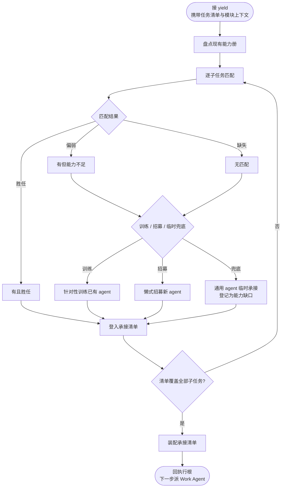
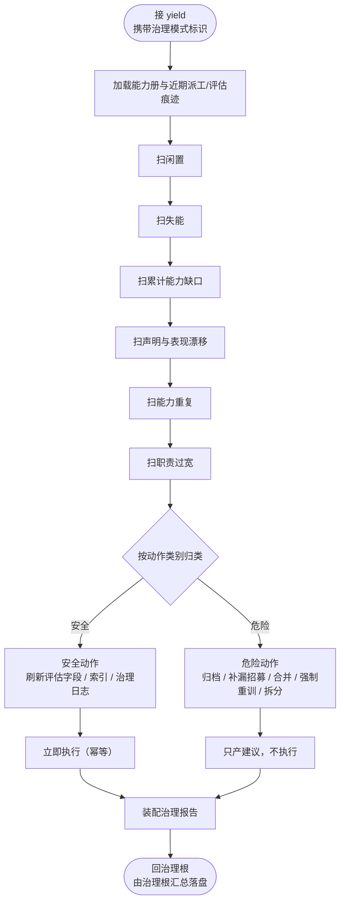

# CBIM HR 的能力管理（执行子循环流程图 + 治理子循环流程图）

> 全貌索引文档。父循环（执行根 / 治理根）见 [`WORKFLOW-EXECUTION.zh-CN.md`](./WORKFLOW-EXECUTION.zh-CN.md) 与 [`WORKFLOW-DREAM.zh-CN.md`](./WORKFLOW-DREAM.zh-CN.md)，本文不展开。
> 位置图见 [`LOOPS-OVERVIEW.zh-CN.md`](./LOOPS-OVERVIEW.zh-CN.md)；与业务轴的对偶关系见 [`WORKFLOW-ARCHITECT.zh-CN.md`](./WORKFLOW-ARCHITECT.zh-CN.md)。

---

## 一句话定位

**HR持有执行子循环流程图和治理子循环流程图两棵子循环**——前者前向式造新（响应当前任务的能力匹配与懒式招募），后者回头式重构（扫已有能力册的健康度并产建议）。两棵子循环皆是流程图，由派工 prompt 头部是否带治理模式标识决定进入哪一棵。

---

## 第一部分：HR执行子循环流程图

### 1.1 触发与定位

挂在执行根之下，由执行根的"派 HR"节点 yield 触发，目标是为当前任务的子任务清单逐一落实承接 agent。**前向式**：只看当前任务需要什么能力，不回头审视已有 agent 的健康度。

### 1.2 HR执行子循环流程图（Mermaid）

### 1.3 节点职责表（执行子循环）

| 节点 | 职责 | 边界 |
|------|------|------|
| 盘点现有能力册 | 读取能力轴注册表，形成可匹配视图 | 不评估健康度 |
| 逐子任务匹配 | 按模块上下文给出的能力需求逐一匹配 | 一次只看一个子任务 |
| 训练 | 对已有 agent 做针对性微调，使其胜任当前任务 | 不做泛化重训 |
| 懒式招募 | 当复杂度足够时孵化新专域 agent | 最小可用，不预造 |
| 临时兜底 | 用通用 agent 承接，同时登记为能力缺口供治理回头扫 | 不掩盖缺口 |
| 装配承接清单 | 保证清单覆盖全部子任务并交还父循环 | 不替父循环派工 |

---

## 第二部分：HR治理子循环流程图

### 2.1 触发与定位

挂在治理根之下，由治理根的"派 HR 治理"节点 yield 触发，prompt 头部带治理模式标识。目标是对能力册做体检。**回头式**：不响应任何当前任务，只看已有 agent 的健康度与结构。

### 2.2 HR治理子循环流程图（Mermaid）

### 2.3 节点职责表（治理子循环）

| 节点 | 职责 | 边界 |
|------|------|------|
| 加载能力册与痕迹 | 读全量 agent 与近期派工 / 评估痕迹 | 只读，不修改 |
| 六类扫描 | 闲置 / 失能 / 累计能力缺口 / 漂移 / 重复 / 职责过宽 | 不响应当前任务 |
| 按动作类别归类 | 区分安全动作与危险动作 | 分类依据：是否幂等可回滚 |
| 安全动作 | 评估字段、索引、治理日志这类幂等更新 | 立即执行 |
| 危险动作 | 涉及结构调整或 agent 进出册的操作 | 仅写入建议，待用户决策 |
| 装配治理报告 | 汇总已执行的安全动作与待决建议 | 不直接通知用户 |

---

## 第三部分：两棵子循环对比

| 维度 | 执行子循环流程图 | 治理子循环流程图 |
|------|------------|------------|
| 触发方 | 执行根派 HR | 治理根派 HR |
| 产出物 | 承接清单（子任务到 agent 的映射） | 治理报告（安全动作 + 待决建议） |
| 衔接 | 交还执行根继续派 Work Agent | 交还治理根汇总落盘并在下次 SessionStart 呈现 |

---

## 第四部分：与业务轴的对偶

能力轴（HR 管）与业务轴（Architect 管）互为镜像：业务轴新增模块可触发能力轴招募对应专域 agent；新 agent 孵化反过来携带新的业务领域知识。两轴各自持有执行 + 治理两棵子循环流程图，协同裂变，边界持续扩展。详见 [`WORKFLOW-ARCHITECT.zh-CN.md`](./WORKFLOW-ARCHITECT.zh-CN.md)。
