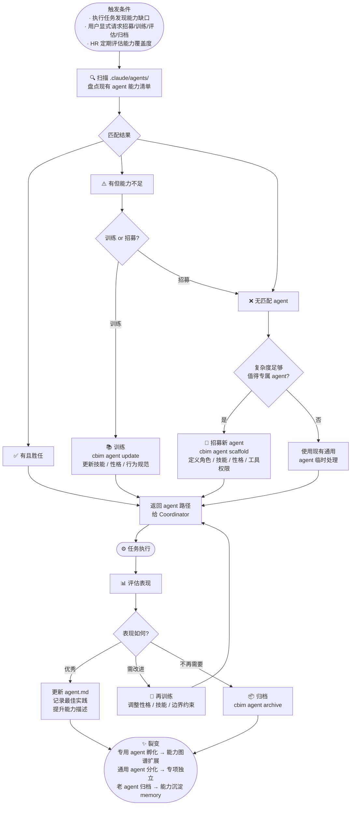

# CBIM 能力知识治理循环

> **v1**（基于 Claude Code）与 **v2**（原生实现）共享的设计蓝图。  
> 网页版：`design/loops.html` → 能力知识治理循环标签。

能力轴 · `.claude/agents/` · 能力系统的更新与裂变。与业务知识治理循环对偶，共同构成双轴治理体系。

## 裂变路径

- **专用 agent 孵化** → 能力图谱扩展，新的专项能力进入体系
- **通用 agent 分化** → 专项 agent 独立，减少通用 agent 的职责蔓延
- **老 agent 归档** → 能力经验沉淀到 `memory/`，不消失只转形

## Agent 生命周期

| 阶段 | 操作 | 说明 |
|------|------|------|
| 招募 | `cbim agent scaffold` | 定义角色、技能、性格、工具权限 |
| 训练 | `cbim agent update` | 更新技能描述、行为规范、边界约束 |
| 评估 | HR 分析执行质量 | 比对任务结果与 agent 能力声明 |
| 归档 | `cbim agent archive` | 标记不再活跃，经验写入 memory |

## 与业务轴的对偶关系

能力轴（`.claude/agents/`）与业务轴（`.dna/`）互为镜像：

- 业务轴新增模块 → 可能触发能力轴招募对应专域 agent
- 能力轴新 agent 孵化 → 携带新的业务领域知识
- 两轴协同裂变，边界持续扩展
