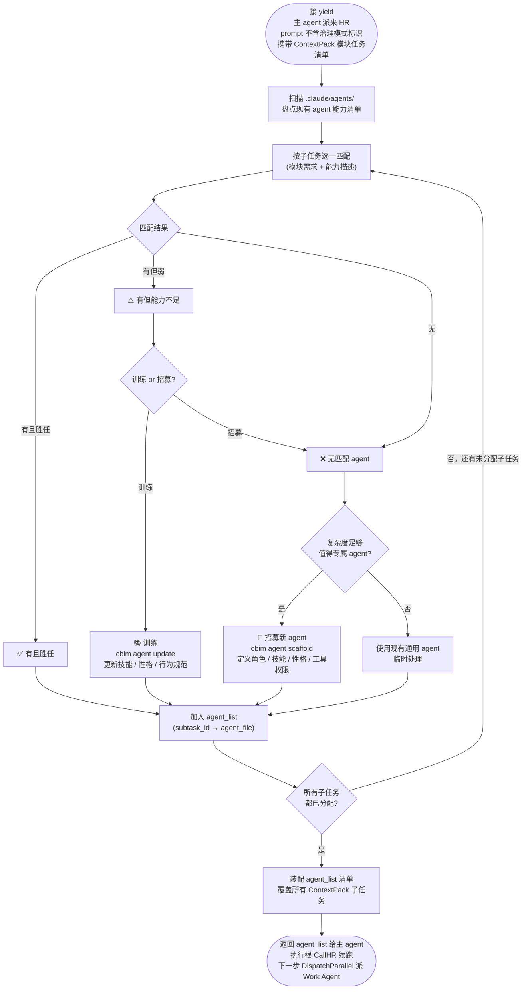
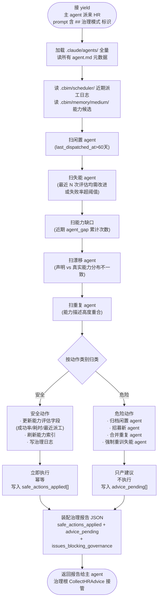

# CBIM HR 的能力管理（执行 + 治理双子循环）

> **v1**（基于 Claude Code）与 **v2**（原生实现）共享的设计蓝图。
> 网页版：`design/web/loops.html` → 能力管理标签。
> 关联文档：[`LOOPS-OVERVIEW.zh-CN.md`](./LOOPS-OVERVIEW.zh-CN.md)（位置图）、[`WORKFLOW-EXECUTION.zh-CN.md`](./WORKFLOW-EXECUTION.zh-CN.md)（执行根，触发执行子循环）、[`WORKFLOW-DREAM.zh-CN.md`](./WORKFLOW-DREAM.zh-CN.md)（治理根，触发治理子循环）。

---

## 0. 顶部说明：HR 是能力轴的双重身份 actor

HR 是能力轴（`.claude/agents/`）的**管理者和执行者**——既是这条轴的"匹配/招募人"（执行子循环），也是这条轴的"维护人"（治理子循环）。两个子循环共用同一份 agent 配置文件（`.claude/agents/hr/hr.md`），由派工 prompt 头部的标识 token 决定进入哪个子循环。

| 子循环 | 触发根 | 工作内容 | 在哪一节 |
|--------|--------|---------|---------|
| **执行子循环** | 执行根（用户驱动） | 按 ContextPack 模块任务清单匹配 / 招募 agent，返回 agent_list | 第一部分 §1–§4 |
| **治理子循环** | 治理根（scheduler 驱动） | 扫 `.claude/agents/` 找问题、安全动作自主、危险动作只产建议 | 第二部分 §5–§8 |

**对偶关系**：能力轴（`.claude/agents/`，HR 管）与业务轴（`.dna/`，Architect 管）互为镜像，详见 [`WORKFLOW-ARCHITECT.zh-CN.md`](./WORKFLOW-ARCHITECT.zh-CN.md)。两轴各有自己的双子循环。

---

# 第一部分：HR 执行子循环

## 1. 触发源

执行子循环挂在执行根（[`WORKFLOW-EXECUTION`](./WORKFLOW-EXECUTION.zh-CN.md)）下，由以下入口触发：

| 触发源 | 场景 |
|--------|------|
| **执行根 `CallHR` 节点** | 每次 `ArchGate` 返回 ContextPack 后，`CallHR` yield 主 agent 派 HR，请求按子任务清单匹配 / 招募 agent |
| **用户显式请求招募 / 训练 / 评估 / 归档** | 用户直接 prompt"训练一个 Y 专家 agent"，仍走执行子循环 |

## 2. 节点流程图（执行子循环）



## 3. 与执行根的接口

### 3.1 DispatchRequest 格式（主 agent → HR）

```
{
  "target_agent": "hr",
  "mode": "execution",                  # 不带 "## 治理模式"
  "user_request": "<原始 prompt>",
  "dispatch_plan": <bb.dispatch_plan>,
  "arch_context": <bb.arch_context>     # 关键：ContextPack 决定每个子任务的能力需求
}
```

### 3.2 agent_list 结构（HR → 主 agent → 执行根）

执行子循环的产物，写回执行根 `bb.agent_list`：

```
[
  {
    "subtask_id": "<id from dispatch_plan>",
    "target_agent_file": ".claude/agents/<dir>/<name>.md",
    "agent_capability": "<capability summary>",
    "match_kind": "fit|trained|scaffolded|temporary"
  },
  ...
]
```

执行根 `DispatchParallel` 阶段会按 `agent_list[subtask_id]` 派 Work Agent，回退到 `subtask.target_agent_file`。

## 4. 裂变路径 · Agent 生命周期（执行子循环的核心知识）

### 裂变路径

- **专用 agent 孵化** → 能力图谱扩展，新的专项能力进入体系
- **通用 agent 分化** → 专项 agent 独立，减少通用 agent 的职责蔓延
- **老 agent 归档** → 能力经验沉淀到 `memory/`，不消失只转形

### Agent 生命周期

| 阶段 | 操作 | 说明 |
|------|------|------|
| 招募 | `cbim agent scaffold` | 定义角色、技能、性格、工具权限 |
| 训练 | `cbim agent update` | 更新技能描述、行为规范、边界约束 |
| 评估 | HR 分析执行质量 | 比对任务结果与 agent 能力声明 |
| 归档 | `cbim agent archive` | 标记不再活跃，经验写入 memory |

执行子循环聚焦在"招募 / 训练 / 匹配"三个阶段；"评估 / 归档"主要在治理子循环中跑（执行子循环只在 Work Agent 回环后顺便记录一次执行表现）。

---

# 第二部分：HR 治理子循环

## 5. 触发源

治理子循环挂在治理根（[`WORKFLOW-DREAM`](./WORKFLOW-DREAM.zh-CN.md)）下，**唯一触发源**：

| 触发源 | 场景 |
|--------|------|
| **治理根第三步 `HRGovernanceStep` 的 `DispatchHRGovern` 节点** | 治理根知识治理步骤完成后，yield 主 agent 派 HR，prompt 头部带 `## 治理模式` 标识 token |

用户对话、执行根派工都**不会**进入治理子循环。

## 6. 节点流程图（治理子循环）



## 7. 治理模式的扫描清单与自主权边界

### 扫描清单（5 大检查项）

| 检查项 | 检查内容 |
|--------|---------|
| 闲置 agent | `last_dispatched_at` 超过 60 天未被派工 |
| 失能 agent | 最近 N 次任务评估均为"需改进"或失败率高于阈值 |
| 能力缺口 | 近期 Architect 报告或执行根日志中出现"无可用 agent"（HR 报 `agent_gap` 的累计次数） |
| 漂移 agent | `agent.md` 能力声明与实际执行表现长期不一致（声明 vs 真实能力分布） |
| 重复 agent | 多个 agent 能力描述高度重合，存在合并机会 |

### 自主权边界

| 类别 | 动作 | 自主权 |
|------|------|--------|
| **安全动作** | 更新 `agent.md` 的能力评估字段（成功率、平均耗时、最近派工时间）；刷新能力索引；写入治理日志 | **可自主执行**（幂等） |
| **危险动作** | 归档闲置 agent、招募新 agent、合并重复 agent、强制重训失能 agent | **只产建议**，写入返回报告的 `advice_pending` 数组，由用户下次会话时决定是否采纳 |

## 8. 与治理根的接口

### 8.1 DispatchRequest 格式（主 agent → HR 治理模式）

```
{
  "target_agent": "hr",
  "mode": "governance",                # prompt 头部带 "## 治理模式"
  "run_id": "<dream run_id>",
  "scope_hint": "all" 或 ["<agent path>", ...]
}
```

### 8.2 返回值结构（HR → 主 agent → 治理根）

治理模式 HR 必须返回结构化 JSON 报告，由治理根 `CollectHRAdvice` 写入 `bb.hr_governance_report`：

```
{
  "mode": "governance",
  "scanned_at": "<ISO 8601>",
  "scope": {
    "agents_scanned": <int>,
    "dispatch_logs_reviewed": <int>
  },
  "safe_actions_applied": [
    {"action": "update_capability_stats", "agent": "<path>", "detail": "..."},
    ...
  ],
  "advice_pending": [
    {"severity": "warn|error", "kind": "idle_agent|capability_gap|drifted_agent|...", "agent": "<path>", "summary": "...", "suggested_action": "archive|recruit|retrain|merge"},
    ...
  ],
  "issues_blocking_governance": [...]
}
```

### 8.3 执行子循环 vs 治理子循环 的关键差异

| 维度 | 执行子循环 | 治理子循环 |
|------|---------|---------|
| 触发来源 | 执行根 `CallHR` 节点 / 用户对话 | 治理根 `DispatchHRGovern` 节点 |
| 模式标识 | `mode=execution` | `mode=governance`，prompt 头部带 `## 治理模式` |
| 输入 | ContextPack + dispatch_plan（少量子任务的能力需求） | 全 `.claude/agents/` 扫描请求 |
| 与用户交互 | 间接（通过 Coordinator 派工） | 不交互（产物落报告，下次 SessionStart 摘要呈现） |
| 招募 / 归档 | 允许（按生命周期表） | 只产建议，不直接执行 |
| 写 `agent.md` | 允许（训练 / 评估） | 只写安全字段（统计数据、时间戳、日志） |
| 返回 | agent_list 清单（subtask_id → agent_file） | 治理报告 JSON |

---

## 9. 与业务轴的对偶关系

能力轴（`.claude/agents/`）与业务轴（`.dna/`）互为镜像：

- 业务轴新增模块 → 可能触发能力轴招募对应专域 agent
- 能力轴新 agent 孵化 → 携带新的业务领域知识
- 两轴各有双子循环（执行 + 治理），协同裂变，边界持续扩展
