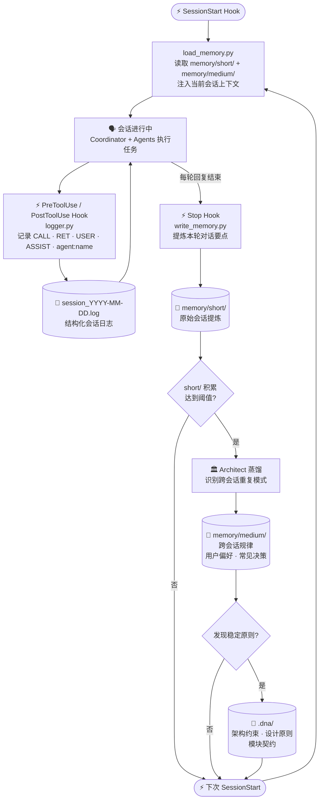

# CBIM 记忆治理循环

> **v1**（基于 Claude Code）与 **v2**（原生实现）共享的设计蓝图。  
> 网页版：`design/web/loops.html` → 记忆治理循环标签。

执行经验自动沉淀为知识。全程由 Hook 驱动，对用户完全透明。



## 三层沉淀

| 层级 | 路径 | 内容 | 触发 |
|------|------|------|------|
| 原始层 | `memory/short/` | 每次会话的要点提炼 | Stop Hook 自动 |
| 模式层 | `memory/medium/` | 跨会话的重复规律、用户偏好、常见决策 | Architect 蒸馏 |
| 原则层 | `.dna/` | 稳定架构约束、设计原则、模块契约 | Architect 提升 |

## Hook 一览（v1 Claude Code 实现）

| Hook | 脚本 | 作用 |
|------|------|------|
| `SessionStart` | `load_memory.py` | 读取 short/ + medium/，注入上下文 |
| `PreToolUse` | `log_pre_tool.py` | 记录工具调用（CALL） |
| `PostToolUse` | `log_post_tool.py` | 记录工具返回（RET） |
| `Stop` | `write_memory.py` | 提炼本轮对话写入 short/ |

## 日志格式

```
[2026-05-22T10:30:00] [USER] 用户消息内容
[2026-05-22T10:30:01] [CALL] [agent:programmer] Read(path=...)
[2026-05-22T10:30:02] [RET]  [agent:programmer] Read → 文件内容...
[2026-05-22T10:30:05] [ASSIST] 助手回复
```

主 session 无 agent 标签；子 agent 通过 `transcript_path` 旁的 `.meta.json` 识别 `agentType`。
