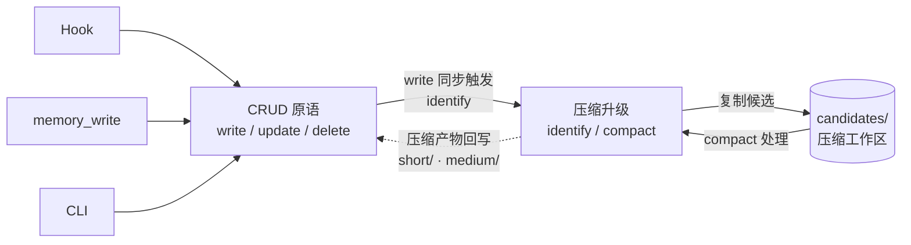

# CBIM 记忆服务

> **v1**（基于 Claude Code）与 **v2**（原生实现）共享的设计蓝图。
> 网页版：`design/web/loops.html` → 记忆服务标签。
> 关联文档：`design/LOOPS-OVERVIEW.zh-CN.md`（五角色全景图）。

---

## 1. 系统定位

**记忆系统是一个独立的存储+查询服务，类比项目本地的一个嵌入式数据库。**

它有自己的内部生命周期（CRUD 与压缩升级），对外只提供一组**只读**的查询接口。它**不参与业务调度**、**不主动通知任何人**、**不区分调用者身份**——谁来查都一样，能拿到什么取决于库里有什么、查询条件是什么。

### 它不是什么

| 误解 | 澄清 |
|------|------|
| 一条从原始到知识的单向晋升流水线 | 不是。CRUD 与压缩升级是**双向闭环**：写入会触发候选识别，候选区压缩后还可能反哺为新的低层条目。 |
| 由 Stop Hook 自动驱动的提炼链路 | 不是。Hook 只是众多写入来源之一，与显式 `memory_write`、压缩升级触发器地位等同。 |
| 一个"为四大循环服务"的子系统 | 不是。它是被动数据服务，与四大循环**平级**。循环消费它，但它不知道循环存在。 |
| 一定要"晋升到 .dna/"才算成功 | 不是。绝大多数记忆条目终其生命周期都不会进入 `.dna/`，这不是失败，是常态。 |

### 与四大循环的关系（一句话）

| 关系方 | 关系 |
|--------|------|
| 四大循环 | 通过 4 个只读接口查询；任何循环都不能直接写记忆库（写入必须走记忆服务自身的写入原语）。 |
| `.dna/` 知识系统 | 同级独立系统。记忆条目可能被人工或 Architect 提炼后**复制**到 `.dna/`，但这是 `.dna/` 侧的导入动作，不是记忆服务的"出口"。 |

---

## 2. 内部循环：CRUD ↔ 压缩升级

记忆服务内部只有两组动作，构成一个双向闭环：

### 4 个存储原语（物理层）

| 原语 | 路径 | 内容形态 | 生命周期 |
|------|------|----------|----------|
| `short` | `.cbim/memory/short/` | 单次写入的原始条目（会话片段、显式备忘、单条决策） | 可压缩；可被删除；可被升级引用 |
| `medium` | `.cbim/memory/medium/` | 已识别出跨条目模式的中等密度条目 | 可继续压缩；可被删除 |
| `candidates` | `.cbim/memory/candidates/` | 压缩升级流程的中间区，待识别/待合并的候选 | 临时；处理完即清空 |
| `index` | `.cbim/memory/.index/` | 检索索引（标签、时间、来源、信号四象限） | 由写操作维护，外部不可见 |

> `candidates/` 是 G3 决议的独立路径。它**不是**第三层存储，仅是压缩升级流程的工作区。

### 5 个操作（行为层）

| 操作 | 类别 | 触发者 | 作用 |
|------|------|--------|------|
| `write` | CRUD | Hook / 显式调用 / CLI | 写入 `short/`，同步更新 `index/`，**同步识别**是否产生压缩候选 |
| `update` | CRUD | 显式调用 / CLI | 修改已有条目（含路径迁移），同步更新 `index/` |
| `delete` | CRUD | 显式调用 / CLI | 删除条目，同步更新 `index/` |
| `identify` | 压缩升级 | 由 `write` 同步触发 | 扫描相关条目，把符合压缩条件的复制（不是移动）到 `candidates/` |
| `compact` | 压缩升级 | 独立触发（CLI / 定时 / 阈值） | 处理 `candidates/`，产出新的 `medium/` 条目或合并 `short/` 条目，清空已处理的候选 |

### 双向闭环的关键约束

**Create 是"一体两步"的收窄写入**：

`write` 操作内部一定要执行两件事，且只在两件都完成后才返回成功：
1. 把新条目落盘到 `short/`，更新 `index/`；
2. 调用 `identify`，若命中压缩条件则把候选复制到 `candidates/`。

第 2 步**不通知任何外部方**，不发起后续动作，只是把候选状态写下来。这就是 G5 "提升候选只识别不通知"的收窄。后续 `compact` 何时跑、由谁跑，与 `write` 无关。

**压缩产物的反哺**：

`compact` 处理候选后，可能产生：
- 一条新的 `medium/` 条目（多条 `short/` 浓缩为一条规律）；
- 一条更新后的 `short/`（同质条目合并）；
- 删除若干被覆盖的原始条目。

这些产物本身又是 `write`/`update`/`delete`，会再次触发 `identify`。这构成闭环——但因为每次压缩**严格减少候选**，闭环会自然收敛。

---

## 3. 对外服务接口契约

记忆服务对外**只暴露 4 个只读接口**。所有写入都是内部行为或通过 Hook/CLI 旁路完成，**外部循环无法直接写记忆库**。

| 接口 | 输入 | 输出 | 用途 |
|------|------|------|------|
| `query` | 自然语言查询 + 可选过滤（标签、时间窗、信号象限） | 排序后的条目列表 | 语义/关键词检索，找最相关的若干条 |
| `scan` | 结构化过滤条件（标签、路径前缀、时间范围） | 全量符合条件的条目列表 | 枚举式拉取，不做相关性排序 |
| `get` | 条目 ID 或路径 | 单条完整内容 | 已知坐标的精确取值 |
| `stats` | 可选过滤条件 | 计数 / 分布 / 最新时间戳等统计量 | 健康度观测、容量决策、压缩触发判断 |

### 契约硬约束

| 约束 | 说明 |
|------|------|
| **只读** | 4 个接口都不修改任何状态。任何"查的同时记一下"都是反模式。 |
| **不区分调用者** | 接口不接受、不感知 `agent_type` / `caller_role` 参数。同一查询条件，谁来查结果都一样。 |
| **不 emit 事件** | 查询不产生事件、不写日志、不通知任何方（内部观测除外）。 |
| **稳定优先** | 这 4 个接口的签名进入 `kernel/memory/.dna/contract.md`，按公共契约级别管理：新增字段可向后兼容追加，删除/重命名需走 contract 变更流程。 |
| **stats 也是稳定契约** | G4 决议：`stats` 不是临时调试接口，明确写入 `contract.md`，与 `query/scan/get` 同级。 |

---

## 4. 与四大循环的边界

**一句话定边界**：记忆服务是被动数据层。四大循环各自决定何时调它、调哪个接口、怎么用结果；记忆服务不感知循环存在，不区分调用者，不主动推送。

### 典型消费者示意

> 仅作为"谁可能调哪个接口"的示意，具体调用时机由各循环自己设计，**不在本文档范围内**。

| 消费者 | 典型场景 | 通常调用 |
|--------|----------|----------|
| Coordinator 调度循环 | 会话开始时拉取最近上下文 | `scan`（按时间窗） |
| Coordinator 调度循环 | 用户问"上次我们决定的 X" | `query`（语义检索） |
| Architect 知识治理循环 | 巡检候选是否值得提升为 `.dna/` | `scan` + `stats` |
| Work Agent 执行循环 | 任务开始前查相关历史决策 | `query` |
| 任何循环 | 已知 ID 取详情 | `get` |
| 健康度监控（任何方） | 容量、增长率、压缩堆积 | `stats` |

注意：**所有写入路径都不在此表中**——因为写入不是"消费记忆服务"，而是"喂数据进记忆服务"，走的是 Hook / `memory_write` MCP / CLI，与查询接口完全隔离。

---

## 5. 已排除的设计选项

以下方案在 v3 设计稿评审中被明确排除，记录原因以防回潮：

| # | 被排除的方案 | 排除原因 |
|---|--------------|----------|
| 1 | **三层沉淀漏斗**（short → medium → .dna 单向晋升） | 把数据服务误描述成业务流程；隐藏了 CRUD ↔ 压缩升级的双向闭环；制造"必须晋升才成功"的错觉。 |
| 2 | **由 Stop Hook 链式驱动提炼到 .dna** | 把写入触发器与压缩触发器耦合；让记忆服务越界承担调度职责；与"被动服务方"定位矛盾。 |
| 3 | **查询接口区分调用者身份**（按 agent_type 返回不同结果） | 破坏接口的确定性；让权限/视图逻辑泄漏进数据层；任何"分调用者视图"的需求由上层 ACL/Filter 包装实现，不在记忆服务内。 |
| 4 | **写入接口对外开放给四大循环** | 破坏被动定位；任何循环都可能绕过候选识别直写存储，导致 `index/` 与 `candidates/` 状态漂移。写入必须走 Hook/MCP/CLI 这三条明确入口。 |
| 5 | **`candidates/` 复用 `short/` 或 `medium/` 路径**（用元数据标记代替独立目录） | G3 否决：候选区是压缩流程的工作区，不是存储层；混路径会让"扫描全量条目"与"扫描待压缩"两个语义纠缠在一起。 |
| 6 | **`stats` 接口归类为内部调试接口** | G4 否决：容量观测和压缩触发判断是长期稳定需求，必须按契约管理，不能随实现起伏。 |
