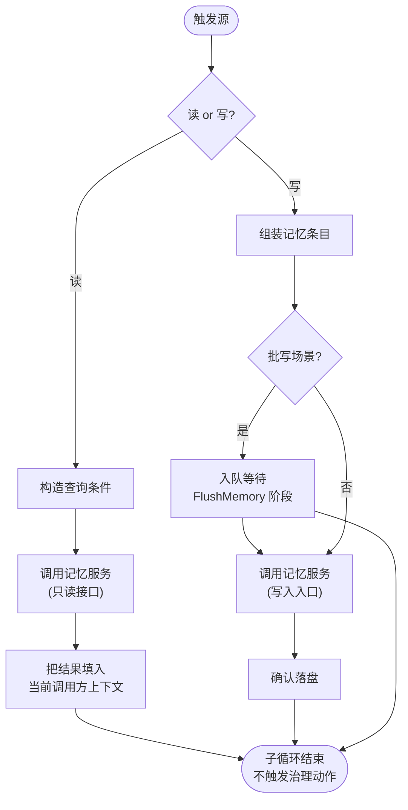
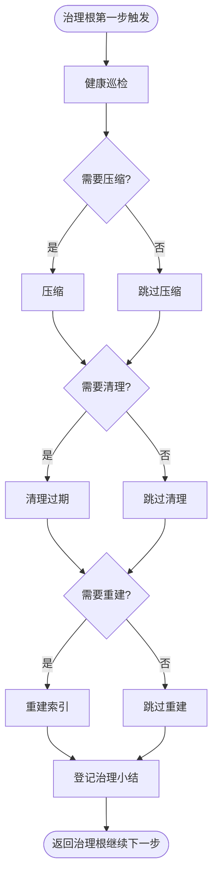

# CBIM 主 agent 的记忆能力（CRUD + 治理 双子循环 BT）

> 关联文档：[`LOOPS-OVERVIEW.zh-CN.md`](./LOOPS-OVERVIEW.zh-CN.md)（位置图）、[`WORKFLOW-EXECUTION.zh-CN.md`](./WORKFLOW-EXECUTION.zh-CN.md)（执行根，挂 CRUD 子循环 BT）、[`WORKFLOW-DREAM.zh-CN.md`](./WORKFLOW-DREAM.zh-CN.md)（治理根，挂治理子循环 BT）。

---

## 一句话定位

**主 agent 持有记忆 CRUD 子循环 BT 和记忆治理子循环 BT；记忆服务本身没有 BT。**

- CRUD 子循环 BT：挂在执行根（用户驱动）下，负责业务路径上的读写。
- 治理子循环 BT：挂在治理根（scheduler 驱动）下，负责定期把存储层的维护动作叫起跑一次。
- 两条子循环 BT 的主体都是**主 agent**——是 actor，是循环的持有者。

---

## 记忆服务边界

记忆服务是**项目本地的存储层**，只有内部状态、没有 BT、不持有定时器、不主动通知任何方；谁调用就执行一次。循环的主体永远是调用它的主 agent。

---

## 主 agent 记忆 CRUD 子循环 BT

### 拓扑

### 节点职责表

| 节点 | 职责 |
|------|------|
| 触发源 | 接收来自执行根节点、Hook 入口、用户显式 MCP 调用的请求 |
| 读 or 写 分支 | 判断本次操作是读路径还是写路径，决定下半段拓扑 |
| 构造查询条件 | 把调用方意图整理成对存储层只读接口可接收的查询形态 |
| 调用记忆服务（只读接口） | 走存储层对外只读接口取回结果 |
| 把结果填入当前调用方上下文 | 把结果交回触发方使用，不做二次加工 |
| 组装记忆条目 | 把待写内容整理成存储层可接受的条目形态 |
| 批写场景判断 | 决定走批写出口还是即时写入 |
| 入队等待 | 暂存到执行根批写出口，由执行根统一冲刷 |
| 调用记忆服务（写入入口） | 通过 Hook / 显式 MCP / CLI 三条入口之一落盘 |
| 确认落盘 | 确认写入成功，子循环 BT 在此返回 |

---

## 主 agent 记忆治理子循环 BT

### 拓扑

### 节点职责表

| 节点 | 职责 |
|------|------|
| 治理根第一步触发 | 由治理根作为首个治理步骤拉起本子循环 BT |
| 健康巡检 | 调存储层维护接口取健康状态，作为后续判断输入 |
| 需要压缩 / 清理 / 重建 三个判断 | 依据健康状态分别决定是否进入对应维护动作 |
| 压缩 / 清理过期 / 重建索引 | 调存储层对应的内部维护接口执行一次维护动作 |
| 跳过压缩 / 跳过清理 / 跳过重建 | 不需要时短路登记结果，保持小结结构齐整 |
| 登记治理小结 | 汇总本次三件维护动作的结果供治理根上层汇报 |
| 返回治理根继续下一步 | 子循环 BT 退出，把控制权交回治理根 |

---

## 触发场景 → 子循环 BT 对照表

| 触发场景 | 走哪个子循环 BT |
|---------|----------------|
| 一次用户对话结束（Hook 落条目） | CRUD 子循环 BT |
| 新开会话拉历史上下文（Hook 召回） | CRUD 子循环 BT |
| 用户显式说"记下这条" | CRUD 子循环 BT |
| 用户显式说"上次我们决定的 X" | CRUD 子循环 BT |
| 执行根批写出口冲刷 | CRUD 子循环 BT |
| 执行根任一节点在业务路径上需要历史 | CRUD 子循环 BT |
| 治理根定期拉起第一步治理 | 治理子循环 BT |
| 人工运行维护命令 | 治理子循环 BT（共用同组维护接口） |

---

## 两条子循环 BT 的关键差异

| 维度 | CRUD 子循环 BT | 治理子循环 BT |
|------|----------------|---------------|
| 挂在哪个根 | 执行根 | 治理根 |
| 节奏 | 业务路径上随调随跑 | 定期跑一次 |
| 调用方身份 | 主 agent 在业务路径上 | 主 agent 在治理路径上 |
| 调存储层哪类接口 | 对外只读接口 + 写入入口 | 内部维护接口 |
| 是否需要 LLM 判断 | 视场景 | 不需要 |
| 失败语义 | 影响当前调用方 | 不打扰用户，下次补跑 |

两条子循环 BT **完全解耦**：CRUD 写入产生的候选不会回调治理子循环 BT，治理子循环 BT 跑完也不会通知 CRUD 子循环 BT。这正是记忆服务"被动存储层"定位的体现。
