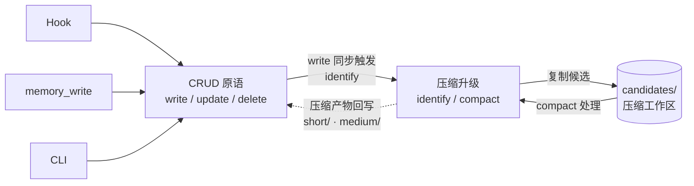
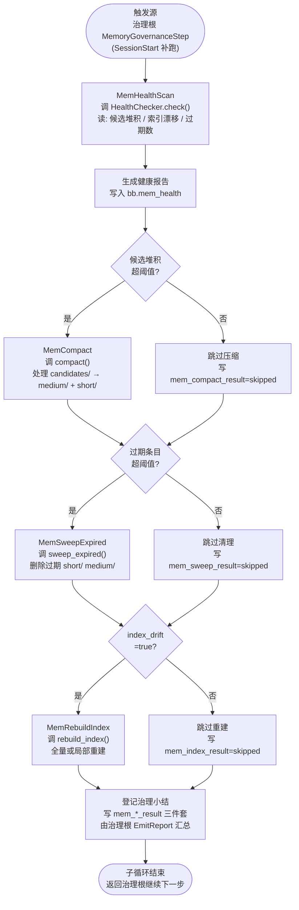

# CBIM 主 agent 的记忆能力（CRUD + 治理双子循环）

> **v1**（基于 Claude Code）与 **v2**（原生实现）共享的设计蓝图。
> 网页版：`design/web/loops.html` → 记忆能力标签。
> 关联文档：[`LOOPS-OVERVIEW.zh-CN.md`](./LOOPS-OVERVIEW.zh-CN.md)（位置图）、[`WORKFLOW-EXECUTION.zh-CN.md`](./WORKFLOW-EXECUTION.zh-CN.md)（执行任务循环，会触发 CRUD 子循环）、[`WORKFLOW-DREAM.zh-CN.md`](./WORKFLOW-DREAM.zh-CN.md)（治理循环，会触发治理子循环）。

---

## 0. 顶部说明：服务 vs 能力 vs 子循环

本文档讲两件相互独立但常被混淆的事，请先把概念分清楚再往下读：

| 概念 | 是什么 | 有没有循环 | 在哪一节 |
|------|--------|----------|---------|
| **记忆服务** | 项目本地的嵌入式数据库；存条目、建索引、跑压缩。**被动数据层**——不知道循环存在，不主动跑，谁来调都按调用执行一次。 | **没有**（不是 actor，只有内部状态机） | §1–§3：定位、内部状态机、对外契约、内部维护接口 |
| **主 agent 的记忆能力** | 主 agent 作为 actor 的一项能力，**通过调用记忆服务来读写记忆**。包含两个子循环：CRUD 子循环（执行根触发）和治理子循环（治理根触发）。 | **有**（主 agent 是 actor） | §4：CRUD 子循环；§5：治理子循环 |

**一句话区分**：记忆服务是**仓库**，永远等着被调用；主 agent 是**仓库的使用者**，按两种节奏（前台执行 / 后台治理）去调它。

> 之前版本把"记忆服务"和"记忆能力"混为一谈，导致出现"记忆服务循环"这种伪概念。本版本明确：循环的主体是**主 agent**，记忆服务只是被它调用的仓库。

---

## 1. 记忆服务的系统定位

**记忆服务是项目本地的一个嵌入式数据库式存储+查询服务。**

它有自己的内部状态机（CRUD 与压缩升级构成的双向闭环），对外只提供一组**只读**的查询接口。它**不参与业务调度**、**不主动通知任何人**、**不区分调用者身份**——谁来查都一样，能拿到什么取决于库里有什么、查询条件是什么。

### 它不是什么

| 误解 | 澄清 |
|------|------|
| 一条从原始到知识的单向晋升流水线 | 不是。CRUD 与压缩升级是**双向闭环**：写入会触发候选识别，候选区压缩后还可能反哺为新的低层条目。 |
| 一个有"主循环"的 actor | 不是。记忆服务没有主动性，只有内部状态机；真正有循环的是**调用记忆服务的主 agent**。 |
| 由 Stop Hook 自动驱动的提炼链路 | 不是。Hook 只是众多写入来源之一，与显式 `memory_write`、压缩升级触发器地位等同。 |
| 一定要"晋升到 .dna/"才算成功 | 不是。绝大多数记忆条目终其生命周期都不会进入 `.dna/`，这不是失败，是常态。 |

### 与各方的关系（一句话）

| 关系方 | 关系 |
|--------|------|
| 主 agent | 通过 CRUD 子循环和治理子循环调用记忆服务；详见 §4、§5。 |
| 其他 agent（Architect / HR / Work Agent / Auditor） | 通过 4 个只读接口查询；任何 agent 都不能直接写记忆库（写入必须走记忆服务自身的写入原语）。 |
| `.dna/` 知识系统 | 同级独立系统。记忆条目可能被人工或 Architect 提炼后**复制**到 `.dna/`，但这是 `.dna/` 侧的导入动作，不是记忆服务的"出口"。 |

---

## 2. 记忆服务的内部状态机：CRUD ↔ 压缩升级

记忆服务内部只有两组动作，构成一个双向闭环。**这是服务自身的内部视角**——不是主 agent 的子循环，是被调用一次后的数据流向。



### 4 个存储原语（物理层）

| 原语 | 路径 | 内容形态 | 生命周期 |
|------|------|----------|----------|
| `short` | `.cbim/memory/short/` | 单次写入的原始条目（会话片段、显式备忘、单条决策） | 可压缩；可被删除；可被升级引用 |
| `medium` | `.cbim/memory/medium/` | 已识别出跨条目模式的中等密度条目 | 可继续压缩；可被删除 |
| `candidates` | `.cbim/memory/candidates/` | 压缩升级流程的中间区，待识别/待合并的候选 | 临时；处理完即清空 |
| `index` | `.cbim/memory/.index/` | 检索索引（标签、时间、来源、信号四象限） | 由写操作维护，外部不可见 |

> `candidates/` 是独立路径。它**不是**第三层存储，仅是压缩升级流程的工作区。

### 5 个操作（行为层）

| 操作 | 类别 | 触发者 | 作用 |
|------|------|--------|------|
| `write` | CRUD | Hook / 显式调用 / CLI | 写入 `short/`，同步更新 `index/`，**同步识别**是否产生压缩候选 |
| `update` | CRUD | 显式调用 / CLI | 修改已有条目（含路径迁移），同步更新 `index/` |
| `delete` | CRUD | 显式调用 / CLI | 删除条目，同步更新 `index/` |
| `identify` | 压缩升级 | 由 `write` 同步触发 | 扫描相关条目，把符合压缩条件的复制（不是移动）到 `candidates/` |
| `compact` | 压缩升级 | 独立触发（由治理子循环调用，详见 §5） | 处理 `candidates/`，产出新的 `medium/` 条目或合并 `short/` 条目，清空已处理的候选 |

### 双向闭环的关键约束

**Create 是"一体两步"的收窄写入**：

`write` 操作内部一定要执行两件事，且只在两件都完成后才返回成功：
1. 把新条目落盘到 `short/`，更新 `index/`；
2. 调用 `identify`，若命中压缩条件则把候选复制到 `candidates/`。

第 2 步**不通知任何外部方**，不发起后续动作，只是把候选状态写下来。后续 `compact` 何时跑、由谁跑，与 `write` 无关——这就是 CRUD 子循环和治理子循环解耦的关键。

**压缩产物的反哺**：

`compact` 处理候选后，可能产生：
- 一条新的 `medium/` 条目（多条 `short/` 浓缩为一条规律）；
- 一条更新后的 `short/`（同质条目合并）；
- 删除若干被覆盖的原始条目。

这些产物本身又是 `write`/`update`/`delete`，会再次触发 `identify`。这构成闭环——但因为每次压缩**严格减少候选**，闭环会自然收敛。

---

## 3. 记忆服务的对外接口契约

### 3.1 对外只读 4 接口（公开契约）

记忆服务对外**只暴露 4 个只读接口**，所有 agent（主 agent / Architect / HR / Work / Auditor）都通过它们查询。

| 接口 | 输入 | 输出 | 用途 |
|------|------|------|------|
| `query` | 自然语言查询 + 可选过滤（标签、时间窗、信号象限） | 排序后的条目列表 | 语义/关键词检索，找最相关的若干条 |
| `scan` | 结构化过滤条件（标签、路径前缀、时间范围） | 全量符合条件的条目列表 | 枚举式拉取，不做相关性排序 |
| `get` | 条目 ID 或路径 | 单条完整内容 | 已知坐标的精确取值 |
| `stats` | 可选过滤条件 | 计数 / 分布 / 最新时间戳等统计量 | 健康度观测、容量决策、压缩触发判断 |

**契约硬约束**：

| 约束 | 说明 |
|------|------|
| **只读** | 4 个接口都不修改任何状态。任何"查的同时记一下"都是反模式。 |
| **不区分调用者** | 接口不接受、不感知 `agent_type` / `caller_role` 参数。同一查询条件，谁来查结果都一样。 |
| **不 emit 事件** | 查询不产生事件、不写日志、不通知任何方（内部观测除外）。 |
| **稳定优先** | 这 4 个接口的签名进入 `kernel/memory/.dna/contract.md`，按公共契约级别管理：新增字段可向后兼容追加，删除/重命名需走 contract 变更流程。 |
| **stats 也是稳定契约** | `stats` 不是临时调试接口，明确写入 `contract.md`，与 `query/scan/get` 同级。 |

### 3.2 内部维护接口（仅治理子循环可调）

记忆服务还有一组**内部维护接口**，专供主 agent 的记忆治理子循环（§5）使用，**不在对外 4 接口契约里**，不对其他 agent 暴露，不通过 MCP 暴露。

| 接口 | 输入 | 输出 | 调用方 |
|------|------|------|--------|
| `compact()` | 可选过滤（仅压缩某来源 / 某时间窗的候选） | 处理统计（候选数、产物数、耗时） | 治理子循环 `MemCompact` 节点 |
| `sweep_expired()` | 可选过期阈值（默认按存储策略） | 清理统计（删除条目数、释放路径数） | 治理子循环 `MemSweepExpired` 节点 |
| `rebuild_index()` | 无（全量重建）或路径前缀（局部重建） | 重建统计（索引条目数、耗时、漂移率） | 治理子循环 `MemRebuildIndex` 节点 |
| `HealthChecker.check()` | 无 | 健康报告（候选堆积量、索引漂移、过期条目数、容量分布） | 治理子循环 `MemHealthScan` 节点 |

**调用方式与隔离约束**：

- **直接 in-process Python 调用，不经 MCP**：治理子循环通过 `import engine/memory/` 直接调用上述接口。MCP 通道不暴露这些接口。
- **唯一合法调用方是主 agent 的治理子循环**：不允许执行根、其他 agent、用户对话调用这些接口。任何"业务路径上需要触发压缩"的需求都是反模式——压缩归治理子循环管，业务路径只走只读 4 接口。
- **不破坏被动服务定位**：治理子循环唤起调用，记忆服务**仍然不主动跑**——它不持有定时器、不监听事件、不感知子循环的存在。从记忆服务自身视角看，内部维护接口与对外只读接口一样都是"被调用一次执行一次"。

---

# 第一部分：主 agent 的记忆 CRUD 子循环

## 4. 记忆 CRUD 子循环

CRUD 子循环是**主 agent 的执行能力子循环**——挂在执行任务循环（用户驱动根）下面，负责把"用户/agent/hook 产生的内容"写入记忆，以及"在业务路径上查记忆"。**它不做压缩、不做清理**——那些归治理子循环管。

### 4.1 触发源

| 触发源 | 场景 | 调用接口 |
|--------|------|---------|
| **Stop hook** | 一次用户对话结束 | 写：`write`（落 session entry 到 `short/`） |
| **SessionStart hook** | 用户新开一个会话 | 读：`scan`（按时间窗拉最近上下文） + `query`（语义召回相关历史） |
| **用户显式 `memory_write` MCP** | 用户说"记下这条"/"备忘" | 写：`write`（落显式备忘条目） |
| **用户显式 `memory_query` MCP** | 用户说"上次我们决定的 X" | 读：`query`（语义检索） |
| **执行根 `FlushMemory` 节点** | 一次 `bt_tick` 完成，把 `bb.memory_flush_queue` 批量落盘 | 写：`write` × N（一次性批写） |
| **执行根任一 Action 需要历史上下文** | Decompose / ArchGate 时需要"上次怎么决定的" | 读：`query` / `get` |

### 4.2 节点流程图

```mermaid
flowchart TD
    Trig(["触发源<br/>Stop hook · SessionStart hook<br/>memory_write/query MCP<br/>FlushMemory 节点 · Action 查询"])

    Branch{"读 or 写?"}

    ReadPath["构造查询条件<br/>(自然语言 / 过滤器 / ID)"]
    CallRead["调用记忆服务<br/>query / scan / get / stats"]
    UseRead["把结果填入<br/>当前调用方上下文<br/>(prompt / bb / 回复)"]

    WritePath["组装记忆条目<br/>(内容 + 标签 + 信号象限)"]
    QueueOrDirect{"批写场景?"}
    EnqueueBB["enqueue 到<br/>bb.memory_flush_queue"]
    CallWrite["调用记忆服务<br/>write (同步触发 identify)"]
    ConfirmWrite["确认 short/ 落盘<br/>candidates/ 已更新"]

    Done(["子循环结束<br/>不通知任何治理动作"])

    Trig --> Branch
    Branch -->|读| ReadPath
    ReadPath --> CallRead
    CallRead --> UseRead
    UseRead --> Done

    Branch -->|写| WritePath
    WritePath --> QueueOrDirect
    QueueOrDirect -->|是 (FlushMemory 阶段)| EnqueueBB
    EnqueueBB --> CallWrite
    QueueOrDirect -->|否 (hook / 显式调用)| CallWrite
    CallWrite --> ConfirmWrite
    ConfirmWrite --> Done
```

### 4.3 调用的记忆服务接口

CRUD 子循环**只调对外 4 接口 + 写入原语**，不调内部维护接口：

| 路径 | 调用接口 | 备注 |
|------|---------|------|
| 读 | `query` / `scan` / `get` / `stats` | 公开 4 接口，任何调用方场景都允许 |
| 写 | `write` / `update` / `delete` | 走 Hook / `memory_write` MCP / CLI 三条入口；不通过对外 4 接口 |
| 不调 | `compact` / `sweep_expired` / `rebuild_index` / `HealthChecker.check` | 内部维护接口，归治理子循环 |

### 4.4 与执行任务循环（执行根）的关系

CRUD 子循环不是独立循环，它**嵌在执行根的各个节点里**：

- 执行根的 `FlushMemory` 节点 = CRUD 子循环的"批写"出口；
- 执行根的 `ArchGate` / `Decompose` / `Aggregate` 等节点在需要历史上下文时 = CRUD 子循环的"读"入口；
- Hook 触发的写入（Stop / SessionStart）在执行根之外发生，但语义上属于同一个子循环——同样是"主 agent 操作记忆服务"。

详见 [`WORKFLOW-EXECUTION.zh-CN.md`](./WORKFLOW-EXECUTION.zh-CN.md) §4 `FlushMemory` 节点契约和 §2 `bb.memory_flush_queue` 字段。

---

# 第二部分：主 agent 的记忆治理子循环

## 5. 记忆治理子循环

治理子循环是**主 agent 的治理能力子循环**——挂在治理循环（scheduler 驱动根）下面，作为治理根的**第一个治理步骤**执行。它负责把记忆服务的内部状态机"叫醒"跑一次：压缩候选、清理过期、重建索引、健康巡检。

**核心差异 vs CRUD 子循环**：CRUD 是"业务路径上顺手操作记忆"；治理是"定期把记忆服务的内部状态机推动一次"。CRUD 调对外接口，治理调内部维护接口。

### 5.1 触发源

| 触发源 | 场景 |
|--------|------|
| **治理根第一步** | 治理循环（[`WORKFLOW-DREAM`](./WORKFLOW-DREAM.zh-CN.md)）的 `MemoryGovernanceStep` 步骤；由 SessionStart hook 检测到"距上次治理 ≥ 20 小时"补跑触发 |
| **人类 CLI（备用入口）** | 人工运行 `cbim memory compact` / `cbim memory sweep` 等命令；走的是同一组内部维护接口 |

**没有其他触发源**——不存在定时器、不存在执行根触发、不存在用户对话直接触发。

### 5.2 节点流程图



### 5.3 调用的记忆服务接口

治理子循环**只调内部维护接口**，不调对外 4 接口：

| 节点 | 调用接口 | 调用方式 |
|------|---------|---------|
| `MemHealthScan` | `HealthChecker.check()` | 直接 Python 调用 `engine/memory/` |
| `MemCompact` | `compact()` | 直接 Python 调用 |
| `MemSweepExpired` | `sweep_expired()` | 直接 Python 调用 |
| `MemRebuildIndex` | `rebuild_index()` | 直接 Python 调用 |

### 5.4 与治理根的关系

治理子循环是治理根三个治理步骤中的**第一个**（也是唯一一个**主 agent 自己直接执行、不需要 LLM 派工**的步骤）：

- 治理根 `MemoryGovernanceStep` ⟶ 本子循环的入口；
- 本子循环的所有节点都是治理根行为树的叶 Action，主 agent 不需要"派 agent"——直接 in-process 调记忆服务即可；
- 本子循环结束 → 治理根继续 `ArchitectGovernanceStep`（要 yield 派 Architect 治理模式，详见 [`WORKFLOW-ARCHITECT.zh-CN.md`](./WORKFLOW-ARCHITECT.zh-CN.md) 第二部分）。

**为什么没有 LLM 介入**：记忆治理是纯确定性流程，输入输出可枚举（堆积阈值 → 压缩 / 漂移 → 重建 / 过期 → 清理），不需要判断与理解——典型的"代码模块"场景而非"agent 技能"场景。

详见 [`WORKFLOW-DREAM.zh-CN.md`](./WORKFLOW-DREAM.zh-CN.md) §4 记忆治理步骤的节点契约与黑板字段。

### 5.5 治理子循环 vs CRUD 子循环 的关键差异

| 维度 | CRUD 子循环 | 治理子循环 |
|------|------------|-----------|
| 挂在哪个根 | 执行根（用户驱动） | 治理根（scheduler 驱动） |
| 触发频率 | 每次用户对话、每个 Action 读写 | 每天一次（SessionStart 补跑） |
| 调用方身份 | 主 agent 在业务路径上 | 主 agent 在治理路径上 |
| 调用哪些接口 | 对外 4 接口 + 写入原语 | 内部维护接口 |
| 是否需要 LLM | 视场景（读上下文 / 决定写什么常需要 LLM） | 不需要（纯确定性流程） |
| 失败语义 | 失败要影响用户回复（FlushMemory 例外，被 @Catch 吞掉） | 失败只记报告，不打扰用户（@Catch 吞掉，下次补跑） |

两个子循环**完全解耦**——CRUD 子循环里写入产生的候选不会主动触发治理子循环；治理子循环跑完不会主动通知 CRUD 子循环。这种解耦正是记忆服务"被动数据层"定位的体现。

---

## 6. 已排除的设计选项

以下方案在评审中被明确排除，记录原因以防回潮：

| # | 被排除的方案 | 排除原因 |
|---|--------------|----------|
| 1 | **把记忆服务建模为有循环的 actor** | 否决：记忆服务没有主动性，没有触发能力，只有内部状态机。把它叫成"actor"或"循环"会让"谁调谁"的关系彻底乱套。循环的主体是主 agent。 |
| 2 | **三层沉淀漏斗**（short → medium → .dna 单向晋升） | 否决：把数据服务误描述成业务流程；隐藏了 CRUD ↔ 压缩升级的双向闭环；制造"必须晋升才成功"的错觉。 |
| 3 | **由 Stop Hook 链式驱动提炼到 .dna** | 否决：把写入触发器与压缩触发器耦合；让 CRUD 子循环越界做治理动作；与"被动服务方"定位矛盾。 |
| 4 | **查询接口区分调用者身份**（按 agent_type 返回不同结果） | 否决：破坏接口的确定性；让权限/视图逻辑泄漏进数据层；任何"分调用者视图"的需求由上层 ACL/Filter 包装实现，不在记忆服务内。 |
| 5 | **写入接口对外开放给所有 agent**（绕过 Hook/MCP/CLI 直写存储） | 否决：破坏被动定位；任何 agent 都可能绕过候选识别直写存储，导致 `index/` 与 `candidates/` 状态漂移。写入必须走 Hook/MCP/CLI 这三条明确入口，对应 CRUD 子循环的三条触发路径。 |
| 6 | **`candidates/` 复用 `short/` 或 `medium/` 路径**（用元数据标记代替独立目录） | 否决：候选区是压缩流程的工作区，不是存储层；混路径会让"扫描全量条目"与"扫描待压缩"两个语义纠缠在一起。 |
| 7 | **`stats` 接口归类为内部调试接口** | 否决：容量观测和压缩触发判断是长期稳定需求，必须按契约管理，不能随实现起伏。 |
| 8 | **执行根的业务节点（Decompose / ArchGate 等）直接调内部维护接口触发压缩** | 否决：业务路径上触发压缩会让响应延迟不可预测，且违反"治理动作归治理子循环"的边界。业务路径只走 CRUD 子循环；压缩必须等治理子循环。 |
| 9 | **治理子循环引入 LLM 判断"该不该压缩"** | 否决：压缩决策的输入输出可枚举（候选数 / 漂移率 / 过期阈值），是典型代码模块场景。引入 LLM 只会增加不确定性与成本。 |
