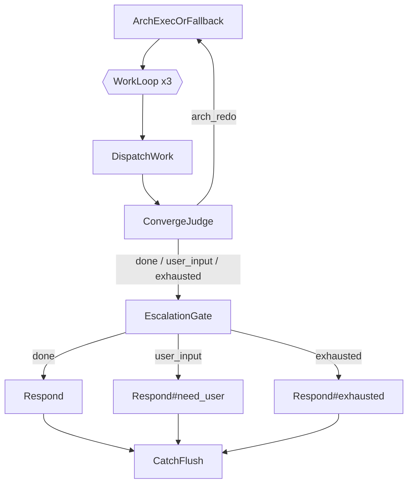

# PR-C — ConvergeJudge + WorkLoop + EscalationGate

**Scope:** Decision Point 2 (work-result convergence judgement and loop-back). Adds three new nodes — `ConvergeJudge`, `LoopSeq`, `EscalationGate` — and re-shapes the existing `ExecutionSeq` so the engine can re-enter the architect plan up to N times when a work agent escalates `needs_arch_decision`, and so it can surface `needs_user_input` / `exhausted` outcomes as distinct user-facing replies.
**Depends on:** PR-A (receipt trailer schema, `bb.work_results[task_id].status` is one of the four enums) — already landed. PR-B (FallbackPlan removal, `ArchExecOrFallback = [EngineDegraded, ArchitectExecution]`) — already landed.
**Out of scope:** Mode-classify regex tweaks (Decision Point 5), `DEFAULT_MODE` change (Decision Point 4), any change to the architect-execution subtree internals, any change to receipt schema.
**Status:** spec, ready for implementation.
**Owner:** architect (design) → programmer (implementation) → auditor (review).

---

## 1. Background and Positioning

After PR-A the engine has machine-readable `status` on every work result; after PR-B the architect-execution path no longer has a deterministic fallback, so a single LLM failure either short-circuits via `EngineDegraded` or bubbles `FAILURE` out the `ArchExecOrFallback` Selector.

What is still missing — and what PR-C delivers — is the **loop-back governance** between work agents and the architect:

- A work agent returning `needs_arch_decision` today bubbles FAILURE out of `DispatchWork`, which sinks `ExecutionSeq`. The escalation question is silently swallowed.
- A work agent returning `needs_user_input` is indistinguishable from a clean `ok`. The clarifying question goes into `bb.final_response` raw and the user has no signal the run is on hold.
- There is no bounded retry. Even if we wanted to feed the escalation back to the architect, there is no node that does so and no iteration cap to prevent an arch ↔ work ping-pong loop.

PR-C introduces a clean three-state convergence model centred on a new pure-code node `ConvergeJudge`, wrapped in a new generic decorator `LoopSeq(max_iters=3)`, terminated by a new switch node `EscalationGate`. The whole governance hangs off one named blackboard field `bb.convergence` whose enum is closed at four values.

The shape is identical to what the design memo proposed; this document pins it down to the level of detail a programmer can implement without any further architect input.

---

## 2. Topology

### 2.1 New `ExecutionSeq` shape

```
ExecutionSeq (Sequence)
  ArchExecOrFallback              -- unchanged (Selector [EngineDegraded, ArchitectExecution])
  WorkLoop (LoopSeq, max_iters=3)
    DispatchWork                  -- unchanged leaf semantics
    ConvergeJudge                 -- NEW pure-code node
  EscalationGate (SwitchBranch on bb.convergence)
    "done"       -> Respond                  -- existing Respond (renders bb.work_results)
    "user_input" -> Respond#need_user        -- NEW Respond variant
    "exhausted"  -> Respond#exhausted        -- NEW Respond variant
  CatchFlush(FlushMemory)         -- unchanged
```

Mermaid (for the next iteration of `WORKFLOW-EXECUTION.zh-CN.md`):



### 2.2 Why `LoopSeq` wraps only `(DispatchWork, ConvergeJudge)`, not `ArchExecOrFallback`

`arch_redo` re-runs the architect step too — but it does so by **failing the inner sequence and letting `LoopSeq` re-enter at the outer `ExecutionSeq` level via blackboard signalling**, not by including `ArchExecOrFallback` inside the loop body. Rationale:

1. `ArchExecOrFallback` already short-circuits on `bb.final_response` being set (see `engine_degraded.py:48-50`); putting it inside the loop would require teaching every architect leaf to invalidate prior outputs on iteration 2+. Wasteful.
2. The trace stays readable: each iteration of `WorkLoop` is exactly one work-fan-out + one judgement. `ArchExecOrFallback` runs once per iteration but at the outer level.
3. Iteration state lives on `bb.work_loop_iter` (see §5.2); `ArchExecOrFallback`'s LLM leaves remain idempotent because they read `bb.arch_redo_context` if present and produce a corrected plan.

Mechanically: when `ConvergeJudge` decides `arch_redo`, it writes `bb.arch_redo_context`, clears the offending `bb.work_results[task_id]` entries, and returns `FAILURE`. `LoopSeq` catches the FAILURE, bumps `bb.work_loop_iter`, and re-ticks its inner sequence. But the **outer `ExecutionSeq`** is what re-runs `ArchExecOrFallback` on the next pass — which means `LoopSeq` must surface a special re-entry signal that the outer Sequence honours. See §5.4 for the loop-back protocol.

> **Refinement:** Per the brief, the loop body is `(DispatchWork, ConvergeJudge)`. The cleanest implementation is for `LoopSeq` to **re-tick the architect step from inside the loop on `arch_redo`** by including `ArchExecOrFallback` as the first sub-node of the loop body. Programmer: pick the shape that produces the smaller diff — both are valid; see §5.5 for the chosen normative shape. **Spec-side normative choice: include `ArchExecOrFallback` as the first child of `LoopSeq`** so iteration semantics are entirely local to the loop. This makes the original `ExecutionSeq` collapse into `[WorkLoop, EscalationGate, CatchFlush]`.

### 2.3 Final normative topology

```
ExecutionSeq (Sequence)
  WorkLoop (LoopSeq, max_iters=3, body=Sequence)
    ArchExecOrFallback            -- existing Selector, idempotent re-tick on iter 2+
    DispatchWork
    ConvergeJudge
  EscalationGate (SwitchBranch on bb.convergence)
    "done"       -> Respond
    "user_input" -> Respond#need_user
    "exhausted"  -> Respond#exhausted
  CatchFlush(FlushMemory)
```

This is the only topology the programmer should implement. Tests assert this shape (see §10).

---

## 3. Blackboard schema additions

PR-C introduces **two transient scratch fields** on the blackboard. Neither is added to the canonical `FIELDS` tuple in `core/blackboard.py`; both ride on `bb.__dict__` per the existing convention (see `core/blackboard.py:78-85` and arch_exec's `arch_plan_draft` precedent).

| Field                  | Type                | Writer            | Reader(s)                           | Lifetime                        |
|------------------------|---------------------|-------------------|-------------------------------------|---------------------------------|
| `bb.convergence`       | `str` (closed enum) | `ConvergeJudge`   | `EscalationGate`, tests             | One tick; cleared on next tick. |
| `bb.arch_redo_context` | `dict` (see §3.2)   | `ConvergeJudge`   | `ArchExecOrFallback` (next pass), `Scan` / `StateCheck` / `Assemble` leaves | Cleared after a successful `ConvergeJudge="done"`. |
| `bb.work_loop_iter`    | `int`               | `LoopSeq`         | `LoopSeq` itself, tests             | Per `WorkLoop` invocation; reset to 0 on the iteration that first enters the loop. |

### 3.1 `bb.convergence` enum

Closed at four values:

| Value         | ConvergeJudge return | EscalationGate route          | Meaning                                                                    |
|---------------|----------------------|-------------------------------|----------------------------------------------------------------------------|
| `"done"`      | `SUCCESS` (exit loop)| `Respond`                     | All work results are terminal — either all `ok`, or a mix of `ok` + `failed`. The user gets the consolidated reply. |
| `"arch_redo"` | `FAILURE` (re-loop)  | (not reached)                 | At least one `needs_arch_decision` and we have iterations left. Architect re-runs with `arch_redo_context`. |
| `"user_input"`| `SUCCESS` (exit loop)| `Respond#need_user`           | At least one `needs_user_input` — short-circuits all other outcomes. Run pauses; user must reply. |
| `"exhausted"` | `SUCCESS` (exit loop)| `Respond#exhausted`           | `max_iters` hit and at least one `needs_arch_decision` still unresolved. User is told the architect could not converge. |

Any other value is a programming error → `EscalationGate` falls back to `Respond` and writes a `bb.trace` entry of kind `converge_unknown_value`.

### 3.2 `bb.arch_redo_context` shape

```python
{
    "iter": int,                             # which loop iteration produced this redo (1-based)
    "unresolved": [                          # list of task escalations the architect must address
        {
            "task_id": str,                  # e.g. "t1"
            "blocking_module": str | None,   # from the receipt trailer
            "question": str,                 # verbatim from the receipt trailer
            "agent": str,                    # which work agent escalated
            "summary": str,                  # one-line context from the trailer
        },
        ...
    ],
    "previous_plan": list[dict],             # bb.arch_plan from the failed pass, deep-copied
}
```

`ArchExecOrFallback` reads this field on iter ≥ 2 and threads it into the prompt of the `Scan` / `StateCheck` / `Assemble` leaves so the LLM understands "the previous plan produced these escalations; please correct". The exact prompt change is **out of scope for PR-C** and will be a small PR-D follow-up; for PR-C the field is **set** correctly and **logged** to `bb.trace`, but the architect-execution leaves are not yet modified to consume it. Tests for PR-C only assert the field is written; they do not assert the next architect run respects it.

> **Programmer note.** Set the field, log it, and run an existing architect pass on iter 2 — the second pass will produce a similar plan because the leaves ignore `arch_redo_context`. That is acceptable for PR-C; the loop-back machinery is what we are validating here, not the architect's intelligence. PR-D wires the field into the LLM prompts.

### 3.3 `bb.work_results` purging on `arch_redo`

When `ConvergeJudge` returns `arch_redo`, it MUST delete from `bb.work_results` exactly the entries whose `status == "needs_arch_decision"`. Entries with `status` `ok` / `failed` / `needs_user_input` are kept (the latter cannot occur on the `arch_redo` path — see §4.3 priority rules). This guarantees the next iteration's `DispatchWork` re-dispatches exactly the unresolved tasks and the `ok` work is not redone.

Rationale: `DispatchWork.tick` reads `bb.work_results` first (`dispatch_work.py:30-34`); a present `status="ok"` short-circuits the leaf to SUCCESS. Purging only the escalated entries gives us per-task replay without redoing successful work.

---

## 4. `ConvergeJudge` — node spec

### 4.1 Location and class

```
v1/kernel/engine/execution/actions/converge_judge.py
```

Co-located with `dispatch_work.py` and `respond.py`. Class `ConvergeJudge(Node)`. No constructor args.

### 4.2 Public surface

```python
# v1/kernel/engine/execution/actions/converge_judge.py

from engine.core.node import Node, Status


class ConvergeJudge(Node):
    """Aggregate bb.work_results and set bb.convergence.

    Pure code; no LLM, no filesystem, no network. Always one of the four
    enum values in bb.convergence after tick() returns.

    Return contract:
      - SUCCESS  -- exit the LoopSeq (convergence in {"done", "user_input",
                    "exhausted"})
      - FAILURE  -- re-loop (convergence == "arch_redo"); LoopSeq is
                    expected to catch this and bump bb.work_loop_iter
    """

    def __init__(self, *, max_iters: int = 3, name: str = "ConvergeJudge") -> None:
        self.name = name
        self._max_iters = max_iters

    def tick(self, bb) -> Status:
        ...  # see §4.3
```

Note: `_max_iters` is duplicated between `ConvergeJudge` and `LoopSeq` because the judge needs it to detect "exhausted at last iteration" before the LoopSeq itself decides whether to re-enter. Single source of truth: a small module-level constant `DEFAULT_MAX_ITERS = 3`; both nodes default to it; the test-suite shape uses the same constant.

### 4.3 Aggregation algorithm (normative)

Given `results = bb.work_results or {}` and `iter = bb.work_loop_iter or 1` (1-based; 1 on first pass):

```python
statuses = {r.get("status") for r in results.values()}

needs_user      = any(r.get("status") == "needs_user_input"     for r in results.values())
needs_arch      = any(r.get("status") == "needs_arch_decision"  for r in results.values())
has_failed      = any(r.get("status") == "failed"               for r in results.values())
all_ok          = bool(results) and all(r.get("status") == "ok" for r in results.values())

# Priority order, top wins.
if needs_user:
    bb.convergence = "user_input"
    return Status.SUCCESS

if needs_arch:
    if iter < self._max_iters:
        bb.convergence = "arch_redo"
        _stash_redo_context(bb)         # see §4.4
        _purge_arch_decision_entries(bb)  # see §4.5
        return Status.FAILURE
    bb.convergence = "exhausted"
    _stash_redo_context(bb)             # still write so the exhausted reply can quote
    return Status.SUCCESS

# At this point: no needs_*; the run is terminal.
bb.convergence = "done"
return Status.SUCCESS
```

Edge cases:

| Situation                                       | Decision    | Rationale |
|-------------------------------------------------|-------------|-----------|
| `bb.work_results` is empty                      | `"done"`    | DispatchWork produced no leaves (empty `arch_plan`). Treat as vacuously successful; Respond writes "(empty response)". |
| All `failed`, no `needs_*`                       | `"done"`    | Per spec — the body of Respond will surface the failure summaries; we do not loop on `failed` (the failure was not architect-fixable, the work agent already classified it as unrecoverable). |
| Mix of `ok` + `failed`, no `needs_*`             | `"done"`    | Same as above. |
| `needs_user_input` + `needs_arch_decision`       | `"user_input"` | `needs_user_input` always wins — we cannot loop the architect while the user is being asked a question. |
| `needs_arch_decision` only, iter == max_iters    | `"exhausted"` | Surface the unresolved escalations to the user verbatim. |
| Malformed entry missing `status` field           | Treat as `failed` for aggregation purposes; the receipt parser already collapses malformed trailers into `status="failed"` (PR-A §3.2), so this is defensive only. |

### 4.4 `_stash_redo_context(bb)` (internal helper)

```python
def _stash_redo_context(bb) -> None:
    unresolved = []
    for tid, r in (bb.work_results or {}).items():
        if r.get("status") != "needs_arch_decision":
            continue
        unresolved.append({
            "task_id": tid,
            "blocking_module": r.get("blocking_module"),
            "question": r.get("question") or "",
            "agent": r.get("agent") or "unknown",
            "summary": r.get("summary") or "",
        })
    bb.arch_redo_context = {
        "iter": int(getattr(bb, "work_loop_iter", 1) or 1),
        "unresolved": unresolved,
        "previous_plan": list(bb.arch_plan or []),
    }
    # Trace entry — visible in trace.jsonl post-mortem.
    _append_trace(bb, {
        "event": "arch_redo_stashed",
        "iter": bb.arch_redo_context["iter"],
        "unresolved_count": len(unresolved),
    })
```

### 4.5 `_purge_arch_decision_entries(bb)` (internal helper)

```python
def _purge_arch_decision_entries(bb) -> None:
    results = dict(bb.work_results or {})
    purged = [
        tid for tid, r in results.items()
        if r.get("status") == "needs_arch_decision"
    ]
    for tid in purged:
        del results[tid]
    bb.work_results = results
    _append_trace(bb, {
        "event": "work_results_purged",
        "task_ids": purged,
    })
```

### 4.6 What `ConvergeJudge` MUST NOT do

- MUST NOT raise. Any internal exception caught → `bb.convergence = "done"`, FAILURE return suppressed to SUCCESS (defensive — we never want the judge itself to break the loop). Add a `bb.trace` entry of kind `converge_internal_error` with the exception class name.
- MUST NOT touch the LLM, filesystem, or network.
- MUST NOT mutate `bb.arch_plan` (only `LoopSeq` / `ArchExecOrFallback` re-rebuild it on the next iteration).
- MUST NOT touch `bb.final_response` — that is `Respond`'s job, dispatched by `EscalationGate`.

---

## 5. `LoopSeq` — composite spec

### 5.1 Location and class

```
v1/kernel/engine/core/composite.py
```

Lives next to `Sequence` / `Selector` / `Parallel` / `SwitchBranch`. Class `LoopSeq(_Composite)`. Generic — reusable for any future bounded retry pattern, not specific to WorkLoop.

### 5.2 Iteration state — where it lives

Composites are stateless across ticks per `core/composite.py:1-11` and `core/node.py:31-35` (the iron rule). `LoopSeq` MUST NOT store `self.iter` or any counter on the instance. Iteration state lives on the blackboard in a scratch field named **after the composite name** so multiple `LoopSeq` instances do not collide:

```python
iter_field = f"_loopseq_{self.name}_iter"
```

For the `WorkLoop` instance the field name is `_loopseq_WorkLoop_iter`. PR-C additionally aliases this to `bb.work_loop_iter` for ergonomic reading by `ConvergeJudge` and tests — `ConvergeJudge` reads the alias, `LoopSeq` is the sole writer.

```python
class LoopSeq(_Composite):
    """Bounded re-entry Sequence.

    Ticks children left-to-right like Sequence. SUCCESS at the end of the
    children list exits the loop with SUCCESS. FAILURE from any child
    bumps the iteration counter and re-enters from the first child, up to
    max_iters total iterations; the max_iters-th FAILURE bubbles out as
    SUCCESS-of-loop-body if the last child already wrote a terminal
    bb-state (see §5.4 contract), otherwise FAILURE.

    Iteration state lives on bb under `_loopseq_{name}_iter` (1-based)
    plus the public alias `bb.work_loop_iter` when name == "WorkLoop".
    """

    def __init__(
        self,
        children: list[Node],
        *,
        max_iters: int = 3,
        name: str = "LoopSeq",
    ) -> None:
        super().__init__(children, name=name)
        self._max_iters = max_iters
```

### 5.3 Tick algorithm (normative)

```python
def tick(self, bb) -> Status:
    iter_field = f"_loopseq_{self.name}_iter"
    cur = int(getattr(bb, iter_field, 0) or 0)
    # First entry of the loop in this run -> initialise to 1.
    if cur == 0:
        cur = 1
        setattr(bb, iter_field, cur)
        if self.name == "WorkLoop":
            bb.work_loop_iter = cur

    while True:
        # Resume-path support: if runner_resume_path runs through this
        # composite, skip children that already completed in a prior tick.
        # See §5.6 for the resume contract.
        start_idx = _resume_index(self, bb)
        inner_status = Status.SUCCESS
        for i in range(start_idx, len(self._children)):
            child = self._children[i]
            status = _tick_child(self, child, i, bb)
            if status is Status.FAILURE:
                inner_status = Status.FAILURE
                break
            if status is Status.RUNNING:
                # Yielded — Runner takes over; we resume next tick.
                return Status.RUNNING
            # SUCCESS -- continue to next child

        if inner_status is Status.SUCCESS:
            # Body completed cleanly — exit loop.
            _clear_iter(bb, iter_field, self.name)
            return Status.SUCCESS

        # inner_status is FAILURE — decide whether to re-enter.
        if cur >= self._max_iters:
            # Out of retries. ConvergeJudge will have set bb.convergence to
            # "exhausted" before failing; the outer ExecutionSeq must NOT
            # propagate FAILURE because EscalationGate needs to render the
            # exhausted reply. So we return SUCCESS, trusting bb.convergence
            # to carry the signal.
            _clear_iter(bb, iter_field, self.name)
            return Status.SUCCESS

        # Re-enter: bump iter, clear resume path so we restart from the
        # first child on this tick.
        cur += 1
        setattr(bb, iter_field, cur)
        if self.name == "WorkLoop":
            bb.work_loop_iter = cur
        _clear_resume_into(self, bb)
        # Trace the iteration boundary.
        _append_trace(bb, {
            "event": "loopseq_reenter",
            "node": self.name,
            "iter": cur,
            "max_iters": self._max_iters,
        })
        # Continue the while True; next iteration starts at child 0.
```

Helper `_clear_iter(bb, iter_field, name)` resets both the canonical scratch field and the public alias to `None` so the next outer-loop entry starts fresh.

Helper `_clear_resume_into(self, bb)` removes any path segments starting at `self.name` from `bb.runner_resume_path` so the inner Sequence walk starts from index 0 on the next iteration. Implementation note: the simplest safe form is

```python
def _clear_resume_into(self, bb) -> None:
    path = bb.runner_resume_path or []
    try:
        idx = path.index(self.name)
        bb.runner_resume_path = path[:idx]
    except ValueError:
        return
```

### 5.4 Return-status contract (key constraint)

The most subtle part of PR-C. The outer `ExecutionSeq` is a `Sequence` — any FAILURE from `WorkLoop` would short-circuit and skip `EscalationGate` / `CatchFlush`. We MUST NOT let that happen for the `"user_input"` / `"exhausted"` / `"done"` paths because they all need `EscalationGate` to fire.

Therefore `LoopSeq` returns:

| ConvergeJudge result   | LoopSeq return | Why                                                          |
|------------------------|----------------|--------------------------------------------------------------|
| `SUCCESS` (any reason) | `SUCCESS`      | Body completed; advance to EscalationGate normally.          |
| `FAILURE`, iter < max  | (re-loop, no return) | Re-enter inner sequence; do not return.                      |
| `FAILURE`, iter == max | `SUCCESS`      | "exhausted" path; bb.convergence carries the signal.         |
| RUNNING from any child | `RUNNING`      | Yielded mid-iteration; Runner takes over.                    |

The only path where `LoopSeq` ever returns `FAILURE` is if a child OTHER than `ConvergeJudge` fails on a path the design did not anticipate (e.g. `DispatchWork` itself returns FAILURE for a non-status reason). In that case the outer Sequence rightly short-circuits — but `EscalationGate` is skipped and `Respond` is never reached, so we wrap the outer with appropriate Catch in §6 if needed. **First implementation: do not add a Catch. Let unanticipated failures surface as engine errors. We will add a safety net only if tests show it is needed.**

### 5.5 Why this differs from `Retry`

`Retry` (`core/decorator.py:106-140`) is single-child, no resume-path management beyond what the inner provides, and returns `FAILURE` after exhausting attempts. `LoopSeq` is multi-child (an inline Sequence), manages a named iteration counter on bb, clears the resume path on re-entry, and (critically) returns `SUCCESS` on exhaustion because the convergence signal lives on `bb.convergence`. Different semantics, different node. Do not unify.

### 5.6 Resume-path interaction

When the inner `DispatchWork` yields (RUNNING) waiting for a Task tool result, the Runner records a resume path like:

```
["Root", "GlobalTimeout", "RootSeq", "ModeSwitch", "ExecutionSeq",
 "WorkLoop", "DispatchWork", "WorkAgentLeaf#t1"]
```

On resume, the bt resume walk descends into `WorkLoop`. `LoopSeq.tick` must:

1. Read `bb.work_loop_iter` (or the canonical scratch field). If present, do NOT reinitialise to 1.
2. Call `_resume_index(self, bb)` (the existing helper in `core/composite.py:348-373`). It already understands path-name matching and works for `LoopSeq` unchanged because `LoopSeq` is a `_Composite` subclass.
3. The for-loop starts at the resumed child index; the just-resumed `DispatchWork` completes; `ConvergeJudge` runs next.

The existing `_prime_bb_dependent_composites` (`core/runner.py:385-404`) is what re-builds `DispatchWork`'s `WorkAgentLeaf` children from `bb.arch_plan` on every tick; `LoopSeq` does NOT need its own bb hook because its children are static (the inline Sequence is constructed at build time).

### 5.7 What `LoopSeq` MUST NOT do

- MUST NOT store iteration state on `self`.
- MUST NOT inspect `bb.convergence` directly. The judge owns that field; the loop only sees child return statuses.
- MUST NOT re-enter when `max_iters` has been reached (no off-by-one — `iter == max_iters` is the LAST allowed pass, not the boundary for re-entry).
- MUST NOT clobber `bb.runner_resume_path` when returning RUNNING (the Runner is the sole writer of that field on yield paths).

---

## 6. `EscalationGate` — switch spec

### 6.1 Construction

`EscalationGate` is not a new class. It is a `SwitchBranch` instance constructed with `key_fn = lambda bb: getattr(bb, "convergence", "done") or "done"` and three cases. Reuse the existing `SwitchBranch` (`core/composite.py:135-215`) — it already handles unknown keys via default.

```python
# in tree/main_loop.py

from engine.core.composite import SwitchBranch

def _converge_key(bb) -> str:
    val = getattr(bb, "convergence", None)
    if val in ("done", "user_input", "exhausted", "arch_redo"):
        # arch_redo should not reach EscalationGate (LoopSeq re-enters),
        # but be defensive: treat it as done so we render whatever we have.
        return val if val != "arch_redo" else "done"
    return "done"

escalation_gate = SwitchBranch(
    key_fn=_converge_key,
    cases={
        "done":       respond,
        "user_input": respond_need_user,
        "exhausted":  respond_exhausted,
    },
    default=respond,                          # belt-and-braces
    name="EscalationGate",
)
```

`SwitchBranch` already emits a `switch_decision` trace entry per tick (`core/composite.py:166-215`) — visible in `trace.jsonl` so we can see which branch each tick took.

### 6.2 Why no separate node class

A switch on a bb enum is exactly what `SwitchBranch` was designed for (already used as `ModeSwitch` in the same file). A wrapper class would only rename it without adding behaviour. C4 (interface segregation): the consumer of `EscalationGate` is `ExecutionSeq`, which only needs "tick a child based on bb.convergence" — `SwitchBranch` satisfies it exactly.

---

## 7. `Respond` variants

### 7.1 Existing `Respond` (unchanged)

`v1/kernel/engine/execution/actions/respond.py` — already does the "consolidate `bb.work_results` into `bb.final_response`" job. No changes for PR-C.

### 7.2 New `Respond#need_user`

Reuses the same `Respond` class with a different name attribute. The class needs a small extension to support a mode parameter:

```python
# v1/kernel/engine/execution/actions/respond.py

class Respond(Node):
    def __init__(
        self,
        *,
        name: str = "Respond",
        mode: str = "default",   # NEW: "default" | "need_user" | "exhausted"
    ) -> None:
        self.name = name
        self._mode = mode

    def tick(self, bb) -> Status:
        if bb.interrupt_reason:
            return Status.SUCCESS
        if bb.final_response:
            return Status.SUCCESS

        if self._mode == "need_user":
            bb.final_response = self._render_need_user(bb)
            return Status.SUCCESS
        if self._mode == "exhausted":
            bb.final_response = self._render_exhausted(bb)
            return Status.SUCCESS
        # default — existing aggregation path, unchanged
        ...
```

#### `_render_need_user(bb)` — required format

Pulls the `question` from every entry with `status == "needs_user_input"`. There may be more than one; concatenate with separators.

```
我需要你的确认才能继续：

【任务 t1 - programmer】
{summary}

问题：{question}

【任务 t3 - tester】
{summary}

问题：{question}

请回复你的答案，我会把它传回相应的 agent 继续执行。
```

Notes:
- Header line is fixed Chinese (matches the existing `engine_degraded.py` style).
- If `summary` is empty, omit the summary line entirely.
- If there are no `needs_user_input` entries (defensive — should be unreachable because `EscalationGate` only routes here when `bb.convergence == "user_input"`), fall through to the default aggregation.

#### `_render_exhausted(bb)` — required format

Pulls the `unresolved` list from `bb.arch_redo_context` (always populated when convergence is `exhausted`, per §4.3).

```
我尝试了 {max_iters} 轮架构师 ↔ 工作 agent 协同，仍未收敛。剩余未解决的问题：

【任务 t1 - {agent}】
{summary}

阻塞模块：{blocking_module or "未指定"}
架构问题：{question}

【任务 t2 - {agent}】
...

请你介入决定下一步：
  (a) 给架构师补充关键信息后重试
  (b) 直接由你回答上述问题
  (c) 放弃本次任务
```

Notes:
- `{max_iters}` reads from a module-level constant (the same `DEFAULT_MAX_ITERS = 3` used by `ConvergeJudge` and `LoopSeq`).
- The three-option footer is fixed text — purely informational; the engine does nothing automatic with the user's reply, the user reply enters the next `bt_tick` as a fresh user_request.

### 7.3 Construction in `main_loop.py`

```python
respond              = Respond(name="Respond")                    # mode="default" implicit
respond_need_user    = Respond(name="Respond#need_user",    mode="need_user")
respond_exhausted    = Respond(name="Respond#exhausted",    mode="exhausted")
```

---

## 8. `tree/main_loop.py` — diff summary

The execution branch construction (currently `main_loop.py:117-140`) collapses to:

```python
# Execution branch — Architect → Work pipeline with bounded loop-back.
from ..actions.converge_judge import ConvergeJudge, DEFAULT_MAX_ITERS
from engine.core.composite import LoopSeq, Sequence, SwitchBranch

arch_exec = build_architect_execution_subtree(llm)
arch_exec_with_fallback = Selector(
    [EngineDegraded(llm=llm, name="EngineDegraded"), arch_exec],
    name="ArchExecOrFallback",
)
dispatch_work    = DispatchWork(name="DispatchWork")
converge_judge   = ConvergeJudge(max_iters=DEFAULT_MAX_ITERS, name="ConvergeJudge")

work_loop = LoopSeq(
    [arch_exec_with_fallback, dispatch_work, converge_judge],
    max_iters=DEFAULT_MAX_ITERS,
    name="WorkLoop",
)

respond           = Respond(name="Respond")
respond_need_user = Respond(name="Respond#need_user", mode="need_user")
respond_exhausted = Respond(name="Respond#exhausted", mode="exhausted")

escalation_gate = SwitchBranch(
    key_fn=_converge_key,
    cases={
        "done":       respond,
        "user_input": respond_need_user,
        "exhausted":  respond_exhausted,
    },
    default=respond,
    name="EscalationGate",
)

flush = Catch(FlushMemory(name="FlushMemory"),
              fallback="swallow", name="CatchFlush")

execution_seq = Sequence(
    [work_loop, escalation_gate, flush],
    name="ExecutionSeq",
)
```

Removed lines: the old `work = DispatchWork(...)`, `respond = Respond(...)`, the inline construction of `execution_seq` from those four nodes. The Selector + EngineDegraded + arch_exec build is unchanged (lifted into LoopSeq's children list).

`_converge_key` definition (file-level helper next to the existing `_mode_key`):

```python
def _converge_key(bb) -> str:
    val = getattr(bb, "convergence", None) or "done"
    return val if val in ("done", "user_input", "exhausted") else "done"
```

Imports added at top:

```python
from ..actions.converge_judge import ConvergeJudge, DEFAULT_MAX_ITERS
from engine.core.composite import LoopSeq  # add to the existing import line
```

`build_root` signature, `_default_llm`, all five mode branches except `execution`, and the `Trace > Timeout > RootSeq` outer shape are all unchanged.

---

## 9. Runner / blackboard / persistence — no changes required

Confirmed by walking the code paths:

- `runner.py` walks the tree via `node.children()`; `LoopSeq` returns its children list normally so resume-path construction and instrumentation work without changes.
- `core/blackboard.py` `__dict__` already accepts arbitrary attributes (`__slots__` includes `"__dict__"`, see `blackboard.py:78-85`); `bb.convergence`, `bb.arch_redo_context`, `bb.work_loop_iter` ride on `__dict__` without changing `FIELDS`.
- `persistence/snapshot.py` serialises only `FIELDS` (see `to_dict`, `blackboard.py:116-130`). The PR-C scratch fields are NOT persisted across ticks. **This is fine** because:
  - `bb.convergence` and `bb.arch_redo_context` are set inside `ConvergeJudge` and consumed by `EscalationGate` / `Respond` in the SAME tick — they do not need to survive a yield.
  - `bb.work_loop_iter` is the only one that crosses a yield (when `DispatchWork` yields mid-iteration). Loss of this counter across yields would silently reset iterations. **Required:** add `_loopseq_WorkLoop_iter` and `work_loop_iter` to the explicit persistence list in `to_dict` OR persist `bb.__dict__` scratch fields wholesale. **Programmer decision:** the cleanest fix is to add a small `extras` dict to the persisted snapshot:

```python
# core/blackboard.py to_dict() — add at the bottom of the existing fields dict
extras = {
    k: v for k, v in self.__dict__.items()
    if k.startswith("_loopseq_") or k in ("work_loop_iter", "convergence",
                                          "arch_redo_context", "arch_plan_draft",
                                          "arch_scan_summary", "arch_state",
                                          "hr_agent_inventory", "hr_current_task",
                                          "hr_current_match", "hr_assignments_draft")
}
if extras:
    fields["_extras"] = extras
```

and the matching restoration in `from_dict`:

```python
extras = fields.pop("_extras", None) or {}
for k, v in extras.items():
    bb.__dict__[k] = v
```

This is a small, contained additive change. Bump `SCHEMA_VERSION` from 3 to 4 only if the audit catches it; the additive shape should be backward-readable (old snapshots have no `_extras` key, restoration no-ops). **Recommendation: do NOT bump `SCHEMA_VERSION`; the change is additive.**

> **Audit-side risk.** Some snapshot consumers may not tolerate an unknown key inside `fields`. Programmer: grep for `fields[` reads outside `core/blackboard.py` before shipping. If any consumer rejects unknown keys, hoist `extras` to a sibling of `fields` in the top-level snapshot dict, not inside it.

---

## 10. Acceptance criteria

### 10.1 Static checks (grep-able)

1. `ConvergeJudge` class exists in exactly one place:
   ```
   rg -n "class ConvergeJudge" v1/
   ```
   Expect: 1 hit in `v1/kernel/engine/execution/actions/converge_judge.py`.

2. `LoopSeq` class exists in exactly one place:
   ```
   rg -n "class LoopSeq" v1/
   ```
   Expect: 1 hit in `v1/kernel/engine/core/composite.py`.

3. The old four-node `ExecutionSeq` shape is gone:
   ```
   rg -n "Sequence\(\s*\[arch_exec_with_fallback, work, respond, flush\]" v1/
   ```
   Expect: 0 hits.

4. `WorkLoop` and `EscalationGate` are wired in `main_loop.py`:
   ```
   rg -n 'name="WorkLoop"' v1/kernel/engine/execution/tree/main_loop.py
   rg -n 'name="EscalationGate"' v1/kernel/engine/execution/tree/main_loop.py
   ```
   Expect: 1 hit each.

5. The convergence enum is referenced consistently:
   ```
   rg -n 'bb\.convergence' v1/kernel/engine/
   ```
   Expect: writes only in `converge_judge.py`; reads only in `main_loop.py` (`_converge_key`) and `respond.py` (defensive only — Respond does not depend on it).

### 10.2 Unit tests required

New file `tests/engine/execution/actions/test_converge_judge.py`:

| # | Case                                                                                        | Assertion                                                                                       |
|---|---------------------------------------------------------------------------------------------|-------------------------------------------------------------------------------------------------|
| 1 | All results `status=ok`                                                                     | `bb.convergence == "done"`, tick returns SUCCESS.                                                |
| 2 | Mix of `ok` + `failed`                                                                      | `bb.convergence == "done"`, tick returns SUCCESS (no loop, failure surfaces in Respond).         |
| 3 | One `needs_arch_decision`, iter=1, max=3                                                    | `bb.convergence == "arch_redo"`, tick returns FAILURE, `bb.arch_redo_context` populated.         |
| 4 | One `needs_arch_decision`, iter=3, max=3                                                    | `bb.convergence == "exhausted"`, tick returns SUCCESS.                                           |
| 5 | One `needs_user_input` + one `needs_arch_decision`                                          | `bb.convergence == "user_input"` (priority), tick returns SUCCESS, NO redo context populated.    |
| 6 | Empty `bb.work_results`                                                                     | `bb.convergence == "done"`, tick returns SUCCESS.                                                |
| 7 | `arch_redo` path: `bb.work_results` purges exactly the `needs_arch_decision` entries        | After tick, no `needs_arch_decision` entries remain; other statuses preserved unchanged.         |
| 8 | `arch_redo_context.unresolved` carries `task_id`, `blocking_module`, `question`, `agent`     | Field-level equality check on a hand-crafted input.                                              |
| 9 | Trace entry `arch_redo_stashed` appears with `iter` and `unresolved_count`                  | `bb.trace[-2:]` includes the entry (and the `work_results_purged` entry).                        |
| 10| Defensive: malformed entry without `status` field treated as `failed`                       | Aggregation produces `"done"` (no loop).                                                         |

New file `tests/engine/core/test_loop_seq.py`:

| #  | Case                                                                                          | Assertion                                                                                  |
|----|-----------------------------------------------------------------------------------------------|--------------------------------------------------------------------------------------------|
| 11 | All children SUCCESS on first pass                                                            | LoopSeq returns SUCCESS, `bb.work_loop_iter` cleared (None), no re-entry trace.            |
| 12 | Last child FAILURE on iter 1, SUCCESS on iter 2                                               | LoopSeq returns SUCCESS, iter counter cleared, exactly one `loopseq_reenter` trace entry. |
| 13 | Last child FAILURE on every iter, max_iters=3                                                 | LoopSeq returns SUCCESS (exhausted convention), exactly two `loopseq_reenter` entries.    |
| 14 | First child RUNNING (yield) on iter 1                                                         | LoopSeq returns RUNNING, `bb.work_loop_iter == 1` preserved for next resume.              |
| 15 | Resume path through LoopSeq advances to the correct child                                     | After resume, the child at the path tail completes; subsequent children tick in order.    |
| 16 | Multiple LoopSeq instances (different `name`) do not share iter state                          | Two instances, both at iter 1 simultaneously; counters independent.                        |
| 17 | A non-Convergeudge child FAILURE on the final iter                                            | LoopSeq returns SUCCESS (current spec — outer Sequence carries on, EscalationGate fires). |

New file `tests/engine/execution/tree/test_main_loop_workloop.py` (integration shape test, no LLM):

| #  | Case                                                                                             | Assertion                                                                                       |
|----|--------------------------------------------------------------------------------------------------|-------------------------------------------------------------------------------------------------|
| 18 | Topology contains WorkLoop with three children in order                                          | `find_node_by_path(ROOT, ["Root","GlobalTimeout","RootSeq","ModeSwitch","ExecutionSeq","WorkLoop"]).children()` returns `[ArchExecOrFallback, DispatchWork, ConvergeJudge]`. |
| 19 | EscalationGate has exactly three cases plus default                                              | Cases keys equal `{"done","user_input","exhausted"}`; default is the same Respond instance.    |
| 20 | NullLLM build of the tree: a single bt_tick with a hand-injected `arch_plan` + all-ok results    | Final response is the consolidated `Respond` output; `bb.convergence == "done"`.               |
| 21 | NullLLM build with hand-injected `arch_plan` + one `needs_user_input` result                     | Final response begins with `我需要你的确认才能继续`; `bb.convergence == "user_input"`.         |
| 22 | NullLLM build with one `needs_arch_decision`, iter forced to max_iters via blackboard pre-seed   | Final response begins with `我尝试了 3 轮架构师`; `bb.convergence == "exhausted"`.             |

### 10.3 Persistence tests

New file `tests/engine/core/test_blackboard_extras.py`:

| #  | Case                                                                                                | Assertion                                                                                  |
|----|-----------------------------------------------------------------------------------------------------|--------------------------------------------------------------------------------------------|
| 23 | Round-trip a blackboard with `work_loop_iter=2`, `arch_redo_context={...}` through to_dict/from_dict | Both fields restored unchanged on the new instance.                                       |
| 24 | from_dict on an old snapshot lacking `_extras`                                                       | No exception, no extras restored, schema_version unchanged.                                |
| 25 | A snapshot consumer (e.g. `audit/checks/*` or persistence/snapshot.py) reads `fields` and ignores the unknown `_extras` key | No regression — all existing snapshot-consuming tests still pass.                          |

### 10.4 Non-regression

- All existing tests under `tests/engine/` and `tests/hooks/` pass unchanged.
- `bb.work_results` schema is **not** modified.
- `Blackboard.FIELDS` tuple is **not** modified.
- `SCHEMA_VERSION` is **not** bumped (additive `_extras` is backward-readable).
- `arch_exec` subtree internals are **not** modified (PR-D will wire `arch_redo_context` into prompts).

---

## 11. Implementation order (suggested)

1. **`core/composite.py` — add `LoopSeq`** + `tests/engine/core/test_loop_seq.py`. Pure structural; no engine integration. Land first; review independently.
2. **`actions/converge_judge.py`** + `tests/engine/execution/actions/test_converge_judge.py`. Pure aggregation; depends only on `bb.work_results` shape (PR-A landed).
3. **`actions/respond.py` — add `mode` parameter and the two renderers** + small additions to existing `test_respond.py` covering modes `need_user` and `exhausted`.
4. **`core/blackboard.py` — add `_extras` round-trip** + `tests/engine/core/test_blackboard_extras.py`. Verify all snapshot consumers tolerate the additive key.
5. **`tree/main_loop.py` — rewire ExecutionSeq** + `tests/engine/execution/tree/test_main_loop_workloop.py`. End-to-end shape and three-path smoke tests.
6. Run the §10.1 grep checks. Fix any drift.
7. Manual smoke: a hand-driven bt_tick with a hand-crafted `arch_plan` and three artificial work agent receipts (one per non-`done` status) confirms all three Respond paths fire and the trace contains the expected `loopseq_reenter` / `switch_decision` / `arch_redo_stashed` entries.

---

## 12. Open questions (escalate to architect before coding if hit)

None expected. The design is fully specified above. The three areas where the programmer has limited discretion are explicitly called out:

- **§3.2** — whether `ArchExecOrFallback` actually consumes `arch_redo_context` on iter ≥ 2. **Decision:** no, that is PR-D.
- **§5.4** — what `LoopSeq` returns when a non-judge child fails on the final iteration. **Decision:** SUCCESS, no Catch wrapper, trust outer Sequence + EscalationGate default.
- **§9** — whether to bump `SCHEMA_VERSION` for the `_extras` snapshot field. **Decision:** no, additive only.

If any of the three turn out wrong in testing, escalate via `NEEDS_ARCH_DECISION` in the receipt trailer with `blocking_module: v1/kernel/engine`.

End of PR-C spec.
