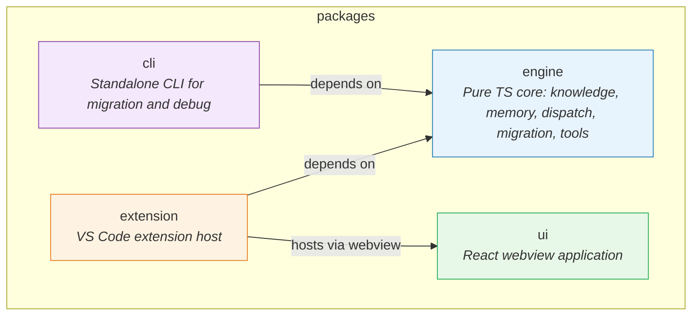

## Positioning

The v2 system as a whole: a multi-agent, knowledge-driven collaboration platform delivered as a VS Code extension, with a portable engine core that is IDE-agnostic.

## Sub-module Relationship Diagram

**Dependency direction:** Both `extension` and `cli` depend on `engine`. `ui` is loaded by `extension` at runtime via webview panel, not as a compile-time dependency. `engine` depends on no sibling package -- it is the stable foundation.

## Key Decisions

- **Why monorepo with 4 packages, not a single extension?** The engine must remain IDE-agnostic -- future consumers include CLI, potential web interfaces, and other IDE plugins. Separating `engine` from `extension` enforces this boundary at the package level, not just by convention. `ui` is a separate package because it has fundamentally different build tooling (Vite + React) and runtime environment (browser sandbox inside webview). `cli` is separate because it ships as an independent executable with no VS Code dependency.

- **Why engine is the gravity center?** All domain logic (knowledge CRUD, memory distillation, agent dispatch, SDK tool definitions) lives in `engine`. The other three packages are presentation/integration shells: `extension` adapts engine to VS Code API, `ui` provides the visual layer, `cli` provides terminal access. This ensures a single source of truth for business rules.

- **Why tools/ lives inside engine, not inside extension?** The `cbim_*` custom tools are thin SDK adapters wrapping engine functions. Keeping them in engine means both extension (via SDK) and cli (direct function calls) share the same tool definitions and validation schemas. The extension only wires `canUseTool` path guard and registers tools with the SDK runtime.

- **Why ui has no compile-time dependency on engine?** The webview runs in an isolated browser context. All communication with the extension host (and transitively with engine) goes through `postMessage`. This is an architectural firewall, not a convenience choice -- the webview cannot import Node.js modules.
