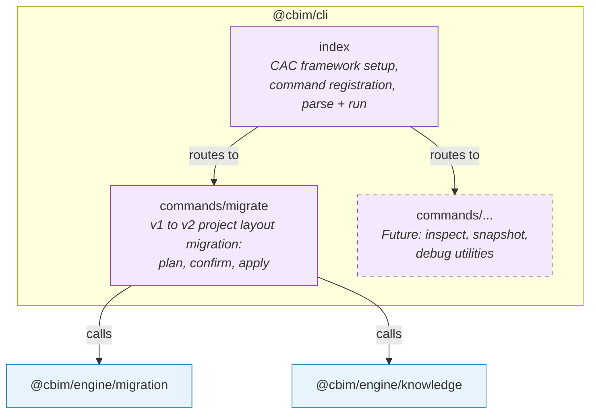

## Positioning

An independent command-line tool that provides v1-to-v2 project migration and engine debugging/inspection utilities. Consumes `@cbim/engine` directly as a TypeScript library, bypassing the SDK tool layer entirely. Ships as a standalone executable via `npx @cbim/cli`.

## Component Diagram

**Dependency direction:** CLI commands are thin orchestration shells that call engine sub-module APIs. All domain logic lives in engine.

## Key Decisions

- **Why CLI is not subject to `canUseTool` guard?** The `canUseTool` path guard constrains LLM agents operating through the SDK runtime, preventing them from using generic file tools on `.cbim/` and `.dna/` paths. CLI is a human-operated tool, not an LLM agent -- it calls engine functions directly as a TypeScript library. There is no SDK runtime, no tool interception, and no need for one. This exception is explicitly documented in v2-plan Section 7.7.

- **Why CAC framework?** CAC is a minimal, zero-dependency CLI framework (~3KB) that provides command parsing, help generation, and option handling. It avoids the weight of commander/yargs while covering all needs of a focused tool. This is a proportional choice -- CBIM CLI is not a general-purpose CLI platform.

- **Why a separate package instead of a script inside engine?** CLI has its own entry point (`#!/usr/bin/env node`), its own binary name (`cbim`), and its own npm distribution channel (`npx @cbim/cli`). It also has Node.js-specific dependencies (file system prompts, terminal formatting) that should not pollute engine's dependency tree. Package-level separation makes the boundary unambiguous.

- **Why migrate is the first (and currently only) command?** Migration is the Phase 0 deliverable and the entry point for existing v1 users into v2. Future commands (inspect, snapshot, debug) will be added as engine capabilities mature, but migration justifies the CLI's existence from day one.

- **Why CLI calls engine/migration and engine/knowledge, not just migration?** The migration process needs to validate the resulting v2 project structure after transformation -- it calls knowledge engine's `listModules()` to verify the migrated module tree is well-formed. This is a deliberate cross-sub-module dependency through engine's public API.
