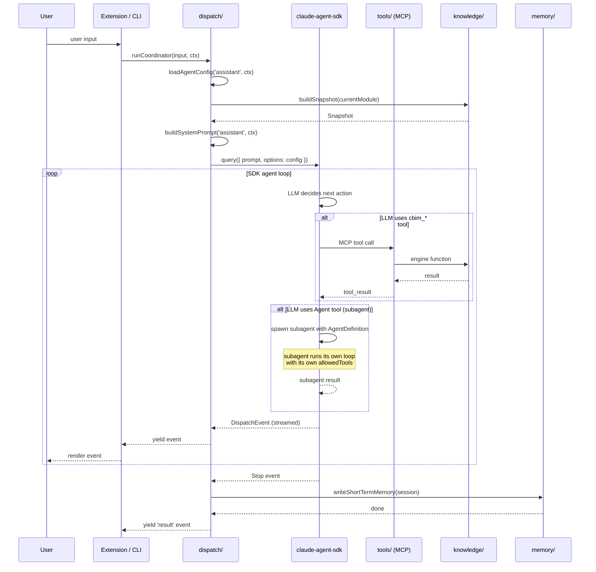

# @cbim/engine/dispatch -- Implementation Contract

> Scope: `packages/engine/src/dispatch/`
> Consumer: `@cbim/vscode-extension` (primary), `@cbim/cli` (future debug/scripting)
> Status: Phase 0 contract -- programmer施工图纸 for Phase 1-2
> Depends on: `@anthropic-ai/claude-agent-sdk`, `@cbim/engine/knowledge`, `@cbim/engine/memory`, `@cbim/engine/tools`

---

## 1. Design Kernel

**dispatch = SDK config assembler + event stream consumer.** It does NOT re-implement the agent loop. The SDK (`@anthropic-ai/claude-agent-sdk`) owns the complete agent loop (Messages API calls, tool_use detection, handler execution, tool_result assembly, subagent spawning, session persistence). dispatch only: (1) routes user intent to a role, (2) assembles the SDK config for that role, (3) calls `query()`, (4) consumes the async iterable event stream.

---

## 2. Core Types

All types exported from `@cbim/engine/dispatch`. All returned objects use `Readonly<T>`.

```typescript
/**
 * The five built-in agent roles. No extensibility -- these are hardcoded.
 * Work agents are user-defined and managed separately via cbim_agent_* tools.
 */
type AgentRole = 'assistant' | 'architect' | 'programmer' | 'hr' | 'auditor'

/**
 * SDK-level configuration for a single agent.
 * Maps directly to the options accepted by SDK's query() call.
 *
 * This is the "assembled" config -- ready to pass to SDK.
 * dispatch is the only module that constructs these.
 */
interface AgentConfig {
  /** Full system prompt text for this role. */
  readonly systemPrompt: string
  /** SDK allowedTools whitelist. Tool names or glob patterns (e.g., 'mcp__cbim__module_*'). */
  readonly allowedTools: readonly string[]
  /** SDK disallowedTools blacklist. RegExp patterns for path-level blocking. */
  readonly disallowedTools: readonly RegExp[]
  /**
   * Subagent definitions for SDK's native `agents` config.
   * Each key is a role name; the SDK exposes it as an `Agent` tool the LLM can invoke.
   * Only populated for roles that can dispatch sub-agents (e.g., assistant).
   */
  readonly agents: Readonly<Record<string, AgentDefinition>>
  /**
   * SDK hooks: lifecycle callbacks.
   * dispatch injects memory-write on Stop, snapshot-inject on SessionStart, etc.
   */
  readonly hooks: Readonly<AgentHooks>
  /**
   * MCP server references to inject into the SDK session.
   * Always includes { cbim: <cbimMcpServer> }.
   */
  readonly mcpServers: Readonly<Record<string, McpServerRef>>
}

/**
 * A subagent definition for SDK's `agents` config.
 * The SDK creates an `Agent` tool from this, allowing the parent agent
 * to invoke the subagent via natural language.
 */
interface AgentDefinition {
  /** Human-readable description shown to the parent agent's LLM. */
  readonly description: string
  /** The subagent's full system prompt. */
  readonly prompt: string
  /** allowedTools for the subagent (same semantics as AgentConfig). */
  readonly allowedTools: readonly string[]
  /** disallowedTools for the subagent. */
  readonly disallowedTools: readonly RegExp[]
  /** Nested subagents (recursive). Empty for leaf agents. */
  readonly agents: Readonly<Record<string, AgentDefinition>>
}

/**
 * SDK hook callbacks injected by dispatch.
 * Each hook is optional; dispatch populates the ones CBIM needs.
 */
interface AgentHooks {
  /** Fires when a session starts. dispatch injects knowledge snapshot here. */
  readonly onSessionStart?: (params: { sessionId: string }) => Promise<void>
  /** Fires before a tool is used. For audit logging. */
  readonly onPreToolUse?: (params: { toolName: string; input: unknown }) => Promise<{ allow: boolean }>
  /** Fires after a tool completes. For audit logging. */
  readonly onPostToolUse?: (params: { toolName: string; output: unknown }) => Promise<void>
  /** Fires when the agent loop stops (final result). dispatch triggers memory write here. */
  readonly onStop?: (params: { sessionId: string; result: unknown }) => Promise<void>
}

/**
 * Reference to an MCP server instance for SDK injection.
 * The actual server object is created by @cbim/engine/tools.
 */
type McpServerRef = unknown // Opaque SDK type; actual type from @anthropic-ai/claude-agent-sdk

/**
 * Input for a dispatch request.
 */
interface DispatchRequest {
  /** Which role initiated this dispatch (for audit trail). */
  readonly fromRole: AgentRole
  /** Target role to dispatch to. */
  readonly toRole: AgentRole
  /** The task description / prompt to send to the target agent. */
  readonly task: string
  /** Parent session ID for context linking (memory association). */
  readonly parentSessionId?: string
}

/**
 * An event emitted by the SDK's async iterable during a query.
 * dispatch forwards these transparently; consumers (UI, CLI) render them.
 *
 * This is a union type mirroring SDK's event types.
 * dispatch does NOT invent its own event taxonomy -- it re-exports SDK events
 * with minimal CBIM-specific metadata added.
 */
type DispatchEvent =
  | { readonly type: 'assistant'; readonly content: string; readonly sessionId: string }
  | { readonly type: 'tool_use'; readonly toolName: string; readonly input: unknown; readonly sessionId: string }
  | { readonly type: 'tool_result'; readonly toolName: string; readonly output: unknown; readonly sessionId: string }
  | { readonly type: 'result'; readonly content: string; readonly sessionId: string }
  | { readonly type: 'error'; readonly error: DispatchError; readonly sessionId: string }

/**
 * The final result of a completed dispatch.
 * Extracted from the 'result' event after the agent loop finishes.
 */
interface DispatchResult {
  /** The final textual output from the agent. */
  readonly content: string
  /** SDK session ID (for resume, memory association, audit). */
  readonly sessionId: string
  /** Tool calls made during the session (for audit/debugging). */
  readonly toolCalls: readonly ToolCallRecord[]
  /** Errors encountered during execution (non-fatal). */
  readonly errors: readonly DispatchError[]
}

/**
 * Record of a single tool call during a session (for audit trail).
 */
interface ToolCallRecord {
  readonly toolName: string
  readonly input: unknown
  readonly output: unknown
  readonly durationMs: number
}

/**
 * Shared context passed through all dispatch operations.
 * Constructed once at session start, threaded through config assembly.
 */
interface CoordinatorContext {
  /** Absolute path to the user's project root. */
  readonly projectRoot: string
  /** Currently focused module path (relative to project root), if any. */
  readonly currentModule?: string
  /** Reference to the latest knowledge snapshot (for injection into agent context). */
  readonly snapshotRef?: string
  /** The cbim MCP server instance (created by tools sub-module, injected here). */
  readonly cbimMcpServer: McpServerRef
}
```

---

## 3. Error Types

```typescript
/**
 * Base error for all dispatch errors.
 */
interface DispatchError extends Error {
  /** The role involved in the error. */
  readonly role: AgentRole
}

/**
 * Thrown when an invalid role is passed to loadAgentConfig or dispatch.
 * Should never happen with TypeScript's type system, but guards against
 * runtime string casting.
 */
interface InvalidRoleError extends DispatchError {
  readonly name: 'InvalidRoleError'
  readonly invalidRole: string
}

/**
 * Thrown when SDK's query() rejects.
 * Wraps the underlying SDK error with CBIM context.
 */
interface SdkQueryError extends DispatchError {
  readonly name: 'SdkQueryError'
  readonly sessionId?: string
  /** The original SDK error. */
  readonly cause: Error
  /** Whether this error is retryable (rate limit = yes; auth = no). */
  readonly retryable: boolean
}

/**
 * Thrown when a dispatch request targets a role that the fromRole
 * is not permitted to invoke (e.g., programmer trying to dispatch architect).
 */
interface UnauthorizedDispatchError extends DispatchError {
  readonly name: 'UnauthorizedDispatchError'
  readonly fromRole: AgentRole
  readonly toRole: AgentRole
}
```

**Error throw conditions:**

| Function | Error | Condition |
|----------|-------|-----------|
| `loadAgentConfig` | `InvalidRoleError` | `role` is not one of the 5 `AgentRole` values |
| `dispatch` | `InvalidRoleError` | `req.toRole` is not a valid `AgentRole` |
| `dispatch` | `UnauthorizedDispatchError` | `req.fromRole` is not permitted to invoke `req.toRole` |
| `dispatch` | `SdkQueryError` | SDK `query()` throws (rate limit, API error, auth failure, tool handler crash) |
| `runCoordinator` | `SdkQueryError` | SDK `query()` throws during coordinator session |

---

## 4. API Functions

All functions are **async**. `dispatch` and `runCoordinator` return `AsyncIterable` for streaming.

```typescript
/**
 * Assemble the complete SDK config for a single agent role.
 *
 * @param role - The agent role to configure.
 * @param ctx - Coordinator context (project root, MCP server, etc.).
 * @returns Fully assembled AgentConfig ready for SDK query().
 * @throws InvalidRoleError if role is not a valid AgentRole.
 *
 * Behavior:
 * 1. Look up the role in the static AGENT_REGISTRY.
 * 2. Call buildSystemPrompt(role, ctx) to construct the full system prompt
 *    (base prompt + optional knowledge snapshot injection).
 * 3. Call getToolConfig(role) from @cbim/engine/tools to get allowedTools/disallowedTools.
 * 4. Determine which sub-agents this role can invoke (see Section 6 table).
 *    For each sub-agent, recursively call loadAgentConfig to build its AgentDefinition.
 *    IMPORTANT: recursion depth is bounded -- sub-agents do not get their own sub-agents
 *    (max depth = 2: coordinator -> architect, not coordinator -> architect -> programmer).
 * 5. Construct hooks:
 *    - onSessionStart: build knowledge snapshot via @cbim/engine/knowledge, inject as context.
 *    - onStop: trigger memory write via @cbim/engine/memory.
 * 6. Attach mcpServers: { cbim: ctx.cbimMcpServer }.
 * 7. Return the assembled AgentConfig.
 */
function loadAgentConfig(role: AgentRole, ctx: CoordinatorContext): AgentConfig

/**
 * Dispatch a task to a target agent role.
 * Calls SDK query() and yields events as they arrive.
 *
 * @param req - Dispatch request (fromRole, toRole, task, parentSessionId?).
 * @param ctx - Coordinator context.
 * @returns Async iterable of DispatchEvents. The final event is always 'result' or 'error'.
 * @throws InvalidRoleError if req.toRole is invalid.
 * @throws UnauthorizedDispatchError if req.fromRole cannot invoke req.toRole.
 *
 * Behavior:
 * 1. Validate req.toRole is a valid AgentRole.
 * 2. Validate dispatch permission: check DISPATCH_PERMISSIONS matrix (see Section 6).
 * 3. Call loadAgentConfig(req.toRole, ctx) to get the SDK config.
 * 4. Call SDK query({ prompt: req.task, options: config }).
 * 5. Iterate the SDK's async iterable:
 *    - For each SDK event, map to DispatchEvent and yield it.
 *    - On 'result' event: construct DispatchResult, yield it, return.
 *    - On SDK error: wrap in SdkQueryError, yield as 'error' event, return.
 * 6. Associate the sessionId with parentSessionId for memory lineage.
 *
 * Concurrency: Multiple dispatch() calls can run concurrently.
 * Each creates an independent SDK query() session. No shared mutable state.
 */
function dispatch(req: DispatchRequest, ctx: CoordinatorContext): AsyncIterable<DispatchEvent>

/**
 * Entry point: start the coordinator (assistant role) with user input.
 *
 * @param userInput - The user's raw input text.
 * @param ctx - Coordinator context.
 * @returns Async iterable of DispatchEvents from the coordinator session.
 *
 * Behavior:
 * 1. Call loadAgentConfig('assistant', ctx).
 *    The assistant config includes agents: { architect, programmer, hr, auditor }
 *    so the LLM can invoke them via the SDK's built-in Agent tool.
 * 2. Call SDK query({ prompt: userInput, options: config }).
 * 3. Stream events. The SDK handles sub-agent invocation internally when
 *    the LLM decides to use the Agent tool -- dispatch does NOT intercept.
 * 4. On Stop hook: write session memory.
 *
 * This is the primary entry point for the extension and CLI.
 * The coordinator (assistant) decides autonomously when to invoke sub-agents.
 */
function runCoordinator(userInput: string, ctx: CoordinatorContext): AsyncIterable<DispatchEvent>
```

### Auxiliary Functions (internal, not exported)

```typescript
/**
 * Build the full system prompt for a role.
 *
 * @param role - Agent role.
 * @param ctx - Coordinator context.
 * @returns The complete system prompt string.
 *
 * Behavior:
 * 1. Load the base prompt for the role from the compiled prompt constants.
 *    (Prompts are TypeScript string constants in @cbim/engine or @cbim/vscode-extension.)
 * 2. If ctx.currentModule is set, build a knowledge snapshot via
 *    @cbim/engine/knowledge.buildSnapshot() and append it to the prompt.
 * 3. If ctx.snapshotRef is set, load cached snapshot and append.
 * 4. Return the assembled prompt.
 *
 * NOT exported -- only used internally by loadAgentConfig.
 */
function buildSystemPrompt(role: AgentRole, ctx: CoordinatorContext): string

/**
 * Get the tool permission config for a role.
 *
 * Delegates to @cbim/engine/tools.getToolConfig(role).
 * This is a pass-through; the canonical tool permission logic lives in tools/.
 *
 * NOT exported -- only used internally by loadAgentConfig.
 */
function getToolConfig(role: AgentRole): {
  allowedTools: readonly string[]
  disallowedTools: readonly RegExp[]
}

/**
 * Get the MCP server references for a context.
 *
 * @returns Record of MCP server name -> server instance.
 * Currently always returns { cbim: ctx.cbimMcpServer }.
 * Future: may include user-configured third-party MCP servers.
 *
 * NOT exported -- only used internally by loadAgentConfig.
 */
function getMcpServers(ctx: CoordinatorContext): Record<string, McpServerRef>
```

---

## 5. Behavioral Contracts

### 5.1 Do NOT re-invent the agent loop

The SDK handles: Messages API calls -> tool_use detection -> handler execution -> tool_result assembly -> continue until done. dispatch MUST NOT implement any of this. The entire "loop" is a single `query()` call.

**Verifiable**: dispatch source code must contain exactly ONE call to the SDK's `query()` function (per dispatch invocation). No manual Messages API calls. No manual tool_use/tool_result plumbing.

### 5.2 Subagent model: SDK-native `agents` config

The coordinator (assistant) dispatches sub-agents NOT by calling dispatch() programmatically, but by the LLM using the SDK's built-in `Agent` tool. dispatch configures this via `agents: { architect: AgentDefinition, ... }` in the coordinator's AgentConfig.

**Why?** Letting the LLM decide when to dispatch via the Agent tool is the natural interface. The LLM reads the user's intent and autonomously chooses which sub-agent to invoke. dispatch does not need intent-routing logic -- the LLM IS the router.

**Verifiable**: The coordinator's AgentConfig.agents must contain entries for architect, programmer, hr, and auditor. Each entry's `description` must be sufficient for the LLM to choose correctly.

### 5.3 Session persistence and memory association

The SDK manages session persistence via JSONL automatically. dispatch adds a CBIM-specific concern: associating sessionId with task context for memory lineage.

**Behavior**:
- On session start: record `{ sessionId, role, parentSessionId, startTime, projectRoot }` to `.cbim/.runtime/sessions/`.
- On session stop: trigger `@cbim/engine/memory` to write short-term memory from the session content.
- parentSessionId links sub-agent sessions to the coordinator session.

**Verifiable**: After a dispatch() call completes, `.cbim/.runtime/sessions/<sessionId>.json` must exist with the above fields.

### 5.4 Streaming event forwarding

dispatch is a transparent pipe for SDK events. It adds sessionId metadata but does NOT transform, filter, or buffer events.

**Verifiable**: Every SDK event must produce exactly one DispatchEvent yield. No batching. No debouncing. Event order is preserved.

### 5.5 Error propagation

| SDK Error Type | dispatch Behavior | Retryable? |
|----------------|-------------------|------------|
| Rate limit (429) | Wrap in SdkQueryError, yield as 'error' event | Yes |
| Auth failure (401/403) | Wrap in SdkQueryError, yield as 'error' event | No |
| Network error | Wrap in SdkQueryError, yield as 'error' event | Yes |
| Tool handler throws | SDK catches internally, sends tool_result with is_error=true, continues loop | N/A (SDK handles) |
| Invalid tool name | SDK catches internally, sends error tool_result, continues | N/A (SDK handles) |

dispatch does NOT retry automatically. Retry policy is the consumer's responsibility (extension or CLI).

**Verifiable**: On SdkQueryError, the `retryable` field must be correctly set based on error type.

### 5.6 Concurrency

Multiple dispatch() calls can run in parallel. Each creates an independent SDK query() session. dispatch holds NO shared mutable state.

**Verifiable**: Two concurrent dispatch() calls must not interfere. No shared variables, no locks, no queue.

---

## 6. Agent Configuration Matrix

### 6.1 Dispatch Permissions

```
DISPATCH_PERMISSIONS: Record<AgentRole, readonly AgentRole[]>

assistant  -> [architect, programmer, hr, auditor]
architect  -> [programmer]   // optional: architect may ask programmer to scaffold
programmer -> []             // leaf agent, does not dispatch
hr         -> []             // leaf agent, manages agent configs only
auditor    -> []             // read-only reviewer, does not dispatch
```

**Verifiable**: `dispatch()` must reject any (fromRole, toRole) pair not in this matrix with `UnauthorizedDispatchError`.

### 6.2 Per-Role Configuration Summary

| Role | System Prompt Gist | allowedTools | disallowedTools | Sub-agents |
|------|-------------------|--------------|-----------------|------------|
| **assistant** | Coordination hub. Understands user intent, decomposes tasks, dispatches to specialists. Does NOT read/write source code or knowledge files directly. Replies in user's language. | `Agent`, `mcp__cbim__audit_log`, `mcp__cbim__memory_query`, `mcp__cbim__snapshot_build` | -- | architect, programmer, hr, auditor |
| **architect** | Module design authority. Creates/updates module.md, contract.md, workflows. Reads source for reference only. Cannot write code or run commands. | `Read`, `Glob`, `Grep`, `mcp__cbim__module_*`, `mcp__cbim__snapshot_build` | `/Write/`, `/Edit/`, `/Bash/` | programmer (optional) |
| **programmer** | Implementation agent. Writes code, runs tests, uses build tools. Reads knowledge (module_get) for context but cannot modify knowledge files. | `Read`, `Write`, `Edit`, `Bash`, `Glob`, `Grep`, `mcp__cbim__module_get`, `mcp__cbim__source_*`, `mcp__cbim__run_*`, `mcp__cbim__git_*` | -- | -- |
| **hr** | Work agent lifecycle manager. Creates/updates/archives user-defined work agents. Queries memory for agent performance context. | `Read`, `Glob`, `mcp__cbim__agent_*`, `mcp__cbim__memory_query` | `/Write/`, `/Edit/`, `/Bash/` | -- |
| **auditor** | Independent reviewer. Read-only access to knowledge and source. Cannot modify anything. Reports findings as text output. | `Read`, `Glob`, `Grep`, `mcp__cbim__module_get`, `mcp__cbim__memory_query`, `mcp__cbim__snapshot_build` | `/Write/`, `/Edit/`, `/Bash/` | -- |

### 6.3 Sub-agent Description Templates

The `description` field in AgentDefinition is what the coordinator LLM sees when deciding which Agent tool to invoke. It must be concise and decision-relevant.

```typescript
const SUBAGENT_DESCRIPTIONS: Record<AgentRole, string> = {
  architect:
    'Module design and knowledge governance specialist. Dispatch for: creating/updating module.md, ' +
    'contract.md, architecture decisions, module splits, dependency analysis. ' +
    'Read-only access to source code. Cannot write code.',
  programmer:
    'Code implementation specialist. Dispatch for: writing code, running tests, ' +
    'building, git operations, file editing. Reads knowledge for context. ' +
    'Cannot modify .dna/ or .cbim/ knowledge files.',
  hr:
    'Work agent lifecycle manager. Dispatch for: creating/updating/archiving ' +
    'user-defined work agents, querying agent performance history.',
  auditor:
    'Independent quality reviewer. Dispatch for: code review, architecture review, ' +
    'compliance checks. Read-only access. Returns findings as text.',
}
```

---

## 7. Data Flow



---

## 8. Key Decisions

### 8.1 Why SDK-native subagent (agents: {}) instead of programmatic dispatch()

The SDK's `agents` config + `Agent` tool lets the **LLM** decide when and how to dispatch. This is fundamentally better than programmatic intent routing because:
- The LLM has full context of the user's request and can make nuanced routing decisions.
- No need for a separate intent classifier or routing rules.
- The SDK handles subagent context isolation, session management, and result reporting.

dispatch still exposes a `dispatch()` function for **programmatic** use (e.g., extension commands that directly target a specific role), but the primary path is LLM-driven via Agent tool.

### 8.2 Context compression: NOT dispatch's responsibility

The SDK does not provide built-in context compression. When conversations grow long, token usage increases. dispatch does NOT implement compression -- this is deferred to Phase 4. The memory sub-module's distillation is a separate concern (converts session content to structured knowledge, not in-conversation compression).

### 8.3 Multi-provider: transparent to dispatch

The SDK supports `ANTHROPIC_BASE_URL` for provider routing (Claude, Bedrock, Vertex, Azure, OpenRouter). dispatch is completely unaware of which provider is active. The environment variable is read by the SDK at query() time. No dispatch code references providers.

### 8.4 System prompt storage: compiled constants

The 5 built-in agent prompts are TypeScript string constants compiled into the extension bundle. They are NOT stored as `.md` files on the user's disk. dispatch imports them from a constants module. This is an IP protection measure (see v2-plan Section 8).

**Implication for engine vs. extension boundary**: The prompt constants could live in either package. Recommendation: store prompt **templates** in engine (since engine assembles the config), but allow extension to override/augment them. Phase 1 can hardcode in engine; Phase 2 can add extension-level customization if needed.

### 8.5 loadAgentConfig is synchronous-shaped but internally async

`loadAgentConfig` needs to call `buildSnapshot()` (async I/O) when constructing the system prompt. It is therefore async even though the config assembly itself is pure computation. The async boundary is at snapshot loading.

---

## 9. Export Surface

```typescript
// packages/engine/src/dispatch/index.ts -- public API surface

// Types
export type {
  AgentRole,
  AgentConfig,
  AgentDefinition,
  AgentHooks,
  DispatchRequest,
  DispatchResult,
  DispatchEvent,
  ToolCallRecord,
  CoordinatorContext,
}

// Errors
export { InvalidRoleError, SdkQueryError, UnauthorizedDispatchError }

// Functions
export { loadAgentConfig, dispatch, runCoordinator }
```

Internal functions (`buildSystemPrompt`, `getToolConfig` pass-through, `getMcpServers`) are NOT exported.

---

## 10. Implementation Guidance (for programmer)

### 10.1 File Structure

```
packages/engine/src/dispatch/
├── index.ts              # Public exports (barrel file)
├── types.ts              # All type definitions from Section 2
├── errors.ts             # Error classes from Section 3
├── config.ts             # loadAgentConfig, buildSystemPrompt, AGENT_REGISTRY
├── permissions.ts        # DISPATCH_PERMISSIONS matrix, validation
├── dispatch.ts           # dispatch() and runCoordinator() implementations
└── prompts/
    ├── assistant.ts      # ASSISTANT_PROMPT constant
    ├── architect.ts      # ARCHITECT_PROMPT constant
    ├── programmer.ts     # PROGRAMMER_PROMPT constant
    ├── hr.ts             # HR_PROMPT constant
    └── auditor.ts        # AUDITOR_PROMPT constant
```

### 10.2 Test Strategy

| Test Category | What to verify | Approach |
|--------------|----------------|----------|
| Config assembly | loadAgentConfig returns correct allowedTools/disallowedTools per role | Unit test; mock SDK types |
| Permission matrix | dispatch rejects unauthorized (fromRole, toRole) pairs | Unit test; assert UnauthorizedDispatchError |
| Event streaming | dispatch yields events in order, no batching | Integration test with mock SDK query() |
| Error mapping | SdkQueryError.retryable is correct for each error type | Unit test with mock SDK errors |
| Concurrency | Two dispatch() calls do not interfere | Integration test; run in parallel, assert independence |
| Subagent config | assistant's agents config contains all 4 sub-agents with correct descriptions | Unit test; inspect loadAgentConfig('assistant', ctx).agents |

### 10.3 Dependencies

```
@anthropic-ai/claude-agent-sdk  -- query(), event types, createSdkMcpServer types
@cbim/engine/knowledge          -- buildSnapshot(), loadModule()
@cbim/engine/memory             -- writeShortTermMemory() (for Stop hook)
@cbim/engine/tools              -- getToolConfig(), cbimMcpServer instance
```
