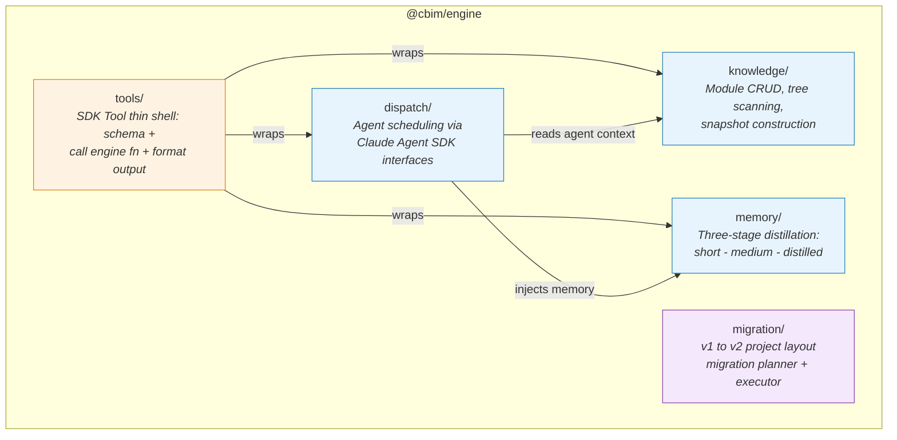

## Positioning

The IDE-agnostic domain core of CBIM v2. Houses all business logic for module knowledge management, three-stage memory distillation, multi-agent dispatch, v1-to-v2 migration, and the `cbim_*` SDK tool adapter layer. Depends on no sibling package and no IDE-specific API.

## Component Diagram

**Dependency direction within engine:**
- `tools/` depends on `knowledge/`, `memory/`, `dispatch/` (wraps their functions as SDK tools)
- `dispatch/` depends on `knowledge/` (reads agent configs and module context) and `memory/` (injects memory into agent sessions)
- `knowledge/` and `memory/` are independent of each other
- `migration/` is fully isolated -- no runtime coupling with other sub-modules

## Key Decisions

- **Why zero VS Code dependency?** Engine is the stable foundation reused by extension, cli, and potentially future IDE plugins or web-based tools. Any VS Code import would make it non-portable. This is enforced at the package boundary: `@cbim/engine` has no `@types/vscode` in its dependency tree.

- **Why five sub-directories, not five separate packages?** `knowledge`, `memory`, `dispatch`, `migration`, and `tools` share a deployment lifecycle and version. Splitting them into separate npm packages would create unnecessary versioning coordination overhead. Instead, engine exposes them as sub-path exports (`@cbim/engine/knowledge`, etc.), giving consumers tree-shaking granularity without package sprawl.

- **Why tools/ is a thin shell, not the domain logic?** The `cbim_*` tools are SDK interface adapters -- they define JSON Schema for inputs, call the underlying engine function, and format the output. All validation, state mutation, and side-effects live in the domain sub-modules (`knowledge/`, `memory/`, `dispatch/`). This means CLI can call the same domain functions directly without going through the SDK tool layer.

- **Why tools/ exports a role-filtered `getToolSet(role)`?** Different agent roles (coordinator, architect, programmer, auditor) have different permission levels. `getToolSet` returns only the tools permitted for a given role, enforcing permission segregation at the tool registration level. The extension passes the appropriate set when spawning each agent.

- **Why migration/ is isolated?** Migration is a one-time operation per project. It has no runtime coupling with knowledge/memory/dispatch and should not add weight to the engine's runtime footprint. It reads v1 file layouts and writes v2 file layouts -- pure file transformation with no engine runtime state.

- **Knowledge access closedness -- where is it enforced?** The engine itself is permissive -- its functions read/write `.cbim/` and `.dna/` paths freely. The closedness principle (Section 7 of v2-plan) is enforced at two levels: (1) SDK `canUseTool` path guard in the extension, blocking agents from using generic file tools on CBIM-managed paths; (2) `cbim_*` tools as the only sanctioned entry points for agents. Engine provides the tools; extension enforces the gate.
