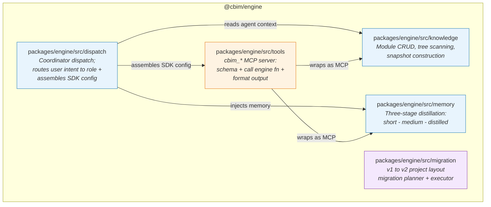

## Positioning

The IDE-agnostic domain core of CBIM v2. Houses all business logic for module knowledge management, three-stage memory distillation, coordinator dispatch, v1-to-v2 migration, and the `cbim_*` MCP tool layer. Depends on no sibling package and no IDE-specific API.

## Sub-module Relationship Diagram

**Internal dependency direction:**
- `dispatch/` depends on `knowledge/` (reads agent configs and module context), `memory/` (injects memory into agent sessions), and `tools/` (gets MCP server + per-role tool configs for SDK assembly)
- `tools/` depends on `knowledge/` and `memory/` (wraps their functions as MCP tools)
- `knowledge/` and `memory/` are independent of each other
- `migration/` is fully isolated -- no runtime coupling with other sub-modules

## Key Decisions

- **Why zero VS Code dependency?** Engine is the stable foundation reused by extension, cli, and potentially future IDE plugins or web-based tools. Any VS Code import would make it non-portable. Enforced at the package boundary: `@cbim/engine` has no `@types/vscode` in its dependency tree.

- **Why five sub-directories, not five separate packages?** `knowledge`, `memory`, `dispatch`, `migration`, and `tools` share a deployment lifecycle and version. Splitting them into separate npm packages would create unnecessary versioning coordination overhead. Engine exposes them as sub-path exports (`@cbim/engine/knowledge`, etc.), giving consumers tree-shaking granularity without package sprawl.

- **Why migration/ is isolated?** Migration is a one-time operation per project. It has no runtime coupling with knowledge/memory/dispatch and should not add weight to the engine's runtime footprint. Pure file transformation with no engine runtime state.
