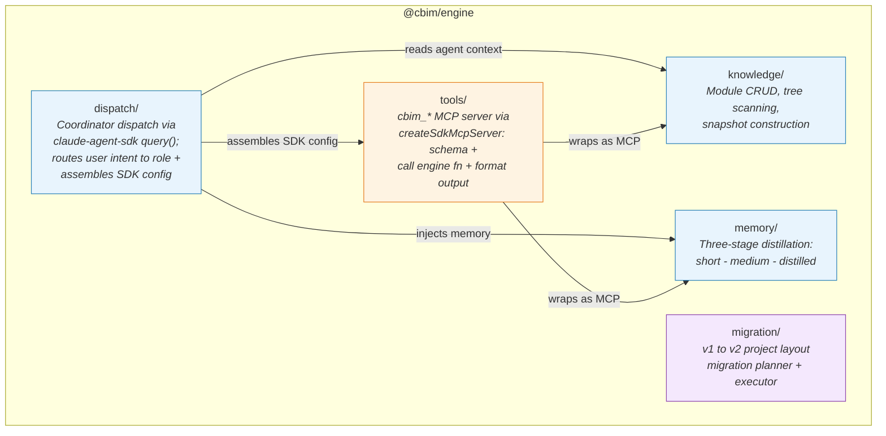

## Positioning

The IDE-agnostic domain core of CBIM v2. Houses all business logic for module knowledge management, three-stage memory distillation, coordinator dispatch (via `@anthropic-ai/claude-agent-sdk` `query()`), v1-to-v2 migration, and the `cbim_*` MCP tool layer (via `createSdkMcpServer`). Depends on no sibling package and no IDE-specific API.

## Component Diagram

**Dependency direction within engine:**
- `dispatch/` depends on `knowledge/` (reads agent configs and module context), `memory/` (injects memory into agent sessions), and `tools/` (gets cbim MCP server + per-role tool configs for SDK assembly)
- `tools/` depends on `knowledge/` and `memory/` (wraps their functions as MCP tools via `createSdkMcpServer`)
- `knowledge/` and `memory/` are independent of each other
- `migration/` is fully isolated -- no runtime coupling with other sub-modules

## Key Decisions

- **Why zero VS Code dependency?** Engine is the stable foundation reused by extension, cli, and potentially future IDE plugins or web-based tools. Any VS Code import would make it non-portable. This is enforced at the package boundary: `@cbim/engine` has no `@types/vscode` in its dependency tree.

- **Why five sub-directories, not five separate packages?** `knowledge`, `memory`, `dispatch`, `migration`, and `tools` share a deployment lifecycle and version. Splitting them into separate npm packages would create unnecessary versioning coordination overhead. Instead, engine exposes them as sub-path exports (`@cbim/engine/knowledge`, etc.), giving consumers tree-shaking granularity without package sprawl.

- **Why dispatch is ~200 lines, not a full agent loop?** `@anthropic-ai/claude-agent-sdk` is the Claude Code CLI packaged as an npm library -- same runtime, same underlying binary. SDK handles the complete agent loop (Messages API calls, tool_use detection, handler execution, tool_result assembly, subagent spawning, session persistence). Dispatch only needs to: (1) route user intent to a role, (2) assemble the SDK config for that role (`systemPrompt`, `allowedTools`, `disallowedTools`, `agents`), (3) call `query()`, (4) consume the event stream. No manual Messages API loop. No manual tool_use/tool_result plumbing. No manual subagent spawn.

- **Why tools/ is an MCP server, not raw SDK tool definitions?** The `cbim_*` tools are wrapped via `createSdkMcpServer` + `tool(name, desc, zodSchema, handler)`. This is the SDK's native mechanism for custom tools. Each tool calls the underlying engine function and formats the output. All validation, state mutation, and side-effects live in the domain sub-modules (`knowledge/`, `memory/`, `dispatch/`). CLI can call the same domain functions directly without going through the MCP layer.

- **Why tools/ exports `getToolConfig(role)` instead of `getToolSet(role)`?** With SDK, permission control is via `allowedTools` / `disallowedTools` arrays (supporting regex), not by filtering tool objects. `getToolConfig(role)` returns the appropriate whitelist/blacklist for each agent role. The MCP server registers all tools; the SDK config determines which ones each agent can see.

- **Why migration/ is isolated?** Migration is a one-time operation per project. It has no runtime coupling with knowledge/memory/dispatch and should not add weight to the engine's runtime footprint. It reads v1 file layouts and writes v2 file layouts -- pure file transformation with no engine runtime state.

- **Knowledge access closedness -- where is it enforced?** The engine itself is permissive -- its functions read/write `.cbim/` and `.dna/` paths freely. The closedness principle (Section 7 of v2-plan) is enforced at the SDK config level: each agent's `allowedTools` whitelist + `disallowedTools` regex blacklist control exactly which tools and paths are accessible. The configuration is hardcoded in `packages/extension` TypeScript constants -- users cannot modify it (unlike Claude Code's `settings.json`). This is strictly stronger than v1's prompt-based constraints.
