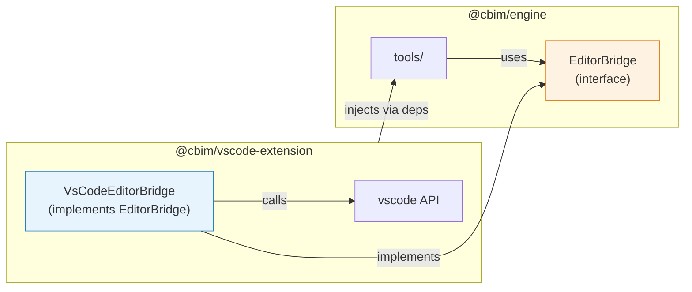

# @cbim/engine/tools -- Implementation Contract

> Scope: `packages/engine/src/tools/`
> Consumer: `@cbim/engine/dispatch` (injects MCP server into agent config), `@cbim/vscode-extension` (editor tools)
> Status: Phase 0 contract -- programmer施工图纸 for Phase 1-2
> Depends on: `@anthropic-ai/claude-agent-sdk`, `@cbim/engine/knowledge`, `@cbim/engine/memory`

---

## 1. Design Kernel

**tools = MCP server wrapping engine functions, with role-based permission assembly.** Every `cbim_*` tool is a thin shell: validate input (zod) -> call engine function -> format output. The MCP server is a single instance injected into all agent sessions; role-based visibility is controlled by `allowedTools`/`disallowedTools` in the SDK config, NOT by registering different tool sets per agent.

---

## 2. Implementation Mechanism

### 2.1 MCP Server Creation

```typescript
import { createSdkMcpServer, tool } from '@anthropic-ai/claude-agent-sdk'
import { z } from 'zod'

/**
 * Create the cbim MCP server instance.
 * Called once at extension/CLI startup. The returned server is passed to
 * dispatch via CoordinatorContext.cbimMcpServer.
 *
 * @param deps - Engine dependencies (knowledge, memory functions).
 * @returns MCP server instance ready for SDK injection.
 */
function createCbimMcpServer(deps: ToolDependencies): McpServer
```

### 2.2 Tool Definition Pattern

Every tool follows this pattern:

```typescript
tool(
  'cbim_<domain>_<action>',                    // name
  'Human-readable description for LLM',        // description (the LLM reads this)
  z.object({ /* input schema */ }),             // zod schema (auto-converted to JSON Schema)
  async (input) => {                            // handler
    // 1. Call engine function
    // 2. Format output as structured object
    // 3. Throw on error (SDK wraps as tool_result { is_error: true })
    return structuredResult
  }
)
```

### 2.3 MCP Server Injection

The MCP server is injected into agent configs via:

```typescript
// In dispatch/config.ts
const config: AgentConfig = {
  // ...
  mcpServers: { cbim: ctx.cbimMcpServer },
}
```

The SDK exposes all tools from the MCP server as `mcp__cbim__<tool_name>`. Role-based filtering uses `allowedTools: ['mcp__cbim__module_*']` to whitelist specific tool patterns.

---

## 3. Tool Dependencies Interface

```typescript
/**
 * Dependencies injected into the MCP server factory.
 * This is the seam between tools/ and the rest of engine.
 * All engine functions are passed in; tools/ never imports engine sub-modules directly.
 */
interface ToolDependencies {
  readonly knowledge: {
    readonly discoverModules: (projectRoot: string) => Promise<readonly ModuleNode[]>
    readonly loadModule: (modulePath: string) => Promise<Module>
    readonly buildSnapshot: (focusModulePath: string, tree: readonly ModuleNode[]) => Promise<Snapshot>
    readonly resolveModulePath: (relativePath: string, projectRoot: string) => string
    readonly parseModuleMd: (raw: string) => { frontmatter: ModuleFrontmatter; sections: ModuleSections }
    readonly initModule: (modulePath: string, frontmatter: ModuleFrontmatter) => Promise<void>
    readonly updateModule: (modulePath: string, patch: ModulePatch) => Promise<Module>
    readonly deprecateModule: (modulePath: string, reason: string) => Promise<void>
  }
  readonly memory: {
    readonly query: (intent: string, scope?: string, limit?: number) => Promise<readonly MemoryHit[]>
    readonly writeShort: (content: string, signals?: MemorySignals) => Promise<void>
    readonly distillToMedium: (criteria: DistillCriteria) => Promise<MediumRecord>
    readonly promoteToDistilled: (recordId: string, targetModule?: string) => Promise<void>
  }
  readonly agents: {
    readonly list: () => Promise<readonly WorkAgentSummary[]>
    readonly get: (id: string) => Promise<WorkAgentConfig>
    readonly create: (id: string, config: WorkAgentInput) => Promise<WorkAgentConfig>
    readonly update: (id: string, patch: WorkAgentPatch) => Promise<WorkAgentConfig>
    readonly archive: (id: string, reason: string) => Promise<void>
  }
  /** Absolute path to the user's project root. */
  readonly projectRoot: string
  /**
   * Editor bridge: optional. Only available when running inside VS Code extension.
   * When null, editor tools are registered but return "not available outside VS Code" error.
   */
  readonly editor: EditorBridge | null
}
```

---

## 4. Complete Tool Catalog (~25 tools)

### Domain A: Module (knowledge CRUD)

#### `cbim_module_list`

| Field | Value |
|-------|-------|
| **Description** | List all modules in the project tree. Returns the full hierarchy with name, path, owner, and nesting structure. |
| **Input Schema** | `z.object({})` (no input) |
| **Output** | `{ tree: ModuleTreeNode[] }` where `ModuleTreeNode = { path, name, owner, description, children: ModuleTreeNode[], isLeaf }` |
| **Side Effects** | None (read-only, filesystem scan) |
| **Errors** | InvalidProjectRootError |

#### `cbim_module_get`

| Field | Value |
|-------|-------|
| **Description** | Load a single module by its path (relative to project root). Returns full frontmatter, all markdown sections, contract content, and workflow names. |
| **Input Schema** | `z.object({ path: z.string().describe('Module path relative to project root, e.g. "src/combat" or ".cbim/dna" for root module') })` |
| **Output** | `{ module: Module }` (full Module object from knowledge contract) |
| **Side Effects** | None |
| **Errors** | ModuleNotFoundError, FrontmatterParseError, InvalidModuleError |

#### `cbim_module_init`

| Field | Value |
|-------|-------|
| **Description** | Create a new module at the given path. Creates the `.dna/` directory and a minimal `module.md` with the provided frontmatter. Fails if `.dna/module.md` already exists at the path. |
| **Input Schema** | `z.object({ path: z.string().describe('Target directory path relative to project root'), name: z.string().describe('Module name (kebab-case)'), owner: z.string().describe('Responsible agent/role id'), description: z.string().optional().describe('Brief module description') })` |
| **Output** | `{ created: true, modulePath: string }` |
| **Side Effects** | Creates `<path>/.dna/module.md` on disk |
| **Errors** | ModuleAlreadyExistsError (if .dna/module.md exists), InvalidModuleError (if name/owner invalid) |

#### `cbim_module_update`

| Field | Value |
|-------|-------|
| **Description** | Update an existing module's frontmatter fields and/or markdown sections. Supports partial updates -- only provided fields are changed. |
| **Input Schema** | `z.object({ path: z.string().describe('Module path relative to project root'), frontmatter: z.record(z.unknown()).optional().describe('Frontmatter fields to update (partial)'), sectionPatch: z.record(z.string()).optional().describe('Section name -> new content mapping. Use section heading as key.') })` |
| **Output** | `{ updated: true, module: Module }` (the updated module) |
| **Side Effects** | Writes to `<path>/.dna/module.md` |
| **Errors** | ModuleNotFoundError, InvalidModuleError (if patch produces invalid state) |

#### `cbim_module_deprecate`

| Field | Value |
|-------|-------|
| **Description** | Mark a module as deprecated. Adds `deprecated: true` and `deprecationReason` to frontmatter. Does NOT delete any files. |
| **Input Schema** | `z.object({ path: z.string().describe('Module path relative to project root'), reason: z.string().describe('Why this module is being deprecated') })` |
| **Output** | `{ deprecated: true, modulePath: string }` |
| **Side Effects** | Updates `<path>/.dna/module.md` frontmatter |
| **Errors** | ModuleNotFoundError |

---

### Domain B: Snapshot

#### `cbim_snapshot_build`

| Field | Value |
|-------|-------|
| **Description** | Build a contextual knowledge snapshot centered on a focus module. Includes the module itself, its ancestors, siblings, children, and dependency-linked modules. Use this to understand a module's place in the system. |
| **Input Schema** | `z.object({ focusModule: z.string().optional().describe('Module path to center the snapshot on. Defaults to root module (.cbim/dna) if omitted.') })` |
| **Output** | `{ snapshot: Snapshot }` (from knowledge contract) |
| **Side Effects** | None (read-only) |
| **Errors** | ModuleNotFoundError (if focus module does not exist) |

---

### Domain C: Memory

#### `cbim_memory_query`

| Field | Value |
|-------|-------|
| **Description** | Search memory by natural language intent. Returns matching records from short-term and medium-term memory, ranked by relevance. |
| **Input Schema** | `z.object({ intent: z.string().describe('Natural language description of what you are looking for'), scope: z.string().optional().describe('Restrict search to a specific scope: "short", "medium", "distilled", or module path'), limit: z.number().int().min(1).max(50).optional().describe('Maximum number of results to return. Default: 10') })` |
| **Output** | `{ hits: MemoryHit[] }` where `MemoryHit = { content, source, score, timestamp }` |
| **Side Effects** | None |
| **Errors** | -- (returns empty hits on no match) |

#### `cbim_memory_write_short`

| Field | Value |
|-------|-------|
| **Description** | Write a record to short-term memory. Used by agents to persist important observations, decisions, or context for future sessions. |
| **Input Schema** | `z.object({ content: z.string().describe('The memory content to store'), signals: z.object({ importance: z.enum(['low', 'medium', 'high']).optional(), keywords: z.array(z.string()).optional(), relatedModule: z.string().optional() }).optional().describe('Optional signals to aid future retrieval and distillation') })` |
| **Output** | `{ written: true, recordId: string }` |
| **Side Effects** | Writes to `.cbim/memory/short/` |
| **Errors** | -- (write failures are non-fatal; logged as warnings) |

#### `cbim_memory_distill_to_medium`

| Field | Value |
|-------|-------|
| **Description** | Trigger distillation of short-term memory records into a medium-term summary. Applies the four-quadrant model (MUST/WANT/HOW/IS). |
| **Input Schema** | `z.object({ criteria: z.object({ timeRange: z.string().optional().describe('ISO date range, e.g. "2026-05-01/2026-05-20"'), keywords: z.array(z.string()).optional().describe('Filter records by keywords'), module: z.string().optional().describe('Filter records related to a specific module') }).describe('Criteria for selecting which short-term records to distill') })` |
| **Output** | `{ distilled: true, mediumRecord: MediumRecord }` |
| **Side Effects** | Writes to `.cbim/memory/medium/`, may archive processed short-term records |
| **Errors** | NoRecordsMatchError (if criteria matches nothing) |

#### `cbim_memory_promote_to_distilled`

| Field | Value |
|-------|-------|
| **Description** | Promote a medium-term memory record to distilled (permanent) knowledge, optionally associating it with a specific module. |
| **Input Schema** | `z.object({ recordId: z.string().describe('ID of the medium-term record to promote'), targetModule: z.string().optional().describe('Module path to associate the distilled knowledge with') })` |
| **Output** | `{ promoted: true, distilledPath: string }` |
| **Side Effects** | Writes to `.cbim/memory/distilled/` (or `<module>/.dna/`) |
| **Errors** | RecordNotFoundError |

---

### Domain D: Agent (work agent management)

#### `cbim_agent_list`

| Field | Value |
|-------|-------|
| **Description** | List all user-defined work agents (NOT built-in agents). Returns summary info for each agent found in `.cbim/agents/`. |
| **Input Schema** | `z.object({})` (no input) |
| **Output** | `{ agents: WorkAgentSummary[] }` where `WorkAgentSummary = { id, name, description, status }` |
| **Side Effects** | None |
| **Errors** | -- |

#### `cbim_agent_get`

| Field | Value |
|-------|-------|
| **Description** | Get the full configuration of a user-defined work agent by ID. |
| **Input Schema** | `z.object({ id: z.string().describe('Agent identifier (filename stem in .cbim/agents/)') })` |
| **Output** | `{ agent: WorkAgentConfig }` where `WorkAgentConfig = { id, name, prompt, tools, description, status }` |
| **Side Effects** | None |
| **Errors** | AgentNotFoundError |

#### `cbim_agent_create`

| Field | Value |
|-------|-------|
| **Description** | Create a new user-defined work agent. Writes the agent configuration to `.cbim/agents/<id>.md`. |
| **Input Schema** | `z.object({ id: z.string().regex(/^[a-z0-9-]+$/).describe('Agent identifier (kebab-case, unique)'), prompt: z.string().describe('System prompt for the agent'), tools: z.array(z.string()).optional().describe('Allowed tool patterns for this agent'), description: z.string().optional().describe('Brief description of the agent role') })` |
| **Output** | `{ created: true, agent: WorkAgentConfig }` |
| **Side Effects** | Writes `.cbim/agents/<id>.md` |
| **Errors** | AgentAlreadyExistsError |

#### `cbim_agent_update`

| Field | Value |
|-------|-------|
| **Description** | Update an existing work agent's configuration. Supports partial updates. |
| **Input Schema** | `z.object({ id: z.string().describe('Agent identifier'), patch: z.object({ prompt: z.string().optional(), tools: z.array(z.string()).optional(), description: z.string().optional() }).describe('Fields to update (partial)') })` |
| **Output** | `{ updated: true, agent: WorkAgentConfig }` |
| **Side Effects** | Updates `.cbim/agents/<id>.md` |
| **Errors** | AgentNotFoundError |

#### `cbim_agent_archive`

| Field | Value |
|-------|-------|
| **Description** | Archive a work agent. Marks it as inactive but does not delete the file. |
| **Input Schema** | `z.object({ id: z.string().describe('Agent identifier'), reason: z.string().describe('Why this agent is being archived') })` |
| **Output** | `{ archived: true, agentId: string }` |
| **Side Effects** | Updates `.cbim/agents/<id>.md` frontmatter |
| **Errors** | AgentNotFoundError |

---

### Domain E: Source (path-restricted file operations)

All source tools enforce path restrictions: they refuse to operate on paths within `.cbim/` or any `.dna/` directory. This is the tool-level enforcement complementing the SDK-level `disallowedTools` config.

```typescript
// Shared path validation (internal)
function assertSourcePath(path: string): void {
  if (path.includes('.cbim/') || path.includes('.cbim\\'))
    throw new ForbiddenPathError(path, 'Cannot access .cbim/ via source tools')
  if (path.includes('/.dna/') || path.includes('\\.dna\\') || path.endsWith('/.dna') || path.endsWith('\\.dna'))
    throw new ForbiddenPathError(path, 'Cannot access .dna/ via source tools')
}
```

#### `cbim_source_read`

| Field | Value |
|-------|-------|
| **Description** | Read a source file's content. Cannot access `.cbim/` or `.dna/` paths -- use `cbim_module_get` for knowledge files. |
| **Input Schema** | `z.object({ path: z.string().describe('File path relative to project root'), offset: z.number().int().min(0).optional().describe('Line number to start reading from (0-based)'), limit: z.number().int().min(1).optional().describe('Maximum number of lines to read') })` |
| **Output** | `{ content: string, totalLines: number }` |
| **Side Effects** | None |
| **Errors** | ForbiddenPathError, FileNotFoundError |

#### `cbim_source_write`

| Field | Value |
|-------|-------|
| **Description** | Write content to a source file. Creates the file if it does not exist. Cannot write to `.cbim/` or `.dna/` paths. |
| **Input Schema** | `z.object({ path: z.string().describe('File path relative to project root'), content: z.string().describe('Complete file content to write') })` |
| **Output** | `{ written: true, path: string, bytes: number }` |
| **Side Effects** | Writes/creates file on disk |
| **Errors** | ForbiddenPathError |

#### `cbim_source_edit`

| Field | Value |
|-------|-------|
| **Description** | Perform a string replacement in a source file. The old string must be unique in the file (or use replaceAll for global replacement). Cannot edit `.cbim/` or `.dna/` paths. |
| **Input Schema** | `z.object({ path: z.string().describe('File path relative to project root'), oldString: z.string().describe('Exact string to find and replace'), newString: z.string().describe('Replacement string'), replaceAll: z.boolean().optional().describe('Replace all occurrences (default: false, requires unique match)') })` |
| **Output** | `{ edited: true, replacements: number }` |
| **Side Effects** | Modifies file on disk |
| **Errors** | ForbiddenPathError, FileNotFoundError, AmbiguousMatchError (if not unique and replaceAll is false) |

#### `cbim_source_glob`

| Field | Value |
|-------|-------|
| **Description** | Find files matching a glob pattern in the project. Automatically excludes `.cbim/` and `.dna/` paths from results. |
| **Input Schema** | `z.object({ pattern: z.string().describe('Glob pattern, e.g. "src/**/*.ts"'), cwd: z.string().optional().describe('Subdirectory to search from (relative to project root). Default: project root') })` |
| **Output** | `{ files: string[] }` (relative paths sorted by modification time) |
| **Side Effects** | None |
| **Errors** | -- (returns empty array on no match) |

---

### Domain F: Run (build/test, programmer-only)

#### `cbim_run_test`

| Field | Value |
|-------|-------|
| **Description** | Run the project's test suite (or a subset). Detects the test runner from package.json scripts. |
| **Input Schema** | `z.object({ scope: z.string().optional().describe('Test scope: file path, test name pattern, or package name. Default: all tests'), watch: z.boolean().optional().describe('Run in watch mode. Default: false') })` |
| **Output** | `{ exitCode: number, stdout: string, stderr: string, duration: number }` |
| **Side Effects** | Executes shell command |
| **Errors** | TestRunnerNotFoundError (if no test script in package.json) |

#### `cbim_run_build`

| Field | Value |
|-------|-------|
| **Description** | Run the project's build command. Detects from package.json scripts. |
| **Input Schema** | `z.object({})` |
| **Output** | `{ exitCode: number, stdout: string, stderr: string, duration: number }` |
| **Side Effects** | Executes shell command |
| **Errors** | BuildScriptNotFoundError |

---

### Domain G: Git

#### `cbim_git_status`

| Field | Value |
|-------|-------|
| **Description** | Get the current git status of the project (staged, unstaged, untracked files). |
| **Input Schema** | `z.object({})` |
| **Output** | `{ staged: FileChange[], unstaged: FileChange[], untracked: string[], branch: string, ahead: number, behind: number }` where `FileChange = { path, status }` |
| **Side Effects** | None |
| **Errors** | NotGitRepoError |

#### `cbim_git_diff`

| Field | Value |
|-------|-------|
| **Description** | Get the diff for the working tree or between refs. |
| **Input Schema** | `z.object({ ref: z.string().optional().describe('Git ref to diff against (e.g. "HEAD~1", "main"). Default: working tree vs HEAD'), staged: z.boolean().optional().describe('Show staged changes only. Default: false'), path: z.string().optional().describe('Restrict diff to a specific file or directory') })` |
| **Output** | `{ diff: string, filesChanged: number, insertions: number, deletions: number }` |
| **Side Effects** | None |
| **Errors** | NotGitRepoError, InvalidRefError |

#### `cbim_git_commit`

| Field | Value |
|-------|-------|
| **Description** | Create a git commit with the specified files and message. Stages the listed files then commits. |
| **Input Schema** | `z.object({ message: z.string().describe('Commit message'), files: z.array(z.string()).min(1).describe('Files to stage and commit (relative to project root)') })` |
| **Output** | `{ committed: true, sha: string, message: string, filesCommitted: number }` |
| **Side Effects** | Creates a git commit |
| **Errors** | NotGitRepoError, NothingToCommitError |

---

### Domain H: Editor (VS Code integration)

> **Cross-package dependency issue**: These tools require VS Code API (`vscode.window.activeTextEditor`, `vscode.window.showTextDocument`, etc.) which violates engine's "zero VS Code dependency" principle. See Section 8 for the resolution.

#### `cbim_editor_active_file`

| Field | Value |
|-------|-------|
| **Description** | Get the currently active (focused) file in the editor. |
| **Input Schema** | `z.object({})` |
| **Output** | `{ path: string, languageId: string, lineCount: number } | { available: false, reason: string }` |
| **Side Effects** | None |
| **Errors** | EditorNotAvailableError (when running outside VS Code) |

#### `cbim_editor_selection`

| Field | Value |
|-------|-------|
| **Description** | Get the currently selected text in the active editor. |
| **Input Schema** | `z.object({})` |
| **Output** | `{ text: string, file: string, startLine: number, endLine: number } | { available: false, reason: string }` |
| **Side Effects** | None |
| **Errors** | EditorNotAvailableError, NoSelectionError |

#### `cbim_editor_show_diff`

| Field | Value |
|-------|-------|
| **Description** | Show a diff preview in the editor between two versions of content. |
| **Input Schema** | `z.object({ before: z.string().describe('Original content'), after: z.string().describe('Modified content'), title: z.string().optional().describe('Title for the diff tab') })` |
| **Output** | `{ shown: true }` |
| **Side Effects** | Opens a diff tab in VS Code |
| **Errors** | EditorNotAvailableError |

---

### Domain I: Audit

#### `cbim_audit_log`

| Field | Value |
|-------|-------|
| **Description** | Read recent operation audit log entries. Filter by time range, role, or action type. |
| **Input Schema** | `z.object({ filter: z.object({ role: z.string().optional().describe('Filter by agent role'), action: z.string().optional().describe('Filter by action type (e.g. "module_update", "source_write")'), since: z.string().optional().describe('ISO timestamp -- only entries after this time'), limit: z.number().int().min(1).max(100).optional().describe('Max entries to return. Default: 20') }).optional() })` |
| **Output** | `{ entries: AuditEntry[] }` where `AuditEntry = { timestamp, role, action, target, summary }` |
| **Side Effects** | None |
| **Errors** | -- (returns empty on no match) |

---

## 5. Role-Based Tool Assembly

### 5.1 getToolConfig API

```typescript
/**
 * Returns the SDK-compatible tool permission config for a given agent role.
 * Used by dispatch/config.ts when assembling AgentConfig.
 *
 * @param role - The agent role.
 * @returns Whitelist (allowedTools) and blacklist (disallowedTools) arrays.
 *
 * The MCP server registers ALL tools. The SDK config controls visibility:
 * - allowedTools: glob patterns for tools this role can see
 * - disallowedTools: regex patterns to block specific operations
 */
function getToolConfig(role: AgentRole): {
  readonly allowedTools: readonly string[]
  readonly disallowedTools: readonly RegExp[]
}
```

### 5.2 Permission Matrix

| Role | allowedTools | disallowedTools |
|------|-------------|-----------------|
| **assistant** | `['Agent', 'mcp__cbim__audit_log', 'mcp__cbim__memory_query', 'mcp__cbim__snapshot_build']` | -- |
| **architect** | `['Read', 'Glob', 'Grep', 'mcp__cbim__module_*', 'mcp__cbim__snapshot_build']` | `[/^Write$/, /^Edit$/, /^Bash$/]` |
| **programmer** | `['Read', 'Write', 'Edit', 'Bash', 'Glob', 'Grep', 'mcp__cbim__module_get', 'mcp__cbim__source_*', 'mcp__cbim__run_*', 'mcp__cbim__git_*', 'mcp__cbim__editor_*']` | -- |
| **hr** | `['Read', 'Glob', 'mcp__cbim__agent_*', 'mcp__cbim__memory_query']` | `[/^Write$/, /^Edit$/, /^Bash$/]` |
| **auditor** | `['Read', 'Glob', 'Grep', 'mcp__cbim__module_get', 'mcp__cbim__memory_query', 'mcp__cbim__snapshot_build']` | `[/^Write$/, /^Edit$/, /^Bash$/]` |

### 5.3 Defense in Depth

Tool-level permission is a **two-layer** system:

1. **SDK layer** (allowedTools/disallowedTools): The LLM never sees tools outside its whitelist. This is the primary enforcement.
2. **Tool handler layer** (assertSourcePath): Source tools independently validate paths to prevent `.cbim/`/`.dna/` access, even if an SDK misconfiguration exposes them. This is defense-in-depth.

**Verifiable**: A programmer agent calling `cbim_source_write` with path `.cbim/config.yaml` must receive ForbiddenPathError, regardless of SDK config.

---

## 6. Core Types

```typescript
/**
 * The MCP server instance type (opaque, from SDK).
 * Only used for type threading -- no internal inspection.
 */
type McpServer = ReturnType<typeof createSdkMcpServer>

/**
 * Summary of a user-defined work agent (for listing).
 */
interface WorkAgentSummary {
  readonly id: string
  readonly name: string
  readonly description: string
  readonly status: 'active' | 'archived'
}

/**
 * Full configuration of a user-defined work agent.
 */
interface WorkAgentConfig {
  readonly id: string
  readonly name: string
  readonly prompt: string
  readonly tools: readonly string[]
  readonly description: string
  readonly status: 'active' | 'archived'
  readonly archiveReason?: string
}

/**
 * Input for creating a work agent.
 */
interface WorkAgentInput {
  readonly prompt: string
  readonly tools?: readonly string[]
  readonly description?: string
}

/**
 * Partial update for a work agent.
 */
interface WorkAgentPatch {
  readonly prompt?: string
  readonly tools?: readonly string[]
  readonly description?: string
}

/**
 * Patch for updating a module (used by cbim_module_update).
 */
interface ModulePatch {
  readonly frontmatter?: Partial<ModuleFrontmatter>
  readonly sectionPatch?: Record<string, string>
}

/**
 * Memory signals for write operations.
 */
interface MemorySignals {
  readonly importance?: 'low' | 'medium' | 'high'
  readonly keywords?: readonly string[]
  readonly relatedModule?: string
}

/**
 * A single audit log entry.
 */
interface AuditEntry {
  readonly timestamp: string // ISO 8601
  readonly role: string
  readonly action: string
  readonly target: string
  readonly summary: string
}

/**
 * Editor bridge interface. Implemented by @cbim/vscode-extension.
 * Engine defines the interface; extension provides the implementation.
 */
interface EditorBridge {
  readonly getActiveFile: () => Promise<{ path: string; languageId: string; lineCount: number } | null>
  readonly getSelection: () => Promise<{ text: string; file: string; startLine: number; endLine: number } | null>
  readonly showDiff: (before: string, after: string, title?: string) => Promise<void>
}
```

---

## 7. Error Types

```typescript
/**
 * Thrown when a source tool attempts to access a forbidden path (.cbim/ or .dna/).
 */
interface ForbiddenPathError extends Error {
  readonly name: 'ForbiddenPathError'
  readonly path: string
  readonly reason: string
}

/**
 * Thrown when a source file is not found.
 */
interface FileNotFoundError extends Error {
  readonly name: 'FileNotFoundError'
  readonly path: string
}

/**
 * Thrown when a source edit's oldString matches multiple locations
 * and replaceAll is not set.
 */
interface AmbiguousMatchError extends Error {
  readonly name: 'AmbiguousMatchError'
  readonly path: string
  readonly matchCount: number
}

/**
 * Thrown when an agent is not found in .cbim/agents/.
 */
interface AgentNotFoundError extends Error {
  readonly name: 'AgentNotFoundError'
  readonly agentId: string
}

/**
 * Thrown when trying to create an agent that already exists.
 */
interface AgentAlreadyExistsError extends Error {
  readonly name: 'AgentAlreadyExistsError'
  readonly agentId: string
}

/**
 * Thrown when a module already exists at the target path.
 */
interface ModuleAlreadyExistsError extends Error {
  readonly name: 'ModuleAlreadyExistsError'
  readonly modulePath: string
}

/**
 * Thrown when editor tools are called outside VS Code.
 */
interface EditorNotAvailableError extends Error {
  readonly name: 'EditorNotAvailableError'
}

/**
 * Thrown when no test runner is found in package.json.
 */
interface TestRunnerNotFoundError extends Error {
  readonly name: 'TestRunnerNotFoundError'
}

/**
 * Thrown when no build script is found in package.json.
 */
interface BuildScriptNotFoundError extends Error {
  readonly name: 'BuildScriptNotFoundError'
}

/**
 * Thrown when the project is not a git repo.
 */
interface NotGitRepoError extends Error {
  readonly name: 'NotGitRepoError'
}

/**
 * Thrown when memory distillation criteria match no records.
 */
interface NoRecordsMatchError extends Error {
  readonly name: 'NoRecordsMatchError'
}

/**
 * Thrown when a memory record ID is not found.
 */
interface RecordNotFoundError extends Error {
  readonly name: 'RecordNotFoundError'
  readonly recordId: string
}
```

**Error handling convention**: All errors thrown by tool handlers are caught by the SDK and automatically wrapped as `tool_result { is_error: true, content: error.message }`. Tool handlers MUST throw (not return error objects). The SDK handles the rest.

---

## 8. Editor Bridge Architecture (Cross-Package Resolution)

### The Problem

Editor tools (`cbim_editor_*`) require VS Code API, but engine has zero VS Code dependency. Placing editor handlers in engine would break the portability constraint.

### Recommended Solution: Dependency Inversion (Interface in engine, implementation in extension)



**How it works**:

1. Engine defines `EditorBridge` interface (see Section 6).
2. Engine's tool handlers check `deps.editor`:
   - If non-null: call bridge methods.
   - If null: return `{ available: false, reason: 'Editor tools require VS Code' }`.
3. Extension implements `VsCodeEditorBridge` using VS Code API.
4. Extension passes the implementation via `ToolDependencies.editor` when calling `createCbimMcpServer(deps)`.

**Why not the alternatives?**

| Alternative | Why rejected |
|-------------|-------------|
| **Put editor handlers in extension** | Then the MCP server must be split across two packages. One unified MCP server is cleaner. |
| **Use vscode-jsonrpc** | Adds IPC complexity and a dependency for something that runs in the same process. |
| **Make editor tools a separate MCP server** | Multiplies MCP server instances. SDK needs one `mcp_servers` entry per server. Adds config complexity. |

**Dependency direction**: Extension depends on engine (imports EditorBridge interface). Engine does NOT depend on extension. Clean cut. Unidirectional.

---

## 9. Schema Design Guidelines (for programmer)

### 9.1 All inputs use zod

```typescript
// Every field gets .describe() for the LLM
z.object({
  path: z.string().describe('Module path relative to project root, e.g. "src/combat"'),
  reason: z.string().describe('Why this module is being deprecated'),
})
```

### 9.2 Outputs are structured objects, not strings

```typescript
// GOOD: structured
return { module: loadedModule, found: true }

// BAD: raw string
return JSON.stringify(loadedModule)

// BAD: markdown
return `# Module: ${name}\n\n${content}`
```

### 9.3 Errors use throw, not return codes

```typescript
// GOOD: throw
if (!exists) throw new ModuleNotFoundError(path)

// BAD: return error
return { error: 'not found', code: 404 }
```

The SDK catches thrown errors and converts them to `tool_result { is_error: true, content: error.message }`. This is the SDK's native error protocol.

### 9.4 Descriptions are LLM-facing

Tool descriptions and field `.describe()` strings are read by the LLM to decide when and how to use the tool. They must be:
- Concise but complete
- Action-oriented ("Get the...", "Create a...", "Run the...")
- Explicit about restrictions ("Cannot access .cbim/ paths")
- Clear about defaults ("Default: 10")

---

## 10. File Structure

```
packages/engine/src/tools/
├── index.ts              # Public exports: createCbimMcpServer, getToolConfig, types
├── mcp-server.ts         # createCbimMcpServer() factory -- registers all tools
├── role-config.ts        # getToolConfig(role) -- permission matrix
├── path-guard.ts         # assertSourcePath() -- .cbim/.dna path validation
├── types.ts              # ToolDependencies, EditorBridge, WorkAgent*, AuditEntry, etc.
├── errors.ts             # All tool-specific error classes
└── domains/
    ├── module.ts          # cbim_module_* handlers (5 tools)
    ├── snapshot.ts        # cbim_snapshot_build handler (1 tool)
    ├── memory.ts          # cbim_memory_* handlers (4 tools)
    ├── agent.ts           # cbim_agent_* handlers (5 tools)
    ├── source.ts          # cbim_source_* handlers (4 tools)
    ├── run.ts             # cbim_run_* handlers (2 tools)
    ├── git.ts             # cbim_git_* handlers (3 tools)
    ├── editor.ts          # cbim_editor_* handlers (3 tools) -- uses EditorBridge
    └── audit.ts           # cbim_audit_log handler (1 tool)
```

**Total: 28 tools across 9 domains.**

---

## 11. Export Surface

```typescript
// packages/engine/src/tools/index.ts -- public API surface

// Factory
export { createCbimMcpServer }

// Role config
export { getToolConfig }

// Types
export type {
  ToolDependencies,
  EditorBridge,
  WorkAgentSummary,
  WorkAgentConfig,
  WorkAgentInput,
  WorkAgentPatch,
  ModulePatch,
  MemorySignals,
  AuditEntry,
}

// Errors
export {
  ForbiddenPathError,
  FileNotFoundError,
  AmbiguousMatchError,
  AgentNotFoundError,
  AgentAlreadyExistsError,
  ModuleAlreadyExistsError,
  EditorNotAvailableError,
  TestRunnerNotFoundError,
  BuildScriptNotFoundError,
  NotGitRepoError,
  NoRecordsMatchError,
  RecordNotFoundError,
}
```

---

## 12. Key Decisions

### 12.1 Why MCP server, not SDK custom tool interface

The SDK's `createSdkMcpServer` + `tool()` is the recommended extension mechanism. It produces a standard MCP server that can also be used by other MCP-compatible clients in the future. Using a non-standard tool interface would lock cbim_* tools to this specific SDK version.

### 12.2 Why one MCP server for all tools (not per-domain)

Role-based filtering is handled by the SDK's `allowedTools` config, not by registering different servers. One server = one `mcp_servers` entry = simpler config. The SDK's glob matching (`mcp__cbim__module_*`) handles per-domain filtering naturally.

### 12.3 Why source tools and module tools are separate

Different path domains, different permission models:
- **Module tools** operate on `.dna/` paths (knowledge)
- **Source tools** operate on everything EXCEPT `.dna/` and `.cbim/` (code)

Mixing them would muddy the permission boundary. An architect can use `cbim_module_*` but not `cbim_source_write`. A programmer can use `cbim_source_*` but not `cbim_module_update`.

### 12.4 Why ToolDependencies injection instead of direct imports

Dependency injection via the `ToolDependencies` interface:
- Makes tools testable (mock the deps)
- Decouples tool registration from engine internals
- Allows CLI to inject different implementations if needed
- Prevents circular dependency: tools/ depends on the interface, not the concrete knowledge/memory modules

### 12.5 Why editor bridge instead of conditional VS Code import

Dynamic `require('vscode')` is fragile (fails silently in non-VS Code environments, bundler issues, type safety loss). The EditorBridge interface gives compile-time type safety and explicit availability checking.

---

## 13. Test Strategy (for programmer)

| Test Category | What to verify | Approach |
|--------------|----------------|----------|
| Tool registration | All 28 tools registered in MCP server | Unit test; call createCbimMcpServer, inspect tool list |
| Path guard | assertSourcePath blocks .cbim/ and .dna/ paths | Unit test; parameterized with edge cases |
| Role config | getToolConfig returns correct whitelist/blacklist per role | Unit test; assert specific patterns per role |
| Module tools | CRUD operations produce correct engine function calls | Unit test; mock ToolDependencies.knowledge |
| Source tools | Path validation + file operations | Integration test; temp directory |
| Editor fallback | Editor tools return "not available" when bridge is null | Unit test; pass null editor |
| Error propagation | Thrown errors become is_error tool_result | Integration test; verify SDK wrapping |
| Zod validation | Invalid inputs are rejected with clear messages | Unit test; pass malformed inputs |
