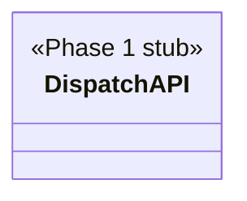

## Positioning

@cbim/engine 的调度子层。负责将用户意图路由到对应的 Agent 角色，组装 SDK 配置（AgentConfig），并通过 `@anthropic-ai/claude-agent-sdk` 驱动 Agent 会话。

## Class Diagram

## Key Decisions

Phase 1 target — implementation not yet started; this module.md establishes the architectural boundary only.
