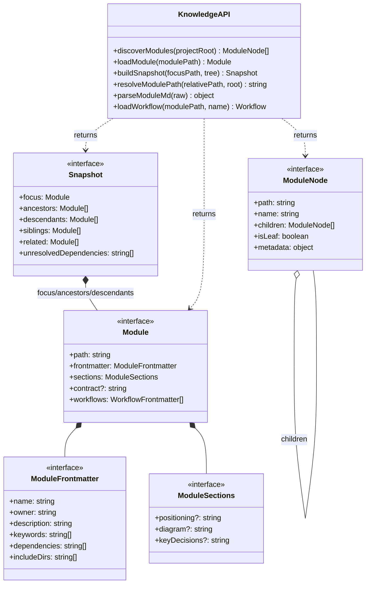

## Positioning

@cbim/engine 的知识子层。负责扫描项目目录树以发现 CBIM 模块，解析 module.md / contract.md，构建面向 Coordinator 的知识快照（Snapshot）。

## Class Diagram

## Key Decisions

- **Stateless engine**: No built-in cache. The engine is a pure library; cache invalidation is the consumer's responsibility (extension caches and watches file changes; CLI runs once and exits).

- **Best-effort discovery**: `discoverModules` logs warnings for broken modules and skips them rather than throwing. Discovery is a full-tree scan; individual module failures must not abort the entire tree.

- **Eager frontmatter / lazy content for workflows**: Module loading eagerly parses workflow frontmatters (name, keywords, description, triggers) but defers body content to `loadWorkflow()`. This matches the skill loading pattern and keeps snapshot assembly lightweight.

- **js-yaml for YAML parsing**: The hand-written v1 YAML parser was fragile (no quoted strings, no multiline values). `js-yaml` / `yaml` is the Node.js standard, zero native dependencies, ~50KB bundled.
