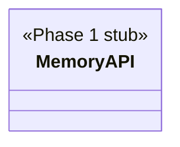

## Positioning

@cbim/engine 的记忆子层。实现三阶段记忆蒸馏管道：短期记忆（short）写入、中期摘要蒸馏（medium）、最终知识提炼（distilled）。

## Class Diagram

## Key Decisions

Phase 1 target — implementation not yet started; this module.md establishes the architectural boundary only.
