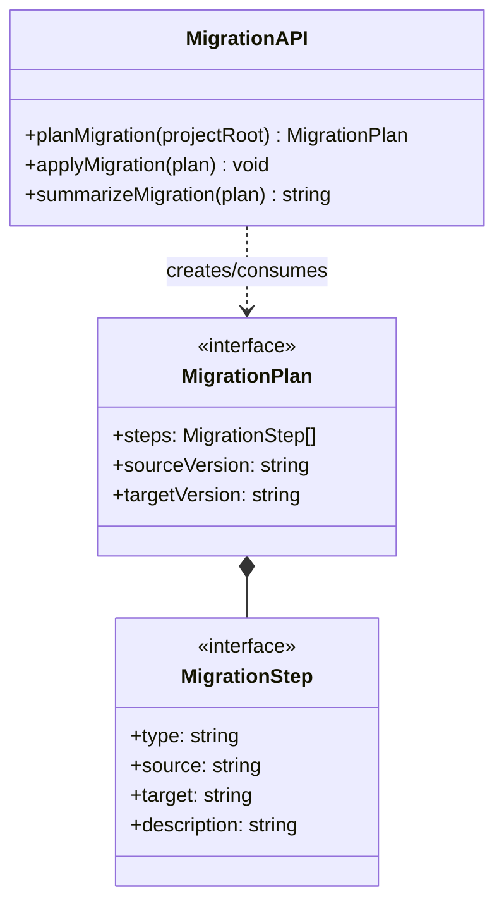

## Positioning

负责将 CBIM v1 项目布局迁移到 v2 格式，包括迁移计划生成（planMigration）和执行（applyMigration）。

## Class Diagram

## Key Decisions

- **Fully isolated from runtime**: `migration/` has no runtime coupling with `knowledge/`, `memory/`, `dispatch/`, or `tools/`. Migration is a one-time file transformation with no engine runtime state. This isolation keeps the runtime footprint clean.

- **Plan-then-apply pattern**: `planMigration` produces a deterministic, inspectable plan before any mutation. `applyMigration` executes the plan. This allows dry-run preview and partial execution.
