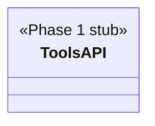

## Positioning

@cbim/engine 的 MCP 工具子层。将引擎函数包装为 `cbim_*` MCP 工具，定义 zod schema，按角色组装工具权限配置（allowedTools / disallowedTools），并通过 `@anthropic-ai/claude-agent-sdk` 注入 Agent 会话。

## Class Diagram

## Key Decisions

Phase 1 target — implementation not yet started; this module.md establishes the architectural boundary only.
