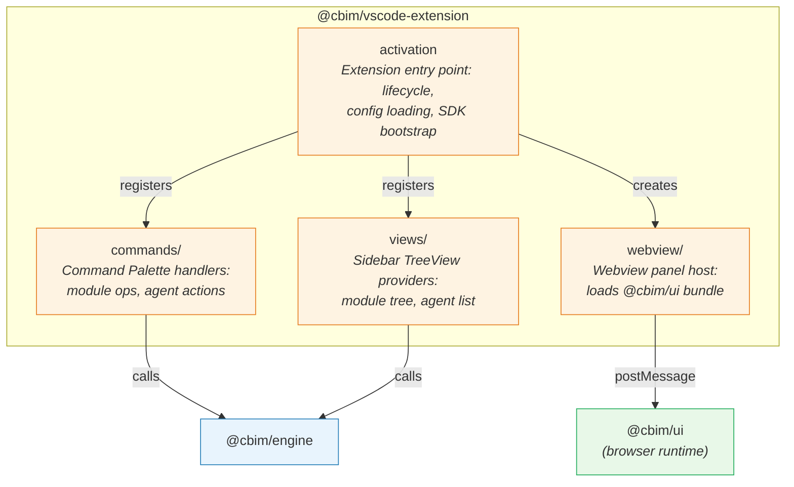

## Positioning

The VS Code extension host that adapts the portable engine core into an IDE-integrated experience. Responsible for extension lifecycle, command palette registration, sidebar tree views, webview panel hosting, SDK agent runtime setup, and the `canUseTool` path guard enforcement.

## Component Diagram

**Dependency direction:** All internal components are orchestrated by `activation`. `commands/` and `views/` call engine APIs. `webview/` communicates with `ui` via postMessage bridge, never via direct import.

## Key Decisions

- **Why CJS output format?** VS Code extension host requires CommonJS modules (`"main"` entry). The extension uses tsup with `format: ['cjs']` and sets tsconfig to `module: "CommonJS"`. This is a VS Code runtime constraint, not a design preference. Engine (ESM) is bundled into the extension's CJS output by tsup.

- **Why `onStartupFinished` activation?** CBIM needs to detect `.cbim/` workspace presence and set up the sidebar early, but should not block VS Code startup. `onStartupFinished` fires after the window is fully loaded, balancing early availability with zero startup penalty. More granular `workspaceContains` activation can be added later if startup cost becomes an issue.

- **Why `canUseTool` path guard lives here, not in engine?** The path guard is an SDK runtime concern -- it intercepts tool calls at the SDK `query()` level. Engine provides the tools and their schemas; the extension configures the SDK runtime with the guard. This keeps engine free of SDK runtime coupling. The guard implementation calls `isCbimPath()` (a pure function that can live in engine as a utility) but the interception wiring is extension-only.

- **Why webview/ is a sub-directory, not a separate component?** The webview host is thin -- it creates a `WebviewPanel`, resolves the `@cbim/ui` bundle path, sets CSP headers, and establishes the postMessage bridge. It has no independent business logic and always activates in the context of the extension lifecycle. Extracting it would add indirection without benefit.

- **Why extension calls engine directly (not via tools)?** The extension process is trusted code, not an LLM agent. It reads `.cbim/` config, builds snapshots, and manages agent lifecycle through engine's TypeScript API. The `cbim_*` tools and `canUseTool` guard exist to constrain LLM agents, not the extension itself (as stated in v2-plan Section 7.7).
