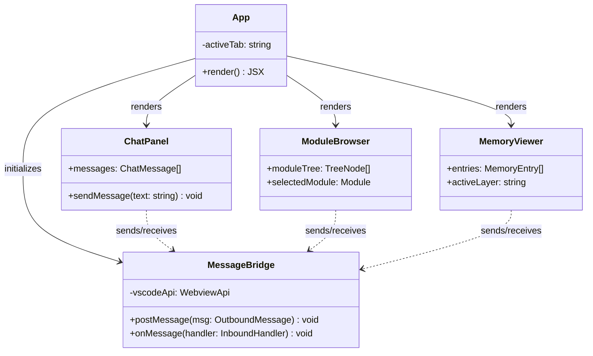

## Positioning

The browser-sandboxed React application rendered inside a VS Code webview panel. Provides three primary views -- chat interaction, module tree browsing, and memory preview -- communicating with the extension host exclusively via the postMessage protocol.

## Class Diagram

**Communication model:** All data flows through a centralized `MessageBridge` initialized by the `App` root component. Individual tab components request data and receive updates through this bridge, never through direct engine imports.

## Key Decisions

- **Why a separate package, not embedded in extension?** The webview runs in a browser sandbox -- it cannot import Node.js modules or access the VS Code API directly. It has a fundamentally different build pipeline (Vite + React) and runtime environment (DOM, not Node). Keeping it as a separate package enforces this boundary and allows independent development/hot-reload via `vite dev`.

- **Why no compile-time dependency on engine?** The browser sandbox cannot execute Node.js code. All data the UI needs (module trees, memory records, agent messages) is serialized and passed through postMessage by the extension host. This is not a design choice but a platform constraint. TypeScript types for message payloads can be shared via a lightweight protocol definition, but no runtime dependency exists.

- **Why postMessage protocol direction matters?** The extension host is the authority; the webview is a passive renderer. The protocol follows request-response semantics: UI sends requests (`cbim:request:listModules`), extension responds with data (`cbim:response:listModules`). For streaming (agent chat), the extension pushes events (`cbim:event:agentMessage`). This direction is fixed -- the webview never directly triggers engine mutations; it requests them through the extension.

- **Why state management selection is deferred?** At this scale (three tabs, no cross-tab shared state beyond the message bridge), React's built-in state (`useState`/`useReducer` + Context) may suffice. Introducing Redux/Zustand/Jotai before the actual data flow patterns solidify would be premature. This decision is explicitly left for Phase 1 implementation, when real data shapes are known.

- **Why three tabs, not three separate webviews?** A single webview panel with tabbed navigation avoids the overhead of multiple panel lifecycles and enables shared state (e.g., selecting a module in the tree and viewing its memory in another tab). VS Code webview panels are expensive resources -- one is enough.
