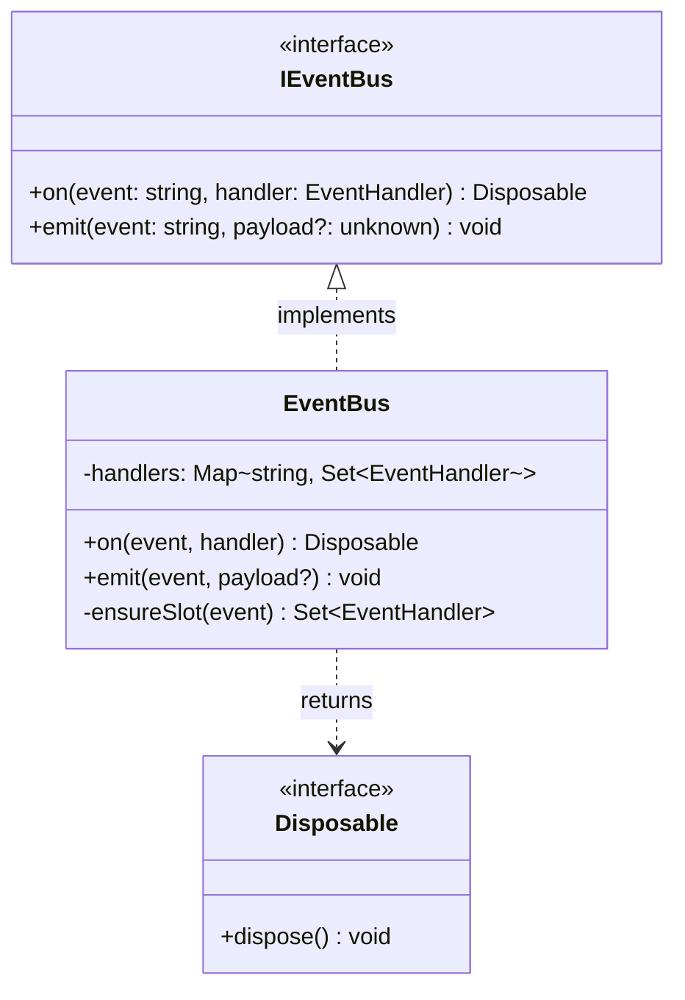
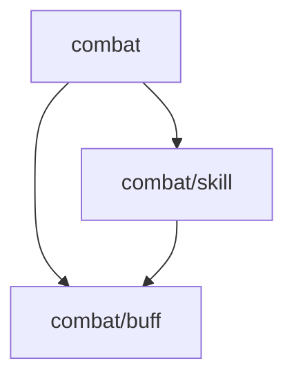

[English](ARCHITECTURE.md) | [中文](ARCHITECTURE.zh-CN.md)

# CBIM Architecture

## Why CBIM

For an agent to genuinely replace human labor and improve efficiency, two conditions must be met simultaneously:

```
Real efficiency gain = Can run autonomously × Runs healthily
```

Neither condition alone is sufficient:

- **Can run autonomously, but runs unhealthily**: Output is flat and chaotic — no layers, no boundaries, review costs more than writing the code manually, maintainability collapses at scale. Still requires heavy human intervention.
- **Runs healthily, but requires human driving**: Every step needs a human to prompt the conversation forward — no order-of-magnitude efficiency gain, cannot genuinely replace human labor.

The reason AI coding agents haven't yet replaced human labor at scale is not that models aren't powerful enough — it's that **no system architecture has existed that simultaneously satisfies "can run autonomously" and "runs healthily"**.

CBIM is designed specifically to solve both:

| Goal | CBIM's Solution |
|------|----------------|
| **Can run autonomously** | SessionStart/Stop hooks for zero-cost cross-session context recovery; assistant dispatch with no human routing needed; knowledge snapshot gives agents full project picture at startup; v2 task queue for autonomous consumption of requirement lists, bug reports, and test runs |
| **Runs healthily** | Architect Gate ensures layered, bounded output; `.dna/` knowledge base makes human review extremely low-cost; two-layer governance continuously ensures architecture quality; context minimization reduces hallucinations and rework |

Both conditions met simultaneously — **agents deliver autonomously, humans handle only final review**.

---

## What Is It

**CBIM** = **CBI** (Capability-Business Independence) + **M** (Memory)

**CBI** is the core design philosophy:

> Capability (agent definitions, skills) and business (project knowledge, module content) must be strictly separated — never contaminating each other.
> Capability is portable expertise; business is a project-specific knowledge blueprint. They collaborate only through task interfaces, never coupling directly.

**M** is the framework's memory infrastructure: session memory (short/medium-term) + SessionStart context injection, enabling CBIM to accumulate structured knowledge across sessions in any project.

This philosophy is reflected in every layer of the framework's design:

| Separation Dimension | Capability Side | Business Side |
|---------------------|-----------------|---------------|
| Storage | `.claude/agents/` (soul) + `.cbim/cbi/skills/` (capability skills) | `.dna/` directory = module identity; `module.md` = sole hard constraint; everything else optional |
| Governed by | HR | Architect |
| Hard rule | soul/skills must contain zero project-specific content | knowledge files must not reference agent specs |
| Verifiable | still meaningful when moved to another project → compliant | describes only current final working state, never describes agents |

**The concrete problem it solves**:

The most common Claude Code workflow is: **one default agent + many CLAUDE.md rules + many skills**. This pattern has a structural flaw that worsens over time:

```
More conversation turns
  → CLAUDE.md and skill files get fully loaded into context
  → Token explosion, LLM starts "getting lost in the middle"
  → Hallucination rate rises, output quality drops
  → Corrections cost more tokens, polluting context further
```

**Resetting the session** clears context, but creates another problem:
- Conversation memory lost
- Must re-grep project files, re-understand code structure
- No structured project knowledge — must manually re-brief the agent on background

CBIM solves both simultaneously:

| Problem | CBIM Solution |
|---------|---------------|
| Context bloat accumulates with turns | Multi-agent × module topology tree: each task loads only target agent soul + task subtree `.dna/`, context is independent of project size |
| Memory lost on session reset | SessionStart hook auto-injects: module topology snapshot + recent memory — zero-cost session recovery |

**Comparison with standard Claude Code usage**:

| | Standard Claude Code | CBIM |
|---|---|---|
| Project context | One `CLAUDE.md` (grows unboundedly with project) | Module topology tree `.dna/` (split by module boundary, load subtree on demand) |
| Business rules | Written into `CLAUDE.md` or `.claude/skills/` | Written into the module's `module.md` (the sole required file); `contract.md` and `workflows/` are optional extensions |
| Operational steps | `.claude/skills/` fully registered, always in context | `.cbim/cbi/skills/` (capability) + `.dna/workflows/` (business), loaded on demand |
| Agent | One large catch-all agent + countless skills | Multiple specialized agents, each task loads only the target agent soul |
| Governance | None | Architect (business layer, three-traversal topology tree) + HR (capability layer) dual-track governance |

> **Core**: The two-dimensional structure of Multi-Agent (capability axis) × Module Topology Tree (business axis) achieves per-task context minimization.

CBIM is also a **Claude Code context management framework deployable to any project**. After installation, launching Claude Code in the project root gives you the "assistant" main session — the sole conversation entry point between you and all execution roles.

You only talk to the assistant. The assistant understands intent, decomposes tasks, routes to the right agent, and consolidates results.

---

## CBIM Core — Multi-Agent × Module Topology Tree

CBIM's core is not just multi-agent — it's the two-dimensional structure of **Multi-Agent (capability axis) × Module Topology Tree (business axis)**. Both are indispensable:

- Multi-agent alone: business knowledge is still a monolith — unknown which context to load
- Module topology tree alone: capability is still monolithic — the agent must carry all skills for any node

Only with both axes can each task simultaneously pinpoint "which agent to use" and "which subtree to load."

### `.dna/` Convention: Minimal Constraint + Open Extension

The `.dna/` convention follows a philosophy of **minimal constraint + open extension**:

- **`.dna/` directory exists = module identity.** No directory, no module. The directory's presence is the sole marker.
- **`module.md` is the only hard constraint** — one file, YAML frontmatter (metadata) + markdown body (architecture), replacing the former `module.json` + `architecture.md` combination. This mirrors the unified `frontmatter + body` pattern used by `.claude/agents/<name>.md` and `.cbim/cbi/skills/<name>/skill.py`.
- **Everything else is optional** — `contract.md` (protocol boundary), `workflows/` (deterministic processes), or any user-defined files. The framework recommends them but never requires them.

```
.dna/
├── module.md           # required: the sole hard constraint
├── contract.md         # optional: protocol boundary (REST / gRPC / SDK)
├── workflows/          # optional: deterministic process definitions
└── ...                 # optional: any user-defined files
```

### The Role of the Module Topology Tree

`.dna/` directories form a tree by filesystem hierarchy, not a flat module list:

```
.dna/ (root)
├── src/combat/.dna/              ← Parent node: describes sub-module relationships and positioning
│   ├── src/combat/skill/.dna/   ← Leaf node: encapsulates specific implementation
│   └── src/combat/buff/.dna/
└── src/economy/.dna/
```

Value of the topology tree:
1. **Precise subtree loading** — task involves `combat` module, only `combat` subtree loaded; `economy` never enters context
2. **Hierarchical governance** — architect uses three-traversal (pre/in/post-order) to systematically check the whole tree's health
3. **Dependency direction constraint** — tree structure naturally enforces one-way dependencies, root to leaf, preventing cycles
4. **Granularity matches task** — cross-module tasks load parent nodes, leaf-level tasks load only the leaf, context auto-scales with task granularity

### Two-Dimensional Context Minimization

```
Each task's context = specialized agent soul (capability axis)
                    × task subtree .dna/ (business axis)
```

| Dimension | Traditional Approach | CBIM |
|-----------|---------------------|------|
| **Capability axis** | One large catch-all agent, soul contains all skills | Multiple specialized agents, each task loads only the target agent's soul |
| **Business axis** | `CLAUDE.md` contains all business rules, always in context | Module topology tree, only loads the task subtree's `.dna/` |

Result: **context ≈ one specialized agent's soul × task subtree's `.dna/`**, independent of total project size.

### Less Context → Fewer Hallucinations → Less Token Waste

LLM quality degradation in long contexts is a known phenomenon ("lost in the middle"). Context pollution compounds losses:

```
Monolithic agent + all knowledge always loaded
  → context pollution → hallucination rate ↑ → errors ↑ → correction turns ↑ → token vicious cycle

Specialized agent × task subtree loaded on demand
  → clean context → hallucination rate ↓ → accuracy ↑ → zero corrections → tokens saved
```

Multi-agent dispatch overhead is a **fixed cost**; monolithic agent context pollution is a **variable cost that grows with project scale**.

> CBIM trades fixed dispatch overhead for per-task two-dimensional context minimization. This is the core tradeoff of the **Multi-Agent × Module Topology Tree** design.

---

## Architecture Overview

```
┌─────────────────────────────────────────────────────────────────┐
│                          User                                    │
└──────────────────────────┬──────────────────────────────────────┘
                           │ All interactions
                           ▼
┌─────────────────────────────────────────────────────────────────┐
│  Assistant (main session, CLAUDE.md)                            │
│  · Sole external interface  · Task decomposition  · Routing  · Consolidation │
└──────┬───────────────────┬──────────────────┬───────────────────┘
       │                   │                  │
       ▼                   ▼                  ▼
┌────────────┐    ┌────────────────┐    ┌──────────────────────┐
│  Architect │    │      HR        │    │  Work Agents         │
│            │    │                │    │  (programmer, ...)   │
│  Business  │    │  Capability    │    │  Execute tasks       │
│ governance │    │  governance    │    │  Deliver per blueprint│
│  .dna/     │    │ .claude/agents/│    │                      │
└────────────┘    └──────┬─────────┘    └──────────────────────┘
                         │
                    ┌────┴────┐
                    │ Auditor │
                    │Independent│
                    │  review  │
                    └─────────┘
```

---

## Four Core Agents

| Agent | Responsibility | Scope |
|-------|---------------|-------|
| **Assistant** | Sole external interface, routing, consolidation | Global coordination |
| **Architect** | Design and maintain project knowledge system, architecture review | `.dna/` (business layer) |
| **HR** | Work agent full lifecycle: recruit, train, assess, archive | `.claude/agents/` (capability layer) |
| **Auditor** | Independent critical review, read-only, dispatched only by assistant | Global read-only |

The core 4 agents are **never within HR's governance scope**.

Work agents (e.g., programmer) are created by HR on demand; assistant dispatches them via HR request.

---

## How to Use

Just tell the assistant what you want — no need to specify an agent:

| What you want | Just say |
|---------------|----------|
| Initialize project knowledge system | Please initialize the module knowledge system for this project |
| Create a feature module | Create a combat module |
| Implement code per blueprint | Implement the login API per the current blueprint |
| Review a design/change | Review this change |
| Query decision history | What was the decision history for the combat module |

---

## Two Types of Skills

Traditional Claude Code projects accumulate large numbers of skill files in `.claude/skills/`, becoming unmanageable over time. CBIM splits skills by "who owns and benefits from them" — `.claude/` only contains `agents/`, staying clean.

| Type | Owner | Storage | Governed by | Characteristics |
|------|-------|---------|-------------|----------------|
| **Capability skill** | Agent private capability | `.cbim/cbi/skills/<name>/skill.py` | HR | Describes how an agent does a category of operation; portable, meaningful in any project |
| **Business skill** | Module deterministic process | `.dna/workflows/<name>/workflow.md` | Architect | Describes specific module business steps; project-bound, evolves with the module |

```
.claude/
└── agents/          ← soul files, referencing capability skills in .cbim/cbi/skills/
                        (no .claude/skills/, no messy pile-up)

.cbim/cbi/skills/   ← capability skills (HR governance, reusable across projects)
.dna/workflows/          ← business skills (architect governance, deterministic module flows)
```

### On-Demand Loading of Business Skills

Business skills (workflows) are not bulk-injected into session context. **Only when a module is designated for processing does that module's `.dna/` get loaded — `module.md` first (always), then optional files only if they exist.**

```
SessionStart
  └── snapshot.py injects into session
        ├── Module tree: path + name + owner (from module.md frontmatter)
        └── Agent list: id + description (no skill content)

Task dispatch (on-demand loading)
  └── agent reads target module's .dna/
        ├── module.md                          ← always loaded (the sole required file)
        ├── contract.md (if present)           ← optional
        └── workflows/<name>/workflow.md       ← optional, loaded only when relevant
```

This is why CBIM doesn't need to pile up large numbers of skills in `.claude/`:
- Capability skills are actively read by agents when needed, not permanently in context
- Business skills (workflows) are encapsulated in module `.dna/`, loaded with the module on demand, completely isolated from other modules

A project can have dozens of modules, each with multiple workflows — the pressure on session context is always constant (snapshot + current task module).

**Evolution path**:
- Business process appears ≥ 2 times → architect distills into `.dna/workflows/` (business skill)
- Agent capability accumulates and validates → HR distills into `.cbim/cbi/skills/` (capability skill) → crystallized into soul

---

## Two-Layer Governance

| Layer | Governed by | Scope |
|-------|-------------|-------|
| **Capability layer** | HR | `.claude/agents/` (agent definitions and skills) |
| **Business layer** | Architect | Each project's `.dna/` (`module.md` + optional extensions) |

**Hard rule**: Capability goes into `.claude/agents/`; business goes into `.dna/`. Never mix.

### Governance Is Review

Both architect and HR governance simulate senior leader review, across two dimensions:

| | Architect (arch-governance) | HR (hr-assessment) |
|---|---|---|
| **Dimension 1** | Architecture design soundness (18 factors, three-traversal) | Definition soundness (14 factors, vertical+horizontal) |
| **Dimension 2** | Knowledge-workspace consistency | Definition-behavior consistency |
| **Scripted** | `arch-governance/check.py` auto-checks 8 items | `hr-assessment/check.py` auto-checks 3 items |
| **Config** | `arch-governance/config.json` | `hr-assessment/config.json` |

---

## Architectural Sustainability

CBIM solves more than just context efficiency — it solves a deeper problem: **even with pure vibe coding, the output is layered, bounded code with unidirectional dependencies**.

### The Architectural Risk in Vibe Coding

"Near-vibe coding" is the most adversarial condition for AI coding tools: natural language requirement descriptions with no file paths, class names, or function names provided. Under these conditions:

**Base mode** (single agent) typical output:
- Agent self-explores the codebase, modifies files found along the way
- New code placed randomly in the nearest relevant file
- No layer awareness, fuzzy module boundaries, arbitrary dependency directions
- As requirements accumulate, the codebase degrades into an unmaintainable flat network

**CBIM mode** under the same conditions:
- Every implementation task must first pass through the Architect
- Architect confirms module placement, dependency direction, interface contracts, updates or creates `.dna/`
- Programmer implements with explicit module context
- Even if the user never mentions "architecture", "layers", or "module boundaries" — these constraints are still enforced

### Knowledge-First Principle (Architect Gate)

```
Every implementation task:
  User requirement
    → Assistant → Architect
                      ├── Which module does this belong to?
                      ├── New module needed? Which existing modules does it depend on?
                      ├── What is the interface contract?
                      └── Confirm/update .dna/ documentation
    → Architect returns module context (path + blueprint)
    → Assistant → Programmer (with explicit path and blueprint)
                      └── Implements in the correct module location
```

The Architect is not an optional review step — it is the **mandatory gateway** for every implementation task. Every requirement development cycle repeats this loop — architectural awareness doesn't depend on the user's technical knowledge or the programmer's experience. It is guaranteed by the process.

### Output Comparison Under Vibe Coding Conditions

| | Base | CBIM |
|--|--|--|
| Code placement | Random exploration, nearest-file modification | Module-assigned, implemented in confirmed path |
| Layer structure | Flat, no layer control | Layered, new code assigned to a definite module node |
| Module boundaries | Fuzzy, spreading with each requirement | Clear, architect confirms boundary before implementation |
| Dependency direction | Arbitrary, bidirectional coupling common | Unidirectional, constrained by topology tree structure |
| Interface contracts | Implicit, implementation is the contract | Explicit, `contract.md` exists before implementation |

### The Larger the Project, the Stronger the Advantage

The smaller the project, the less visible Base mode's flat code problem is (fewer files, simpler relationships). As the project grows:

- **Base**: Flat network keeps expanding, module boundaries become increasingly blurry, any change may cause unexpected side effects
- **CBIM**: Topology tree constraints always present, new modules slot into the appropriate parent node, dependency direction always root-to-leaf

**Architectural sustainability is not dependent on manual review — it is embedded in the execution process of every task.**

---

## Structured Auditability

CBIM's third core value serves **human reviewers**: after an agent team has been running autonomously for a while, humans don't need to read code — just `.dna/` and `agents/` to get a clear picture of the entire project state and virtual team progress.

### Knowledge as a First-Class Citizen

CBIM treats knowledge as a first-class citizen of the architecture, not an appendage to code. `.dna/` is not after-the-fact documentation — it is a **living knowledge base that the Architect confirms before each task and updates after each change**. This means human reviewers encounter structured, dependable knowledge — not fragmented commit messages and scattered comments.

### Two Entry Points, Full Project Picture at a Glance

```
.dna/ (tree structure)   → Business picture
  ├── module.md per module: positioning, class diagram, key decisions
  ├── contract.md (where present): cross-boundary interface contracts
  └── workflows/ (where present): crystallized deterministic business flows

.claude/agents/          → Team picture
  ├── What agents exist and their capability boundaries
  ├── Which skills each agent has
  └── Skill evolution state (active / validating / internalized into soul)

Combined → project progress + virtual team state, readable at a glance
```

### Comparison with Base Mode

| Review Dimension | Base | CBIM |
|-----------------|------|------|
| Project state | Read git log → read diff → guess intent | Read `.dna/` tree, module boundaries and decisions explicit |
| Team state | No virtual team concept | Read `agents/`, capability boundaries and skill distribution clear |
| Knowledge source | Code comments + commit messages (after-the-fact, fragmented) | Architecture-driven write (confirmed before task, structured) |
| Impact assessment | Must deeply read code to assess impact scope | Read module contracts and dependency tree, quickly locate impact boundary |

### Maintainability Comes from Structure

Because knowledge is actively maintained by the Architect and synchronized with code implementation (knowledge-first), human reviewers encounter a knowledge base with:

- **Completeness**: Every module has exactly one required file (`module.md`) — metadata and architecture in one place, with optional extensions (`contract.md`, `workflows/`) only where they add value
- **Currency**: Knowledge is updated before implementation, not retrofitted after
- **Hierarchy**: Topology tree structure, granularity naturally matches task scope

This makes CBIM projects far easier to **hand off, collaborate on, and maintain long-term** than Base mode — even newly onboarded human developers can quickly build a mental model of the project through the knowledge tree, rather than reading code from scratch.

---

## Memory System

**The assistant is the sole memory holder.** Subagents focus on execution; they don't operate memory directly.

Memory in CBIM is a **three-stage distillation pipeline**, with different purposes at each stage:

| Stage | Path | Purpose |
|-------|------|---------|
| **Short-term** | `.cbim/memory/short/` | Raw session records; mainly for recent context recovery, auto-cleaned |
| **Medium-term** | `.cbim/memory/medium/` | Compressed pattern summaries; de-noised, preserves effective signals, long-term retention |
| **Knowledge** (core) | `.cbim/cbi/skills/` + `.dna/` | Structured crystallization: capability → skills/soul, business → `.dna/workflows/` |

Transformation between stages:
- **Short → Medium**: Compression — strip execution details, retain patterns and lessons worth recording
- **Medium → Knowledge**: The critical step — crystallize validated patterns into governance structures, the foundation for all future tasks

| Layer | Path | Lifecycle |
|-------|------|-----------|
| Short-term | `.cbim/memory/short/` | Tagged `distilled` after processing, kept at least 3 days then deleted by cleanup; undistilled never auto-deleted |
| Medium-term | `.cbim/memory/medium/` | Long-term retention, manually archived after promotion to knowledge layer |

- **Stop hook** — `write-memory.py` automatically does two things at session end:
  1. Writes this session's dispatch content to short-term memory (`short/YYYY-MM-DD-*.md`)
  2. Writes `last-session.md` — structured recovery point (task, execution records, changed files, involved modules)

- **SessionStart hook** — `load-memory.py` automatically injects three context layers at session start:
  1. **Project knowledge snapshot** (module topology tree + agent list)
  2. **Last session recovery point** (`last-session.md`, always injected first)
  3. **Recent memory** (sorted by modification time, top-k entries)

- **On-demand query** — during session, query history via `.cbim/memory/engine/cli.py query`

```
Session ends
  └── Stop hook
        ├── short/YYYY-MM-DD-*.md   ← raw records (shared source for governance + recovery)
        └── last-session.md          ← recovery point (injected next time)

New session starts
  └── SessionStart hook injects
        ├── Project knowledge snapshot (module tree + agent list)
        ├── Last session recovery point
        └── Recent memory (sorted by time)

Governance cycle (HR / architect triggered)
  └── Three-stage distillation
        ├── short/ → medium/         (compression: assistant extracts summary)
        ├── medium/ → skills/soul    (crystallization: HR converts patterns to capability governance)
        └── medium/ → .dna/          (crystallization: architect converts patterns to business governance)
```

---

## Memory Distillation Paths

### Capability Distillation (HR side)

```
short/          Raw session records (auto-written)
    ↓ compress & distill
medium/         Capability pattern summary (de-noised, signals retained)
    ↓ crystallize (the critical step)
.cbim/cbi/skills/<name>/skill.py   New or updated capability skill
    ↓ internalized after multiple validations
.claude/agents/<id>/<id>.md             Updated Soul / Identity
```

### Business Distillation (Architect side)

```
short/          Raw session records (auto-written)
    ↓ compress & distill
medium/         Business pattern summary (decisions, interface changes, recurring processes)
    ↓ crystallize (the critical step)
.dna/module.md + contract.md            Updated module blueprint
    ↓ deterministic processes appearing ≥2 times
.dna/workflows/<name>/                  New business workflow
    ↓ module responsibilities become too heavy
Split into multiple sub-modules
```

---

## Directory Structure (After Deployment)

`.dna/` directories are scattered through the codebase at any depth where a module exists; they form a tree by filesystem hierarchy. The project root **does not** require a `.dna/`. The framework-managed registry at `.cbim/index.md` is the only hard requirement (created by install, updated by `init_module`).

```
<project>/
├── CLAUDE.md                          ← Assistant identity (main session)
│
├── .claude/
│   ├── settings.json                  ← Permission config + hook registration
│   ├── commands/                      ← Slash commands (/cbim_*)
│   └── agents/
│       ├── architect/architect.md
│       ├── hr/hr.md
│       ├── auditor/auditor.md
│       └── programmer/programmer.md
│
├── src/                               ← Your code (any layout)
│   ├── combat/
│   │   ├── .dna/                      ← Module (parent): describes children + boundaries
│   │   │   ├── module.md              ← required: frontmatter + architecture body
│   │   │   ├── contract.md            ← optional: protocol boundary (REST / gRPC / SDK)
│   │   │   ├── workflows/             ← optional: deterministic process definitions
│   │   │   └── ...                    ← optional: any user-defined files
│   │   ├── skill/.dna/                ← Module (leaf)
│   │   └── buff/.dna/                 ← Module (leaf)
│   └── economy/.dna/                  ← Module
│
├── .dna/                              ← OPTIONAL project-root module (single-app shape;
│   └── module.md                      ←   monorepos typically skip this)
│
└── .cbim/                              ← Framework
    ├── .dna/index.md                  ← Module registry (framework-managed; required after install)
    ├── README.md / README.zh-CN.md
    ├── config.json                    ← Local framework config
    │
    ├── cbi/                           ← Capability + business knowledge base
    │   ├── README.md                  ← Four-quadrant architecture explanation
    │   ├── agent-convention.md        ← Agent definition spec
    │   ├── dna-convention.md          ← .dna/ content spec
    │   ├── claude_md.py               ← CLAUDE.md template (assistant identity)
    │   ├── agents/                    ← Agent souls + private skills
    │   │   ├── architect/             ← agent.py + skills/{arch_governance,arch_modules,arch_upgrade}/
    │   │   ├── auditor/               ← agent.py + skills/audit_review/
    │   │   ├── hr/                    ← agent.py + skills/{hr_agents,hr_assessment,hr_training}/
    │   │   └── programmer/agent.py
    │   ├── engine/                    ← Knowledge CRUD primitives
    │   │   ├── cli.py                 ← agents / modules dual-domain commands
    │   │   ├── agents.py
    │   │   ├── modules.py
    │   │   └── snapshot.py            ← Project knowledge snapshot
    │   └── skills/                    ← Global skills (assistant + memory)
    │       ├── dispatch/skill.py      ← Assistant request classification and routing
    │       ├── memory_write/skill.py
    │       ├── memory_query/skill.py
    │       └── memory_distill/skill.py
    │
    ├── engine/                        ← Unified CLI entry (python .cbim/engine ...)
    │   ├── cli.py                     ← memory / dna / agent / skill / soul / snapshot / config / debug / log
    │   ├── config.py
    │   └── log_view.py
    │
    ├── hooks/                         ← Runtime hooks (registered via .claude/settings.json)
    │   ├── load_memory.py             ← SessionStart: snapshot + memory injection
    │   └── write_memory.py            ← Stop: write short-term memory
    │
    ├── memory/                        ← Memory engine
    │   ├── engine/                    ← Python package (FileBackend / ChromaBackend)
    │   └── store/
    │       ├── short/                 ← Short-term memory (gitignored)
    │       └── medium/                ← Medium-term memory (gitignored)
    │
    ├── docs/                          ← Architecture documentation
    │
    └── dashboard/                     ← Local dashboard server (memory / capability / knowledge / log)
        ├── server.py
        ├── dashboard.py / dashboard.bat
        └── index.html / app.js / style.css

# Repo-only (not copied to target projects by the INSTALL.md flow):
install/                                ← Install-time scripts and tools
├── install.py / install.bat           ← Legacy one-shot installer entry
├── cli.py / settings.py
└── steps/{bootstrap,agents,hooks}.py
```

---

## Appendix: `module.md` Example

`module.md` is the sole required file in `.dna/`. It combines metadata (YAML frontmatter) and architecture (markdown body) in one file — following the same `frontmatter + body` pattern as `.claude/agents/<name>.md` and `.cbim/cbi/skills/<name>/skill.py`.

### Leaf Module Example

````markdown
---
name: event-bus
owner: architect
description: Decoupled, type-safe in-process event dispatch
keywords: [event, pub-sub, decoupling]
dependencies: []
---

## Positioning

Decoupled, type-safe in-process event dispatch for cross-module communication.

## Class Diagram



## Key Decisions

- **Interface-first**: Consumers depend on `IEventBus`, never on `EventBus` directly, enabling test doubles without mocking frameworks.
- **Disposable return**: `on()` returns a `Disposable` instead of requiring `off()`, preventing forgotten-unsubscribe memory leaks.
- **No async emit**: Handlers are synchronous by design; async side-effects should be managed by the handler itself, keeping the bus simple and predictable.
````

### Parent Module Example

A parent module's body describes only positioning, child-module relationships, and cross-child emergent insights — never any child's internal details.

````markdown
---
name: combat
owner: architect
description: Combat system root module
keywords: [combat, battle]
dependencies:
  - src/types
---

## Positioning

Top-level container for all combat-related subsystems.

## Sub-module Relationships



- **skill** — Active ability execution (cast, cooldown, targeting)
- **buff** — Passive status effects (apply, tick, expire)

## Key Decisions

- **skill depends on buff, not the reverse**: Abilities can apply buffs, but buffs must never trigger abilities — this prevents recursive combat loops.
````
