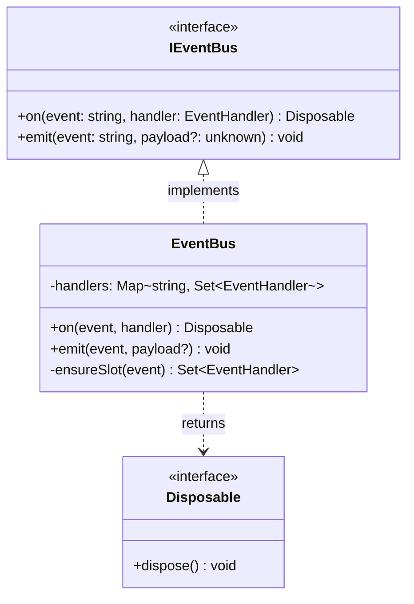
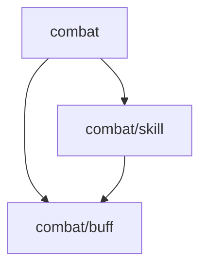

[English](MODULE-MD-EXAMPLE.md) | [中文](MODULE-MD-EXAMPLE.zh-CN.md)

# Appendix: `module.md` Example

`module.md` is the sole required file in `.dna/`. It combines metadata (YAML frontmatter) and architecture (markdown body) in one file — following the same `frontmatter + body` pattern as `.claude/agents/<name>.md` and `.cbim/cbi/skills/<name>/skill.py`.

## Leaf Module Example

````markdown
---
name: event-bus
owner: architect
description: Decoupled, type-safe in-process event dispatch
keywords: [event, pub-sub, decoupling]
dependencies: []
---

## Positioning

Decoupled, type-safe in-process event dispatch for cross-module communication.

## Class Diagram



## Key Decisions

- **Interface-first**: Consumers depend on `IEventBus`, never on `EventBus` directly, enabling test doubles without mocking frameworks.
- **Disposable return**: `on()` returns a `Disposable` instead of requiring `off()`, preventing forgotten-unsubscribe memory leaks.
- **No async emit**: Handlers are synchronous by design; async side-effects should be managed by the handler itself, keeping the bus simple and predictable.
````

## Parent Module Example

A parent module's body describes only positioning, child-module relationships, and cross-child emergent insights — never any child's internal details.

````markdown
---
name: combat
owner: architect
description: Combat system root module
keywords: [combat, battle]
dependencies:
  - src/types
---

## Positioning

Top-level container for all combat-related subsystems.

## Sub-module Relationships



- **skill** — Active ability execution (cast, cooldown, targeting)
- **buff** — Passive status effects (apply, tick, expire)

## Key Decisions

- **skill depends on buff, not the reverse**: Abilities can apply buffs, but buffs must never trigger abilities — this prevents recursive combat loops.
````
